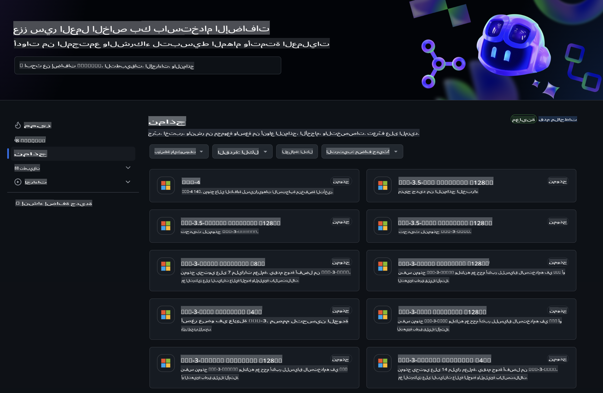
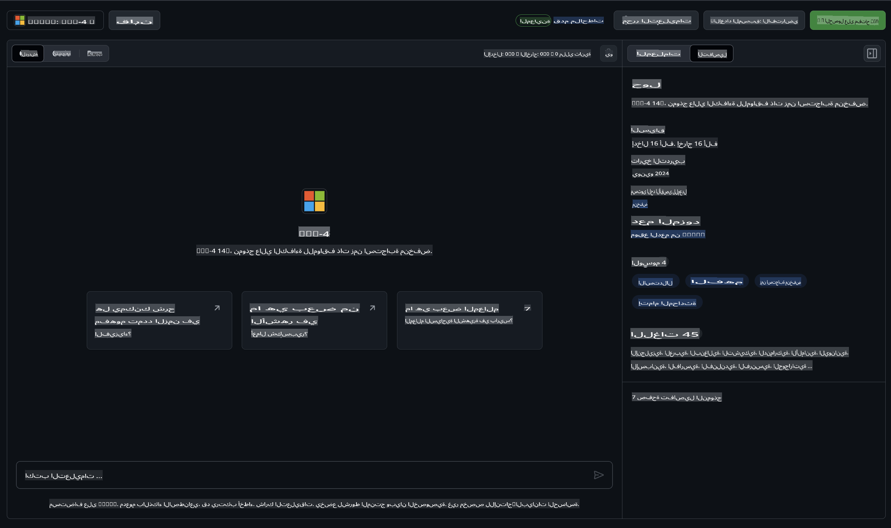
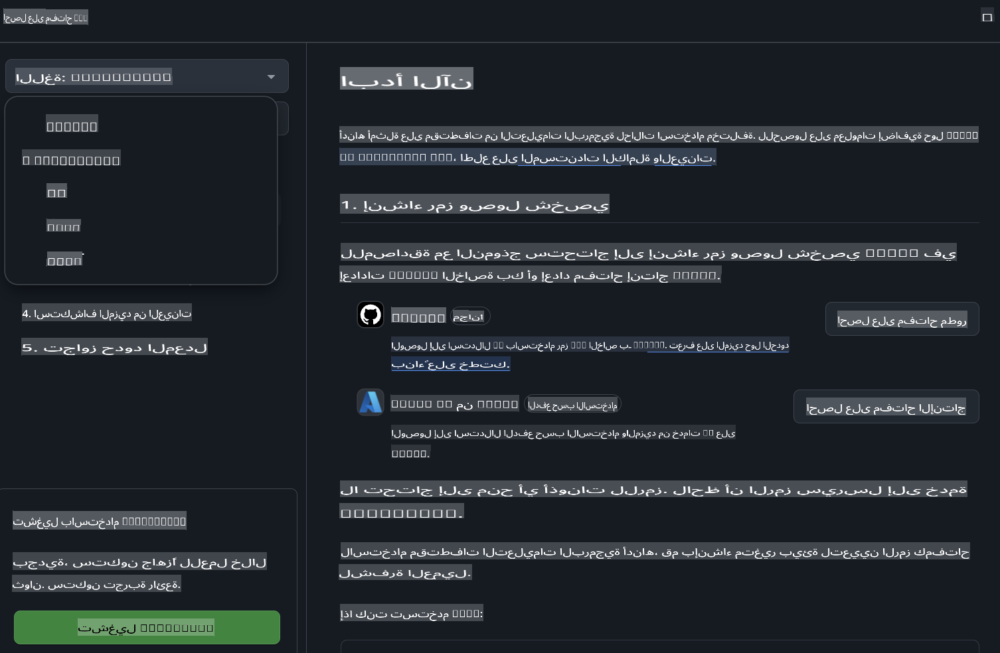
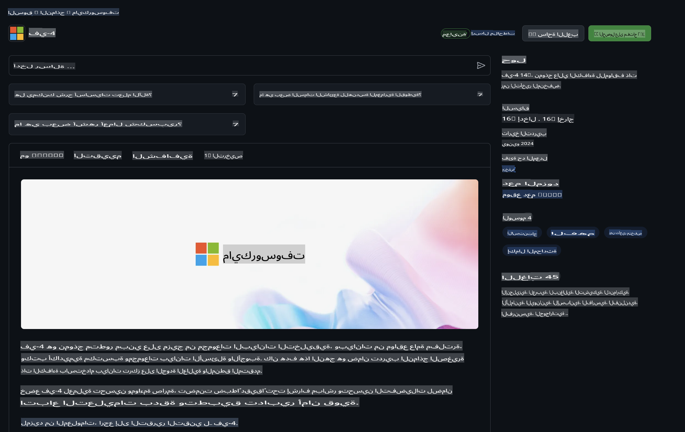

## عائلة Phi في GitHub Models

مرحبًا بكم في [GitHub Models](https://github.com/marketplace/models)! لدينا كل شيء جاهز لتستكشفوا نماذج الذكاء الاصطناعي المستضافة على Azure AI.



للحصول على المزيد من المعلومات حول النماذج المتوفرة في GitHub Models، تحقق من [GitHub Model Marketplace](https://github.com/marketplace/models)

## النماذج المتوفرة

كل نموذج لديه بيئة تجريبية مخصصة وكود أمثلة 



### عائلة Phi في كتالوج GitHub Model

- [Phi-4](https://github.com/marketplace/models/azureml/Phi-4)

- [Phi-3.5-MoE instruct (128k)](https://github.com/marketplace/models/azureml/Phi-3-5-MoE-instruct)

- [Phi-3.5-vision instruct (128k)](https://github.com/marketplace/models/azureml/Phi-3-5-vision-instruct)

- [Phi-3.5-mini instruct (128k)](https://github.com/marketplace/models/azureml/Phi-3-5-mini-instruct)

- [Phi-3-Medium-128k-Instruct](https://github.com/marketplace/models/azureml/Phi-3-medium-128k-instruct)

- [Phi-3-medium-4k-instruct](https://github.com/marketplace/models/azureml/Phi-3-medium-4k-instruct)

- [Phi-3-mini-128k-instruct](https://github.com/marketplace/models/azureml/Phi-3-mini-128k-instruct)

- [Phi-3-mini-4k-instruct](https://github.com/marketplace/models/azureml/Phi-3-mini-4k-instruct)

- [Phi-3-small-128k-instruct](https://github.com/marketplace/models/azureml/Phi-3-small-128k-instruct)

- [Phi-3-small-8k-instruct](https://github.com/marketplace/models/azureml/Phi-3-small-8k-instruct)

## البدء

هناك بعض الأمثلة الأساسية الجاهزة لتشغيلها. يمكنك العثور عليها في دليل الأمثلة. إذا كنت ترغب في الانتقال مباشرةً إلى لغتك المفضلة، يمكنك العثور على الأمثلة في اللغات التالية:

- Python  
- JavaScript  
- C#  
- Java  
- cURL  

كما يوجد بيئة مخصصة لـ Codespaces لتشغيل الأمثلة والنماذج.



## كود أمثلة

فيما يلي مقتطفات كود لبعض حالات الاستخدام. لمزيد من المعلومات حول Azure AI Inference SDK، راجع الوثائق الكاملة والأمثلة.

## الإعداد

1. إنشاء رمز وصول شخصي  
لا تحتاج إلى إعطاء أي أذونات للرمز. لاحظ أن الرمز سيتم إرساله إلى خدمة Microsoft.

لاستخدام مقتطفات الكود أدناه، قم بإنشاء متغير بيئة لتعيين الرمز الخاص بك كمفتاح للكود.

إذا كنت تستخدم bash:  
```
export GITHUB_TOKEN="<your-github-token-goes-here>"
```  
إذا كنت في powershell:  

```
$Env:GITHUB_TOKEN="<your-github-token-goes-here>"
```  

إذا كنت تستخدم موجه الأوامر في Windows:  

```
set GITHUB_TOKEN=<your-github-token-goes-here>
```  

## مثال Python

### تثبيت المتطلبات  
قم بتثبيت Azure AI Inference SDK باستخدام pip (يتطلب: Python >=3.8):  

```
pip install azure-ai-inference
```  

### تشغيل مثال كود أساسي  

يُظهر هذا المثال استدعاءً أساسيًا لـ chat completion API. يتم استخدام نقطة النهاية الخاصة باستنتاج نموذج GitHub AI ورمز GitHub الخاص بك. الاستدعاء متزامن.  

```python
import os
from azure.ai.inference import ChatCompletionsClient
from azure.ai.inference.models import SystemMessage, UserMessage
from azure.core.credentials import AzureKeyCredential

endpoint = "https://models.inference.ai.azure.com"
model_name = "Phi-4"
token = os.environ["GITHUB_TOKEN"]

client = ChatCompletionsClient(
    endpoint=endpoint,
    credential=AzureKeyCredential(token),
)

response = client.complete(
    messages=[
        UserMessage(content="I have $20,000 in my savings account, where I receive a 4% profit per year and payments twice a year. Can you please tell me how long it will take for me to become a millionaire? Also, can you please explain the math step by step as if you were explaining it to an uneducated person?"),
    ],
    temperature=0.4,
    top_p=1.0,
    max_tokens=2048,
    model=model_name
)

print(response.choices[0].message.content)
```  

### تشغيل محادثة متعددة الجولات  

يوضح هذا المثال محادثة متعددة الجولات مع chat completion API. عند استخدام النموذج لتطبيق محادثة، ستحتاج إلى إدارة تاريخ المحادثة وإرسال أحدث الرسائل إلى النموذج.  

```
import os
from azure.ai.inference import ChatCompletionsClient
from azure.ai.inference.models import AssistantMessage, SystemMessage, UserMessage
from azure.core.credentials import AzureKeyCredential

token = os.environ["GITHUB_TOKEN"]
endpoint = "https://models.inference.ai.azure.com"
# Replace Model_Name
model_name = "Phi-4"

client = ChatCompletionsClient(
    endpoint=endpoint,
    credential=AzureKeyCredential(token),
)

messages = [
    SystemMessage(content="You are a helpful assistant."),
    UserMessage(content="What is the capital of France?"),
    AssistantMessage(content="The capital of France is Paris."),
    UserMessage(content="What about Spain?"),
]

response = client.complete(messages=messages, model=model_name)

print(response.choices[0].message.content)
```  

### بث المخرجات  

لتحسين تجربة المستخدم، سترغب في بث استجابة النموذج بحيث تظهر الرموز الأولى مبكرًا وتتجنب الانتظار لفترات طويلة من الردود.  

```
import os
from azure.ai.inference import ChatCompletionsClient
from azure.ai.inference.models import SystemMessage, UserMessage
from azure.core.credentials import AzureKeyCredential

token = os.environ["GITHUB_TOKEN"]
endpoint = "https://models.inference.ai.azure.com"
# Replace Model_Name
model_name = "Phi-4"

client = ChatCompletionsClient(
    endpoint=endpoint,
    credential=AzureKeyCredential(token),
)

response = client.complete(
    stream=True,
    messages=[
        SystemMessage(content="You are a helpful assistant."),
        UserMessage(content="Give me 5 good reasons why I should exercise every day."),
    ],
    model=model_name,
)

for update in response:
    if update.choices:
        print(update.choices[0].delta.content or "", end="")

client.close()
```  

## الاستخدام المجاني وحدود المعدلات لـ GitHub Models



[حدود المعدلات لاستخدام بيئة التجريب وواجهة برمجة التطبيقات المجانية](https://docs.github.com/en/github-models/prototyping-with-ai-models#rate-limits) تهدف إلى مساعدتك على تجربة النماذج وبناء نموذج أولي لتطبيق الذكاء الاصطناعي الخاص بك. للاستخدام الذي يتجاوز هذه الحدود، ولتوسيع نطاق تطبيقك، يجب عليك توفير الموارد من حساب Azure والمصادقة من هناك بدلاً من رمز الوصول الشخصي الخاص بـ GitHub. لا تحتاج إلى تغيير أي شيء آخر في الكود الخاص بك. استخدم هذا الرابط لمعرفة كيفية تجاوز حدود الطبقة المجانية في Azure AI.

### الإفصاحات  

تذكر عند التفاعل مع نموذج أنك تجرب الذكاء الاصطناعي، لذا من الممكن حدوث أخطاء في المحتوى.  

الميزة تخضع لعدة قيود (بما في ذلك الطلبات لكل دقيقة، الطلبات لكل يوم، الرموز لكل طلب، والطلبات المتزامنة) وليست مصممة للاستخدامات الإنتاجية.  

GitHub Models يستخدم Azure AI Content Safety. لا يمكن إيقاف تشغيل هذه المرشحات كجزء من تجربة GitHub Models. إذا قررت استخدام النماذج من خلال خدمة مدفوعة، يرجى تكوين مرشحات المحتوى لتلبية متطلباتك.  

هذه الخدمة تخضع لشروط GitHub التجريبية.  

**إخلاء المسؤولية**:  
تمت ترجمة هذا المستند باستخدام خدمات الترجمة الآلية المدعومة بالذكاء الاصطناعي. بينما نسعى جاهدين لتحقيق الدقة، يرجى العلم أن الترجمات الآلية قد تحتوي على أخطاء أو معلومات غير دقيقة. يجب اعتبار المستند الأصلي بلغته الأصلية هو المصدر الموثوق. للحصول على معلومات حاسمة، يُوصى باللجوء إلى ترجمة بشرية احترافية. نحن غير مسؤولين عن أي سوء فهم أو تفسيرات خاطئة تنشأ عن استخدام هذه الترجمة.