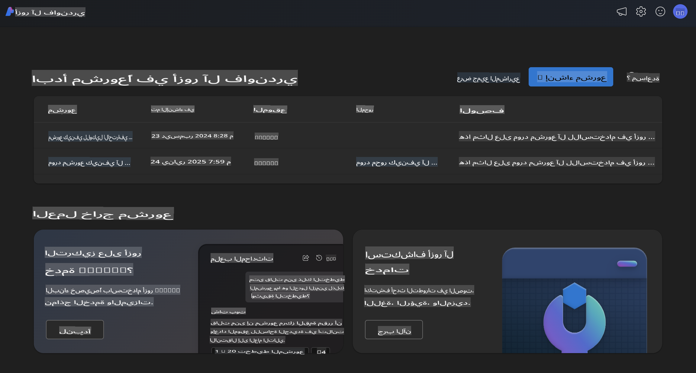
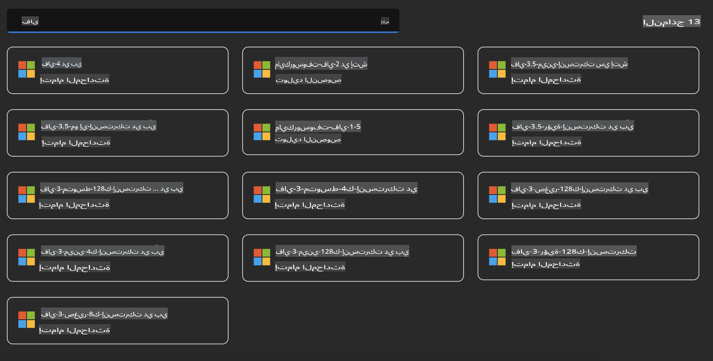
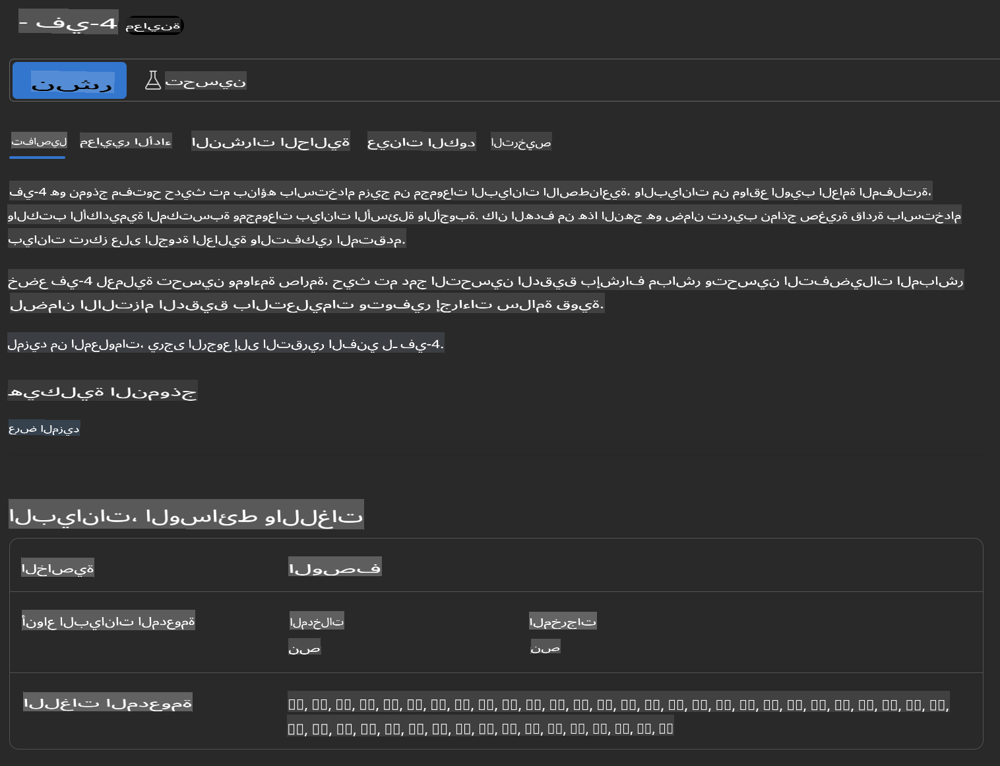
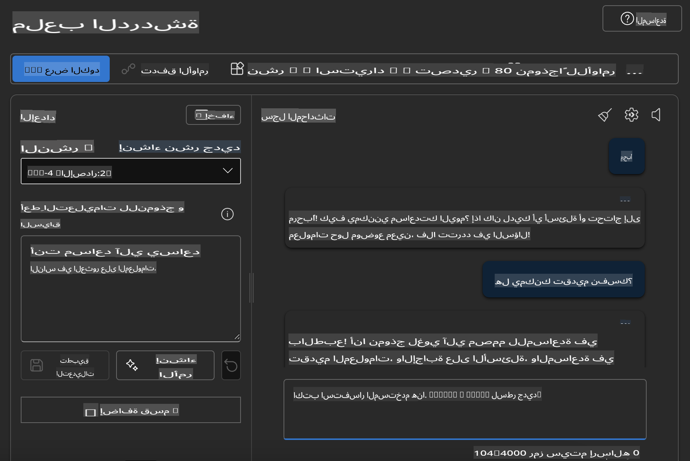

## عائلة Phi في Azure AI Foundry

[Azure AI Foundry](https://ai.azure.com) هي منصة موثوقة تمكّن المطورين من قيادة الابتكار وتشكيل المستقبل باستخدام الذكاء الاصطناعي بطريقة آمنة ومأمونة ومسؤولة.

تم تصميم [Azure AI Foundry](https://ai.azure.com) للمطورين من أجل:

- بناء تطبيقات ذكاء اصطناعي توليدي على منصة بمستوى مؤسسي.
- استكشاف وبناء واختبار ونشر باستخدام أدوات ذكاء اصطناعي ونماذج تعلم آلي متطورة، مع الالتزام بممارسات الذكاء الاصطناعي المسؤولة.
- التعاون مع فريق خلال دورة حياة تطوير التطبيق بالكامل.

مع Azure AI Foundry، يمكنك استكشاف مجموعة واسعة من النماذج والخدمات والإمكانات، والبدء في بناء تطبيقات ذكاء اصطناعي تخدم أهدافك بشكل أفضل. تسهّل منصة Azure AI Foundry التوسع لتحويل إثباتات المفاهيم إلى تطبيقات إنتاجية متكاملة بسهولة. يضمن المراقبة المستمرة والتحسين النجاح على المدى الطويل.



بالإضافة إلى استخدام خدمة Azure AOAI في Azure AI Foundry، يمكنك أيضًا استخدام نماذج من جهات خارجية من خلال كتالوج النماذج في Azure AI Foundry. هذا خيار جيد إذا كنت ترغب في استخدام Azure AI Foundry كمنصة لحلول الذكاء الاصطناعي الخاصة بك.

يمكننا نشر نماذج عائلة Phi بسرعة من خلال كتالوج النماذج في Azure AI Foundry.



### **نشر Phi-4 في Azure AI Foundry**



### **اختبار Phi-4 في Azure AI Foundry Playground**



### **تشغيل كود Python لاستدعاء Azure AI Foundry Phi-4**

```python

import os  
import base64
from openai import AzureOpenAI  
from azure.identity import DefaultAzureCredential, get_bearer_token_provider  
        
endpoint = os.getenv("ENDPOINT_URL", "Your Azure AOAI Service Endpoint")  
deployment = os.getenv("DEPLOYMENT_NAME", "Phi-4")  
      
token_provider = get_bearer_token_provider(  
    DefaultAzureCredential(),  
    "https://cognitiveservices.azure.com/.default"  
)  
  
client = AzureOpenAI(  
    azure_endpoint=endpoint,  
    azure_ad_token_provider=token_provider,  
    api_version="2024-05-01-preview",  
)  
  

chat_prompt = [
    {
        "role": "system",
        "content": "You are an AI assistant that helps people find information."
    },
    {
        "role": "user",
        "content": "can you introduce yourself"
    }
] 
    
# Include speech result if speech is enabled  
messages = chat_prompt 

completion = client.chat.completions.create(  
    model=deployment,  
    messages=messages,
    max_tokens=800,  
    temperature=0.7,  
    top_p=0.95,  
    frequency_penalty=0,  
    presence_penalty=0,
    stop=None,  
    stream=False  
)  
  
print(completion.to_json())  

```

**إخلاء مسؤولية**:  
تم ترجمة هذا المستند باستخدام خدمات الترجمة الآلية المعتمدة على الذكاء الاصطناعي. بينما نسعى لتحقيق الدقة، يرجى العلم بأن الترجمات الآلية قد تحتوي على أخطاء أو معلومات غير دقيقة. يجب اعتبار المستند الأصلي بلغته الأصلية المصدر الموثوق والأساسي. للحصول على معلومات حاسمة، يُوصى بالاستعانة بترجمة بشرية احترافية. نحن غير مسؤولين عن أي سوء فهم أو تفسيرات خاطئة ناتجة عن استخدام هذه الترجمة.