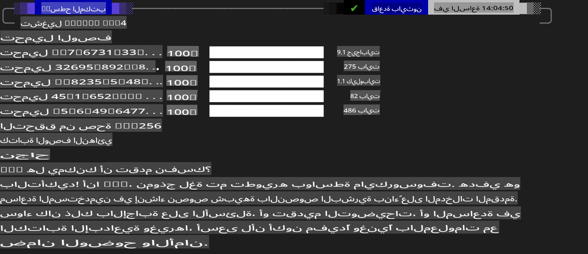
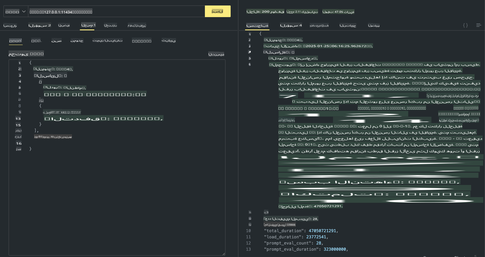

## عائلة Phi في Ollama

[Ollama](https://ollama.com) تتيح لعدد أكبر من الأشخاص نشر نماذج LLM أو SLM مفتوحة المصدر مباشرة من خلال سكربتات بسيطة، كما يمكنها إنشاء واجهات برمجة تطبيقات (APIs) لدعم سيناريوهات التطبيقات المحلية مثل Copilot.

## **1. التثبيت**

يدعم Ollama التشغيل على أنظمة Windows وmacOS وLinux. يمكنك تثبيت Ollama من خلال هذا الرابط ([https://ollama.com/download](https://ollama.com/download)). بعد التثبيت بنجاح، يمكنك استخدام سكربت Ollama لاستدعاء Phi-3 مباشرة من نافذة الطرفية. يمكنك الاطلاع على [جميع المكتبات المتاحة في Ollama](https://ollama.com/library). إذا فتحت هذا المستودع في Codespace، فسيكون Ollama مثبتًا بالفعل.

```bash

ollama run phi4

```

> [!NOTE]
> سيتم تنزيل النموذج في المرة الأولى التي تقوم فيها بتشغيله. بالطبع، يمكنك أيضًا تحديد نموذج Phi-4 الذي تم تنزيله مسبقًا. نأخذ WSL كمثال لتشغيل الأمر. بعد تنزيل النموذج بنجاح، يمكنك التفاعل مباشرة من خلال الطرفية.



## **2. استدعاء واجهة برمجة تطبيقات phi-4 من Ollama**

إذا كنت ترغب في استدعاء واجهة برمجة التطبيقات Phi-4 التي يتم إنشاؤها بواسطة Ollama، يمكنك استخدام هذا الأمر في الطرفية لبدء خادم Ollama.

```bash

ollama serve

```

> [!NOTE]
> إذا كنت تستخدم macOS أو Linux، يرجى ملاحظة أنك قد تواجه الخطأ التالي **"Error: listen tcp 127.0.0.1:11434: bind: address already in use"**. قد يظهر هذا الخطأ عند تشغيل الأمر. يمكنك تجاهل هذا الخطأ، لأنه عادةً يشير إلى أن الخادم يعمل بالفعل، أو يمكنك إيقاف وإعادة تشغيل Ollama:

**macOS**

```bash

brew services restart ollama

```

**Linux**

```bash

sudo systemctl stop ollama

```

يدعم Ollama نوعين من واجهات برمجة التطبيقات: generate وchat. يمكنك استدعاء واجهة برمجة التطبيقات للنموذج التي يوفرها Ollama وفقًا لاحتياجاتك، عن طريق إرسال الطلبات إلى الخدمة المحلية التي تعمل على المنفذ 11434.

**Chat**

```bash

curl http://127.0.0.1:11434/api/chat -d '{
  "model": "phi3",
  "messages": [
    {
      "role": "system",
      "content": "Your are a python developer."
    },
    {
      "role": "user",
      "content": "Help me generate a bubble algorithm"
    }
  ],
  "stream": false
  
}'

This is the result in Postman



## Additional Resources

Check the list of available models in Ollama in [their library](https://ollama.com/library).

Pull your model from the Ollama server using this command

```bash
ollama pull phi4
```

Run the model using this command

```bash
ollama run phi4
```

***Note:*** Visit this link [https://github.com/ollama/ollama/blob/main/docs/api.md](https://github.com/ollama/ollama/blob/main/docs/api.md) to learn more

## Calling Ollama from Python

You can use `requests` or `urllib3` to make requests to the local server endpoints used above. However, a popular way to use Ollama in Python is via the [openai](https://pypi.org/project/openai/) SDK, since Ollama provides OpenAI-compatible server endpoints as well.

Here is an example for phi3-mini:

```python
import openai

client = openai.OpenAI(
    base_url="http://localhost:11434/v1",
    api_key="nokeyneeded",
)

response = client.chat.completions.create(
    model="phi4",
    temperature=0.7,
    n=1,
    messages=[
        {"role": "system", "content": "You are a helpful assistant."},
        {"role": "user", "content": "Write a haiku about a hungry cat"},
    ],
)

print("Response:")
print(response.choices[0].message.content)
```

## Calling Ollama from JavaScript 

```javascript
// مثال لتلخيص ملف باستخدام Phi-4
script({
    model: "ollama:phi4",
    title: "Summarize with Phi-4",
    system: ["system"],
})

// مثال على التلخيص
const file = def("FILE", env.files)
$`Summarize ${file} in a single paragraph.`
```

## Calling Ollama from C#

Create a new C# Console application and add the following NuGet package:

```bash
dotnet add package Microsoft.SemanticKernel --version 1.34.0
```

Then replace this code in the `Program.cs` file

```csharp
using Microsoft.SemanticKernel;
using Microsoft.SemanticKernel.ChatCompletion;

// إضافة خدمة إكمال المحادثة باستخدام نقطة نهاية خادم Ollama المحلي
#pragma warning disable SKEXP0001, SKEXP0003, SKEXP0010, SKEXP0011, SKEXP0050, SKEXP0052
builder.AddOpenAIChatCompletion(
    modelId: "phi4",
    endpoint: new Uri("http://localhost:11434/"),
    apiKey: "non required");

// استدعاء طلب بسيط لخدمة المحادثة
string prompt = "Write a joke about kittens";
var response = await kernel.InvokePromptAsync(prompt);
Console.WriteLine(response.GetValue<string>());
```

Run the app with the command:

```bash
dotnet run

**إخلاء المسؤولية**:  
تم ترجمة هذا المستند باستخدام خدمات الترجمة الآلية المعتمدة على الذكاء الاصطناعي. بينما نسعى جاهدين لتحقيق الدقة، يرجى العلم أن الترجمات الآلية قد تحتوي على أخطاء أو معلومات غير دقيقة. يجب اعتبار المستند الأصلي بلغته الأصلية هو المصدر الموثوق. للحصول على معلومات حاسمة، يُوصى بالاستعانة بترجمة بشرية احترافية. نحن غير مسؤولين عن أي سوء فهم أو تفسيرات خاطئة ناتجة عن استخدام هذه الترجمة.