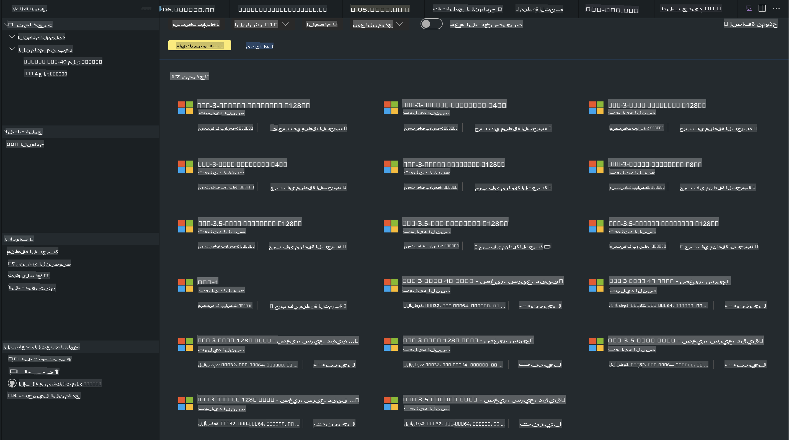
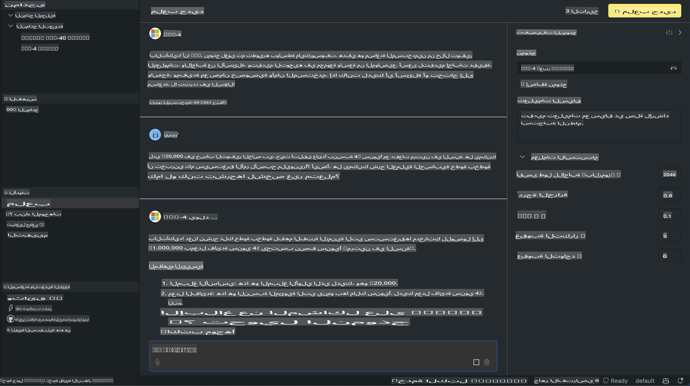

# عائلة Phi في AITK

[أداة الذكاء الاصطناعي لـ VS Code](https://marketplace.visualstudio.com/items?itemName=ms-windows-ai-studio.windows-ai-studio) تسهّل تطوير تطبيقات الذكاء الاصطناعي التوليدي من خلال جمع أدوات تطوير الذكاء الاصطناعي المتقدمة والنماذج من كتالوج Azure AI Foundry وكاتالوجات أخرى مثل Hugging Face. يمكنك تصفح كتالوج نماذج الذكاء الاصطناعي المدعوم من GitHub Models وAzure AI Foundry Model Catalogs، تحميلها محليًا أو عن بُعد، تحسينها، اختبارها واستخدامها في تطبيقاتك.

يعمل الإصدار التجريبي من AI Toolkit محليًا. يعتمد التنبؤ أو التحسين المحلي على النموذج الذي تختاره، وقد تحتاج إلى وحدة معالجة الرسومات مثل NVIDIA CUDA GPU. يمكنك أيضًا تشغيل نماذج GitHub مباشرة باستخدام AITK.

## البدء

[تعرف على كيفية تثبيت نظام Windows الفرعي لـ Linux](https://learn.microsoft.com/windows/wsl/install?WT.mc_id=aiml-137032-kinfeylo)

و[تغيير التوزيعة الافتراضية](https://learn.microsoft.com/windows/wsl/install#change-the-default-linux-distribution-installed).

[مستودع GitHub لأداة AI Toolkit](https://github.com/microsoft/vscode-ai-toolkit/)

- Windows، Linux، macOS
  
- لتحسين الأداء على كل من Windows وLinux، ستحتاج إلى وحدة معالجة الرسومات Nvidia. بالإضافة إلى ذلك، يتطلب **Windows** نظامًا فرعيًا لـ Linux مع توزيعة Ubuntu 18.4 أو أعلى. [تعرف على كيفية تثبيت نظام Windows الفرعي لـ Linux](https://learn.microsoft.com/windows/wsl/install) و[تغيير التوزيعة الافتراضية](https://learn.microsoft.com/windows/wsl/install#change-the-default-linux-distribution-installed).

### تثبيت AI Toolkit

يتم شحن AI Toolkit كـ [امتداد لـ Visual Studio Code](https://code.visualstudio.com/docs/setup/additional-components#_vs-code-extensions)، لذا ستحتاج إلى تثبيت [VS Code](https://code.visualstudio.com/docs/setup/windows?WT.mc_id=aiml-137032-kinfeylo) أولاً، وتحميل AI Toolkit من [VS Marketplace](https://marketplace.visualstudio.com/items?itemName=ms-windows-ai-studio.windows-ai-studio).  
[يتوفر AI Toolkit في سوق Visual Studio](https://marketplace.visualstudio.com/items?itemName=ms-windows-ai-studio.windows-ai-studio) ويمكن تثبيته مثل أي امتداد آخر لـ VS Code.

إذا كنت غير معتاد على تثبيت امتدادات VS Code، اتبع الخطوات التالية:

### تسجيل الدخول

1. في شريط النشاط في VS Code اختر **الامتدادات**  
1. في شريط البحث عن الامتدادات اكتب "AI Toolkit"  
1. اختر "AI Toolkit for Visual Studio code"  
1. اختر **تثبيت**  

الآن، أنت جاهز لاستخدام الامتداد!

سيُطلب منك تسجيل الدخول إلى GitHub، لذا يرجى النقر على "السماح" للمتابعة. سيتم توجيهك إلى صفحة تسجيل الدخول إلى GitHub.

يرجى تسجيل الدخول واتباع خطوات العملية. بعد إتمام العملية بنجاح، سيتم توجيهك إلى VS Code.

بمجرد تثبيت الامتداد، ستظهر أيقونة AI Toolkit في شريط النشاط الخاص بك.

لنستكشف الإجراءات المتاحة!

### الإجراءات المتاحة

الشريط الجانبي الرئيسي لـ AI Toolkit منظم كالتالي:

- **النماذج**  
- **الموارد**  
- **منطقة اللعب**  
- **تحسين الأداء**  
- **التقييم**  

تتوفر هذه الخيارات في قسم الموارد. للبدء، اختر **كتالوج النماذج**.

### تنزيل نموذج من الكتالوج

عند تشغيل AI Toolkit من الشريط الجانبي لـ VS Code، يمكنك اختيار الخيارات التالية:



- العثور على نموذج مدعوم من **كتالوج النماذج** وتنزيله محليًا  
- اختبار تنبؤ النموذج في **منطقة اللعب للنماذج**  
- تحسين النموذج محليًا أو عن بُعد في **تحسين أداء النموذج**  
- نشر النماذج المحسّنة إلى السحابة عبر لوحة الأوامر الخاصة بـ AI Toolkit  
- تقييم النماذج  

> [!NOTE]
>
> **GPU مقابل CPU**
>
> ستلاحظ أن بطاقات النماذج تعرض حجم النموذج، المنصة ونوع المسرّع (CPU، GPU). لتحقيق أداء مُحسّن على **أجهزة Windows التي تحتوي على وحدة معالجة الرسومات GPU واحدة على الأقل**، اختر إصدارات النماذج التي تستهدف Windows فقط.
>
> هذا يضمن حصولك على نموذج مُحسّن لمسرّع DirectML.
>
> أسماء النماذج تكون بالتنسيق
>
> - `{model_name}-{accelerator}-{quantization}-{format}`.
>
>للتحقق مما إذا كان لديك GPU على جهاز Windows الخاص بك، افتح **إدارة المهام** ثم اختر علامة التبويب **الأداء**. إذا كان لديك وحدات معالجة رسومات، فسيتم إدراجها بأسماء مثل "GPU 0" أو "GPU 1".

### تشغيل النموذج في منطقة اللعب

بعد ضبط جميع المعلمات، انقر على **إنشاء المشروع**.

بمجرد تنزيل النموذج، اختر **تحميل في منطقة اللعب** من بطاقة النموذج في الكتالوج:

- بدء تنزيل النموذج  
- تثبيت جميع المتطلبات والاعتماديات  
- إنشاء مساحة عمل في VS Code  



### استخدام REST API في تطبيقك

يأتي AI Toolkit مع خادم REST API محلي **على المنفذ 5272** يستخدم [صيغة OpenAI لتكملة الدردشة](https://platform.openai.com/docs/api-reference/chat/create).

يتيح لك هذا اختبار تطبيقك محليًا دون الحاجة إلى الاعتماد على خدمة نماذج الذكاء الاصطناعي السحابية. على سبيل المثال، يظهر ملف JSON التالي كيفية تكوين محتوى الطلب:

```json
{
    "model": "Phi-4",
    "messages": [
        {
            "role": "user",
            "content": "what is the golden ratio?"
        }
    ],
    "temperature": 0.7,
    "top_p": 1,
    "top_k": 10,
    "max_tokens": 100,
    "stream": true
}
```

يمكنك اختبار REST API باستخدام (على سبيل المثال) [Postman](https://www.postman.com/) أو أداة CURL (Client URL):

```bash
curl -vX POST http://127.0.0.1:5272/v1/chat/completions -H 'Content-Type: application/json' -d @body.json
```

### استخدام مكتبة OpenAI للعميل في Python

```python
from openai import OpenAI

client = OpenAI(
    base_url="http://127.0.0.1:5272/v1/", 
    api_key="x" # required for the API but not used
)

chat_completion = client.chat.completions.create(
    messages=[
        {
            "role": "user",
            "content": "what is the golden ratio?",
        }
    ],
    model="Phi-4",
)

print(chat_completion.choices[0].message.content)
```

### استخدام مكتبة Azure OpenAI للعميل في .NET

أضف [مكتبة Azure OpenAI للعميل لـ .NET](https://www.nuget.org/packages/Azure.AI.OpenAI/) إلى مشروعك باستخدام NuGet:

```bash
dotnet add {project_name} package Azure.AI.OpenAI --version 1.0.0-beta.17
```

أضف ملف C# يسمى **OverridePolicy.cs** إلى مشروعك والصق الكود التالي:

```csharp
// OverridePolicy.cs
using Azure.Core.Pipeline;
using Azure.Core;

internal partial class OverrideRequestUriPolicy(Uri overrideUri)
    : HttpPipelineSynchronousPolicy
{
    private readonly Uri _overrideUri = overrideUri;

    public override void OnSendingRequest(HttpMessage message)
    {
        message.Request.Uri.Reset(_overrideUri);
    }
}
```

بعد ذلك، الصق الكود التالي في ملف **Program.cs** الخاص بك:

```csharp
// Program.cs
using Azure.AI.OpenAI;

Uri localhostUri = new("http://localhost:5272/v1/chat/completions");

OpenAIClientOptions clientOptions = new();
clientOptions.AddPolicy(
    new OverrideRequestUriPolicy(localhostUri),
    Azure.Core.HttpPipelinePosition.BeforeTransport);
OpenAIClient client = new(openAIApiKey: "unused", clientOptions);

ChatCompletionsOptions options = new()
{
    DeploymentName = "Phi-4",
    Messages =
    {
        new ChatRequestSystemMessage("You are a helpful assistant. Be brief and succinct."),
        new ChatRequestUserMessage("What is the golden ratio?"),
    }
};

StreamingResponse<StreamingChatCompletionsUpdate> streamingChatResponse
    = await client.GetChatCompletionsStreamingAsync(options);

await foreach (StreamingChatCompletionsUpdate chatChunk in streamingChatResponse)
{
    Console.Write(chatChunk.ContentUpdate);
}
```

## تحسين الأداء باستخدام AI Toolkit

- ابدأ باكتشاف النماذج ومنطقة اللعب.  
- تحسين الأداء والاستنتاج باستخدام موارد الحوسبة المحلية.  
- تحسين الأداء والاستنتاج عن بُعد باستخدام موارد Azure.  

[تحسين الأداء باستخدام AI Toolkit](../../03.FineTuning/Finetuning_VSCodeaitoolkit.md)

## موارد الأسئلة الشائعة لأداة AI Toolkit

يرجى الرجوع إلى [صفحة الأسئلة الشائعة](https://github.com/microsoft/vscode-ai-toolkit/blob/main/archive/QA.md) للحصول على أكثر المشكلات شيوعًا وحلولها.

**إخلاء المسؤولية**:  
تم ترجمة هذا المستند باستخدام خدمات الترجمة الآلية المدعومة بالذكاء الاصطناعي. بينما نسعى لتحقيق الدقة، يرجى العلم أن الترجمات الآلية قد تحتوي على أخطاء أو عدم دقة. يجب اعتبار المستند الأصلي بلغته الأصلية المصدر الرسمي والموثوق. للحصول على معلومات حاسمة، يُوصى بالاستعانة بترجمة بشرية احترافية. نحن غير مسؤولين عن أي سوء فهم أو تفسيرات خاطئة ناتجة عن استخدام هذه الترجمة.