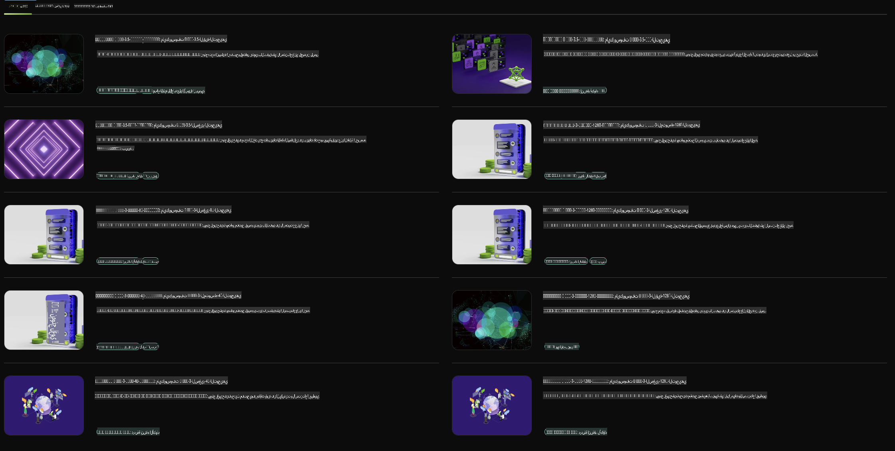

## عائلة Phi في NVIDIA NIM

NVIDIA NIM هي مجموعة من الخدمات المصغرة سهلة الاستخدام المصممة لتسريع نشر نماذج الذكاء الاصطناعي التوليدي عبر السحابة، مراكز البيانات، ومحطات العمل. يتم تصنيف NIM حسب عائلة النموذج وعلى أساس كل نموذج على حدة. على سبيل المثال، يوفر NVIDIA NIM للنماذج اللغوية الكبيرة (LLMs) قوة النماذج اللغوية المتقدمة للتطبيقات المؤسسية، مما يتيح قدرات غير مسبوقة في معالجة وفهم اللغة الطبيعية.

يسهل NIM على فرق تقنية المعلومات و DevOps استضافة النماذج اللغوية الكبيرة (LLMs) بأنفسهم في بيئاتهم المدارة، مع توفير واجهات برمجة التطبيقات القياسية في الصناعة للمطورين، مما يسمح لهم ببناء مساعدين افتراضيين، روبوتات محادثة، ومساعدين ذكيين يمكنهم تحويل أعمالهم. من خلال الاستفادة من تسريع GPU المتقدم من NVIDIA والنشر القابل للتوسع، يوفر NIM أسرع طريق للاستدلال مع أداء لا مثيل له.

يمكنك استخدام NVIDIA NIM للاستدلال باستخدام نماذج عائلة Phi.



### **أمثلة - Phi-3-Vision في NVIDIA NIM**

تخيل أن لديك صورة (`demo.png`) وترغب في توليد كود Python يعالج هذه الصورة ويحفظ نسخة جديدة منها (`phi-3-vision.jpg`).

الكود أعلاه يقوم بأتمتة هذه العملية من خلال:

1. إعداد البيئة والتكوينات اللازمة.
2. إنشاء طلب يوجه النموذج لتوليد كود Python المطلوب.
3. إرسال الطلب للنموذج وجمع الكود الناتج.
4. استخراج وتشغيل الكود الناتج.
5. عرض الصور الأصلية والمعدلة.

هذا النهج يستفيد من قوة الذكاء الاصطناعي لأتمتة مهام معالجة الصور، مما يجعل تحقيق أهدافك أسهل وأسرع.

[حل الكود النموذجي](../../../../../code/06.E2E/E2E_Nvidia_NIM_Phi3_Vision.ipynb)

لنقم بتحليل ما يقوم به الكود بالكامل خطوة بخطوة:

1. **تثبيت الحزمة المطلوبة**:
    ```python
    !pip install langchain_nvidia_ai_endpoints -U
    ```
    هذا الأمر يقوم بتثبيت حزمة `langchain_nvidia_ai_endpoints`، مع التأكد من أنها أحدث إصدار.

2. **استيراد الوحدات اللازمة**:
    ```python
    from langchain_nvidia_ai_endpoints import ChatNVIDIA
    import getpass
    import os
    import base64
    ```
    هذه الاستيرادات تُدخل الوحدات اللازمة للتفاعل مع نقاط النهاية للذكاء الاصطناعي من NVIDIA، التعامل الآمن مع كلمات المرور، التفاعل مع نظام التشغيل، وترميز/فك ترميز البيانات بتنسيق base64.

3. **إعداد مفتاح API**:
    ```python
    if not os.getenv("NVIDIA_API_KEY"):
        os.environ["NVIDIA_API_KEY"] = getpass.getpass("Enter your NVIDIA API key: ")
    ```
    هذا الكود يتحقق مما إذا كان متغير البيئة `NVIDIA_API_KEY` مضبوطًا. إذا لم يكن كذلك، فإنه يطلب من المستخدم إدخال مفتاح API الخاص به بشكل آمن.

4. **تحديد النموذج ومسار الصورة**:
    ```python
    model = 'microsoft/phi-3-vision-128k-instruct'
    chat = ChatNVIDIA(model=model)
    img_path = './imgs/demo.png'
    ```
    يتم هنا تحديد النموذج المستخدم، إنشاء مثيل من `ChatNVIDIA` بالنموذج المحدد، وتحديد مسار ملف الصورة.

5. **إنشاء طلب نصي**:
    ```python
    text = "Please create Python code for image, and use plt to save the new picture under imgs/ and name it phi-3-vision.jpg."
    ```
    هذا الكود يحدد طلبًا نصيًا يوجه النموذج لتوليد كود Python لمعالجة الصورة.

6. **ترميز الصورة بتنسيق Base64**:
    ```python
    with open(img_path, "rb") as f:
        image_b64 = base64.b64encode(f.read()).decode()
    image = f''
    ```
    يقرأ هذا الكود ملف الصورة، يرمزه بتنسيق base64، وينشئ علامة HTML للصورة مع البيانات المشفرة.

7. **دمج النص والصورة في طلب واحد**:
    ```python
    prompt = f"{text} {image}"
    ```
    يتم هنا دمج الطلب النصي وعلامة HTML للصورة في سلسلة نصية واحدة.

8. **توليد الكود باستخدام ChatNVIDIA**:
    ```python
    code = ""
    for chunk in chat.stream(prompt):
        print(chunk.content, end="")
        code += chunk.content
    ```
    يرسل هذا الكود الطلب إلى `ChatNVIDIA` ويجمع الكود الناتج في سلسلة نصية.

9. **استخراج كود Python من المحتوى الناتج**:
    ```python
    begin = code.index('```python') + 9
    code = code[begin:]
    end = code.index('```')
    code = code[:end]
    ```
    يقوم هذا الكود باستخراج كود Python الفعلي من المحتوى الناتج من خلال إزالة تنسيق markdown.

10. **تشغيل الكود الناتج**:
    ```python
    import subprocess
    result = subprocess.run(["python", "-c", code], capture_output=True)
    ```
    يقوم هذا الكود بتشغيل كود Python المستخرج كعملية فرعية ويجمع مخرجاته.

11. **عرض الصور**:
    ```python
    from IPython.display import Image, display
    display(Image(filename='./imgs/phi-3-vision.jpg'))
    display(Image(filename='./imgs/demo.png'))
    ```
    تعرض هذه الأسطر الصور باستخدام وحدة `IPython.display`.

**إخلاء المسؤولية**:  
تمت ترجمة هذا المستند باستخدام خدمات الترجمة الآلية بالذكاء الاصطناعي. بينما نسعى لتحقيق الدقة، يرجى العلم أن الترجمات الآلية قد تحتوي على أخطاء أو عدم دقة. يجب اعتبار المستند الأصلي بلغته الأصلية المصدر الموثوق. للحصول على معلومات حاسمة، يُوصى بالاستعانة بترجمة بشرية احترافية. نحن غير مسؤولين عن أي سوء فهم أو تفسيرات خاطئة ناتجة عن استخدام هذه الترجمة.