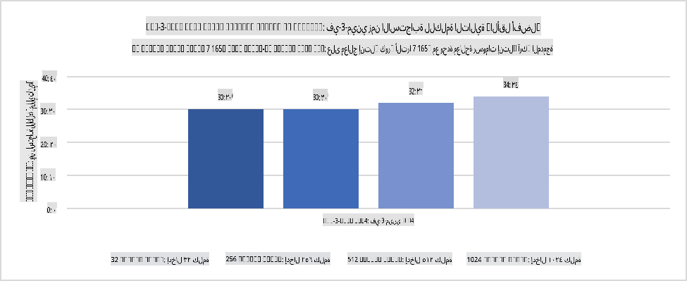
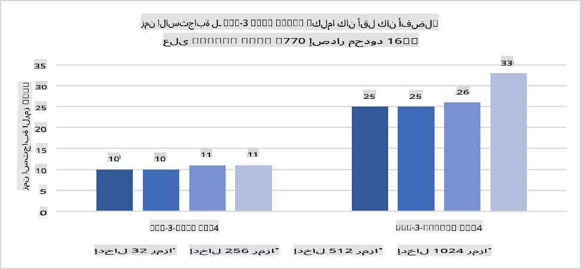
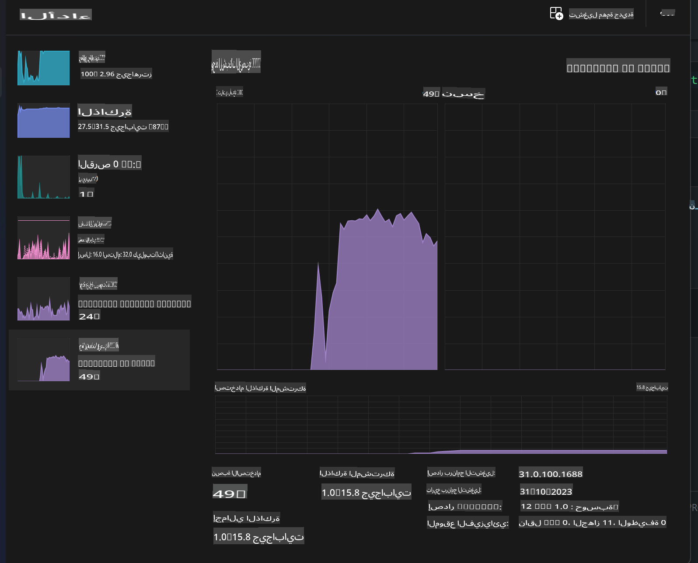
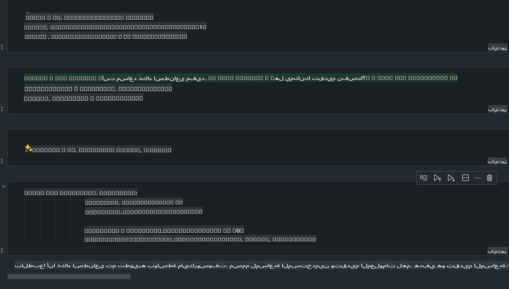
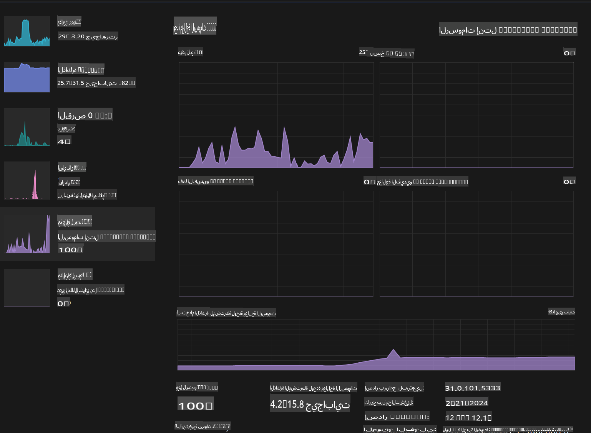

# **نشر نموذج Phi-3 على أجهزة الكمبيوتر المزودة بالذكاء الاصطناعي**

مع تطور الذكاء الاصطناعي التوليدي وتحسن قدرات الأجهزة الطرفية، أصبح من الممكن دمج عدد متزايد من نماذج الذكاء الاصطناعي التوليدية في أجهزة المستخدمين الشخصية (BYOD). أجهزة الكمبيوتر المزودة بالذكاء الاصطناعي هي واحدة من هذه النماذج. بدءًا من عام 2024، تعاونت Intel وAMD وQualcomm مع مصنعي أجهزة الكمبيوتر لتقديم أجهزة الكمبيوتر المزودة بالذكاء الاصطناعي التي تسهل نشر نماذج الذكاء الاصطناعي التوليدية المحلية من خلال تعديلات على الأجهزة. في هذه المناقشة، سنركز على أجهزة Intel المزودة بالذكاء الاصطناعي ونستعرض كيفية تشغيل نموذج Phi-3 على جهاز Intel المزود بالذكاء الاصطناعي.

### ما هو NPU؟

وحدة المعالجة العصبية (NPU) هي معالج مخصص أو وحدة معالجة ضمن نظام على شريحة (SoC) مصممة خصيصًا لتسريع عمليات الشبكات العصبية ومهام الذكاء الاصطناعي. بخلاف وحدات المعالجة المركزية (CPU) ووحدات معالجة الرسومات (GPU) العامة، يتم تحسين وحدات NPU للحوسبة الموازية المعتمدة على البيانات، مما يجعلها فعالة للغاية في معالجة البيانات الضخمة مثل الفيديوهات والصور ومعالجة بيانات الشبكات العصبية. وهي بارعة بشكل خاص في التعامل مع المهام المتعلقة بالذكاء الاصطناعي، مثل التعرف على الكلام، طمس الخلفية في مكالمات الفيديو، وعمليات تحرير الصور أو الفيديو مثل اكتشاف الكائنات.

## NPU مقابل GPU

بينما يتم تشغيل العديد من أعباء العمل الخاصة بالذكاء الاصطناعي والتعلم الآلي على وحدات معالجة الرسومات (GPU)، هناك فرق جوهري بين وحدات GPU وNPU.  
تُعرف وحدات GPU بقدراتها على الحوسبة الموازية، ولكن ليس كل وحدات GPU فعالة بنفس القدر خارج نطاق معالجة الرسومات. من ناحية أخرى، تم تصميم وحدات NPU خصيصًا للعمليات الحسابية المعقدة التي تتطلبها عمليات الشبكات العصبية، مما يجعلها فعالة للغاية في مهام الذكاء الاصطناعي.

باختصار، وحدات NPU هي "عباقرة الرياضيات" التي تُسرّع العمليات الحسابية للذكاء الاصطناعي، وتلعب دورًا رئيسيًا في عصر أجهزة الكمبيوتر المزودة بالذكاء الاصطناعي!

***هذا المثال يعتمد على أحدث معالج Intel Core Ultra***

## **1. استخدام NPU لتشغيل نموذج Phi-3**

جهاز Intel® NPU هو مسرّع استنتاجي للذكاء الاصطناعي مدمج مع وحدات المعالجة المركزية Intel® Core™ Ultra (المعروفة سابقًا باسم Meteor Lake). يتيح تنفيذ مهام الشبكات العصبية الاصطناعية بكفاءة في استهلاك الطاقة.





**مكتبة تسريع Intel NPU**

مكتبة Intel NPU Acceleration Library [https://github.com/intel/intel-npu-acceleration-library](https://github.com/intel/intel-npu-acceleration-library) هي مكتبة Python مصممة لتعزيز كفاءة التطبيقات من خلال الاستفادة من قوة وحدة المعالجة العصبية Intel (NPU) لإجراء الحسابات بسرعة على الأجهزة المتوافقة.

مثال على Phi-3-mini على جهاز كمبيوتر مزود بمعالجات Intel® Core™ Ultra.


تثبيت مكتبة Python باستخدام pip

```bash

   pip install intel-npu-acceleration-library

```

***ملاحظة*** المشروع لا يزال قيد التطوير، ولكن النموذج المرجعي مكتمل جدًا بالفعل.

### **تشغيل Phi-3 باستخدام مكتبة Intel NPU Acceleration Library**

باستخدام تسريع Intel NPU، لا تؤثر هذه المكتبة على عملية الترميز التقليدية. تحتاج فقط إلى استخدام هذه المكتبة لتكميم نموذج Phi-3 الأصلي، مثل FP16، INT8، INT4، مثل

```python
from transformers import AutoTokenizer, pipeline,TextStreamer
from intel_npu_acceleration_library import NPUModelForCausalLM, int4
from intel_npu_acceleration_library.compiler import CompilerConfig
import warnings

model_id = "microsoft/Phi-3-mini-4k-instruct"

compiler_conf = CompilerConfig(dtype=int4)
model = NPUModelForCausalLM.from_pretrained(
    model_id, use_cache=True, config=compiler_conf, attn_implementation="sdpa"
).eval()

tokenizer = AutoTokenizer.from_pretrained(model_id)

text_streamer = TextStreamer(tokenizer, skip_prompt=True)
```

بعد نجاح التكميم، استمر في التنفيذ لاستدعاء NPU لتشغيل نموذج Phi-3.

```python
generation_args = {
   "max_new_tokens": 1024,
   "return_full_text": False,
   "temperature": 0.3,
   "do_sample": False,
   "streamer": text_streamer,
}

pipe = pipeline(
   "text-generation",
   model=model,
   tokenizer=tokenizer,
)

query = "<|system|>You are a helpful AI assistant.<|end|><|user|>Can you introduce yourself?<|end|><|assistant|>"

with warnings.catch_warnings():
    warnings.simplefilter("ignore")
    pipe(query, **generation_args)
```

أثناء تنفيذ الكود، يمكننا عرض حالة تشغيل NPU من خلال مدير المهام.



***عينات*** : [AIPC_NPU_DEMO.ipynb](../../../../../code/03.Inference/AIPC/AIPC_NPU_DEMO.ipynb)

## **2. استخدام DirectML + ONNX Runtime لتشغيل نموذج Phi-3**

### **ما هو DirectML**

[DirectML](https://github.com/microsoft/DirectML) هو مكتبة DirectX 12 عالية الأداء مع تسريع عتادي للتعلم الآلي. يوفر DirectML تسريع GPU للمهام الشائعة للتعلم الآلي عبر مجموعة واسعة من الأجهزة المدعومة وبرامج التشغيل، بما في ذلك جميع وحدات GPU القادرة على DirectX 12 من بائعي مثل AMD، Intel، NVIDIA، وQualcomm.

عند استخدامه بشكل مستقل، يعد DirectML API مكتبة DirectX 12 منخفضة المستوى ومناسبة للتطبيقات ذات الأداء العالي وزمن الاستجابة المنخفض، مثل الأطر، الألعاب، والتطبيقات الأخرى في الوقت الفعلي. التوافق السلس لـ DirectML مع Direct3D 12 وكذلك انخفاض تكلفته وموثوقيته عبر الأجهزة يجعله مثاليًا لتسريع التعلم الآلي عندما يكون الأداء العالي والنتائج المتوقعة عبر الأجهزة أمرًا حاسمًا.

***ملاحظة*** : يدعم DirectML الآن NPU (https://devblogs.microsoft.com/directx/introducing-neural-processor-unit-npu-support-in-directml-developer-preview/)

### مقارنة DirectML وCUDA من حيث القدرات والأداء:

**DirectML** هو مكتبة تعلم آلي طورتها Microsoft. تم تصميمها لتسريع أعباء العمل الخاصة بالتعلم الآلي على أجهزة Windows، بما في ذلك أجهزة سطح المكتب وأجهزة الكمبيوتر المحمولة والأجهزة الطرفية.
- قائم على DX12: تم بناء DirectML على DirectX 12 (DX12)، مما يوفر دعمًا واسعًا للأجهزة عبر وحدات GPU، بما في ذلك وحدات NVIDIA وAMD.
- دعم أوسع: نظرًا لأنه يعتمد على DX12، يمكن لـ DirectML العمل مع أي GPU يدعم DX12، حتى وحدات GPU المدمجة.
- معالجة الصور: يعالج DirectML الصور والبيانات الأخرى باستخدام الشبكات العصبية، مما يجعله مناسبًا للمهام مثل التعرف على الصور، اكتشاف الكائنات، والمزيد.
- سهولة الإعداد: إعداد DirectML بسيط ولا يتطلب مكتبات أو أدوات تطوير محددة من مصنعي وحدات GPU.
- الأداء: في بعض الحالات، يقدم DirectML أداءً جيدًا وقد يكون أسرع من CUDA، خاصة في بعض أعباء العمل.
- القيود: ومع ذلك، هناك حالات قد يكون فيها DirectML أبطأ، خاصة في دفعات كبيرة مع float16.

**CUDA** هي منصة الحوسبة الموازية ونموذج البرمجة الخاص بـ NVIDIA. يسمح للمطورين باستخدام قوة وحدات GPU من NVIDIA لأغراض الحوسبة العامة، بما في ذلك التعلم الآلي والمحاكاة العلمية.
- خاص بـ NVIDIA: تم تصميم CUDA لتتكامل بشكل وثيق مع وحدات GPU من NVIDIA.
- أداء عالي التخصيص: يقدم أداءً ممتازًا للمهام المسرّعة بواسطة GPU، خاصة عند استخدام وحدات GPU من NVIDIA.
- استخدام واسع: العديد من أطر التعلم الآلي والمكتبات (مثل TensorFlow وPyTorch) تدعم CUDA.
- التخصيص: يمكن للمطورين ضبط إعدادات CUDA لمهام محددة، مما قد يؤدي إلى أداء مثالي.
- القيود: ومع ذلك، يعتمد CUDA على أجهزة NVIDIA، مما قد يكون قيدًا إذا كنت بحاجة إلى توافق أوسع عبر وحدات GPU مختلفة.

### الاختيار بين DirectML وCUDA

يعتمد الاختيار بين DirectML وCUDA على حالتك الخاصة، وتوافر الأجهزة، وتفضيلاتك.  
إذا كنت تبحث عن توافق أوسع وسهولة في الإعداد، فقد يكون DirectML خيارًا جيدًا. ومع ذلك، إذا كنت تمتلك وحدات GPU من NVIDIA وتحتاج إلى أداء عالي التخصيص، فإن CUDA تظل خيارًا قويًا. باختصار، لكل من DirectML وCUDA نقاط قوة وضعف، لذا اختر بناءً على متطلباتك والأجهزة المتاحة.

### **الذكاء الاصطناعي التوليدي مع ONNX Runtime**

في عصر الذكاء الاصطناعي، تعد قابلية نقل النماذج أمرًا مهمًا. يتيح ONNX Runtime نشر النماذج المدربة بسهولة على أجهزة مختلفة. لا يحتاج المطورون إلى التركيز على إطار الاستنتاج، ويمكنهم استخدام واجهة برمجة تطبيقات موحدة لإتمام استنتاج النموذج. في عصر الذكاء الاصطناعي التوليدي، أجرى ONNX Runtime أيضًا تحسينات على الكود (https://onnxruntime.ai/docs/genai/). من خلال ONNX Runtime المحسن، يمكن استنتاج النموذج التوليدي المُكمم على أجهزة طرفية مختلفة. مع Generative AI باستخدام ONNX Runtime، يمكن استنتاج النموذج باستخدام Python، C#، C / C++. بالطبع، يمكن النشر على iPhone باستخدام واجهة Generative AI مع ONNX Runtime الخاصة بـ C++.

[كود المثال](https://github.com/Azure-Samples/Phi-3MiniSamples/tree/main/onnx)

***تجميع الذكاء الاصطناعي التوليدي مع مكتبة ONNX Runtime***

```bash

winget install --id=Kitware.CMake  -e

git clone https://github.com/microsoft/onnxruntime.git

cd .\onnxruntime\

./build.bat --build_shared_lib --skip_tests --parallel --use_dml --config Release

cd ../

git clone https://github.com/microsoft/onnxruntime-genai.git

cd .\onnxruntime-genai\

mkdir ort

cd ort

mkdir include

mkdir lib

copy ..\onnxruntime\include\onnxruntime\core\providers\dml\dml_provider_factory.h ort\include

copy ..\onnxruntime\include\onnxruntime\core\session\onnxruntime_c_api.h ort\include

copy ..\onnxruntime\build\Windows\Release\Release\*.dll ort\lib

copy ..\onnxruntime\build\Windows\Release\Release\onnxruntime.lib ort\lib

python build.py --use_dml


```

**تثبيت المكتبة**

```bash

pip install .\onnxruntime_genai_directml-0.3.0.dev0-cp310-cp310-win_amd64.whl

```

هذا هو نتيجة التشغيل



***عينات*** : [AIPC_DirectML_DEMO.ipynb](../../../../../code/03.Inference/AIPC/AIPC_DirectML_DEMO.ipynb)

## **3. استخدام Intel OpenVino لتشغيل نموذج Phi-3**

### **ما هو OpenVINO**

[OpenVINO](https://github.com/openvinotoolkit/openvino) هو أداة مفتوحة المصدر لتحسين ونشر نماذج التعلم العميق. يوفر أداءً معززًا لنماذج التعلم العميق الخاصة بالرؤية والصوت واللغة من أطر شهيرة مثل TensorFlow وPyTorch والمزيد. ابدأ مع OpenVINO. يمكن أيضًا استخدام OpenVINO مع وحدة المعالجة المركزية ووحدة معالجة الرسومات لتشغيل نموذج Phi3.

***ملاحظة***: حاليًا، لا يدعم OpenVINO وحدة NPU.

### **تثبيت مكتبة OpenVINO**

```bash

 pip install git+https://github.com/huggingface/optimum-intel.git

 pip install git+https://github.com/openvinotoolkit/nncf.git

 pip install openvino-nightly

```

### **تشغيل Phi-3 باستخدام OpenVINO**

مثل NPU، يكمل OpenVINO استدعاء نماذج الذكاء الاصطناعي التوليدية عن طريق تشغيل النماذج المكممة. نحتاج أولاً إلى تكميم نموذج Phi-3 وإكمال التكميم عبر سطر الأوامر باستخدام optimum-cli.

**INT4**

```bash

optimum-cli export openvino --model "microsoft/Phi-3-mini-4k-instruct" --task text-generation-with-past --weight-format int4 --group-size 128 --ratio 0.6  --sym  --trust-remote-code ./openvinomodel/phi3/int4

```

**FP16**

```bash

optimum-cli export openvino --model "microsoft/Phi-3-mini-4k-instruct" --task text-generation-with-past --weight-format fp16 --trust-remote-code ./openvinomodel/phi3/fp16

```

الشكل المحول، يبدو هكذا


قم بتحميل مسارات النموذج (model_dir)، التكوينات ذات الصلة (ov_config = {"PERFORMANCE_HINT": "LATENCY", "NUM_STREAMS": "1", "CACHE_DIR": ""})، وأجهزة التسريع العتادية (GPU.0) من خلال OVModelForCausalLM.

```python

ov_model = OVModelForCausalLM.from_pretrained(
     model_dir,
     device='GPU.0',
     ov_config=ov_config,
     config=AutoConfig.from_pretrained(model_dir, trust_remote_code=True),
     trust_remote_code=True,
)

```

أثناء تنفيذ الكود، يمكننا عرض حالة تشغيل GPU من خلال مدير المهام.



***عينات*** : [AIPC_OpenVino_Demo.ipynb](../../../../../code/03.Inference/AIPC/AIPC_OpenVino_Demo.ipynb)

### ***ملاحظة*** : الطرق الثلاثة المذكورة أعلاه لكل منها مزاياها، ولكن يُوصى باستخدام تسريع NPU للاستنتاج على أجهزة الكمبيوتر المزودة بالذكاء الاصطناعي.

**إخلاء المسؤولية**:  
تم ترجمة هذا المستند باستخدام خدمات الترجمة الآلية المعتمدة على الذكاء الاصطناعي. بينما نسعى لتحقيق الدقة، يرجى العلم أن الترجمات الآلية قد تحتوي على أخطاء أو معلومات غير دقيقة. يجب اعتبار المستند الأصلي بلغته الأصلية هو المصدر الموثوق به. بالنسبة للمعلومات الحساسة، يُوصى بالاستعانة بترجمة بشرية احترافية. نحن غير مسؤولين عن أي سوء فهم أو تفسير خاطئ ينشأ نتيجة استخدام هذه الترجمة.