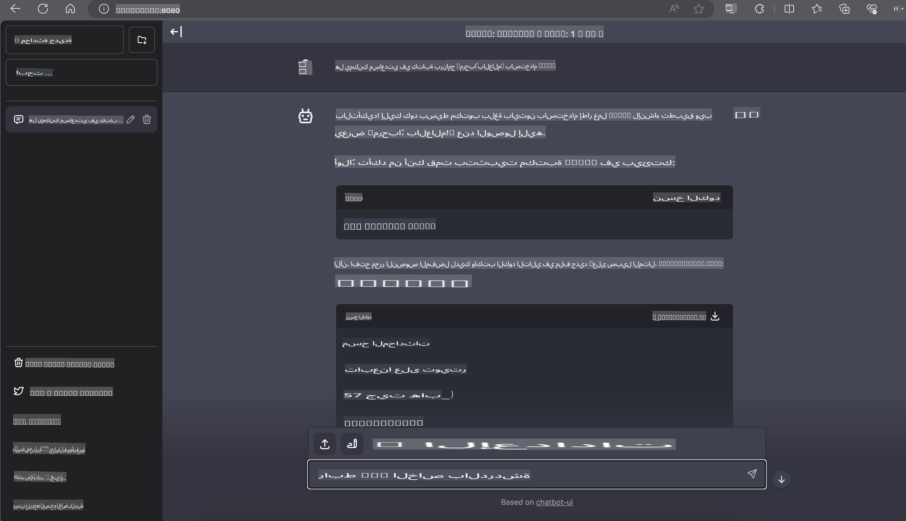

# **تنفيذ Phi-3 على Nvidia Jetson**

Nvidia Jetson هي سلسلة من لوحات الحوسبة المدمجة من Nvidia. تحمل نماذج Jetson TK1 وTX1 وTX2 جميعها معالج Tegra (أو SoC) من Nvidia الذي يدمج وحدة معالجة مركزية (CPU) تعتمد على معمارية ARM. Jetson هو نظام منخفض الطاقة ومصمم لتسريع تطبيقات التعلم الآلي. يتم استخدام Nvidia Jetson من قبل المطورين المحترفين لإنشاء منتجات ذكاء اصطناعي رائدة في جميع الصناعات، وأيضًا من قبل الطلاب والهواة لتعلم الذكاء الاصطناعي بشكل عملي وإنشاء مشاريع مذهلة. يتم نشر SLM في أجهزة الحافة مثل Jetson، مما يتيح تنفيذًا أفضل لسيناريوهات تطبيق الذكاء الاصطناعي الصناعي التوليدي.

## النشر على NVIDIA Jetson:
يمكن للمطورين الذين يعملون على الروبوتات المستقلة والأجهزة المدمجة الاستفادة من Phi-3 Mini. الحجم الصغير نسبيًا لـ Phi-3 يجعله مثاليًا للنشر على الحافة. تم ضبط المعلمات بدقة أثناء التدريب لضمان دقة عالية في الاستجابات.

### تحسين TensorRT-LLM:
مكتبة [TensorRT-LLM من NVIDIA](https://github.com/NVIDIA/TensorRT-LLM?WT.mc_id=aiml-138114-kinfeylo) تعمل على تحسين استدلال نماذج اللغة الكبيرة. تدعم نافذة السياق الطويلة لـ Phi-3 Mini، مما يعزز كلًا من الإنتاجية والزمن المستغرق. تشمل التحسينات تقنيات مثل LongRoPE وFP8 والتجميع أثناء التنفيذ.

### التوفر والنشر:
يمكن للمطورين استكشاف Phi-3 Mini مع نافذة سياق 128K عبر [NVIDIA's AI](https://www.nvidia.com/en-us/ai-data-science/generative-ai/). يتم تقديمه كخدمة صغيرة (NVIDIA NIM) مع واجهة برمجة تطبيقات قياسية يمكن نشرها في أي مكان. بالإضافة إلى ذلك، يمكن العثور على [تنفيذات TensorRT-LLM على GitHub](https://github.com/NVIDIA/TensorRT-LLM).

## **1. التحضير**

a. Jetson Orin NX / Jetson NX  

b. JetPack 5.1.2+  

c. Cuda 11.8  

d. Python 3.8+  

## **2. تشغيل Phi-3 على Jetson**

يمكننا اختيار [Ollama](https://ollama.com) أو [LlamaEdge](https://llamaedge.com)  

إذا كنت ترغب في استخدام gguf في السحابة وأجهزة الحافة في الوقت نفسه، يمكن فهم LlamaEdge كـ WasmEdge (WasmEdge هو بيئة تشغيل WebAssembly خفيفة الوزن وعالية الأداء وقابلة للتوسع ومناسبة للتطبيقات السحابية الأصلية والحافة والتطبيقات اللامركزية. يدعم التطبيقات بدون خادم، الوظائف المدمجة، الخدمات المصغرة، العقود الذكية وأجهزة إنترنت الأشياء. يمكنك نشر النموذج الكمي لـ gguf على أجهزة الحافة والسحابة عبر LlamaEdge).


إليك الخطوات لاستخدامه:  

1. تثبيت وتنزيل المكتبات والملفات ذات الصلة  

```bash

curl -sSf https://raw.githubusercontent.com/WasmEdge/WasmEdge/master/utils/install.sh | bash -s -- --plugin wasi_nn-ggml

curl -LO https://github.com/LlamaEdge/LlamaEdge/releases/latest/download/llama-api-server.wasm

curl -LO https://github.com/LlamaEdge/chatbot-ui/releases/latest/download/chatbot-ui.tar.gz

tar xzf chatbot-ui.tar.gz

```  

**ملاحظة**: يجب أن تكون الملفات llama-api-server.wasm وchatbot-ui في نفس المجلد  

2. تشغيل السكربتات في الطرفية  

```bash

wasmedge --dir .:. --nn-preload default:GGML:AUTO:{Your gguf path} llama-api-server.wasm -p phi-3-chat

```  

إليك النتيجة أثناء التشغيل  

  

***كود نموذجي*** [Phi-3 mini WASM Notebook Sample](https://github.com/Azure-Samples/Phi-3MiniSamples/tree/main/wasm)  

باختصار، يمثل Phi-3 Mini تقدمًا كبيرًا في نمذجة اللغة، حيث يجمع بين الكفاءة والوعي بالسياق وقوة تحسينات NVIDIA. سواء كنت تبني روبوتات أو تطبيقات على الحافة، فإن Phi-3 Mini هو أداة قوية يجب أن تكون على دراية بها.

**إخلاء المسؤولية**:  
تم ترجمة هذا المستند باستخدام خدمات الترجمة الآلية المعتمدة على الذكاء الاصطناعي. بينما نسعى لتحقيق الدقة، يرجى العلم بأن الترجمات الآلية قد تحتوي على أخطاء أو معلومات غير دقيقة. يجب اعتبار المستند الأصلي بلغته الأصلية هو المصدر الرسمي والموثوق. للحصول على معلومات حاسمة، يُوصى باللجوء إلى ترجمة بشرية احترافية. نحن غير مسؤولين عن أي سوء فهم أو تفسيرات خاطئة تنشأ عن استخدام هذه الترجمة.