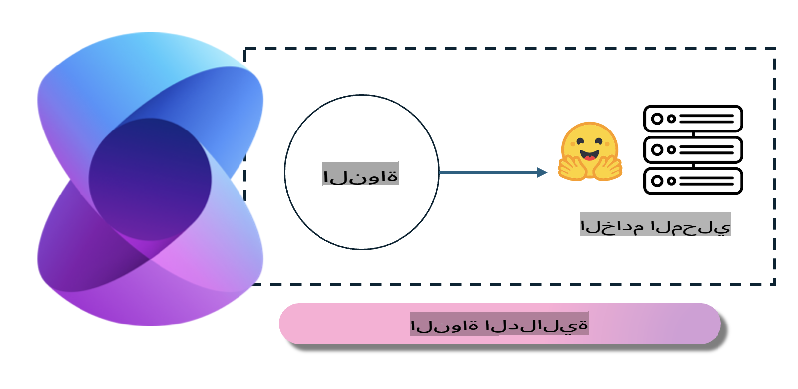
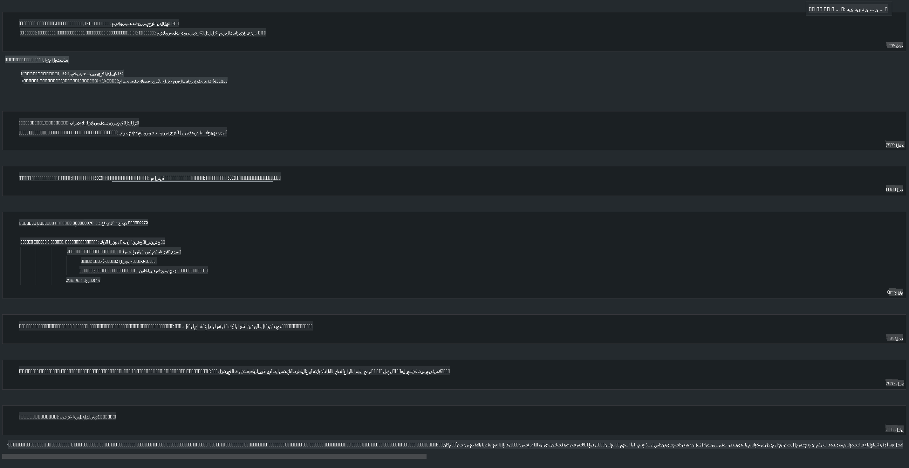

# **نشر Phi-3 على خادم محلي**

يمكننا نشر Phi-3 على خادم محلي. يمكن للمستخدمين اختيار حلول [Ollama](https://ollama.com) أو [LM Studio](https://llamaedge.com)، أو كتابة الكود الخاص بهم. يمكنك توصيل خدمات Phi-3 المحلية عبر [Semantic Kernel](https://github.com/microsoft/semantic-kernel?WT.mc_id=aiml-138114-kinfeylo) أو [Langchain](https://www.langchain.com/) لبناء تطبيقات Copilot.

## **استخدام Semantic Kernel للوصول إلى Phi-3-mini**

في تطبيق Copilot، نقوم بإنشاء التطبيقات من خلال Semantic Kernel / LangChain. هذا النوع من أطر العمل للتطبيقات يتوافق بشكل عام مع خدمة Azure OpenAI / نماذج OpenAI، ويمكنه أيضًا دعم النماذج مفتوحة المصدر على Hugging Face والنماذج المحلية. ماذا نفعل إذا أردنا استخدام Semantic Kernel للوصول إلى Phi-3-mini؟ باستخدام .NET كمثال، يمكننا دمجه مع موصل Hugging Face في Semantic Kernel. بشكل افتراضي، يمكنه التوافق مع معرف النموذج على Hugging Face (عند الاستخدام لأول مرة، سيتم تنزيل النموذج من Hugging Face، مما يستغرق وقتًا طويلاً). يمكنك أيضًا الاتصال بالخدمة المحلية التي تم إعدادها. بالمقارنة بين الخيارين، نوصي باستخدام الأخير لأنه يوفر درجة أعلى من الاستقلالية، خاصة في تطبيقات المؤسسات.

من الشكل، يمكن الوصول إلى الخدمات المحلية عبر Semantic Kernel بسهولة للاتصال بخادم نموذج Phi-3-mini الذي تم إنشاؤه ذاتيًا. هنا نتيجة التشغيل:

***الكود التجريبي*** https://github.com/kinfey/Phi3MiniSamples/tree/main/semantickernel

**إخلاء المسؤولية**:  
تم ترجمة هذا المستند باستخدام خدمات الترجمة الآلية بالاعتماد على الذكاء الاصطناعي. بينما نسعى لتحقيق الدقة، يرجى العلم أن الترجمات الآلية قد تحتوي على أخطاء أو معلومات غير دقيقة. يجب اعتبار المستند الأصلي بلغته الأصلية هو المصدر الرسمي والموثوق. للحصول على معلومات حاسمة، يُوصى بالاستعانة بترجمة بشرية احترافية. نحن غير مسؤولين عن أي سوء فهم أو تفسير خاطئ ينشأ نتيجة استخدام هذه الترجمة.