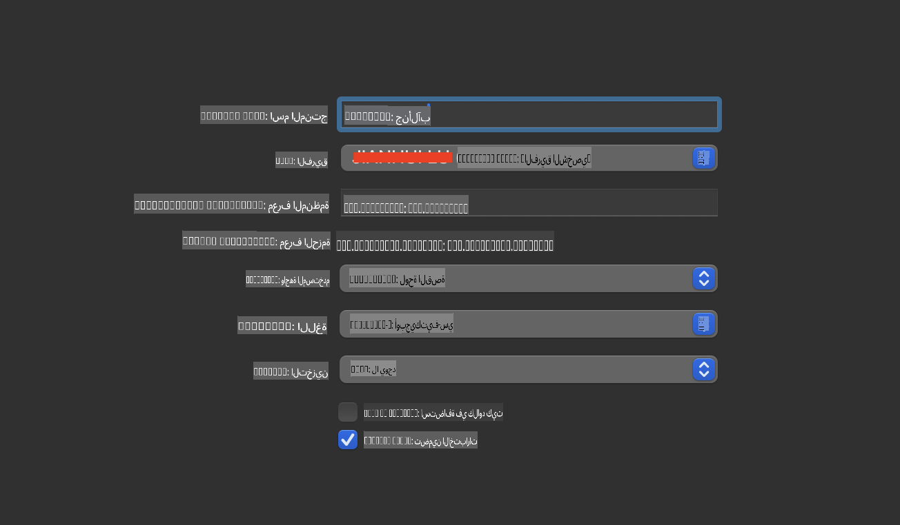
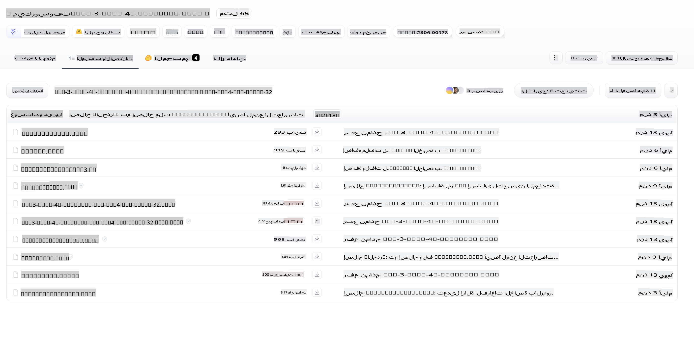
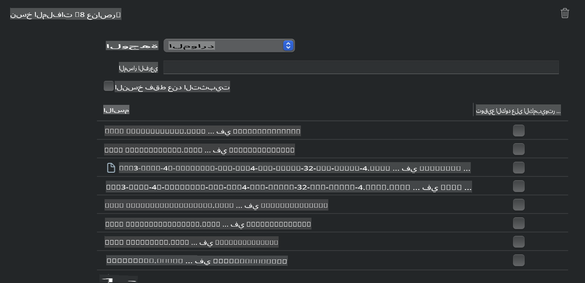
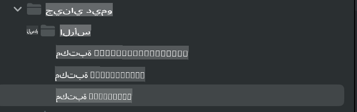
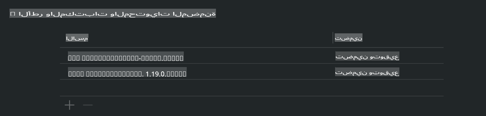
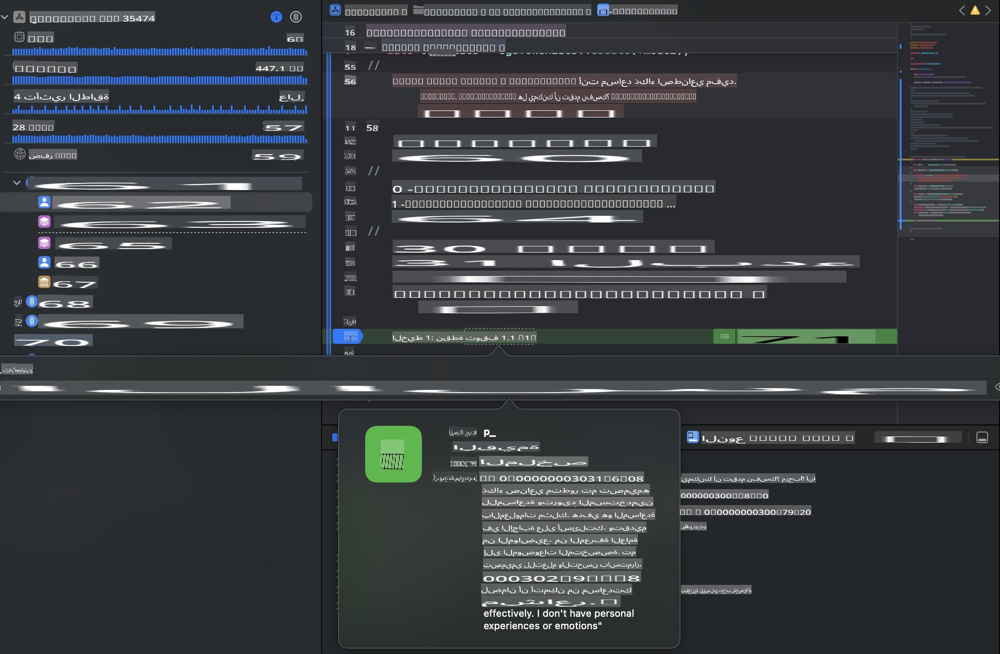

# **استنتاج Phi-3 على نظام iOS**

Phi-3-mini هو سلسلة جديدة من النماذج من مايكروسوفت تتيح نشر نماذج اللغة الكبيرة (LLMs) على الأجهزة الطرفية وأجهزة إنترنت الأشياء. Phi-3-mini متاح لنظام iOS، Android، والأجهزة الطرفية، مما يسمح بنشر الذكاء الاصطناعي التوليدي في بيئات الأجهزة المملوكة للمستخدمين (BYOD). يوضح المثال التالي كيفية نشر Phi-3-mini على نظام iOS.

## **1. التحضير**

- **أ.** macOS 14 أو أحدث  
- **ب.** Xcode 15 أو أحدث  
- **ج.** iOS SDK 17.x (iPhone 14 بمعالج A16 أو أحدث)  
- **د.** تثبيت Python 3.10 أو أحدث (يوصى باستخدام Conda)  
- **هـ.** تثبيت مكتبة Python: `python-flatbuffers`  
- **و.** تثبيت CMake  

### إطار Semantic Kernel والاستنتاج

Semantic Kernel هو إطار عمل يتيح لك إنشاء تطبيقات متوافقة مع Azure OpenAI Service، نماذج OpenAI، وحتى النماذج المحلية. الوصول إلى الخدمات المحلية من خلال Semantic Kernel يتيح التكامل السهل مع خادم نموذج Phi-3-mini المستضاف ذاتياً.

### استدعاء النماذج المضغوطة باستخدام Ollama أو LlamaEdge

يفضل العديد من المستخدمين استخدام النماذج المضغوطة لتشغيل النماذج محلياً. [Ollama](https://ollama.com) و[LlamaEdge](https://llamaedge.com) تتيحان للمستخدمين استدعاء نماذج مضغوطة مختلفة:

#### **Ollama**

يمكنك تشغيل `ollama run phi3` مباشرة أو تكوينه في وضع عدم الاتصال. قم بإنشاء ملف Modelfile مع المسار إلى ملف `gguf` الخاص بك. مثال على الكود لتشغيل نموذج Phi-3-mini المضغوط:

```gguf
FROM {Add your gguf file path}
TEMPLATE \"\"\"<|user|> .Prompt<|end|> <|assistant|>\"\"\"
PARAMETER stop <|end|>
PARAMETER num_ctx 4096
```

#### **LlamaEdge**

إذا كنت ترغب في استخدام `gguf` على السحابة والأجهزة الطرفية في الوقت نفسه، فإن LlamaEdge خيار رائع.

## **2. ترجمة ONNX Runtime لنظام iOS**

```bash

git clone https://github.com/microsoft/onnxruntime.git

cd onnxruntime

./build.sh --build_shared_lib --ios --skip_tests --parallel --build_dir ./build_ios --ios --apple_sysroot iphoneos --osx_arch arm64 --apple_deploy_target 17.5 --cmake_generator Xcode --config Release

cd ../

```

### **ملاحظة**

- **أ.** قبل الترجمة، تأكد من تكوين Xcode بشكل صحيح واضبطه كدليل مطور نشط في الطرفية:

    ```bash
    sudo xcode-select -switch /Applications/Xcode.app/Contents/Developer
    ```

- **ب.** يجب ترجمة ONNX Runtime لمنصات مختلفة. لنظام iOS، يمكنك الترجمة لـ `arm64` or `x86_64`.

- **ج.** يوصى باستخدام أحدث إصدار من iOS SDK للترجمة. ومع ذلك، يمكنك أيضاً استخدام إصدار أقدم إذا كنت بحاجة إلى التوافق مع إصدارات SDK السابقة.

## **3. ترجمة الذكاء الاصطناعي التوليدي باستخدام ONNX Runtime لنظام iOS**

> **ملاحظة:** نظراً لأن الذكاء الاصطناعي التوليدي مع ONNX Runtime في مرحلة المعاينة، يرجى الانتباه إلى التغييرات المحتملة.

```bash

git clone https://github.com/microsoft/onnxruntime-genai
 
cd onnxruntime-genai
 
mkdir ort
 
cd ort
 
mkdir include
 
mkdir lib
 
cd ../
 
cp ../onnxruntime/include/onnxruntime/core/session/onnxruntime_c_api.h ort/include
 
cp ../onnxruntime/build_ios/Release/Release-iphoneos/libonnxruntime*.dylib* ort/lib
 
export OPENCV_SKIP_XCODEBUILD_FORCE_TRYCOMPILE_DEBUG=1
 
python3 build.py --parallel --build_dir ./build_ios --ios --ios_sysroot iphoneos --ios_arch arm64 --ios_deployment_target 17.5 --cmake_generator Xcode --cmake_extra_defines CMAKE_XCODE_ATTRIBUTE_CODE_SIGNING_ALLOWED=NO

```

## **4. إنشاء تطبيق App في Xcode**

اخترت Objective-C كطريقة تطوير للتطبيق، لأن استخدام الذكاء الاصطناعي التوليدي مع ONNX Runtime C++ API يجعل التوافق أفضل مع Objective-C. بالطبع، يمكنك أيضاً إكمال الاستدعاءات ذات الصلة من خلال Swift bridging.



## **5. نسخ نموذج INT4 المضغوط من ONNX إلى مشروع تطبيق App**

نحتاج إلى استيراد نموذج INT4 المضغوط بتنسيق ONNX، والذي يجب تنزيله أولاً.



بعد التنزيل، تحتاج إلى إضافته إلى دليل Resources في المشروع في Xcode.



## **6. إضافة واجهة برمجة التطبيقات C++ في ViewControllers**

> **ملاحظة:**

- **أ.** أضف ملفات الترويسة C++ المناسبة إلى المشروع.

  

- **ب.** قم بتضمين `onnxruntime-genai` dynamic library in Xcode.

  

- **c.** Use the C Samples code for testing. You can also add additional features like ChatUI for more functionality.

- **d.** Since you need to use C++ in your project, rename `ViewController.m` to `ViewController.mm` لتمكين دعم Objective-C++.

```objc

    NSString *llmPath = [[NSBundle mainBundle] resourcePath];
    char const *modelPath = llmPath.cString;

    auto model =  OgaModel::Create(modelPath);

    auto tokenizer = OgaTokenizer::Create(*model);

    const char* prompt = "<|system|>You are a helpful AI assistant.<|end|><|user|>Can you introduce yourself?<|end|><|assistant|>";

    auto sequences = OgaSequences::Create();
    tokenizer->Encode(prompt, *sequences);

    auto params = OgaGeneratorParams::Create(*model);
    params->SetSearchOption("max_length", 100);
    params->SetInputSequences(*sequences);

    auto output_sequences = model->Generate(*params);
    const auto output_sequence_length = output_sequences->SequenceCount(0);
    const auto* output_sequence_data = output_sequences->SequenceData(0);
    auto out_string = tokenizer->Decode(output_sequence_data, output_sequence_length);
    
    auto tmp = out_string;

```

## **7. تشغيل التطبيق**

بمجرد اكتمال الإعداد، يمكنك تشغيل التطبيق لرؤية نتائج استنتاج نموذج Phi-3-mini.



للحصول على المزيد من أكواد الأمثلة والتعليمات التفصيلية، قم بزيارة [مستودع عينات Phi-3 Mini](https://github.com/Azure-Samples/Phi-3MiniSamples/tree/main/ios).

**إخلاء المسؤولية**:  
تمت ترجمة هذا المستند باستخدام خدمات الترجمة الآلية المدعومة بالذكاء الاصطناعي. على الرغم من أننا نسعى لتحقيق الدقة، يرجى العلم أن الترجمات الآلية قد تحتوي على أخطاء أو عدم دقة. يجب اعتبار المستند الأصلي بلغته الأصلية هو المصدر الموثوق. للحصول على معلومات حاسمة، يُوصى بالاستعانة بترجمة بشرية احترافية. نحن غير مسؤولين عن أي سوء فهم أو تفسيرات خاطئة ناتجة عن استخدام هذه الترجمة.