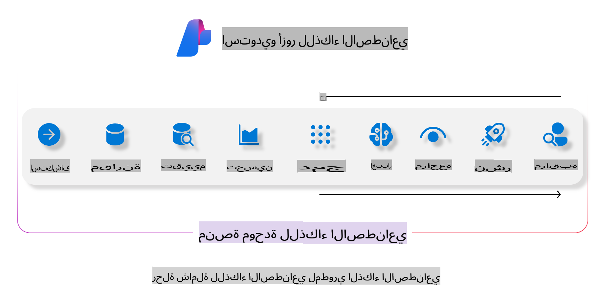
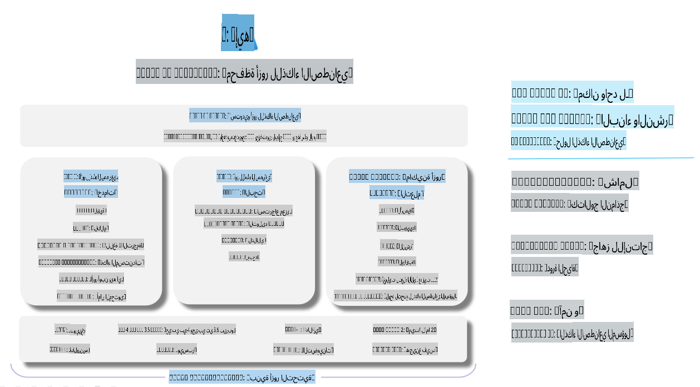

# **استخدام Azure AI Foundry للتقييم**

كيفية تقييم تطبيق الذكاء الاصطناعي التوليدي الخاص بك باستخدام [Azure AI Foundry](https://ai.azure.com?WT.mc_id=aiml-138114-kinfeylo). سواء كنت تقوم بتقييم محادثات فردية أو متعددة الأدوار، يوفر Azure AI Foundry أدوات لتقييم أداء النموذج وسلامته.

## كيفية تقييم تطبيقات الذكاء الاصطناعي التوليدية باستخدام Azure AI Foundry
للحصول على تعليمات أكثر تفصيلاً، راجع [وثائق Azure AI Foundry](https://learn.microsoft.com/azure/ai-studio/how-to/evaluate-generative-ai-app?WT.mc_id=aiml-138114-kinfeylo).

إليك الخطوات للبدء:

## تقييم نماذج الذكاء الاصطناعي التوليدية في Azure AI Foundry

**المتطلبات الأساسية**

- مجموعة بيانات اختبار بتنسيق CSV أو JSON.
- نموذج ذكاء اصطناعي توليدي منشور (مثل Phi-3، GPT 3.5، GPT 4، أو نماذج Davinci).
- بيئة تشغيل تحتوي على وحدة حوسبة لتشغيل التقييم.

## مقاييس التقييم المدمجة

يتيح لك Azure AI Foundry تقييم المحادثات الفردية وكذلك المحادثات المعقدة متعددة الأدوار.  
في سيناريوهات استرجاع البيانات المعزز (RAG)، حيث يعتمد النموذج على بيانات محددة، يمكنك تقييم الأداء باستخدام مقاييس التقييم المدمجة.  
بالإضافة إلى ذلك، يمكنك تقييم سيناريوهات الإجابة على الأسئلة الفردية العامة (غير RAG).

## إنشاء تشغيل تقييم

من واجهة المستخدم لـ Azure AI Foundry، انتقل إلى صفحة "Evaluate" أو صفحة "Prompt Flow".  
اتبع معالج إنشاء التقييم لإعداد تشغيل تقييم. قم بتوفير اسم اختياري لتقييمك.  
حدد السيناريو الذي يتماشى مع أهداف تطبيقك.  
اختر واحدًا أو أكثر من مقاييس التقييم لتقييم مخرجات النموذج.

## تدفق تقييم مخصص (اختياري)

للحصول على مرونة أكبر، يمكنك إنشاء تدفق تقييم مخصص. قم بتخصيص عملية التقييم بناءً على متطلباتك المحددة.

## عرض النتائج

بعد تشغيل التقييم، قم بتسجيل وعرض وتحليل مقاييس التقييم التفصيلية في Azure AI Foundry. احصل على رؤى حول قدرات تطبيقك وحدوده.

**ملاحظة**  
Azure AI Foundry حاليًا في المرحلة التجريبية العامة، لذا يُنصح باستخدامه لأغراض التجريب والتطوير.  
لأعباء العمل الإنتاجية، فكر في خيارات أخرى. استكشف [وثائق AI Foundry الرسمية](https://learn.microsoft.com/azure/ai-studio/?WT.mc_id=aiml-138114-kinfeylo) للحصول على مزيد من التفاصيل والتعليمات خطوة بخطوة.

**إخلاء المسؤولية**:  
تم ترجمة هذا المستند باستخدام خدمات الترجمة الآلية المدعومة بالذكاء الاصطناعي. بينما نسعى لتحقيق الدقة، يرجى العلم أن الترجمات الآلية قد تحتوي على أخطاء أو معلومات غير دقيقة. يجب اعتبار المستند الأصلي بلغته الأصلية هو المصدر الرسمي. للحصول على معلومات حاسمة، يُوصى بالاستعانة بترجمة بشرية احترافية. نحن غير مسؤولين عن أي سوء فهم أو تفسيرات خاطئة تنشأ عن استخدام هذه الترجمة.