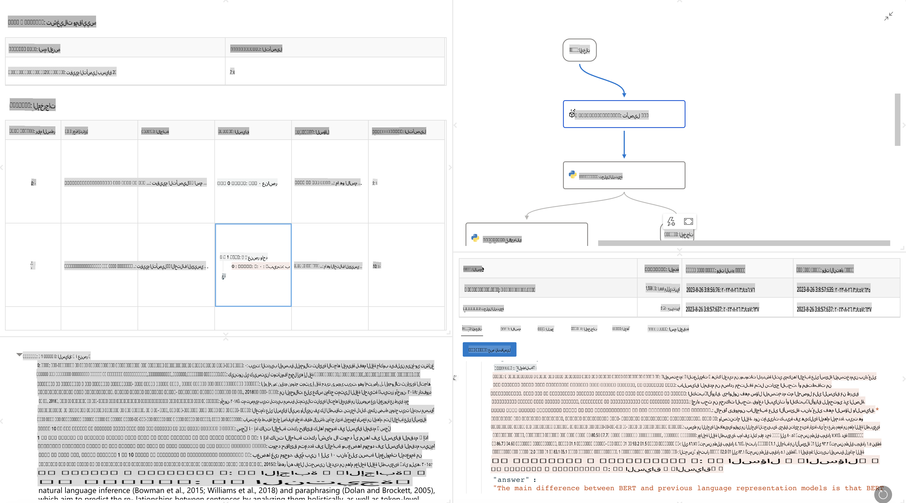

# **تعرف على Promptflow**

[Microsoft Prompt Flow](https://microsoft.github.io/promptflow/index.html?WT.mc_id=aiml-138114-kinfeylo) هو أداة مرئية لأتمتة سير العمل تتيح للمستخدمين إنشاء سير عمل مؤتمت باستخدام قوالب جاهزة ووصلات مخصصة. تم تصميمها لتمكين المطورين والمحللين التجاريين من بناء عمليات مؤتمتة بسرعة لمهام مثل إدارة البيانات، التعاون، وتحسين العمليات. مع Prompt Flow، يمكن للمستخدمين بسهولة ربط خدمات وتطبيقات وأنظمة مختلفة وأتمتة العمليات التجارية المعقدة.

تم تصميم Microsoft Prompt Flow لتبسيط دورة التطوير الشاملة لتطبيقات الذكاء الاصطناعي المدعومة بنماذج اللغة الكبيرة (LLMs). سواء كنت تخطط، أو تختبر، أو تطور، أو تنشر تطبيقات تعتمد على LLM، فإن Prompt Flow يسهل العملية ويساعدك على بناء تطبيقات بجودة إنتاجية.

## فيما يلي الميزات والفوائد الرئيسية لاستخدام Microsoft Prompt Flow:

**تجربة تأليف تفاعلية**

يوفر Prompt Flow تمثيلاً بصريًا لبنية سير العمل الخاص بك، مما يجعل من السهل فهم مشاريعك والتنقل فيها.  
يوفر تجربة ترميز شبيهة بدفاتر الملاحظات لتطوير سير العمل وتصحيح الأخطاء بكفاءة.

**تنويعات الضبط والتنقيح**

قم بإنشاء ومقارنة عدة تنويعات من التعليمات لتسهيل عملية التنقيح التدريجي.  
قيّم أداء التعليمات المختلفة واختر الأنسب.

**تدفقات التقييم المدمجة**  
قيّم جودة وفعالية تعليماتك وتدفقاتك باستخدام أدوات التقييم المدمجة.  
افهم مدى أداء تطبيقاتك المستندة إلى LLM.

**موارد شاملة**

يتضمن Prompt Flow مكتبة من الأدوات المدمجة والعينات والقوالب.  
تعمل هذه الموارد كنقطة انطلاق للتطوير، وتلهم الإبداع، وتسرّع العملية.

**التعاون والاستعداد المؤسسي**

دعم التعاون بين الفريق من خلال السماح لعدة مستخدمين بالعمل معًا على مشاريع هندسة التعليمات.  
حافظ على التحكم بالإصدارات وشارك المعرفة بفعالية.  
بسّط عملية هندسة التعليمات بالكامل من التطوير والتقييم إلى النشر والمراقبة.

## التقييم في Prompt Flow

في Microsoft Prompt Flow، يلعب التقييم دورًا حيويًا في قياس أداء نماذج الذكاء الاصطناعي. دعونا نستعرض كيفية تخصيص تدفقات التقييم والمقاييس داخل Prompt Flow:

**فهم التقييم في Prompt Flow**

في Prompt Flow، يمثل التدفق تسلسلاً من العقد التي تعالج المدخلات وتنتج المخرجات.  
تدفقات التقييم هي نوع خاص من التدفقات المصممة لقياس أداء التشغيل بناءً على معايير وأهداف محددة.

**الميزات الرئيسية لتدفقات التقييم**

عادةً ما يتم تشغيلها بعد التدفق الذي يتم اختباره، باستخدام مخرجاته.  
تقوم بحساب درجات أو مقاييس لقياس أداء التدفق الذي تم اختباره.  
يمكن أن تشمل المقاييس الدقة، درجات الصلة، أو أي مقاييس ذات صلة أخرى.

### تخصيص تدفقات التقييم

**تحديد المدخلات**

تحتاج تدفقات التقييم إلى استخدام مخرجات التشغيل الذي يتم اختباره. قم بتحديد المدخلات بطريقة مشابهة للتدفقات العادية.  
على سبيل المثال، إذا كنت تقيم تدفق أسئلة وأجوبة، قم بتسمية مدخل بـ "الإجابة". إذا كنت تقيم تدفق تصنيف، قم بتسمية مدخل بـ "الفئة". قد تكون هناك حاجة أيضًا إلى مدخلات الحقيقة الأرضية (مثل التصنيفات الفعلية).

**المخرجات والمقاييس**

تنتج تدفقات التقييم نتائج تقيس أداء التدفق الذي تم اختباره.  
يمكن حساب المقاييس باستخدام Python أو LLM (نماذج اللغة الكبيرة). استخدم وظيفة log_metric() لتسجيل المقاييس ذات الصلة.

**استخدام تدفقات التقييم المخصصة**

قم بتطوير تدفق تقييم خاص بك يناسب مهامك وأهدافك المحددة.  
خصص المقاييس بناءً على أهداف التقييم الخاصة بك.  
طبق تدفق التقييم المخصص هذا على عمليات التشغيل الدفعي للاختبار على نطاق واسع.

## طرق التقييم المدمجة

يوفر Prompt Flow أيضًا طرق تقييم مدمجة.  
يمكنك تقديم عمليات تشغيل دفعي واستخدام هذه الطرق لتقييم مدى أداء تدفقك مع مجموعات بيانات كبيرة.  
استعرض نتائج التقييم، قارن المقاييس، وكرر العملية حسب الحاجة.  
تذكر أن التقييم ضروري لضمان أن نماذج الذكاء الاصطناعي الخاصة بك تلبي المعايير والأهداف المطلوبة. استعرض الوثائق الرسمية للحصول على تعليمات مفصلة حول تطوير واستخدام تدفقات التقييم في Microsoft Prompt Flow.

باختصار، يمكن لـ Microsoft Prompt Flow تمكين المطورين من إنشاء تطبيقات LLM عالية الجودة من خلال تبسيط هندسة التعليمات وتوفير بيئة تطوير قوية. إذا كنت تعمل مع LLMs، فإن Prompt Flow هو أداة قيمة لاستكشافها. استعرض [وثائق تقييم Prompt Flow](https://learn.microsoft.com/azure/machine-learning/prompt-flow/how-to-develop-an-evaluation-flow?view=azureml-api-2?WT.mc_id=aiml-138114-kinfeylo) للحصول على تعليمات مفصلة حول تطوير واستخدام تدفقات التقييم في Microsoft Prompt Flow.

**إخلاء المسؤولية**:  
تمت ترجمة هذا المستند باستخدام خدمات الترجمة الآلية بالاعتماد على الذكاء الاصطناعي. بينما نسعى لتحقيق الدقة، يرجى العلم بأن الترجمات الآلية قد تحتوي على أخطاء أو عدم دقة. يجب اعتبار المستند الأصلي بلغته الأصلية المصدر الموثوق. للحصول على معلومات حاسمة، يُوصى باللجوء إلى ترجمة بشرية احترافية. نحن غير مسؤولين عن أي سوء فهم أو تفسيرات خاطئة ناتجة عن استخدام هذه الترجمة.