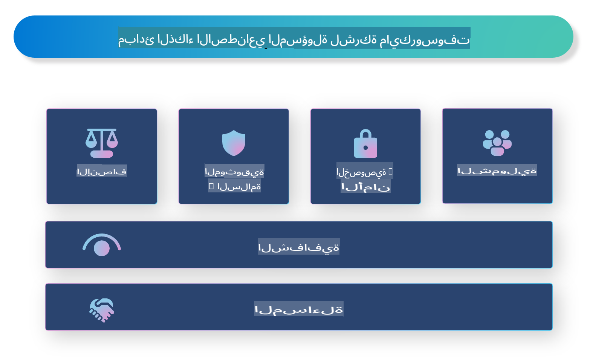

# **تقديم الذكاء الاصطناعي المسؤول**

[Microsoft Responsible AI](https://www.microsoft.com/ai/responsible-ai?WT.mc_id=aiml-138114-kinfeylo) هي مبادرة تهدف إلى مساعدة المطورين والمؤسسات في بناء أنظمة ذكاء اصطناعي تكون شفافة، جديرة بالثقة، وقابلة للمساءلة. توفر المبادرة إرشادات وموارد لتطوير حلول ذكاء اصطناعي مسؤولة تتماشى مع المبادئ الأخلاقية مثل الخصوصية، العدالة، والشفافية. سنستعرض أيضًا بعض التحديات وأفضل الممارسات المرتبطة ببناء أنظمة ذكاء اصطناعي مسؤولة.

## نظرة عامة على الذكاء الاصطناعي المسؤول من Microsoft

**المبادئ الأخلاقية**

يسترشد الذكاء الاصطناعي المسؤول من Microsoft بمجموعة من المبادئ الأخلاقية، مثل الخصوصية، العدالة، الشفافية، المساءلة، والسلامة. تم تصميم هذه المبادئ لضمان تطوير أنظمة ذكاء اصطناعي بطريقة أخلاقية ومسؤولة.

**الذكاء الاصطناعي الشفاف**

يؤكد الذكاء الاصطناعي المسؤول من Microsoft على أهمية الشفافية في أنظمة الذكاء الاصطناعي. يتضمن ذلك تقديم تفسيرات واضحة حول كيفية عمل نماذج الذكاء الاصطناعي، بالإضافة إلى ضمان توفر مصادر البيانات والخوارزميات للجمهور.

**الذكاء الاصطناعي القابل للمساءلة**

[Microsoft Responsible AI](https://www.microsoft.com/ai/responsible-ai?WT.mc_id=aiml-138114-kinfeylo) يعزز تطوير أنظمة ذكاء اصطناعي قابلة للمساءلة، يمكنها تقديم رؤى حول كيفية اتخاذ نماذج الذكاء الاصطناعي للقرارات. يساعد ذلك المستخدمين على فهم مخرجات الأنظمة والثقة بها.

**الشمولية**

يجب تصميم أنظمة الذكاء الاصطناعي بحيث تعود بالفائدة على الجميع. تسعى Microsoft إلى إنشاء ذكاء اصطناعي شامل يأخذ في الاعتبار وجهات نظر متنوعة ويتجنب التحيز أو التمييز.

**الاعتمادية والسلامة**

ضمان أن تكون أنظمة الذكاء الاصطناعي موثوقة وآمنة أمر بالغ الأهمية. تركز Microsoft على بناء نماذج قوية تؤدي بشكل متسق وتتجنب النتائج الضارة.

**العدالة في الذكاء الاصطناعي**

يدرك الذكاء الاصطناعي المسؤول من Microsoft أن أنظمة الذكاء الاصطناعي قد تعزز التحيز إذا تم تدريبها على بيانات أو خوارزميات متحيزة. توفر المبادرة إرشادات لتطوير أنظمة ذكاء اصطناعي عادلة لا تميز بناءً على عوامل مثل العرق، الجنس، أو العمر.

**الخصوصية والأمان**

يؤكد الذكاء الاصطناعي المسؤول من Microsoft على أهمية حماية خصوصية المستخدم وأمان البيانات في أنظمة الذكاء الاصطناعي. يشمل ذلك تنفيذ تشفير قوي للبيانات وضوابط وصول، بالإضافة إلى مراجعة أنظمة الذكاء الاصطناعي بانتظام للكشف عن الثغرات.

**المساءلة والمسؤولية**

يعزز الذكاء الاصطناعي المسؤول من Microsoft المساءلة والمسؤولية في تطوير ونشر الذكاء الاصطناعي. يشمل ذلك ضمان وعي المطورين والمؤسسات بالمخاطر المحتملة المرتبطة بأنظمة الذكاء الاصطناعي واتخاذ خطوات للتخفيف من تلك المخاطر.

## أفضل الممارسات لبناء أنظمة ذكاء اصطناعي مسؤولة

**تطوير نماذج الذكاء الاصطناعي باستخدام مجموعات بيانات متنوعة**

لتجنب التحيز في أنظمة الذكاء الاصطناعي، من المهم استخدام مجموعات بيانات متنوعة تمثل مجموعة من وجهات النظر والخبرات.

**استخدام تقنيات الذكاء الاصطناعي القابلة للتفسير**

يمكن أن تساعد تقنيات الذكاء الاصطناعي القابلة للتفسير المستخدمين على فهم كيفية اتخاذ نماذج الذكاء الاصطناعي للقرارات، مما يزيد من الثقة في النظام.

**مراجعة أنظمة الذكاء الاصطناعي بانتظام للكشف عن الثغرات**

يمكن أن تساعد المراجعات المنتظمة لأنظمة الذكاء الاصطناعي في تحديد المخاطر والثغرات المحتملة التي تحتاج إلى معالجة.

**تنفيذ تشفير قوي للبيانات وضوابط وصول**

يمكن أن يساعد تشفير البيانات وضوابط الوصول في حماية خصوصية المستخدم وأمانه في أنظمة الذكاء الاصطناعي.

**اتباع المبادئ الأخلاقية في تطوير الذكاء الاصطناعي**

يمكن أن يساعد اتباع المبادئ الأخلاقية، مثل العدالة، الشفافية، والمسؤولية، في بناء الثقة في أنظمة الذكاء الاصطناعي وضمان تطويرها بطريقة مسؤولة.

## استخدام AI Foundry للذكاء الاصطناعي المسؤول

[Azure AI Foundry](https://ai.azure.com?WT.mc_id=aiml-138114-kinfeylo) هو منصة قوية تتيح للمطورين والمؤسسات إنشاء تطبيقات ذكية ومتطورة وجاهزة للسوق ومسؤولة بسرعة. فيما يلي بعض الميزات والقدرات الرئيسية لـ Azure AI Foundry:

**واجهات برمجية ونماذج جاهزة وقابلة للتخصيص**

يوفر Azure AI Foundry واجهات برمجية ونماذج جاهزة وقابلة للتخصيص تغطي مجموعة واسعة من مهام الذكاء الاصطناعي، بما في ذلك الذكاء الاصطناعي التوليدي، معالجة اللغة الطبيعية، البحث، المراقبة، الترجمة، الصوتيات، الرؤية، واتخاذ القرارات.

**Prompt Flow**

تتيح خاصية Prompt Flow في Azure AI Foundry إنشاء تجارب ذكاء اصطناعي تفاعلية. تمكنك من تصميم وإدارة تدفقات المحادثات، مما يسهل بناء روبوتات المحادثة، المساعدات الافتراضية، والتطبيقات التفاعلية الأخرى.

**التوليد المعزز بالاسترجاع (RAG)**

تقنية RAG تجمع بين النهج القائم على الاسترجاع والنهج التوليدي. تحسن جودة الردود المولدة من خلال الاستفادة من المعرفة الموجودة مسبقًا (الاسترجاع) والتوليد الإبداعي (التوليد).

**مقاييس التقييم والمراقبة للذكاء الاصطناعي التوليدي**

يوفر Azure AI Foundry أدوات لتقييم ومراقبة نماذج الذكاء الاصطناعي التوليدي. يمكنك تقييم أدائها، عدالتها، والمقاييس المهمة الأخرى لضمان نشرها بشكل مسؤول. بالإضافة إلى ذلك، إذا قمت بإنشاء لوحة معلومات، يمكنك استخدام واجهة المستخدم بدون كود في Azure Machine Learning Studio لتخصيص وإنشاء لوحة معلومات الذكاء الاصطناعي المسؤول والبطاقة المرتبطة بها بناءً على مكتبات [Responsible AI Toolbox](https://responsibleaitoolbox.ai/?WT.mc_id=aiml-138114-kinfeylo) بلغة Python. تساعدك هذه البطاقة في مشاركة رؤى رئيسية تتعلق بالعدالة، أهمية الميزات، واعتبارات النشر المسؤول مع الأطراف الفنية وغير الفنية.

لاستخدام AI Foundry مع الذكاء الاصطناعي المسؤول، يمكنك اتباع أفضل الممارسات التالية:

**تحديد المشكلة وأهداف نظام الذكاء الاصطناعي**

قبل بدء عملية التطوير، من المهم تحديد المشكلة أو الهدف الذي يسعى نظام الذكاء الاصطناعي إلى حله بوضوح. سيساعدك ذلك في تحديد البيانات، الخوارزميات، والموارد اللازمة لبناء نموذج فعال.

**جمع البيانات ذات الصلة ومعالجتها مسبقًا**

يمكن أن يكون لجودة وكمية البيانات المستخدمة في تدريب نظام الذكاء الاصطناعي تأثير كبير على أدائه. لذلك، من المهم جمع البيانات ذات الصلة، تنظيفها، معالجتها مسبقًا، وضمان تمثيلها للسكان أو المشكلة التي تحاول حلها.

**اختيار التقييم المناسب**

توجد خوارزميات تقييم مختلفة متاحة. من المهم اختيار الخوارزمية الأنسب بناءً على بياناتك ومشكلتك.

**تقييم وتفسير النموذج**

بمجرد بناء نموذج الذكاء الاصطناعي، من المهم تقييم أدائه باستخدام المقاييس المناسبة وتفسير النتائج بطريقة شفافة. سيساعدك ذلك في تحديد أي تحيزات أو قيود في النموذج وإجراء تحسينات عند الضرورة.

**ضمان الشفافية وقابلية التفسير**

يجب أن تكون أنظمة الذكاء الاصطناعي شفافة وقابلة للتفسير حتى يتمكن المستخدمون من فهم كيفية عملها وكيفية اتخاذ القرارات. هذا مهم بشكل خاص للتطبيقات التي لها تأثير كبير على حياة البشر، مثل الرعاية الصحية، المالية، والأنظمة القانونية.

**مراقبة وتحديث النموذج**

يجب مراقبة أنظمة الذكاء الاصطناعي وتحديثها باستمرار لضمان بقائها دقيقة وفعالة مع مرور الوقت. يتطلب ذلك صيانة مستمرة، اختبار، وإعادة تدريب النموذج.

في الختام، الذكاء الاصطناعي المسؤول من Microsoft هو مبادرة تهدف إلى مساعدة المطورين والمؤسسات على بناء أنظمة ذكاء اصطناعي تكون شفافة، جديرة بالثقة، وقابلة للمساءلة. تذكر أن تنفيذ الذكاء الاصطناعي المسؤول أمر ضروري، ويهدف Azure AI Foundry إلى جعله عمليًا للمؤسسات. من خلال اتباع المبادئ الأخلاقية وأفضل الممارسات، يمكننا ضمان تطوير ونشر أنظمة ذكاء اصطناعي بطريقة مسؤولة تفيد المجتمع ككل.

**إخلاء المسؤولية**:  
تمت ترجمة هذا المستند باستخدام خدمات الترجمة الآلية المدعومة بالذكاء الاصطناعي. بينما نسعى لتحقيق الدقة، يرجى العلم أن الترجمات الآلية قد تحتوي على أخطاء أو معلومات غير دقيقة. يجب اعتبار المستند الأصلي بلغته الأصلية المصدر الموثوق. بالنسبة للمعلومات الحساسة أو الهامة، يُوصى بالاستعانة بترجمة بشرية احترافية. نحن غير مسؤولين عن أي سوء فهم أو تفسيرات خاطئة تنشأ عن استخدام هذه الترجمة.