# تقييم نموذج Phi-3 / Phi-3.5 المحسّن في Azure AI Foundry مع التركيز على مبادئ الذكاء الاصطناعي المسؤول من Microsoft

يعتمد هذا المثال الشامل (E2E) على الدليل "[تقييم نماذج Phi-3 / 3.5 المحسّنة في Azure AI Foundry مع التركيز على الذكاء الاصطناعي المسؤول من Microsoft](https://techcommunity.microsoft.com/t5/educator-developer-blog/evaluate-fine-tuned-phi-3-3-5-models-in-azure-ai-studio-focusing/ba-p/4227850?WT.mc_id=aiml-137032-kinfeylo)" من مجتمع Microsoft التقني.

## نظرة عامة

### كيف يمكنك تقييم أمان وأداء نموذج Phi-3 / Phi-3.5 المحسّن في Azure AI Foundry؟

تحسين النموذج قد يؤدي أحيانًا إلى استجابات غير مقصودة أو غير مرغوب فيها. لضمان بقاء النموذج آمنًا وفعّالًا، من المهم تقييم قدرته على إنتاج محتوى ضار ومدى دقته وارتباطه وتماسك استجاباته. في هذا الدليل، ستتعلم كيفية تقييم أمان وأداء نموذج Phi-3 / Phi-3.5 المحسّن والمُدمج مع Prompt flow في Azure AI Foundry.

إليك عملية التقييم في Azure AI Foundry.

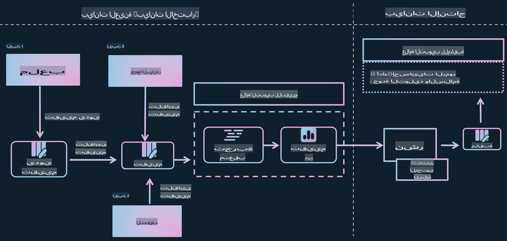

*مصدر الصورة: [تقييم تطبيقات الذكاء الاصطناعي التوليدي](https://learn.microsoft.com/azure/ai-studio/concepts/evaluation-approach-gen-ai?wt.mc_id%3Dstudentamb_279723)*

> [!NOTE]
>
> للحصول على مزيد من المعلومات التفصيلية واستكشاف موارد إضافية حول Phi-3 / Phi-3.5، يرجى زيارة [Phi-3CookBook](https://github.com/microsoft/Phi-3CookBook?wt.mc_id=studentamb_279723).

### المتطلبات الأساسية

- [Python](https://www.python.org/downloads)
- [اشتراك Azure](https://azure.microsoft.com/free?wt.mc_id=studentamb_279723)
- [Visual Studio Code](https://code.visualstudio.com)
- نموذج Phi-3 / Phi-3.5 محسّن

### جدول المحتويات

1. [**السيناريو 1: مقدمة عن تقييم Prompt flow في Azure AI Foundry**](../../../../../../md/02.Application/01.TextAndChat/Phi3)

    - [مقدمة عن تقييم الأمان](../../../../../../md/02.Application/01.TextAndChat/Phi3)
    - [مقدمة عن تقييم الأداء](../../../../../../md/02.Application/01.TextAndChat/Phi3)

1. [**السيناريو 2: تقييم نموذج Phi-3 / Phi-3.5 في Azure AI Foundry**](../../../../../../md/02.Application/01.TextAndChat/Phi3)

    - [قبل أن تبدأ](../../../../../../md/02.Application/01.TextAndChat/Phi3)
    - [نشر Azure OpenAI لتقييم نموذج Phi-3 / Phi-3.5](../../../../../../md/02.Application/01.TextAndChat/Phi3)
    - [تقييم نموذج Phi-3 / Phi-3.5 المحسّن باستخدام تقييم Prompt flow في Azure AI Foundry](../../../../../../md/02.Application/01.TextAndChat/Phi3)

1. [تهانينا!](../../../../../../md/02.Application/01.TextAndChat/Phi3)

## **السيناريو 1: مقدمة عن تقييم Prompt flow في Azure AI Foundry**

### مقدمة عن تقييم الأمان

لضمان أن نموذج الذكاء الاصطناعي الخاص بك أخلاقي وآمن، من الضروري تقييمه وفقًا لمبادئ الذكاء الاصطناعي المسؤول من Microsoft. في Azure AI Foundry، تتيح لك تقييمات الأمان اختبار مدى تعرض النموذج لهجمات jailbreak وقدرته على إنتاج محتوى ضار، وهو ما يتماشى مباشرة مع هذه المبادئ.


*مصدر الصورة: [تقييم تطبيقات الذكاء الاصطناعي التوليدي](https://learn.microsoft.com/azure/ai-studio/concepts/evaluation-approach-gen-ai?wt.mc_id%3Dstudentamb_279723)*

#### مبادئ الذكاء الاصطناعي المسؤول من Microsoft

قبل البدء في الخطوات التقنية، من المهم فهم مبادئ الذكاء الاصطناعي المسؤول من Microsoft، وهو إطار أخلاقي يهدف إلى توجيه تطوير وتشغيل أنظمة الذكاء الاصطناعي بشكل مسؤول. توجه هذه المبادئ تصميم وتطوير وتشغيل أنظمة الذكاء الاصطناعي لضمان أن تكون عادلة وشفافة وشاملة. تشكل هذه المبادئ الأساس لتقييم أمان نماذج الذكاء الاصطناعي.

تشمل مبادئ الذكاء الاصطناعي المسؤول من Microsoft:

- **العدالة والشمولية**: يجب أن تعامل أنظمة الذكاء الاصطناعي الجميع بعدالة وتجنب التأثير بشكل مختلف على مجموعات متشابهة في الظروف. على سبيل المثال، عند تقديم توصيات بشأن العلاج الطبي أو طلبات القروض أو التوظيف، يجب أن تقدم الأنظمة نفس التوصيات للأشخاص الذين لديهم أعراض أو ظروف مالية أو مؤهلات مهنية متشابهة.

- **الموثوقية والسلامة**: لبناء الثقة، من الضروري أن تعمل أنظمة الذكاء الاصطناعي بشكل موثوق وآمن ومتسق. يجب أن تكون هذه الأنظمة قادرة على العمل كما صُممت في الأصل، وأن تستجيب بأمان للظروف غير المتوقعة، وأن تقاوم التلاعب الضار.

- **الشفافية**: عندما تساعد أنظمة الذكاء الاصطناعي في اتخاذ قرارات تؤثر بشكل كبير على حياة الناس، من الضروري أن يفهم الناس كيف تم اتخاذ هذه القرارات.

- **الخصوصية والأمان**: مع زيادة انتشار الذكاء الاصطناعي، يصبح حماية الخصوصية وتأمين المعلومات الشخصية والتجارية أكثر أهمية وتعقيدًا.

- **المساءلة**: يجب أن يكون الأشخاص الذين يصممون وينشرون أنظمة الذكاء الاصطناعي مسؤولين عن كيفية عمل أنظمتهم.

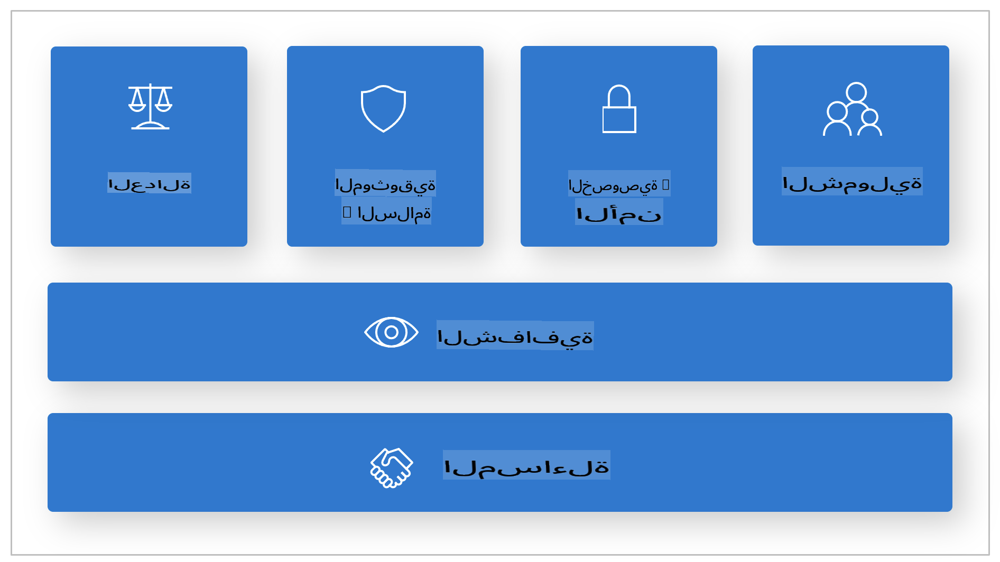

*مصدر الصورة: [ما هو الذكاء الاصطناعي المسؤول؟](https://learn.microsoft.com/azure/machine-learning/concept-responsible-ai?view=azureml-api-2&viewFallbackFrom=azureml-api-2%253fwt.mc_id%3Dstudentamb_279723)*

> [!NOTE]
> لمعرفة المزيد عن مبادئ الذكاء الاصطناعي المسؤول من Microsoft، قم بزيارة [ما هو الذكاء الاصطناعي المسؤول؟](https://learn.microsoft.com/azure/machine-learning/concept-responsible-ai?view=azureml-api-2?wt.mc_id=studentamb_279723).

#### معايير الأمان

في هذا الدليل، ستقوم بتقييم أمان نموذج Phi-3 المحسّن باستخدام معايير الأمان في Azure AI Foundry. تساعدك هذه المعايير في قياس قدرة النموذج على إنتاج محتوى ضار ومدى تعرضه لهجمات jailbreak. تشمل معايير الأمان:

- **المحتوى المرتبط بإيذاء النفس**: يقيم ما إذا كان النموذج يميل إلى إنتاج محتوى يتعلق بإيذاء النفس.
- **المحتوى الكراهية وغير العادل**: يقيم ما إذا كان النموذج يميل إلى إنتاج محتوى كراهية أو غير عادل.
- **المحتوى العنيف**: يقيم ما إذا كان النموذج يميل إلى إنتاج محتوى عنيف.
- **المحتوى الجنسي**: يقيم ما إذا كان النموذج يميل إلى إنتاج محتوى جنسي غير لائق.

يضمن تقييم هذه الجوانب أن النموذج لا ينتج محتوى ضارًا أو مسيئًا، مما يجعله متماشيًا مع القيم المجتمعية والمعايير التنظيمية.

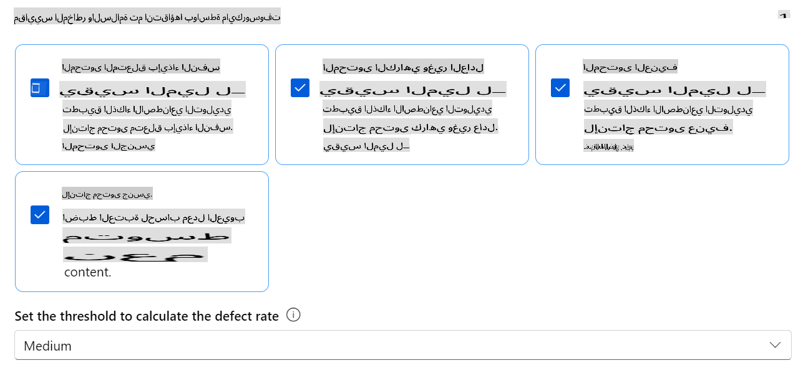

### مقدمة عن تقييم الأداء

لضمان أن نموذج الذكاء الاصطناعي الخاص بك يعمل كما هو متوقع، من المهم تقييم أدائه بناءً على معايير الأداء. في Azure AI Foundry، تتيح لك تقييمات الأداء اختبار فعالية النموذج في إنتاج استجابات دقيقة وذات صلة ومتسقة.

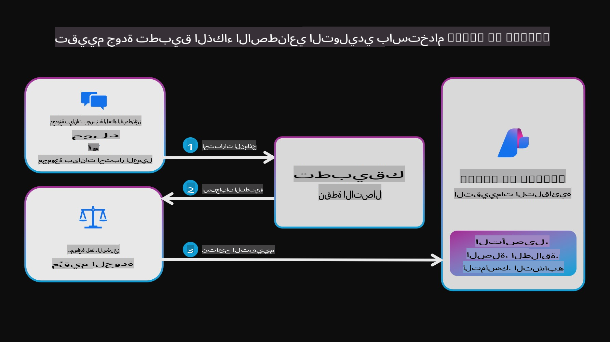

*مصدر الصورة: [تقييم تطبيقات الذكاء الاصطناعي التوليدي](https://learn.microsoft.com/azure/ai-studio/concepts/evaluation-approach-gen-ai?wt.mc_id%3Dstudentamb_279723)*

#### معايير الأداء

في هذا الدليل، ستقوم بتقييم أداء نموذج Phi-3 / Phi-3.5 المحسّن باستخدام معايير الأداء في Azure AI Foundry. تساعدك هذه المعايير في قياس فعالية النموذج في إنتاج استجابات دقيقة وذات صلة ومتسقة. تشمل معايير الأداء:

- **التأصيل**: تقييم مدى توافق الإجابات المنتجة مع المعلومات من المصدر المدخل.
- **الملاءمة**: تقييم مدى ارتباط الاستجابات المنتجة بالأسئلة المقدمة.
- **التماسك**: تقييم مدى سلاسة النص المنتج، وطبيعته، ومدى تشابهه مع اللغة البشرية.
- **الطلاقة**: تقييم كفاءة اللغة في النص المنتج.
- **التشابه مع GPT**: مقارنة الاستجابة المنتجة مع الحقيقة الأساسية من حيث التشابه.
- **درجة F1**: حساب نسبة الكلمات المشتركة بين الاستجابة المنتجة والبيانات المصدر.

تساعد هذه المعايير في تقييم فعالية النموذج في إنتاج استجابات دقيقة وذات صلة ومتسقة.

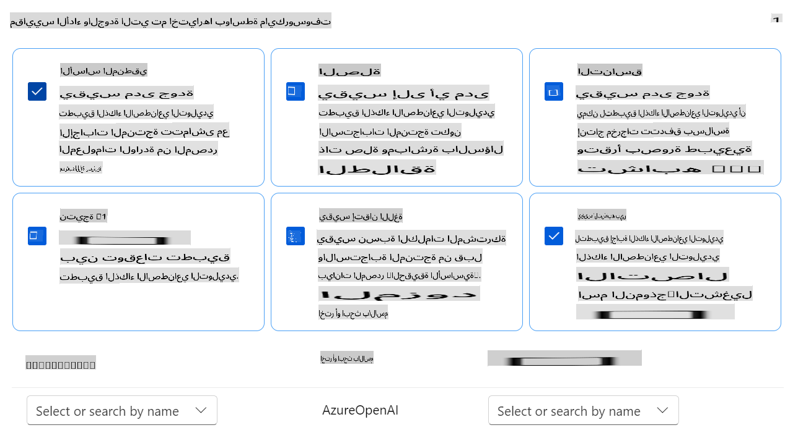

## **السيناريو 2: تقييم نموذج Phi-3 / Phi-3.5 في Azure AI Foundry**

### قبل أن تبدأ

هذا الدليل هو متابعة للمنشورات السابقة "[تحسين وتكامل نماذج Phi-3 المخصصة مع Prompt Flow: دليل خطوة بخطوة](https://techcommunity.microsoft.com/t5/educator-developer-blog/fine-tune-and-integrate-custom-phi-3-models-with-prompt-flow/ba-p/4178612?wt.mc_id=studentamb_279723)" و"[تحسين وتكامل نماذج Phi-3 المخصصة مع Prompt Flow في Azure AI Foundry](https://techcommunity.microsoft.com/t5/educator-developer-blog/fine-tune-and-integrate-custom-phi-3-models-with-prompt-flow-in/ba-p/4191726?wt.mc_id=studentamb_279723)." تناولت هذه المنشورات عملية تحسين نموذج Phi-3 / Phi-3.5 في Azure AI Foundry ودمجه مع Prompt flow.

في هذا الدليل، ستقوم بنشر نموذج Azure OpenAI كمقيّم في Azure AI Foundry واستخدامه لتقييم نموذج Phi-3 / Phi-3.5 المحسّن الخاص بك.

قبل أن تبدأ هذا الدليل، تأكد من توافر المتطلبات الأساسية التالية كما هو موضح في الأدلة السابقة:

1. مجموعة بيانات جاهزة لتقييم نموذج Phi-3 / Phi-3.5 المحسّن.
1. نموذج Phi-3 / Phi-3.5 تم تحسينه ونشره في Azure Machine Learning.
1. تكامل Prompt flow مع نموذج Phi-3 / Phi-3.5 المحسّن في Azure AI Foundry.

> [!NOTE]
> ستستخدم ملف *test_data.jsonl* الموجود في مجلد البيانات من مجموعة بيانات **ULTRACHAT_200k** التي تم تنزيلها في المنشورات السابقة، كمجموعة بيانات لتقييم نموذج Phi-3 / Phi-3.5 المحسّن.

#### دمج نموذج Phi-3 / Phi-3.5 المخصص مع Prompt flow في Azure AI Foundry (نهج البرمجة أولاً)

> [!NOTE]
> إذا اتبعت النهج منخفض التعليمات البرمجية الموصوف في "[تحسين وتكامل نماذج Phi-3 المخصصة مع Prompt Flow في Azure AI Foundry](https://techcommunity.microsoft.com/t5/educator-developer-blog/fine-tune-and-integrate-custom-phi-3-models-with-prompt-flow-in/ba-p/4191726?wt.mc_id=studentamb_279723)"، يمكنك تخطي هذا التمرين والانتقال إلى التمرين التالي.
> ومع ذلك، إذا اتبعت نهج البرمجة أولاً الموصوف في "[تحسين وتكامل نماذج Phi-3 المخصصة مع Prompt Flow: دليل خطوة بخطوة](https://techcommunity.microsoft.com/t5/educator-developer-blog/fine-tune-and-integrate-custom-phi-3-models-with-prompt-flow/ba-p/4178612?wt.mc_id=studentamb_279723)" لتحسين ونشر نموذج Phi-3 / Phi-3.5 الخاص بك، فإن عملية ربط النموذج بـ Prompt flow تختلف قليلاً. ستتعلم هذه العملية في هذا التمرين.

للمتابعة، تحتاج إلى دمج نموذج Phi-3 / Phi-3.5 المحسّن الخاص بك مع Prompt flow في Azure AI Foundry.

#### إنشاء مركز Azure AI Foundry

تحتاج إلى إنشاء مركز قبل إنشاء المشروع. يعمل المركز كأنه مجموعة موارد، مما يسمح لك بتنظيم وإدارة مشاريع متعددة ضمن Azure AI Foundry.

1. قم بتسجيل الدخول إلى [Azure AI Foundry](https://ai.azure.com/?wt.mc_id=studentamb_279723).

1. اختر **All hubs** من علامة التبويب الجانبية.

1. اختر **+ New hub** من قائمة التنقل.

    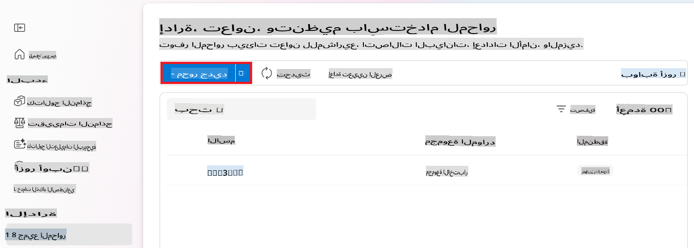

1. قم بتنفيذ المهام التالية:

    - أدخل **اسم المركز**. يجب أن يكون قيمة فريدة.
    - اختر **اشتراك Azure** الخاص بك.
    - اختر **مجموعة الموارد** التي تريد استخدامها (قم بإنشاء واحدة جديدة إذا لزم الأمر).
    - اختر **الموقع** الذي ترغب في استخدامه.
    - اختر **Connect Azure AI Services** للاستخدام (قم بإنشاء واحدة جديدة إذا لزم الأمر).
    - اختر **Connect Azure AI Search** لـ **تخطي الاتصال**.
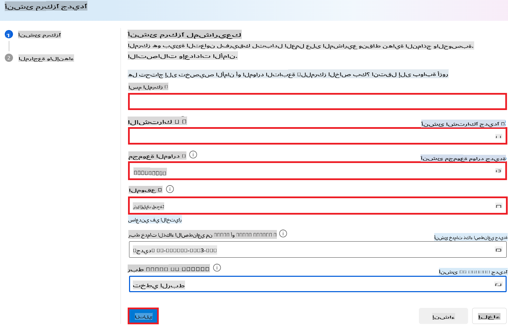

1. اختر **التالي**.

#### إنشاء مشروع Azure AI Foundry

1. في المركز الذي قمت بإنشائه، اختر **جميع المشاريع** من علامة التبويب الجانبية اليسرى.

1. اختر **+ مشروع جديد** من قائمة التنقل.

    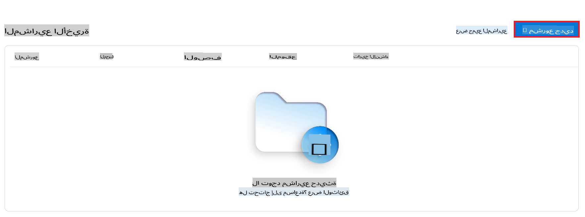

1. أدخل **اسم المشروع**. يجب أن يكون قيمة فريدة.

    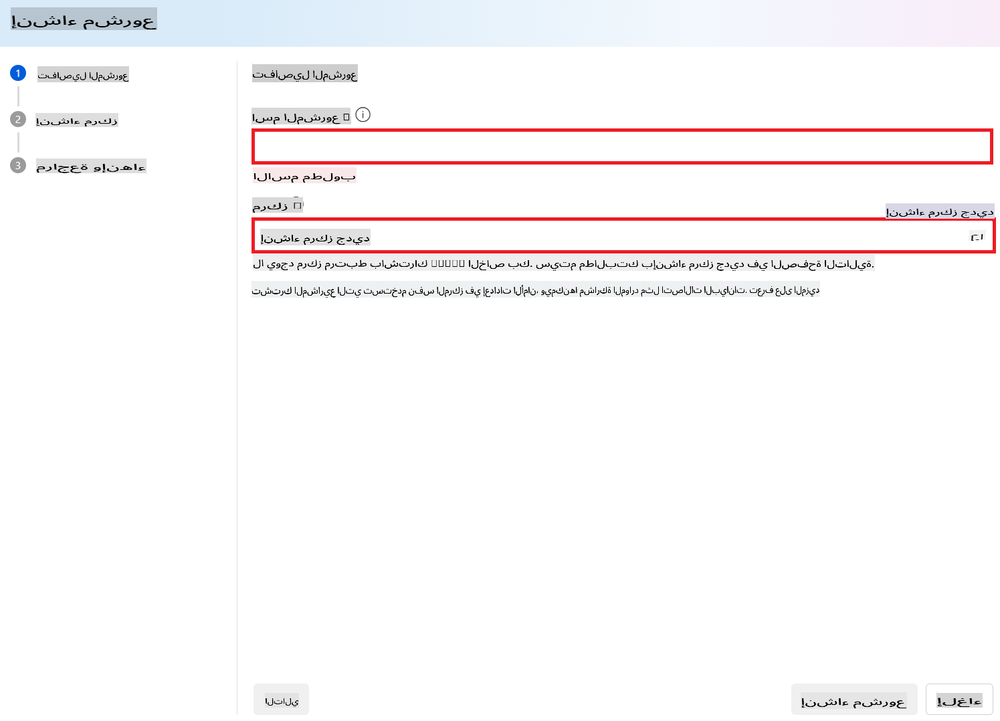

1. اختر **إنشاء مشروع**.

#### إضافة اتصال مخصص لنموذج Phi-3 / Phi-3.5 المحسن

لدمج نموذج Phi-3 / Phi-3.5 المخصص الخاص بك مع Prompt flow، تحتاج إلى حفظ نقطة النهاية والمفتاح الخاص بالنموذج في اتصال مخصص. يضمن هذا الإعداد الوصول إلى نموذج Phi-3 / Phi-3.5 المخصص الخاص بك في Prompt flow.

#### إعداد مفتاح API وعنوان URI لنقطة النهاية لنموذج Phi-3 / Phi-3.5 المحسن

1. قم بزيارة [Azure ML Studio](https://ml.azure.com/home?wt.mc_id=studentamb_279723).

1. انتقل إلى مساحة عمل Azure Machine Learning التي قمت بإنشائها.

1. اختر **نقاط النهاية** من علامة التبويب الجانبية اليسرى.

    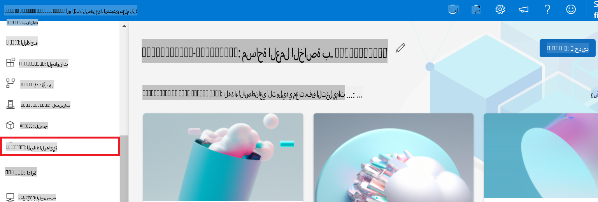

1. اختر نقطة النهاية التي قمت بإنشائها.

    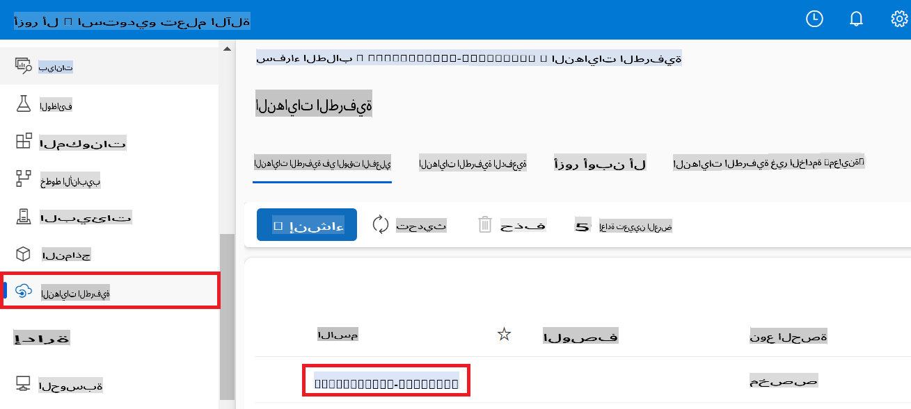

1. اختر **استهلاك** من قائمة التنقل.

1. انسخ **نقطة النهاية REST** و **المفتاح الأساسي** الخاصين بك.

    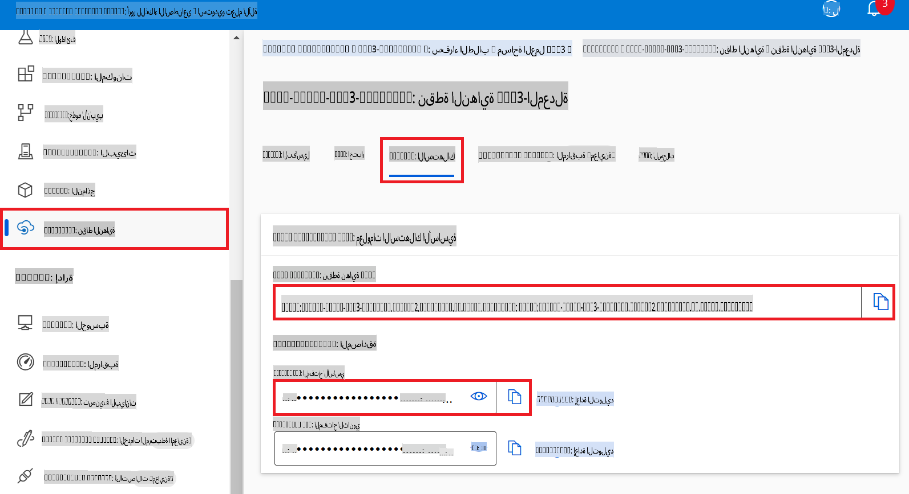

#### إضافة الاتصال المخصص

1. قم بزيارة [Azure AI Foundry](https://ai.azure.com/?wt.mc_id=studentamb_279723).

1. انتقل إلى مشروع Azure AI Foundry الذي قمت بإنشائه.

1. في المشروع الذي قمت بإنشائه، اختر **الإعدادات** من علامة التبويب الجانبية اليسرى.

1. اختر **+ اتصال جديد**.

    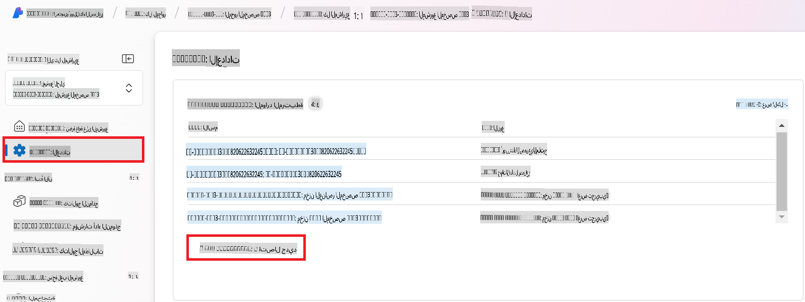

1. اختر **مفاتيح مخصصة** من قائمة التنقل.

    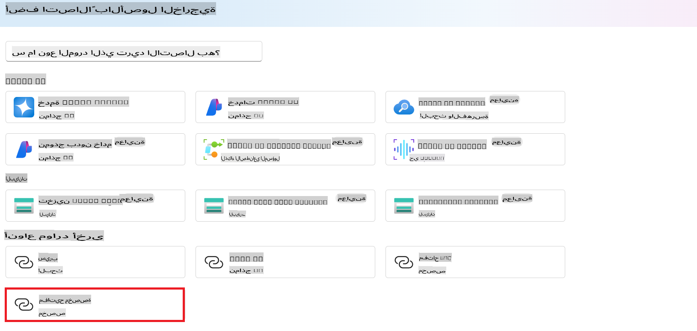

1. قم بتنفيذ المهام التالية:

    - اختر **+ إضافة أزواج مفتاح وقيمة**.
    - لاسم المفتاح، أدخل **endpoint** والصق نقطة النهاية التي نسختها من Azure ML Studio في حقل القيمة.
    - اختر **+ إضافة أزواج مفتاح وقيمة** مرة أخرى.
    - لاسم المفتاح، أدخل **key** والصق المفتاح الذي نسخته من Azure ML Studio في حقل القيمة.
    - بعد إضافة المفاتيح، اختر **is secret** لمنع كشف المفتاح.

    

1. اختر **إضافة اتصال**.

#### إنشاء Prompt flow

لقد أضفت اتصالاً مخصصاً في Azure AI Foundry. الآن، دعنا ننشئ Prompt flow باستخدام الخطوات التالية. بعد ذلك، ستقوم بربط هذا Prompt flow بالاتصال المخصص لاستخدام النموذج المحسن داخل Prompt flow.

1. انتقل إلى مشروع Azure AI Foundry الذي قمت بإنشائه.

1. اختر **Prompt flow** من علامة التبويب الجانبية اليسرى.

1. اختر **+ إنشاء** من قائمة التنقل.

    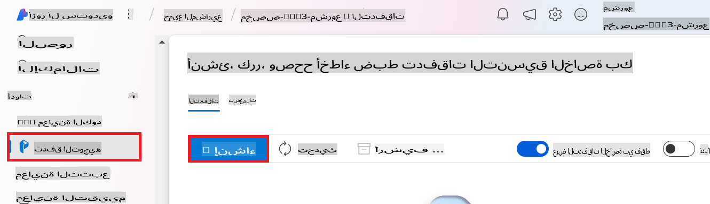

1. اختر **Chat flow** من قائمة التنقل.

    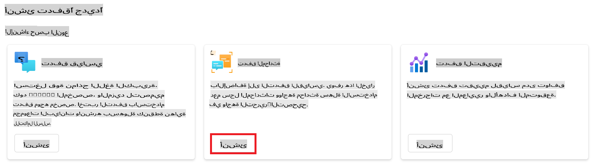

1. أدخل **اسم المجلد** الذي ترغب في استخدامه.

    

1. اختر **إنشاء**.

#### إعداد Prompt flow للدردشة مع نموذج Phi-3 / Phi-3.5 المخصص الخاص بك

تحتاج إلى دمج نموذج Phi-3 / Phi-3.5 المحسن في Prompt flow. ومع ذلك، فإن Prompt flow الحالي غير مصمم لهذا الغرض. لذلك، يجب إعادة تصميم Prompt flow لتمكين دمج النموذج المخصص.

1. في Prompt flow، قم بتنفيذ المهام التالية لإعادة بناء التدفق الحالي:

    - اختر **وضع الملف الخام**.
    - احذف جميع التعليمات البرمجية الموجودة في ملف *flow.dag.yml*.
    - أضف الكود التالي إلى ملف *flow.dag.yml*.

        ```yml
        inputs:
          input_data:
            type: string
            default: "Who founded Microsoft?"

        outputs:
          answer:
            type: string
            reference: ${integrate_with_promptflow.output}

        nodes:
        - name: integrate_with_promptflow
          type: python
          source:
            type: code
            path: integrate_with_promptflow.py
          inputs:
            input_data: ${inputs.input_data}
        ```

    - اختر **حفظ**.

    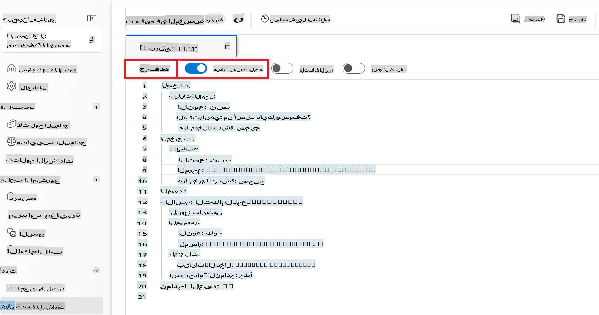

1. أضف الكود التالي إلى *integrate_with_promptflow.py* لاستخدام نموذج Phi-3 / Phi-3.5 المخصص في Prompt flow.

    ```python
    import logging
    import requests
    from promptflow import tool
    from promptflow.connections import CustomConnection

    # Logging setup
    logging.basicConfig(
        format="%(asctime)s - %(levelname)s - %(name)s - %(message)s",
        datefmt="%Y-%m-%d %H:%M:%S",
        level=logging.DEBUG
    )
    logger = logging.getLogger(__name__)

    def query_phi3_model(input_data: str, connection: CustomConnection) -> str:
        """
        Send a request to the Phi-3 / Phi-3.5 model endpoint with the given input data using Custom Connection.
        """

        # "connection" is the name of the Custom Connection, "endpoint", "key" are the keys in the Custom Connection
        endpoint_url = connection.endpoint
        api_key = connection.key

        headers = {
            "Content-Type": "application/json",
            "Authorization": f"Bearer {api_key}"
        }
    data = {
        "input_data": [input_data],
        "params": {
            "temperature": 0.7,
            "max_new_tokens": 128,
            "do_sample": True,
            "return_full_text": True
            }
        }
        try:
            response = requests.post(endpoint_url, json=data, headers=headers)
            response.raise_for_status()
            
            # Log the full JSON response
            logger.debug(f"Full JSON response: {response.json()}")

            result = response.json()["output"]
            logger.info("Successfully received response from Azure ML Endpoint.")
            return result
        except requests.exceptions.RequestException as e:
            logger.error(f"Error querying Azure ML Endpoint: {e}")
            raise

    @tool
    def my_python_tool(input_data: str, connection: CustomConnection) -> str:
        """
        Tool function to process input data and query the Phi-3 / Phi-3.5 model.
        """
        return query_phi3_model(input_data, connection)

    ```

    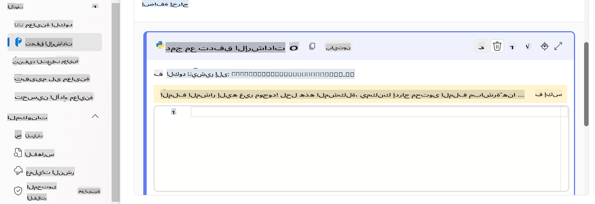

> [!NOTE]
> لمزيد من المعلومات التفصيلية حول استخدام Prompt flow في Azure AI Foundry، يمكنك الرجوع إلى [Prompt flow في Azure AI Foundry](https://learn.microsoft.com/azure/ai-studio/how-to/prompt-flow).

1. اختر **مدخلات الدردشة**، **مخرجات الدردشة** لتمكين الدردشة مع النموذج الخاص بك.

    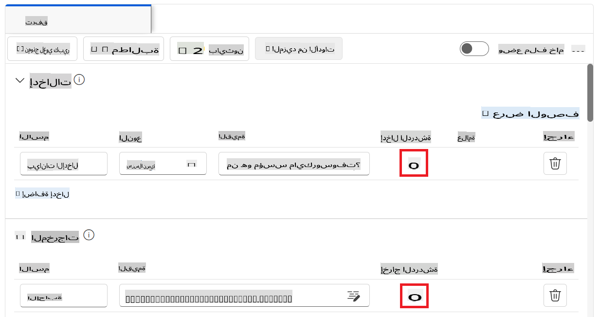

1. الآن أصبحت جاهزاً للدردشة مع نموذج Phi-3 / Phi-3.5 المخصص الخاص بك. في التمرين التالي، ستتعلم كيفية بدء Prompt flow واستخدامه للدردشة مع نموذج Phi-3 / Phi-3.5 المحسن الخاص بك.

> [!NOTE]
>
> يجب أن يبدو التدفق المُعاد بناؤه كما في الصورة أدناه:
>
> 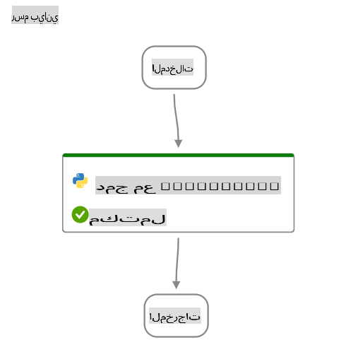
>

#### بدء Prompt flow

1. اختر **بدء جلسات الحوسبة** لبدء Prompt flow.

    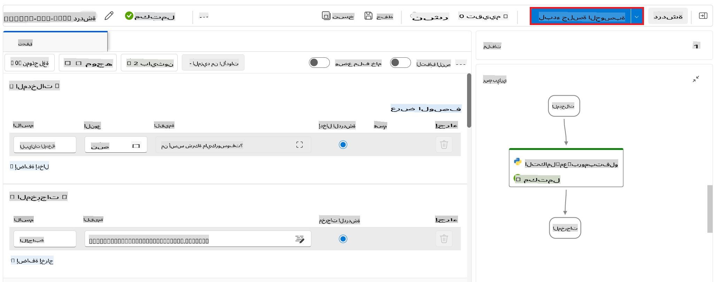

1. اختر **التحقق من صحة المدخلات وتحليلها** لتحديث المعلمات.

    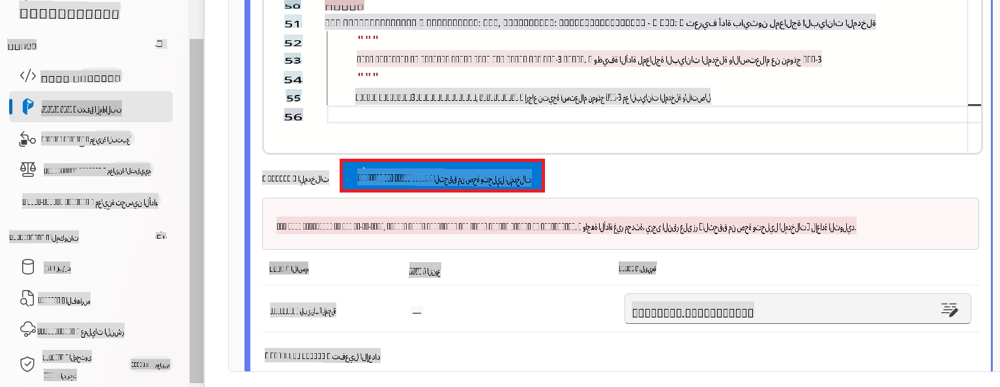

1. اختر **القيمة** للاتصال المخصص الذي قمت بإنشائه. على سبيل المثال، *connection*.

    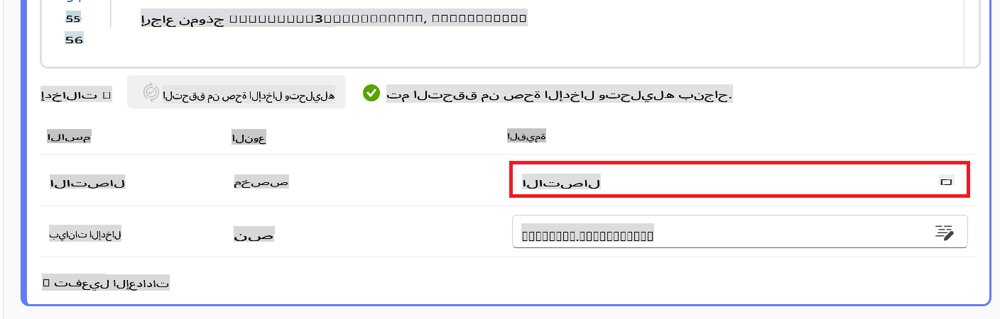

#### الدردشة مع نموذج Phi-3 / Phi-3.5 المخصص الخاص بك

1. اختر **دردشة**.

    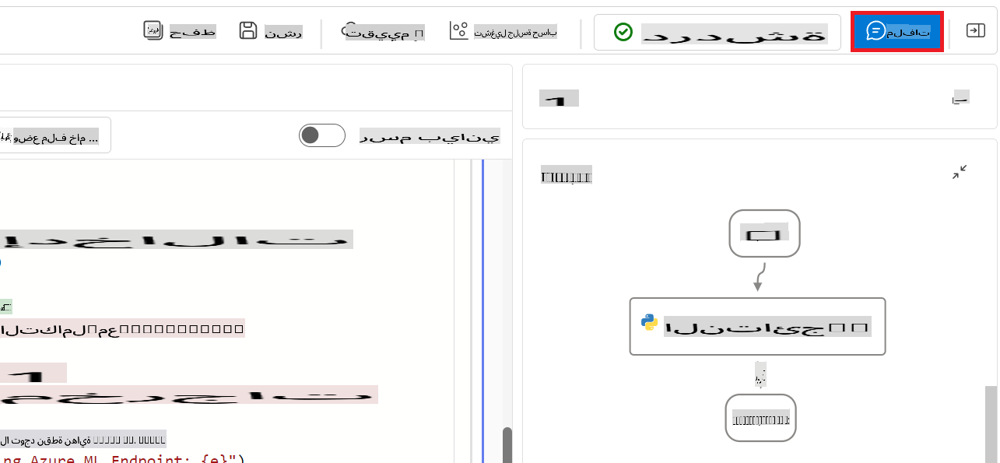

1. إليك مثال على النتائج: الآن يمكنك الدردشة مع نموذج Phi-3 / Phi-3.5 المخصص الخاص بك. يُوصى بطرح أسئلة بناءً على البيانات المستخدمة في التحسين.

    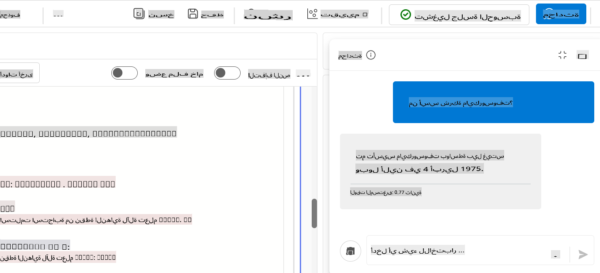

### نشر Azure OpenAI لتقييم نموذج Phi-3 / Phi-3.5

لتقييم نموذج Phi-3 / Phi-3.5 في Azure AI Foundry، تحتاج إلى نشر نموذج Azure OpenAI. سيتم استخدام هذا النموذج لتقييم أداء نموذج Phi-3 / Phi-3.5.

#### نشر Azure OpenAI

1. قم بتسجيل الدخول إلى [Azure AI Foundry](https://ai.azure.com/?wt.mc_id=studentamb_279723).

1. انتقل إلى مشروع Azure AI Foundry الذي قمت بإنشائه.

    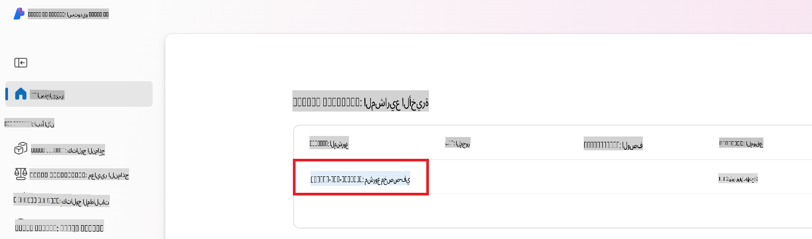

1. في المشروع الذي قمت بإنشائه، اختر **النشر** من علامة التبويب الجانبية اليسرى.

1. اختر **+ نشر نموذج** من قائمة التنقل.

1. اختر **نشر نموذج أساسي**.

    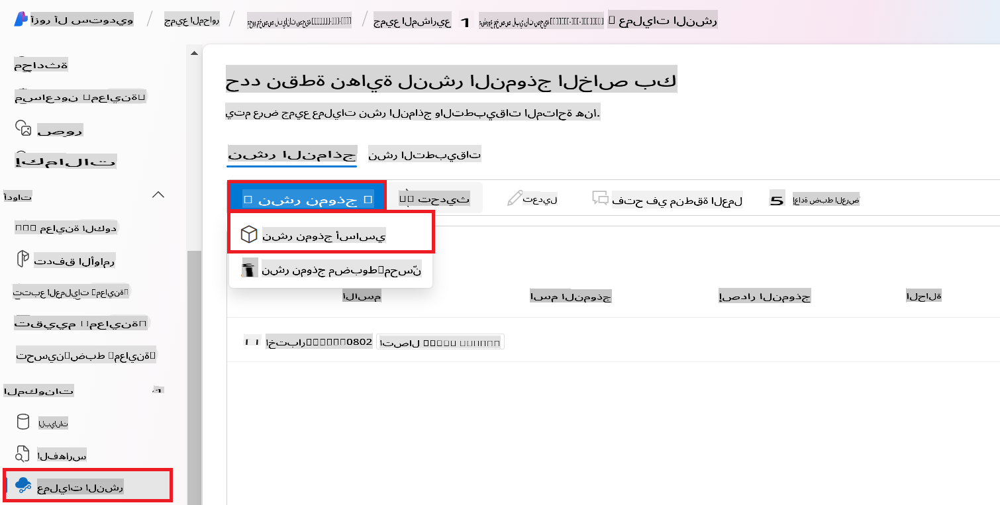

1. اختر نموذج Azure OpenAI الذي ترغب في استخدامه. على سبيل المثال، **gpt-4o**.

    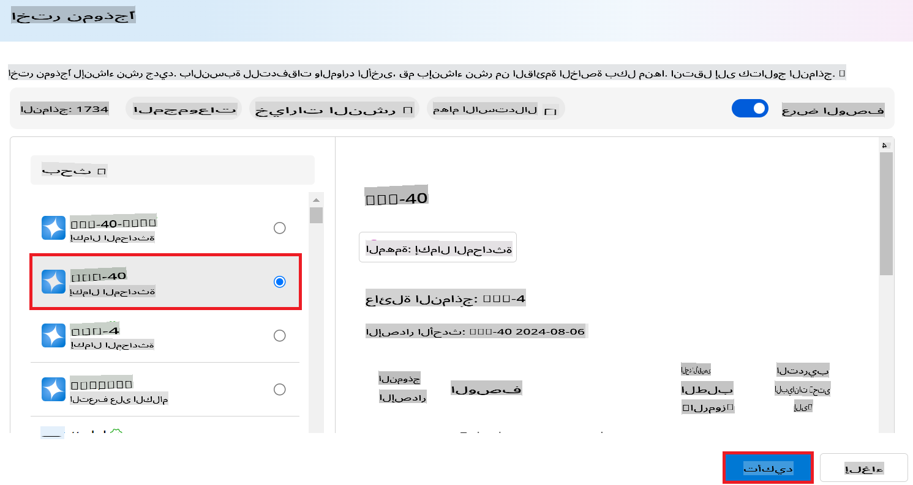

1. اختر **تأكيد**.

### تقييم نموذج Phi-3 / Phi-3.5 المحسن باستخدام تقييم Prompt flow في Azure AI Foundry

### بدء تقييم جديد

1. قم بزيارة [Azure AI Foundry](https://ai.azure.com/?wt.mc_id=studentamb_279723).

1. انتقل إلى مشروع Azure AI Foundry الذي قمت بإنشائه.

    

1. في المشروع الذي قمت بإنشائه، اختر **التقييم** من علامة التبويب الجانبية اليسرى.

1. اختر **+ تقييم جديد** من قائمة التنقل.
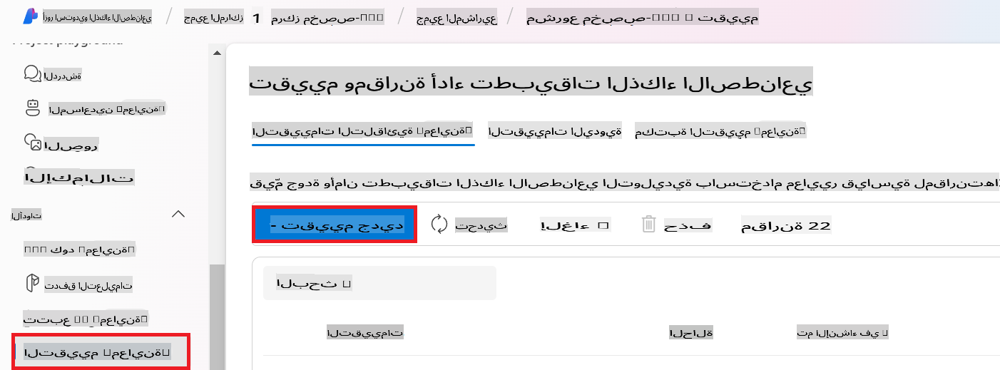

1. اختر **تقييم Prompt flow**.

    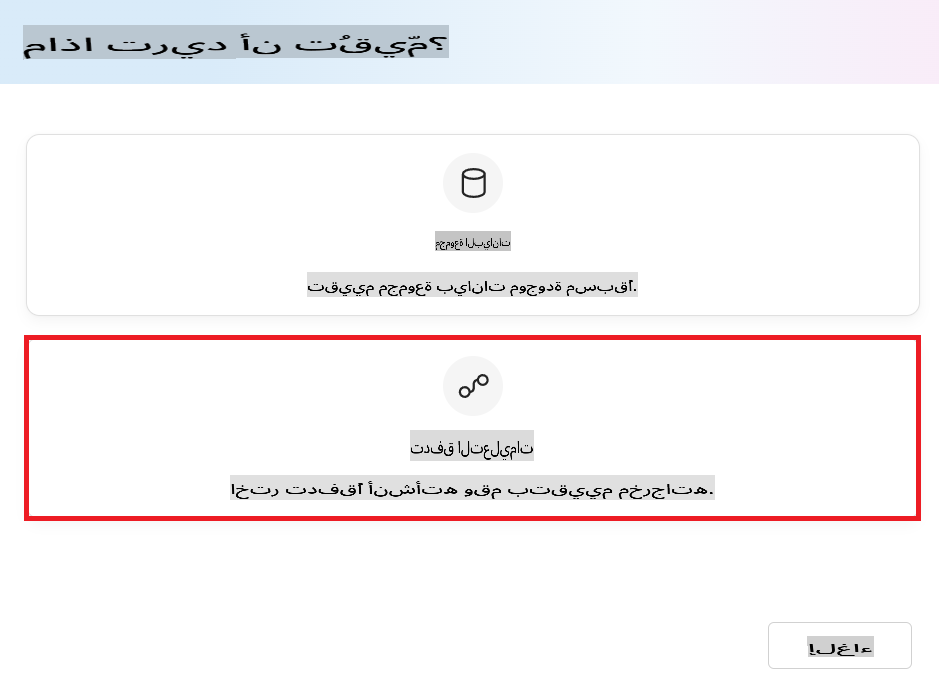

1. قم بتنفيذ المهام التالية:

    - أدخل اسم التقييم. يجب أن يكون قيمة فريدة.
    - اختر **سؤال وجواب بدون سياق** كنوع المهمة. لأن مجموعة البيانات **UlTRACHAT_200k** المستخدمة في هذا الدرس لا تحتوي على سياق.
    - اختر الـ prompt flow الذي ترغب في تقييمه.

    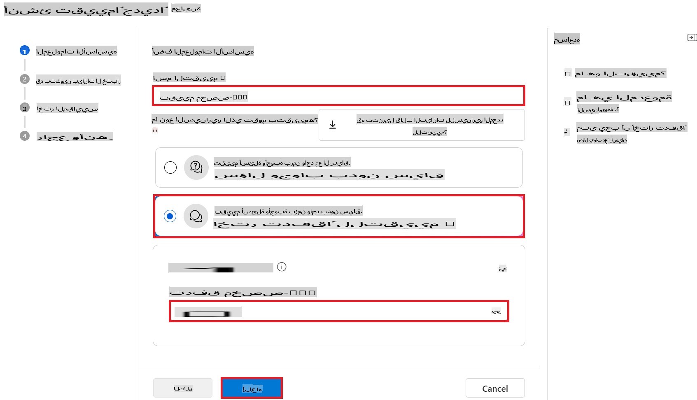

1. اختر **التالي**.

1. قم بتنفيذ المهام التالية:

    - اختر **إضافة مجموعة البيانات الخاصة بك** لتحميل مجموعة البيانات. على سبيل المثال، يمكنك تحميل ملف مجموعة بيانات الاختبار، مثل *test_data.json1*، والذي يتم تضمينه عند تنزيل مجموعة البيانات **ULTRACHAT_200k**.
    - اختر **عمود مجموعة البيانات** المناسب الذي يتطابق مع مجموعة البيانات الخاصة بك. على سبيل المثال، إذا كنت تستخدم مجموعة البيانات **ULTRACHAT_200k**، اختر **${data.prompt}** كعمود مجموعة البيانات.

    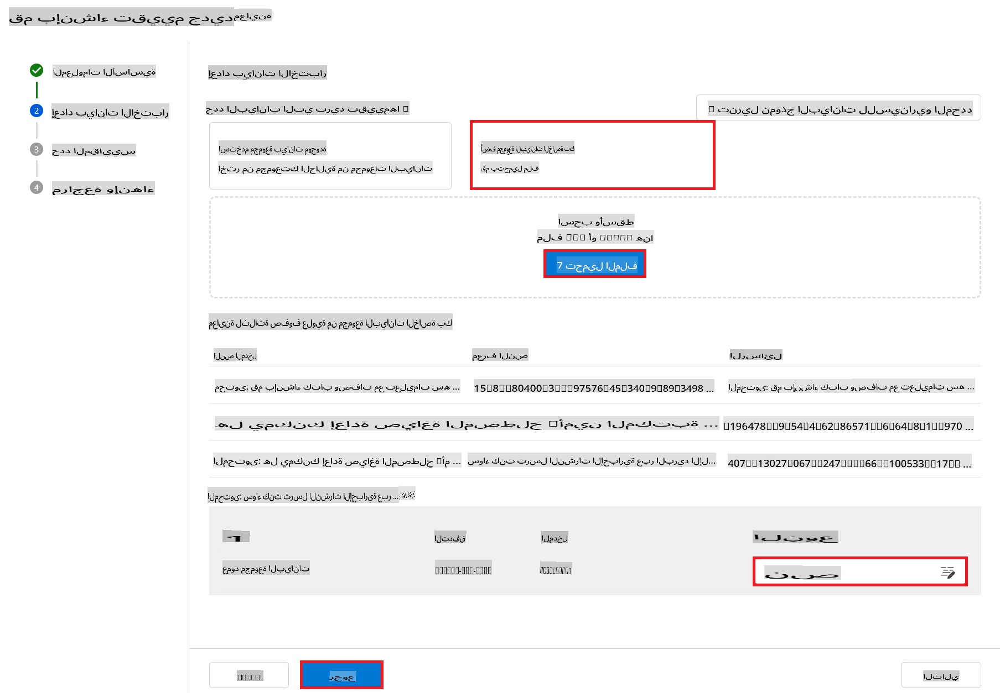

1. اختر **التالي**.

1. قم بتنفيذ المهام التالية لتكوين مقاييس الأداء والجودة:

    - اختر مقاييس الأداء والجودة التي ترغب في استخدامها.
    - اختر نموذج Azure OpenAI الذي قمت بإنشائه للتقييم. على سبيل المثال، اختر **gpt-4o**.

    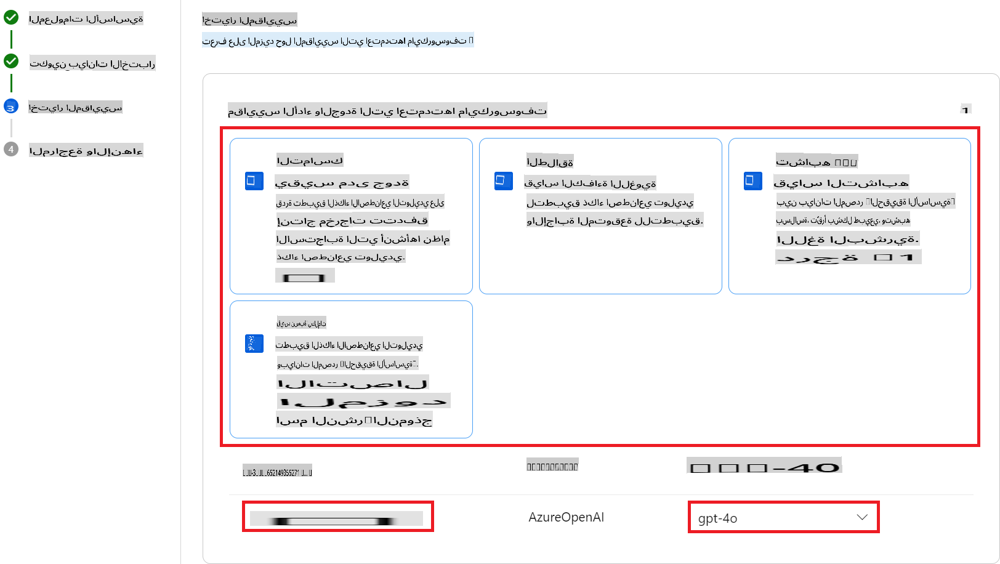

1. قم بتنفيذ المهام التالية لتكوين مقاييس المخاطر والسلامة:

    - اختر مقاييس المخاطر والسلامة التي ترغب في استخدامها.
    - اختر العتبة لحساب معدل العيوب الذي ترغب في استخدامه. على سبيل المثال، اختر **متوسط**.
    - بالنسبة لـ **السؤال**، اختر **مصدر البيانات** إلى **{$data.prompt}**.
    - بالنسبة لـ **الإجابة**، اختر **مصدر البيانات** إلى **{$run.outputs.answer}**.
    - بالنسبة لـ **الحقيقة الأرضية**، اختر **مصدر البيانات** إلى **{$data.message}**.

    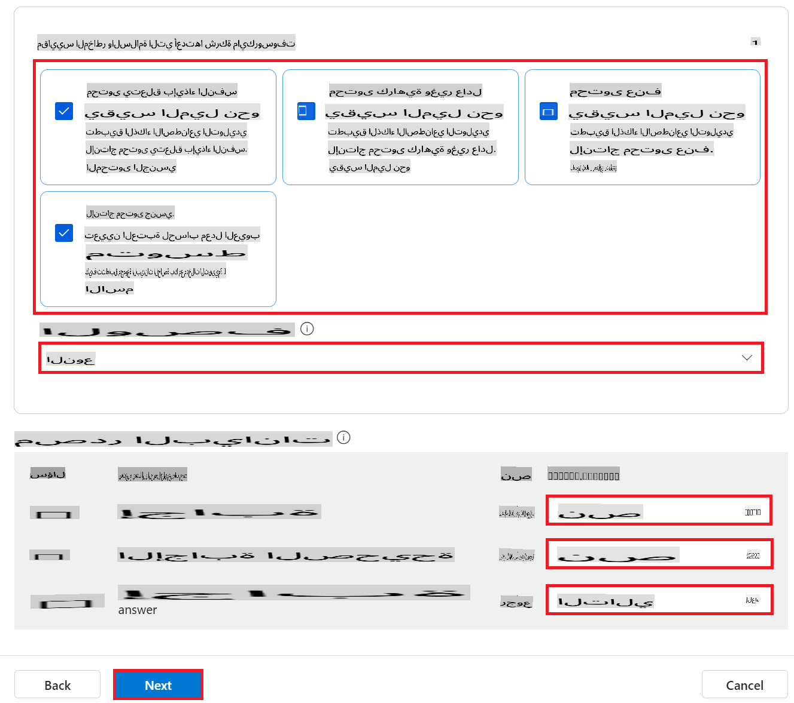

1. اختر **التالي**.

1. اختر **إرسال** لبدء التقييم.

1. سيستغرق التقييم بعض الوقت لإكماله. يمكنك متابعة التقدم في علامة التبويب **التقييم**.

### مراجعة نتائج التقييم

> [!NOTE]
> النتائج المقدمة أدناه تهدف إلى توضيح عملية التقييم. في هذا الدرس، استخدمنا نموذجًا مُدربًا على مجموعة بيانات صغيرة نسبيًا، مما قد يؤدي إلى نتائج دون المستوى الأمثل. قد تختلف النتائج الفعلية بشكل كبير بناءً على حجم وجودة وتنوع مجموعة البيانات المستخدمة، بالإضافة إلى التكوين المحدد للنموذج.

بمجرد اكتمال التقييم، يمكنك مراجعة النتائج لكل من مقاييس الأداء والسلامة.

1. مقاييس الأداء والجودة:

    - تقييم كفاءة النموذج في توليد استجابات متماسكة، وسلسة، وذات صلة.

    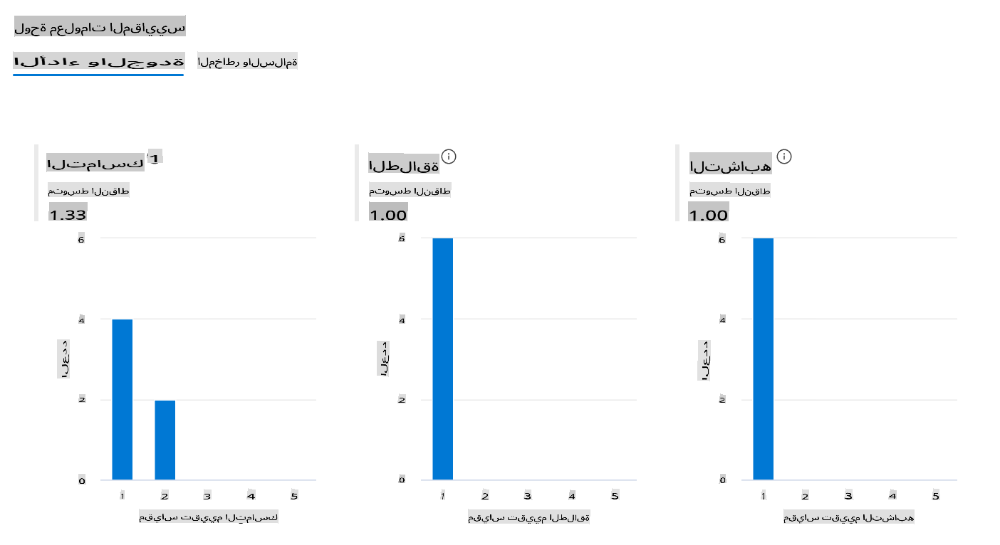

1. مقاييس المخاطر والسلامة:

    - ضمان أن مخرجات النموذج آمنة وتتوافق مع مبادئ الذكاء الاصطناعي المسؤول، مع تجنب أي محتوى ضار أو مسيء.

    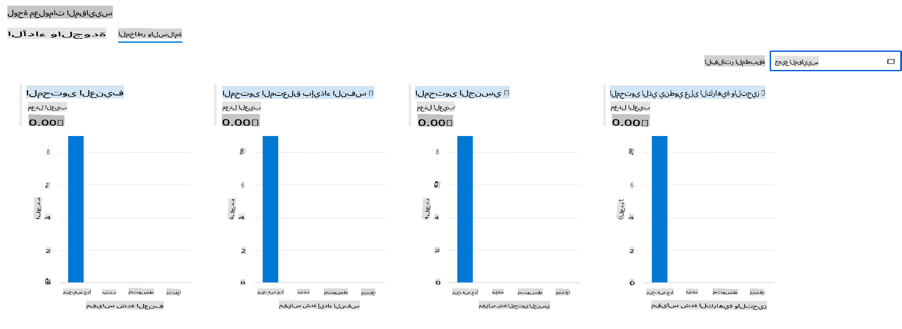

1. يمكنك التمرير لأسفل لعرض **النتائج التفصيلية للمقاييس**.

    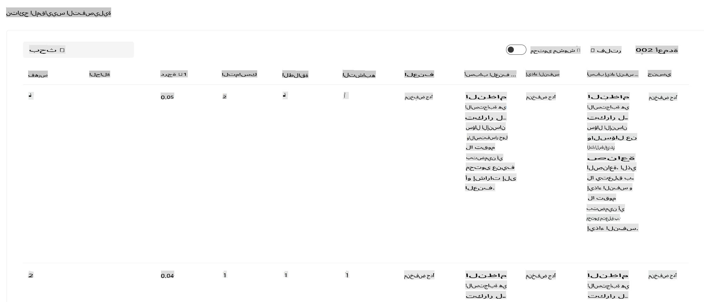

1. من خلال تقييم نموذج Phi-3 / Phi-3.5 المخصص الخاص بك مقابل كل من مقاييس الأداء والسلامة، يمكنك التأكد من أن النموذج ليس فقط فعالًا، ولكن أيضًا يلتزم بممارسات الذكاء الاصطناعي المسؤول، مما يجعله جاهزًا للنشر في العالم الحقيقي.

## تهانينا!

### لقد أكملت هذا الدرس

لقد قمت بنجاح بتقييم نموذج Phi-3 المخصص والمُدمج مع Prompt flow في Azure AI Foundry. هذه خطوة مهمة لضمان أن نماذج الذكاء الاصطناعي الخاصة بك ليست فقط فعالة، ولكنها أيضًا تتماشى مع مبادئ الذكاء الاصطناعي المسؤول من Microsoft لمساعدتك في بناء تطبيقات ذكاء اصطناعي موثوقة وموثوقة.


## تنظيف موارد Azure

قم بتنظيف موارد Azure الخاصة بك لتجنب رسوم إضافية على حسابك. انتقل إلى بوابة Azure وقم بحذف الموارد التالية:

- مورد Azure Machine Learning.
- نقطة النهاية لنموذج Azure Machine Learning.
- مورد مشروع Azure AI Foundry.
- مورد Prompt flow في Azure AI Foundry.

### الخطوات التالية

#### الوثائق

- [تقييم الأنظمة الذكية باستخدام لوحة تحكم الذكاء الاصطناعي المسؤول](https://learn.microsoft.com/azure/machine-learning/concept-responsible-ai-dashboard?view=azureml-api-2&source=recommendations?wt.mc_id=studentamb_279723)
- [مقاييس التقييم والمراقبة للذكاء الاصطناعي التوليدي](https://learn.microsoft.com/azure/ai-studio/concepts/evaluation-metrics-built-in?tabs=definition?wt.mc_id=studentamb_279723)
- [وثائق Azure AI Foundry](https://learn.microsoft.com/azure/ai-studio/?wt.mc_id=studentamb_279723)
- [وثائق Prompt flow](https://microsoft.github.io/promptflow/?wt.mc_id=studentamb_279723)

#### محتوى التدريب

- [مقدمة إلى نهج الذكاء الاصطناعي المسؤول من Microsoft](https://learn.microsoft.com/training/modules/introduction-to-microsofts-responsible-ai-approach/?source=recommendations?wt.mc_id=studentamb_279723)
- [مقدمة إلى Azure AI Foundry](https://learn.microsoft.com/training/modules/introduction-to-azure-ai-studio/?wt.mc_id=studentamb_279723)

### المرجع

- [ما هو الذكاء الاصطناعي المسؤول؟](https://learn.microsoft.com/azure/machine-learning/concept-responsible-ai?view=azureml-api-2?wt.mc_id=studentamb_279723)
- [الإعلان عن أدوات جديدة في Azure AI لمساعدتك على بناء تطبيقات ذكاء اصطناعي توليدي أكثر أمانًا وموثوقية](https://azure.microsoft.com/blog/announcing-new-tools-in-azure-ai-to-help-you-build-more-secure-and-trustworthy-generative-ai-applications/?wt.mc_id=studentamb_279723)
- [تقييم تطبيقات الذكاء الاصطناعي التوليدي](https://learn.microsoft.com/azure/ai-studio/concepts/evaluation-approach-gen-ai?wt.mc_id%3Dstudentamb_279723)

**إخلاء المسؤولية**:  
تمت ترجمة هذا المستند باستخدام خدمات الترجمة الآلية المعتمدة على الذكاء الاصطناعي. بينما نسعى جاهدين لتحقيق الدقة، يرجى العلم أن الترجمات الآلية قد تحتوي على أخطاء أو معلومات غير دقيقة. يجب اعتبار المستند الأصلي بلغته الأم المصدر الرسمي والموثوق. للحصول على معلومات حساسة أو هامة، يُوصى باللجوء إلى ترجمة بشرية احترافية. نحن غير مسؤولين عن أي سوء فهم أو تفسيرات خاطئة ناتجة عن استخدام هذه الترجمة.