# ضبط وتكامل نماذج Phi-3 المخصصة مع Prompt Flow في Azure AI Foundry

يعتمد هذا المثال الشامل (E2E) على الدليل "[ضبط وتكامل نماذج Phi-3 المخصصة مع Prompt Flow في Azure AI Foundry](https://techcommunity.microsoft.com/t5/educator-developer-blog/fine-tune-and-integrate-custom-phi-3-models-with-prompt-flow-in/ba-p/4191726?WT.mc_id=aiml-137032-kinfeylo)" من مجتمع Microsoft التقني. يشرح هذا الدليل خطوات ضبط النماذج المخصصة، نشرها، وتكاملها مع Prompt Flow في Azure AI Foundry.  
على عكس المثال الشامل "[ضبط وتكامل نماذج Phi-3 المخصصة مع Prompt Flow](./E2E_Phi-3-FineTuning_PromptFlow_Integration.md)" الذي يتطلب تشغيل الكود محليًا، يركز هذا الدليل بالكامل على ضبط النماذج وتكاملها ضمن Azure AI / ML Studio.

## نظرة عامة

في هذا المثال الشامل، ستتعلم كيفية ضبط نموذج Phi-3 وتكاملها مع Prompt Flow في Azure AI Foundry. من خلال استخدام Azure AI / ML Studio، ستقوم بإنشاء سير عمل لنشر واستخدام نماذج الذكاء الاصطناعي المخصصة. ينقسم هذا المثال الشامل إلى ثلاث سيناريوهات:

**السيناريو الأول: إعداد موارد Azure والتحضير للضبط**  
**السيناريو الثاني: ضبط نموذج Phi-3 ونشره في Azure Machine Learning Studio**  
**السيناريو الثالث: التكامل مع Prompt Flow والدردشة مع النموذج المخصص الخاص بك في Azure AI Foundry**

فيما يلي نظرة عامة على هذا المثال الشامل.

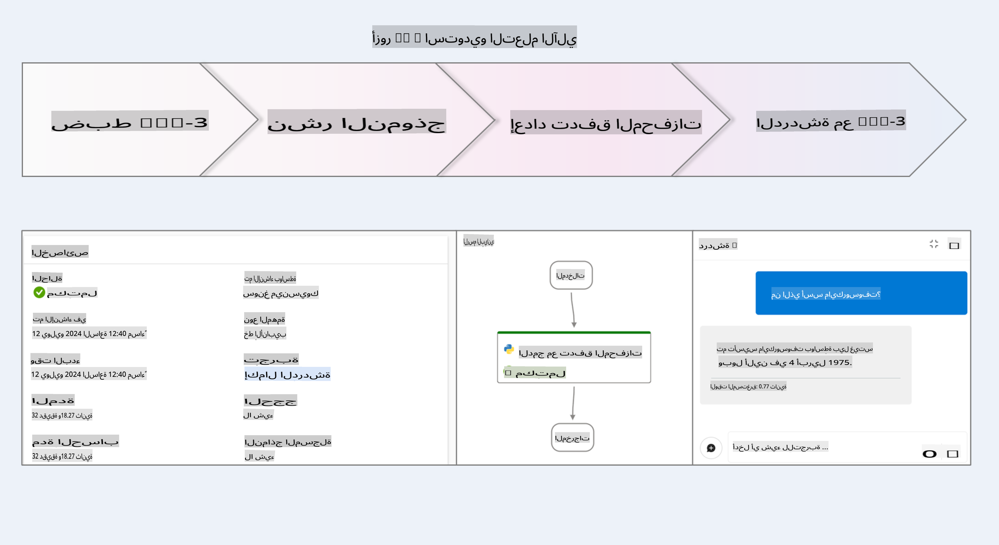

### جدول المحتويات

1. **[السيناريو الأول: إعداد موارد Azure والتحضير للضبط](../../../../../../md/02.Application/01.TextAndChat/Phi3)**  
    - [إنشاء مساحة عمل Azure Machine Learning](../../../../../../md/02.Application/01.TextAndChat/Phi3)  
    - [طلب حصص GPU في اشتراك Azure](../../../../../../md/02.Application/01.TextAndChat/Phi3)  
    - [إضافة تعيين الأدوار](../../../../../../md/02.Application/01.TextAndChat/Phi3)  
    - [إعداد المشروع](../../../../../../md/02.Application/01.TextAndChat/Phi3)  
    - [تحضير مجموعة البيانات للضبط](../../../../../../md/02.Application/01.TextAndChat/Phi3)  

2. **[السيناريو الثاني: ضبط نموذج Phi-3 ونشره في Azure Machine Learning Studio](../../../../../../md/02.Application/01.TextAndChat/Phi3)**  
    - [ضبط نموذج Phi-3](../../../../../../md/02.Application/01.TextAndChat/Phi3)  
    - [نشر نموذج Phi-3 الذي تم ضبطه](../../../../../../md/02.Application/01.TextAndChat/Phi3)  

3. **[السيناريو الثالث: التكامل مع Prompt Flow والدردشة مع النموذج المخصص الخاص بك في Azure AI Foundry](../../../../../../md/02.Application/01.TextAndChat/Phi3)**  
    - [تكامل نموذج Phi-3 المخصص مع Prompt Flow](../../../../../../md/02.Application/01.TextAndChat/Phi3)  
    - [الدردشة مع نموذج Phi-3 المخصص الخاص بك](../../../../../../md/02.Application/01.TextAndChat/Phi3)  

## السيناريو الأول: إعداد موارد Azure والتحضير للضبط

### إنشاء مساحة عمل Azure Machine Learning

1. اكتب *azure machine learning* في **شريط البحث** أعلى صفحة البوابة وحدد **Azure Machine Learning** من الخيارات التي تظهر.

    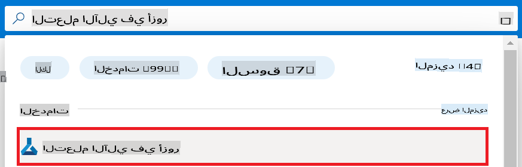

2. حدد **+ Create** من قائمة التنقل.

3. حدد **New workspace** من قائمة التنقل.

    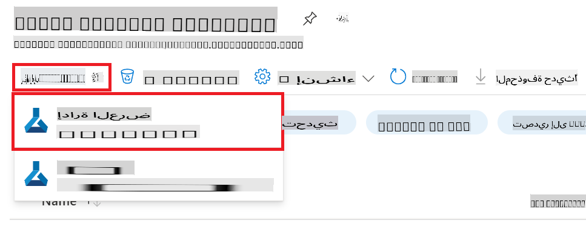

4. قم بتنفيذ المهام التالية:

    - اختر **اشتراك Azure** الخاص بك.  
    - اختر **مجموعة الموارد** التي ترغب في استخدامها (قم بإنشاء واحدة جديدة إذا لزم الأمر).  
    - أدخل **اسم مساحة العمل**. يجب أن يكون قيمة فريدة.  
    - اختر **المنطقة** التي ترغب في استخدامها.  
    - اختر **حساب التخزين** الذي ترغب في استخدامه (قم بإنشاء واحد جديد إذا لزم الأمر).  
    - اختر **Key vault** الذي ترغب في استخدامه (قم بإنشاء واحد جديد إذا لزم الأمر).  
    - اختر **Application insights** الذي ترغب في استخدامه (قم بإنشاء واحد جديد إذا لزم الأمر).  
    - اختر **Container registry** الذي ترغب في استخدامه (قم بإنشاء واحد جديد إذا لزم الأمر).  

    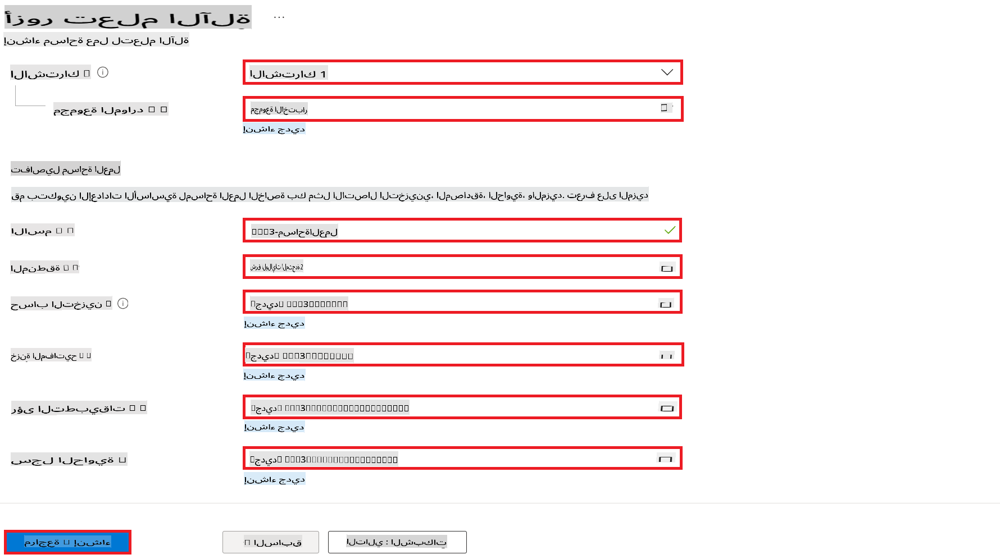

5. حدد **Review + Create**.

6. حدد **Create**.

### طلب حصص GPU في اشتراك Azure

في هذا الدليل، ستتعلم كيفية ضبط ونشر نموذج Phi-3 باستخدام وحدات معالجة الرسومات (GPU). للضبط، ستستخدم وحدة معالجة الرسومات *Standard_NC24ads_A100_v4*، والتي تتطلب طلب حصة. وللنشر، ستستخدم وحدة معالجة الرسومات *Standard_NC6s_v3*، والتي تتطلب أيضًا طلب حصة.

> [!NOTE]
>  
> الاشتراكات من نوع Pay-As-You-Go فقط (النوع القياسي للاشتراك) مؤهلة لتخصيص GPU؛ الاشتراكات ذات الامتيازات غير مدعومة حاليًا.  

1. قم بزيارة [Azure ML Studio](https://ml.azure.com/home?wt.mc_id=studentamb_279723).

1. قم بتنفيذ المهام التالية لطلب حصة *Standard NCADSA100v4 Family*:

    - اختر **Quota** من علامة التبويب الموجودة في الجانب الأيسر.  
    - اختر **عائلة الأجهزة الافتراضية** التي ترغب في استخدامها. على سبيل المثال، اختر **Standard NCADSA100v4 Family Cluster Dedicated vCPUs**، والتي تتضمن وحدة معالجة الرسومات *Standard_NC24ads_A100_v4*.  
    - اختر **Request quota** من قائمة التنقل.  

        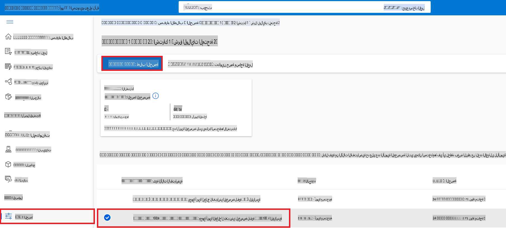

    - داخل صفحة طلب الحصة، أدخل **الحد الجديد من النوى** الذي ترغب في استخدامه. على سبيل المثال، 24.  
    - داخل صفحة طلب الحصة، اختر **Submit** لطلب حصة GPU.  

1. قم بتنفيذ المهام التالية لطلب حصة *Standard NCSv3 Family*:

    - اختر **Quota** من علامة التبويب الموجودة في الجانب الأيسر.  
    - اختر **عائلة الأجهزة الافتراضية** التي ترغب في استخدامها. على سبيل المثال، اختر **Standard NCSv3 Family Cluster Dedicated vCPUs**، والتي تتضمن وحدة معالجة الرسومات *Standard_NC6s_v3*.  
    - اختر **Request quota** من قائمة التنقل.  
    - داخل صفحة طلب الحصة، أدخل **الحد الجديد من النوى** الذي ترغب في استخدامه. على سبيل المثال، 24.  
    - داخل صفحة طلب الحصة، اختر **Submit** لطلب حصة GPU.  

### إضافة تعيين الأدوار

لضبط النماذج الخاصة بك ونشرها، يجب عليك أولاً إنشاء هوية مُدارة مخصصة للمستخدم (UAI) ومنحها الأذونات المناسبة. سيتم استخدام هذه الهوية للمصادقة أثناء النشر.

#### إنشاء هوية مُدارة مخصصة للمستخدم (UAI)

1. اكتب *managed identities* في **شريط البحث** أعلى صفحة البوابة وحدد **Managed Identities** من الخيارات التي تظهر.

    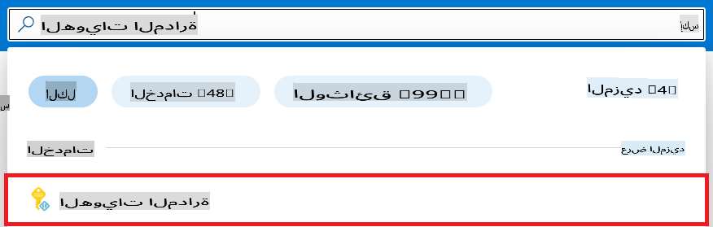

1. حدد **+ Create**.

    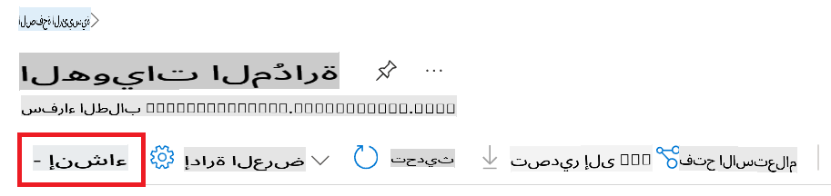

1. قم بتنفيذ المهام التالية:

    - اختر **اشتراك Azure** الخاص بك.  
    - اختر **مجموعة الموارد** التي ترغب في استخدامها (قم بإنشاء واحدة جديدة إذا لزم الأمر).  
    - اختر **المنطقة** التي ترغب في استخدامها.  
    - أدخل **الاسم**. يجب أن يكون قيمة فريدة.  

    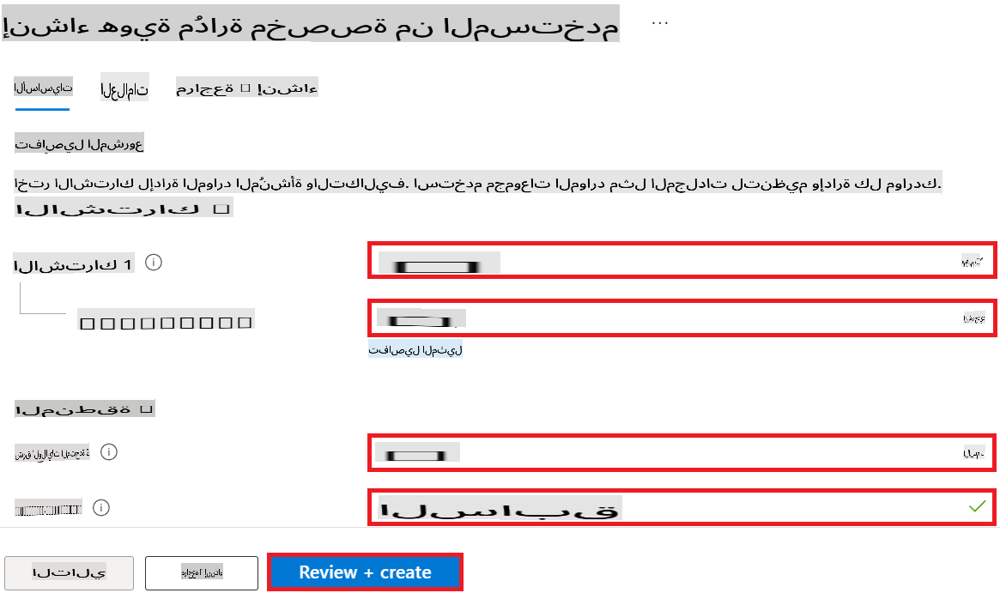

1. حدد **Review + create**.

1. حدد **+ Create**.  

#### إضافة دور المساهم (Contributor) إلى الهوية المُدارة

1. انتقل إلى مورد الهوية المُدارة الذي أنشأته.

1. اختر **Azure role assignments** من علامة التبويب الموجودة في الجانب الأيسر.

1. اختر **+Add role assignment** من قائمة التنقل.

1. داخل صفحة إضافة تعيين الأدوار، قم بتنفيذ المهام التالية:  
    - اختر **النطاق** ليكون **مجموعة الموارد**.  
    - اختر **اشتراك Azure** الخاص بك.  
    - اختر **مجموعة الموارد** التي ترغب في استخدامها.  
    - اختر **الدور** ليكون **Contributor**.  

    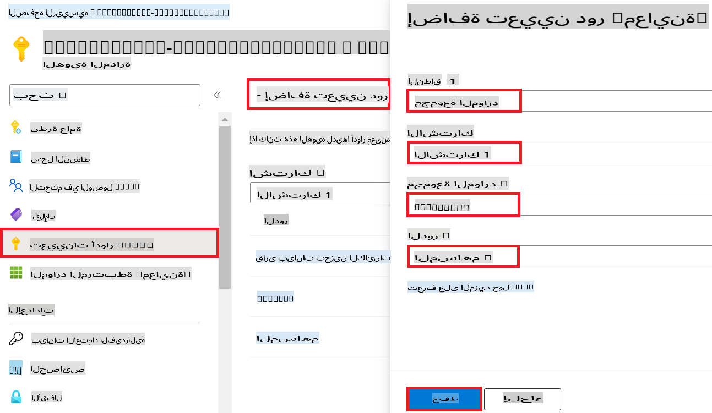

2. اختر **Save**.  

#### إضافة دور قارئ بيانات تخزين Blob إلى الهوية المُدارة

1. اكتب *storage accounts* في **شريط البحث** أعلى صفحة البوابة وحدد **Storage accounts** من الخيارات التي تظهر.

    

1. اختر حساب التخزين المرتبط بمساحة العمل التي أنشأتها في Azure Machine Learning. على سبيل المثال، *finetunephistorage*.  

1. قم بتنفيذ المهام التالية للتنقل إلى صفحة إضافة تعيين الأدوار:  
    - انتقل إلى حساب التخزين الذي أنشأته.  
    - اختر **Access Control (IAM)** من علامة التبويب الموجودة في الجانب الأيسر.  
    - اختر **+ Add** من قائمة التنقل.  
    - اختر **Add role assignment** من قائمة التنقل.  

    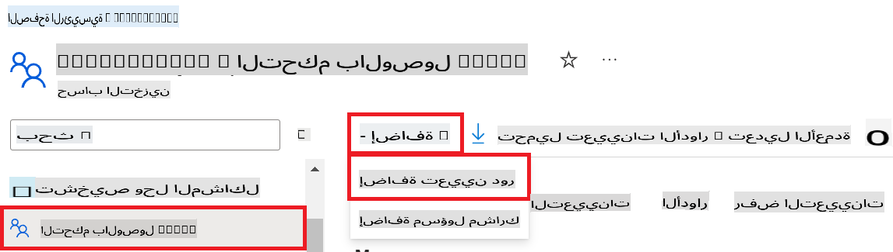

1. داخل صفحة إضافة تعيين الأدوار، قم بتنفيذ المهام التالية:  
    - داخل صفحة الدور، اكتب *Storage Blob Data Reader* في **شريط البحث** واختر **Storage Blob Data Reader** من الخيارات التي تظهر.  
    - داخل صفحة الدور، اختر **Next**.  
    - داخل صفحة الأعضاء، اختر **Assign access to** **Managed identity**.  
    - داخل صفحة الأعضاء، اختر **+ Select members**.  
    - داخل صفحة اختيار الهويات المُدارة، اختر **اشتراك Azure** الخاص بك.  
    - داخل صفحة اختيار الهويات المُدارة، اختر **الهوية المُدارة** التي أنشأتها. على سبيل المثال، *finetunephi-managedidentity*.  
    - داخل صفحة اختيار الهويات المُدارة، اختر **Select**.  

    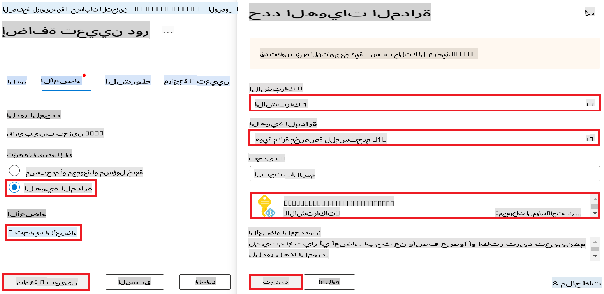

1. اختر **Review + assign**.  

#### إضافة دور AcrPull إلى الهوية المُدارة

1. اكتب *container registries* في **شريط البحث** أعلى صفحة البوابة وحدد **Container registries** من الخيارات التي تظهر.

    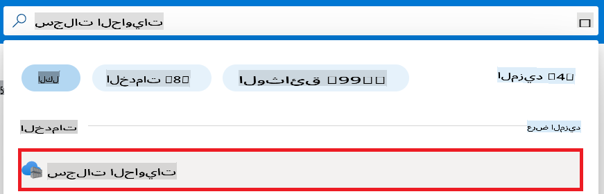

1. اختر سجل الحاويات المرتبط بمساحة العمل التي أنشأتها في Azure Machine Learning. على سبيل المثال، *finetunephicontainerregistry*.  

1. قم بتنفيذ المهام التالية للتنقل إلى صفحة إضافة تعيين الأدوار:  
    - اختر **Access Control (IAM)** من علامة التبويب الموجودة في الجانب الأيسر.  
    - اختر **+ Add** من قائمة التنقل.  
    - اختر **Add role assignment** من قائمة التنقل.  

1. داخل صفحة إضافة تعيين الأدوار، قم بتنفيذ المهام التالية:  
    - داخل صفحة الدور، اكتب *AcrPull* في **شريط البحث** واختر **AcrPull** من الخيارات التي تظهر.  
    - داخل صفحة الدور، اختر **Next**.  
    - داخل صفحة الأعضاء، اختر **Assign access to** **Managed identity**.  
    - داخل صفحة الأعضاء، اختر **+ Select members**.  
    - داخل صفحة اختيار الهويات المُدارة، اختر **اشتراك Azure** الخاص بك.  
    - داخل صفحة اختيار الهويات المُدارة، اختر **الهوية المُدارة** التي أنشأتها. على سبيل المثال، *finetunephi-managedidentity*.  
    - داخل صفحة اختيار الهويات المُدارة، اختر **Select**.  
    - اختر **Review + assign**.  

### إعداد المشروع

لتنزيل مجموعات البيانات المطلوبة للضبط، ستقوم بإعداد بيئة محلية.

في هذا التمرين، ستقوم بـ:  
- إنشاء مجلد للعمل بداخله.  
- إنشاء بيئة افتراضية.  
- تثبيت الحزم المطلوبة.  
- إنشاء ملف *download_dataset.py* لتنزيل مجموعة البيانات.  

#### إنشاء مجلد للعمل بداخله

1. افتح نافذة الطرفية واكتب الأمر التالي لإنشاء مجلد باسم *finetune-phi* في المسار الافتراضي.

    ```console
    mkdir finetune-phi
    ```

2. اكتب الأمر التالي داخل الطرفية للتنقل إلى مجلد *finetune-phi* الذي أنشأته.

    ```console
    cd finetune-phi
    ```

#### إنشاء بيئة افتراضية

1. اكتب الأمر التالي داخل الطرفية لإنشاء بيئة افتراضية باسم *.venv*.

    ```console
    python -m venv .venv
    ```

2. اكتب الأمر التالي داخل الطرفية لتفعيل البيئة الافتراضية.

    ```console
    .venv\Scripts\activate.bat
    ```

> [!NOTE]
> إذا نجح التفعيل، سترى *(.venv)* قبل موجه الأوامر.  

#### تثبيت الحزم المطلوبة

1. اكتب الأوامر التالية داخل الطرفية لتثبيت الحزم المطلوبة.

    ```console
    pip install datasets==2.19.1
    ```

#### إنشاء `download_dataset.py`

> [!NOTE]
> هيكل المجلد الكامل:  
>  
> ```text
> └── YourUserName
> .    └── finetune-phi
> .        └── download_dataset.py
> ```  

1. افتح **Visual Studio Code**.

1. اختر **File** من شريط القوائم.

1. اختر **Open Folder**.

1. اختر مجلد *finetune-phi* الذي أنشأته، والذي يقع في *C:\Users\yourUserName\finetune-phi*.  

    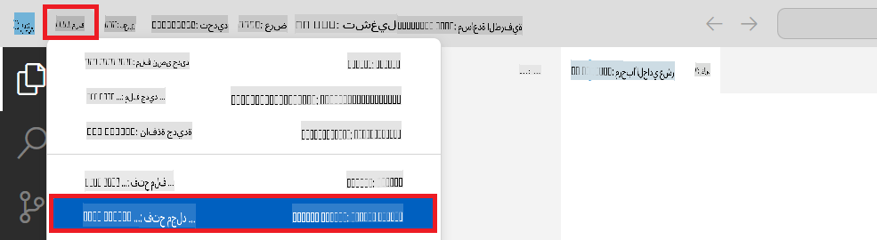

1. في الجزء الأيسر من Visual Studio Code، انقر بزر الماوس الأيمن واختر **New File** لإنشاء ملف جديد باسم *download_dataset.py*.  

    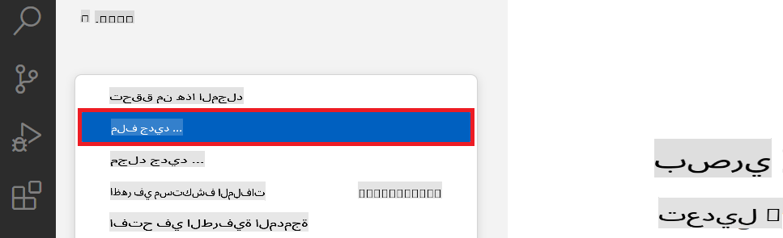

### تحضير مجموعة البيانات للضبط

في هذا التمرين، ستقوم بتشغيل ملف *download_dataset.py* لتنزيل مجموعة بيانات *ultrachat_200k* إلى بيئتك المحلية. ستستخدم هذه المجموعة لضبط نموذج Phi-3 في Azure Machine Learning.

في هذا التمرين، ستقوم بـ:  
- إضافة الكود إلى ملف *download_dataset.py* لتنزيل مجموعة البيانات.  
- تشغيل ملف *download_dataset.py* لتنزيل مجموعة البيانات إلى بيئتك المحلية.  

#### تنزيل مجموعة البيانات باستخدام *download_dataset.py*

1. افتح ملف *download_dataset.py* في Visual Studio Code.

1. أضف الكود التالي إلى ملف *download_dataset.py*.

    ```python
    import json
    import os
    from datasets import load_dataset

    def load_and_split_dataset(dataset_name, config_name, split_ratio):
        """
        Load and split a dataset.
        """
        # Load the dataset with the specified name, configuration, and split ratio
        dataset = load_dataset(dataset_name, config_name, split=split_ratio)
        print(f"Original dataset size: {len(dataset)}")
        
        # Split the dataset into train and test sets (80% train, 20% test)
        split_dataset = dataset.train_test_split(test_size=0.2)
        print(f"Train dataset size: {len(split_dataset['train'])}")
        print(f"Test dataset size: {len(split_dataset['test'])}")
        
        return split_dataset

    def save_dataset_to_jsonl(dataset, filepath):
        """
        Save a dataset to a JSONL file.
        """
        # Create the directory if it does not exist
        os.makedirs(os.path.dirname(filepath), exist_ok=True)
        
        # Open the file in write mode
        with open(filepath, 'w', encoding='utf-8') as f:
            # Iterate over each record in the dataset
            for record in dataset:
                # Dump the record as a JSON object and write it to the file
                json.dump(record, f)
                # Write a newline character to separate records
                f.write('\n')
        
        print(f"Dataset saved to {filepath}")

    def main():
        """
        Main function to load, split, and save the dataset.
        """
        # Load and split the ULTRACHAT_200k dataset with a specific configuration and split ratio
        dataset = load_and_split_dataset("HuggingFaceH4/ultrachat_200k", 'default', 'train_sft[:1%]')
        
        # Extract the train and test datasets from the split
        train_dataset = dataset['train']
        test_dataset = dataset['test']

        # Save the train dataset to a JSONL file
        save_dataset_to_jsonl(train_dataset, "data/train_data.jsonl")
        
        # Save the test dataset to a separate JSONL file
        save_dataset_to_jsonl(test_dataset, "data/test_data.jsonl")

    if __name__ == "__main__":
        main()

    ```

1. اكتب الأمر التالي داخل الطرفية لتشغيل السكربت وتنزيل مجموعة البيانات إلى بيئتك المحلية.

    ```console
    python download_dataset.py
    ```

1. تحقق من أن مجموعة البيانات تم حفظها بنجاح في دليل *finetune-phi/data* المحلي الخاص بك.

> [!NOTE]
>
> #### ملاحظة حول حجم مجموعة البيانات ووقت الضبط  
>
> في هذا الدليل، ستستخدم فقط 1% من مجموعة البيانات (`split='train[:1%]'`). هذا يقلل بشكل كبير من حجم البيانات، مما يسرع من عمليات التحميل والضبط. يمكنك ضبط النسبة لتحقيق التوازن بين وقت التدريب وأداء النموذج. استخدام جزء صغير من مجموعة البيانات يقلل من الوقت المطلوب للضبط، مما يجعل العملية أكثر قابلية للإدارة في سياق هذا الدليل.  

## السيناريو الثاني: ضبط نموذج Phi-3 ونشره في Azure Machine Learning Studio

### ضبط نموذج Phi-3

في هذا التمرين، ستقوم بضبط نموذج Phi-3 في Azure Machine Learning Studio.

في هذا التمرين، ستقوم بـ:  
- إنشاء مجموعة حاسوبية للضبط.  
- ضبط نموذج Phi-3 في Azure Machine Learning Studio.  

#### إنشاء مجموعة حاسوبية للضبط  
1. قم بزيارة [Azure ML Studio](https://ml.azure.com/home?wt.mc_id=studentamb_279723).

1. اختر **الحوسبة** من الشريط الجانبي على اليسار.

1. اختر **مجموعات الحوسبة** من قائمة التنقل.

1. اضغط على **+ جديد**.

    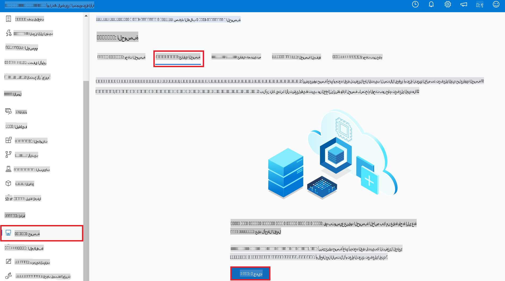

1. قم بتنفيذ المهام التالية:

    - اختر **المنطقة** التي ترغب في استخدامها.
    - اختر **فئة الجهاز الافتراضي** إلى **مخصص**.
    - اختر **نوع الجهاز الافتراضي** إلى **GPU**.
    - قم بتعيين مرشح **حجم الجهاز الافتراضي** إلى **اختيار من جميع الخيارات**.
    - اختر **حجم الجهاز الافتراضي** إلى **Standard_NC24ads_A100_v4**.

    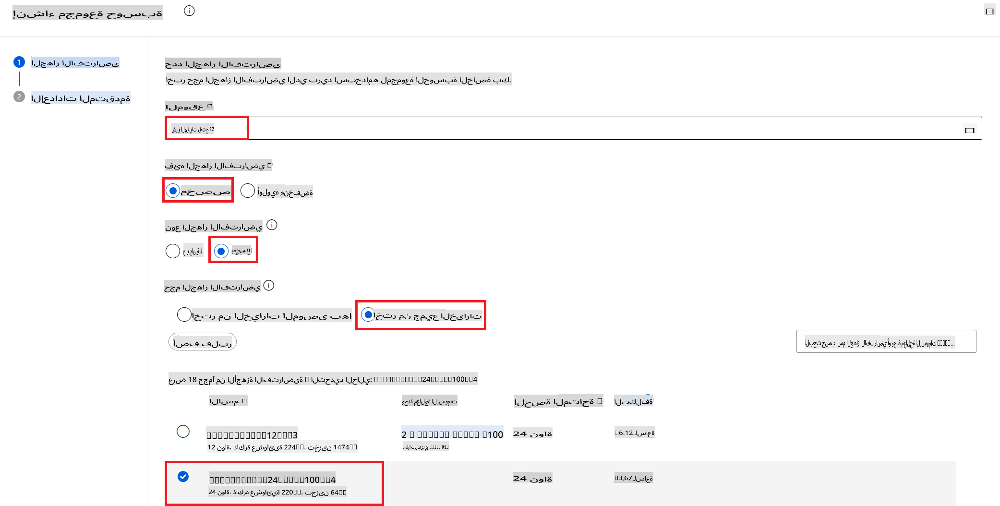

1. اضغط على **التالي**.

1. قم بتنفيذ المهام التالية:

    - أدخل **اسم الحوسبة**. يجب أن يكون قيمة فريدة.
    - اختر **الحد الأدنى لعدد العقد** إلى **0**.
    - اختر **الحد الأقصى لعدد العقد** إلى **1**.
    - اختر **عدد الثواني الخاملة قبل التوسع للأسفل** إلى **120**.

    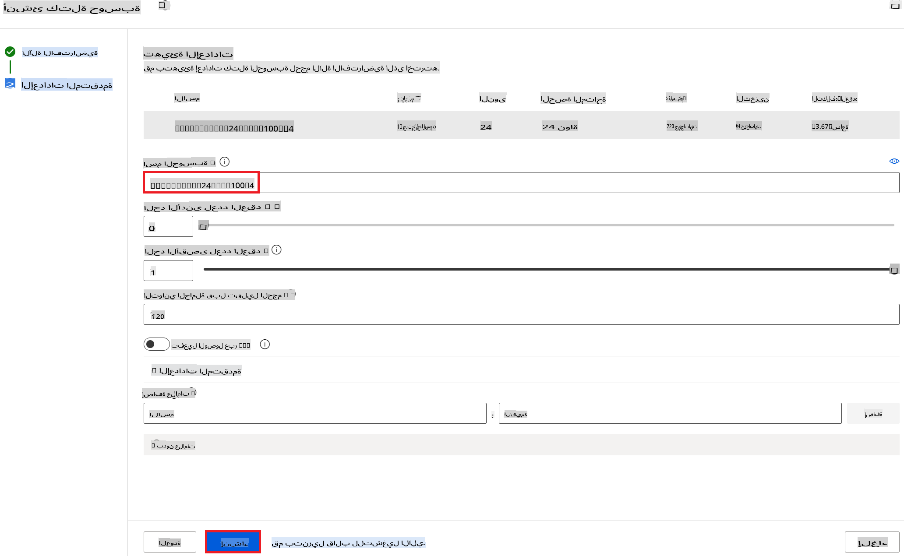

1. اضغط على **إنشاء**.

#### تحسين نموذج Phi-3

1. قم بزيارة [Azure ML Studio](https://ml.azure.com/home?wt.mc_id=studentamb_279723).

1. اختر مساحة العمل الخاصة بـ Azure Machine Learning التي قمت بإنشائها.

    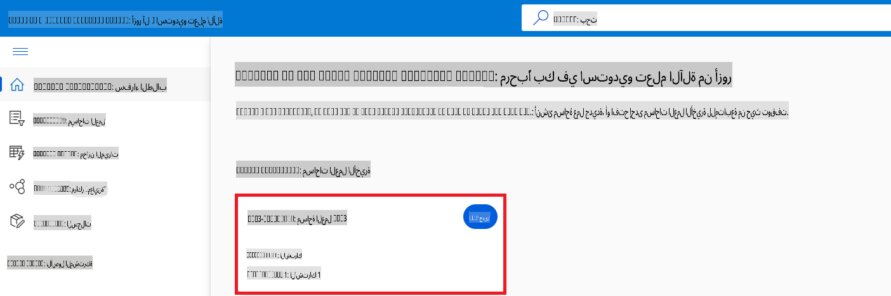

1. قم بتنفيذ المهام التالية:

    - اختر **كتالوج النماذج** من الشريط الجانبي الأيسر.
    - اكتب *phi-3-mini-4k* في **شريط البحث** واختر **Phi-3-mini-4k-instruct** من الخيارات التي تظهر.

    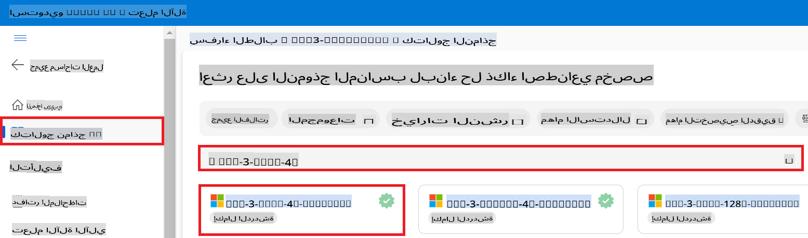

1. اختر **تحسين** من قائمة التنقل.

    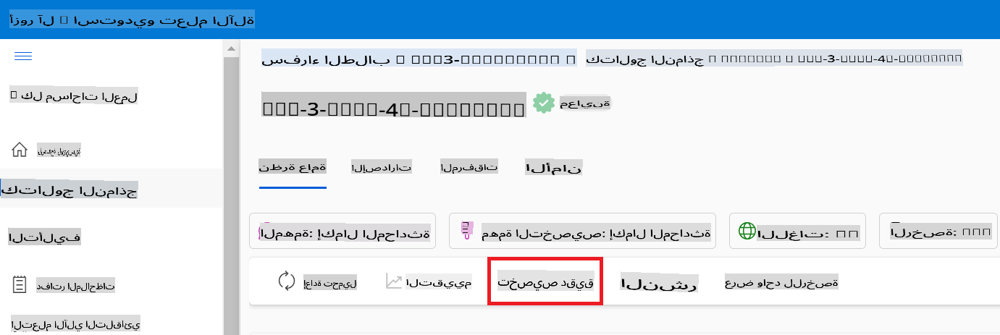

1. قم بتنفيذ المهام التالية:

    - اختر **نوع المهمة** إلى **إكمال المحادثة**.
    - اضغط على **+ اختيار البيانات** لتحميل **بيانات التدريب**.
    - اختر نوع تحميل بيانات التحقق إلى **توفير بيانات تحقق مختلفة**.
    - اضغط على **+ اختيار البيانات** لتحميل **بيانات التحقق**.

    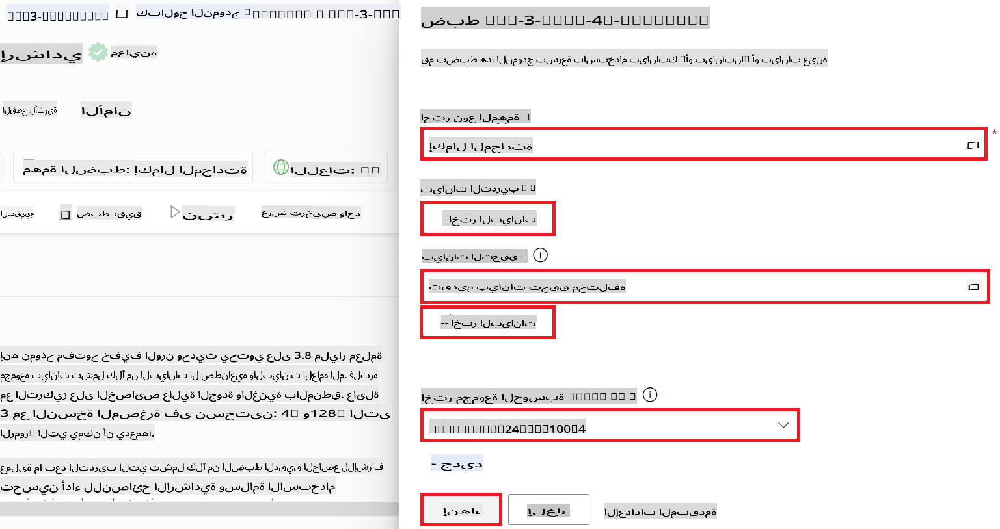

    > [!TIP]
    >
    > يمكنك اختيار **الإعدادات المتقدمة** لتخصيص التكوينات مثل **learning_rate** و **lr_scheduler_type** لتحسين عملية التحسين وفقًا لاحتياجاتك الخاصة.

1. اضغط على **إنهاء**.

1. في هذا التمرين، قمت بتحسين نموذج Phi-3 بنجاح باستخدام Azure Machine Learning. يُرجى ملاحظة أن عملية التحسين قد تستغرق وقتًا طويلاً. بعد تشغيل مهمة التحسين، تحتاج إلى الانتظار حتى تكتمل. يمكنك مراقبة حالة المهمة من خلال الانتقال إلى علامة التبويب "الوظائف" في الجانب الأيسر من مساحة العمل الخاصة بـ Azure Machine Learning. في السلسلة التالية، ستقوم بنشر النموذج المحسن ودمجه مع Prompt flow.

    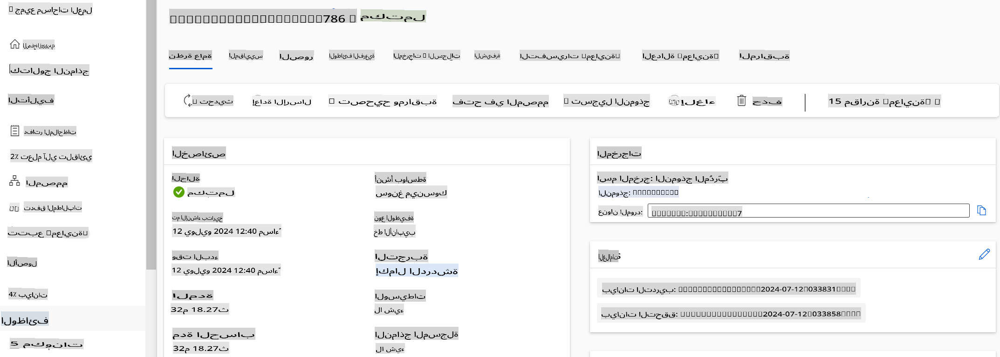

### نشر نموذج Phi-3 المحسن

لدمج نموذج Phi-3 المحسن مع Prompt flow، تحتاج إلى نشر النموذج لجعله متاحًا للتنبؤ في الوقت الفعلي. تتضمن هذه العملية تسجيل النموذج، وإنشاء نقطة نهاية عبر الإنترنت، ونشر النموذج.

في هذا التمرين، ستقوم بـ:

- تسجيل النموذج المحسن في مساحة العمل الخاصة بـ Azure Machine Learning.
- إنشاء نقطة نهاية عبر الإنترنت.
- نشر نموذج Phi-3 المحسن المسجل.

#### تسجيل النموذج المحسن

1. قم بزيارة [Azure ML Studio](https://ml.azure.com/home?wt.mc_id=studentamb_279723).

1. اختر مساحة العمل الخاصة بـ Azure Machine Learning التي قمت بإنشائها.

    

1. اختر **النماذج** من الشريط الجانبي الأيسر.
1. اضغط على **+ تسجيل**.
1. اختر **من مخرجات وظيفة**.

    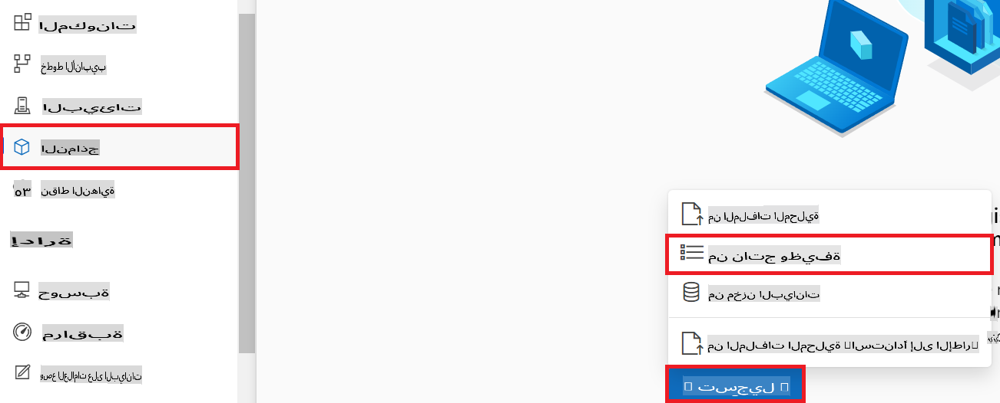

1. اختر الوظيفة التي أنشأتها.

    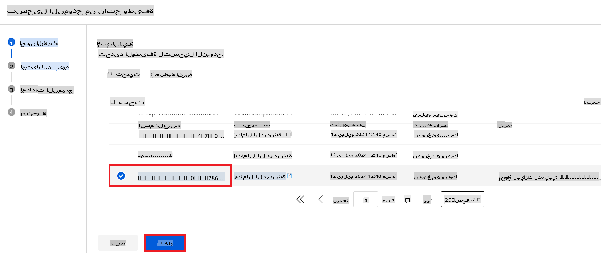

1. اضغط على **التالي**.

1. اختر **نوع النموذج** إلى **MLflow**.

1. تأكد من أن **مخرجات الوظيفة** محددة؛ يجب أن تكون محددة تلقائيًا.

    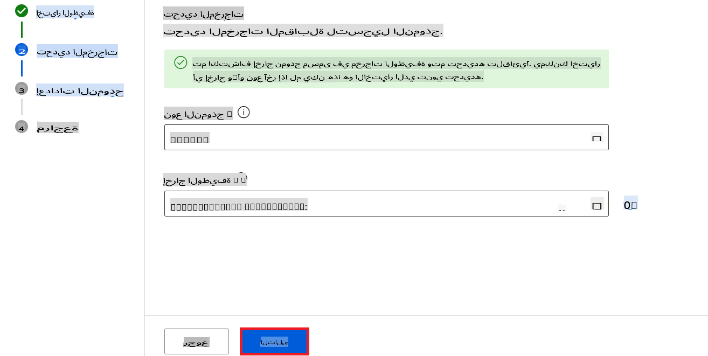

2. اضغط على **التالي**.

3. اضغط على **تسجيل**.

    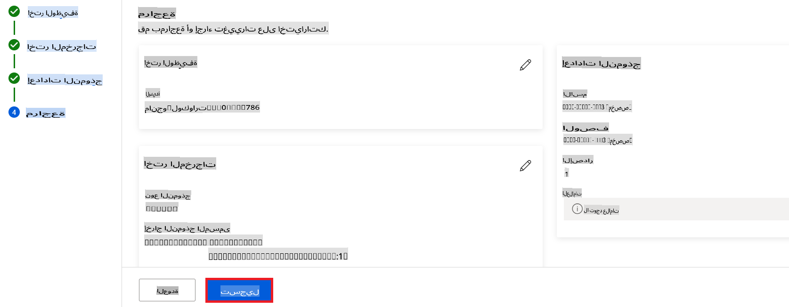

4. يمكنك عرض النموذج المسجل الخاص بك عن طريق الانتقال إلى قائمة **النماذج** من الشريط الجانبي الأيسر.

    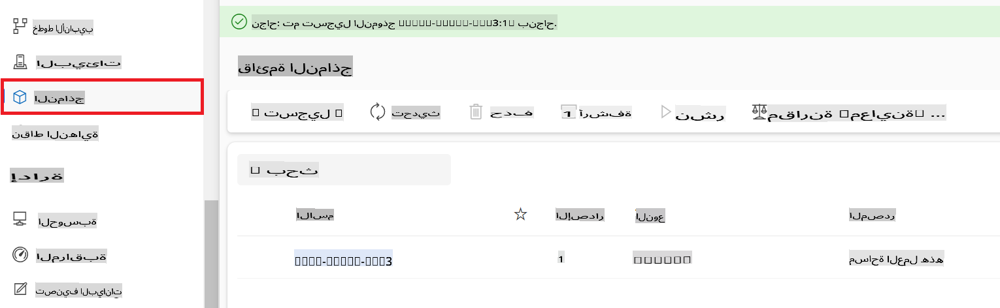

#### نشر النموذج المحسن

1. انتقل إلى مساحة العمل الخاصة بـ Azure Machine Learning التي قمت بإنشائها.

1. اختر **نقاط النهاية** من الشريط الجانبي الأيسر.

1. اختر **نقاط النهاية في الوقت الفعلي** من قائمة التنقل.

    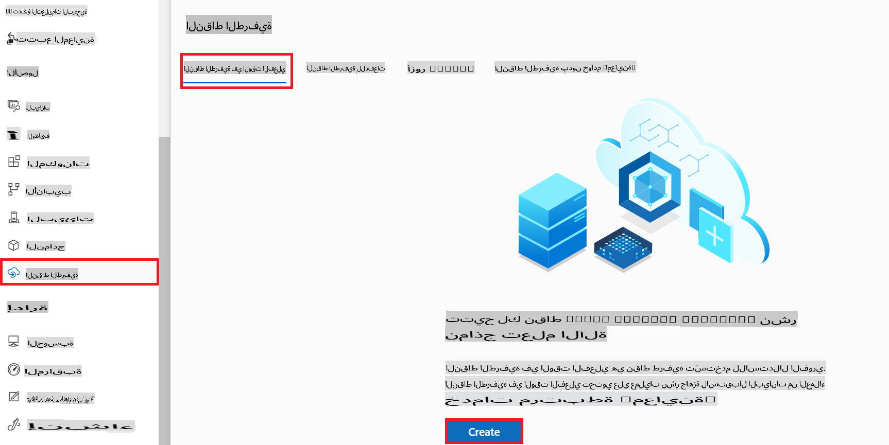

1. اضغط على **إنشاء**.

1. اختر النموذج المسجل الذي قمت بإنشائه.

    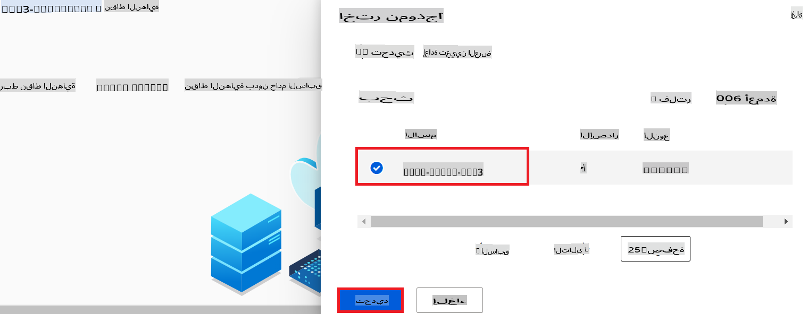

1. اضغط على **اختيار**.

1. قم بتنفيذ المهام التالية:

    - اختر **الجهاز الافتراضي** إلى *Standard_NC6s_v3*.
    - اختر **عدد المثيلات** التي ترغب في استخدامها. على سبيل المثال، *1*.
    - اختر **نقطة النهاية** إلى **جديد** لإنشاء نقطة نهاية.
    - أدخل **اسم نقطة النهاية**. يجب أن يكون قيمة فريدة.
    - أدخل **اسم النشر**. يجب أن يكون قيمة فريدة.

    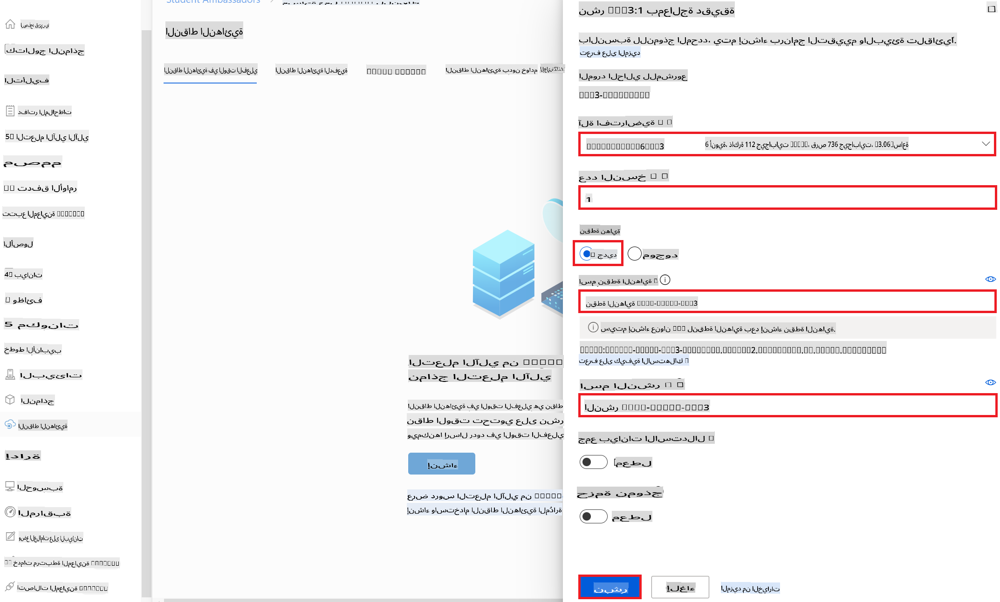

1. اضغط على **نشر**.

> [!WARNING]
> لتجنب تكاليف إضافية على حسابك، تأكد من حذف نقطة النهاية التي قمت بإنشائها في مساحة العمل الخاصة بـ Azure Machine Learning.
>

#### التحقق من حالة النشر في مساحة عمل Azure Machine Learning

1. انتقل إلى مساحة العمل الخاصة بـ Azure Machine Learning التي قمت بإنشائها.

1. اختر **نقاط النهاية** من الشريط الجانبي الأيسر.

1. اختر نقطة النهاية التي قمت بإنشائها.

    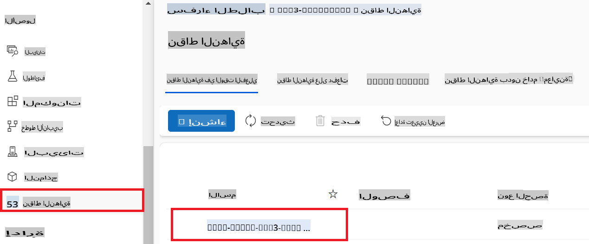

1. في هذه الصفحة، يمكنك إدارة نقاط النهاية أثناء عملية النشر.

> [!NOTE]
> بمجرد اكتمال النشر، تأكد من أن **حركة المرور المباشرة** مضبوطة على **100%**. إذا لم تكن كذلك، اختر **تحديث حركة المرور** لتعديل إعدادات الحركة. لاحظ أنه لا يمكنك اختبار النموذج إذا كانت الحركة مضبوطة على 0%.
>
> 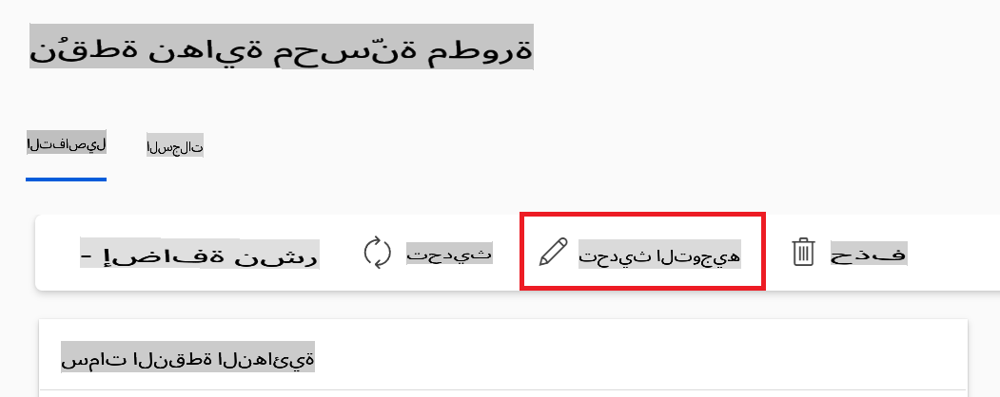
>

## السيناريو 3: الدمج مع Prompt flow والدردشة مع النموذج المخصص في Azure AI Foundry

### دمج نموذج Phi-3 المخصص مع Prompt flow

بعد نشر النموذج المحسن بنجاح، يمكنك الآن دمجه مع Prompt Flow لاستخدام النموذج الخاص بك في التطبيقات التفاعلية في الوقت الفعلي، مما يتيح مجموعة متنوعة من المهام التفاعلية باستخدام نموذج Phi-3 المخصص.

في هذا التمرين، ستقوم بـ:

- إنشاء مركز Azure AI Foundry.
- إنشاء مشروع Azure AI Foundry.
- إنشاء Prompt flow.
- إضافة اتصال مخصص للنموذج المحسن Phi-3.
- إعداد Prompt flow للدردشة مع نموذج Phi-3 المخصص الخاص بك.

> [!NOTE]
> يمكنك أيضًا الدمج مع Promptflow باستخدام Azure ML Studio. يمكن تطبيق نفس عملية الدمج على Azure ML Studio.

#### إنشاء مركز Azure AI Foundry

تحتاج إلى إنشاء مركز قبل إنشاء المشروع. يعمل المركز مثل مجموعة الموارد، مما يسمح لك بتنظيم وإدارة مشاريع متعددة داخل Azure AI Foundry.

1. قم بزيارة [Azure AI Foundry](https://ai.azure.com/?WT.mc_id=aiml-137032-kinfeylo).

1. اختر **جميع المراكز** من الشريط الجانبي الأيسر.

1. اختر **+ مركز جديد** من قائمة التنقل.

    

1. قم بتنفيذ المهام التالية:

    - أدخل **اسم المركز**. يجب أن يكون قيمة فريدة.
    - اختر **اشتراك Azure** الخاص بك.
    - اختر **مجموعة الموارد** التي تريد استخدامها (قم بإنشاء واحدة جديدة إذا لزم الأمر).
    - اختر **الموقع** الذي ترغب في استخدامه.
    - اختر **الاتصال بخدمات Azure AI** التي تريد استخدامها (قم بإنشاء واحدة جديدة إذا لزم الأمر).
    - اختر **الاتصال ببحث Azure AI** إلى **تخطي الاتصال**.

    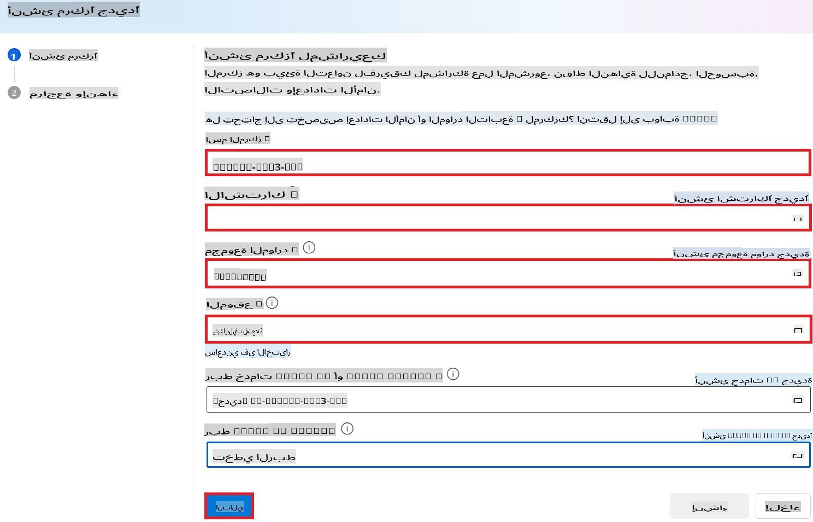

1. اضغط على **التالي**.

#### إنشاء مشروع Azure AI Foundry

1. في المركز الذي أنشأته، اختر **جميع المشاريع** من الشريط الجانبي الأيسر.

1. اختر **+ مشروع جديد** من قائمة التنقل.

    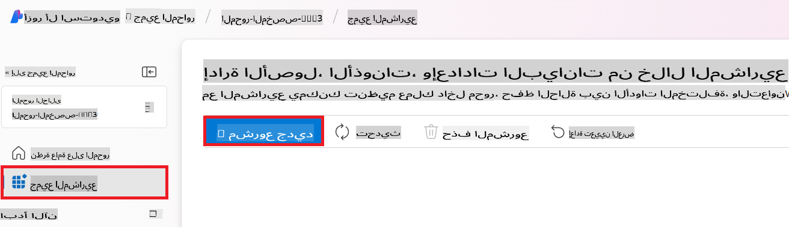

1. أدخل **اسم المشروع**. يجب أن يكون قيمة فريدة.

    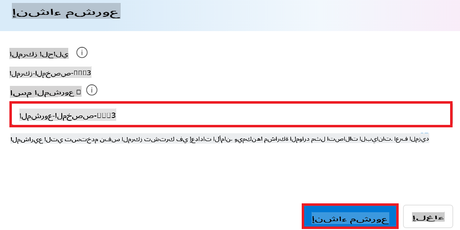

1. اختر **إنشاء مشروع**.

#### إضافة اتصال مخصص للنموذج المحسن Phi-3

لدمج نموذج Phi-3 المخصص الخاص بك مع Prompt flow، تحتاج إلى حفظ نقطة نهاية النموذج والمفتاح في اتصال مخصص. يضمن هذا الإعداد الوصول إلى نموذج Phi-3 المخصص الخاص بك في Prompt flow.

#### إعداد مفتاح API وعنوان نقطة النهاية للنموذج المحسن Phi-3

1. قم بزيارة [Azure ML Studio](https://ml.azure.com/home?WT.mc_id=aiml-137032-kinfeylo).

1. انتقل إلى مساحة العمل الخاصة بـ Azure Machine Learning التي قمت بإنشائها.

1. اختر **نقاط النهاية** من الشريط الجانبي الأيسر.

    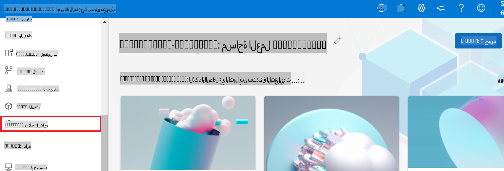

1. اختر نقطة النهاية التي قمت بإنشائها.

    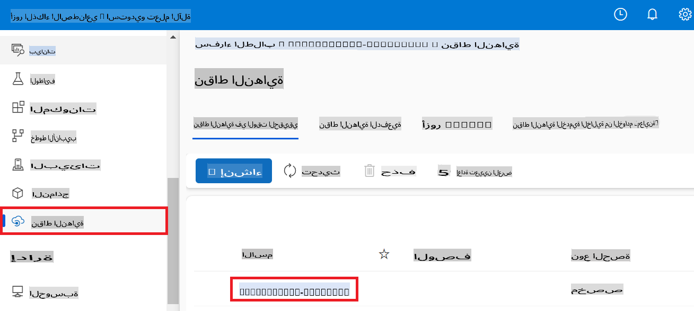

1. اختر **استهلاك** من قائمة التنقل.

1. انسخ **نقطة النهاية REST** و **المفتاح الأساسي** الخاصين بك.
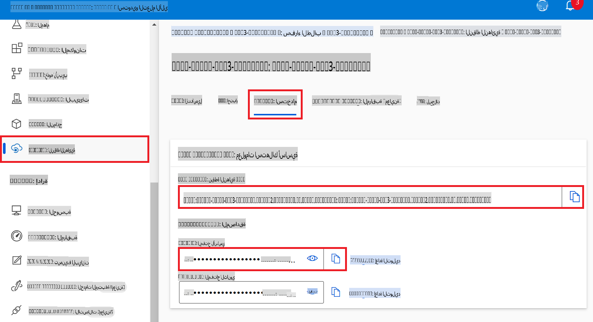

#### إضافة الاتصال المخصص

1. قم بزيارة [Azure AI Foundry](https://ai.azure.com/?WT.mc_id=aiml-137032-kinfeylo).

1. انتقل إلى مشروع Azure AI Foundry الذي قمت بإنشائه.

1. في المشروع الذي قمت بإنشائه، اختر **Settings** من القائمة الجانبية.

1. اختر **+ New connection**.

    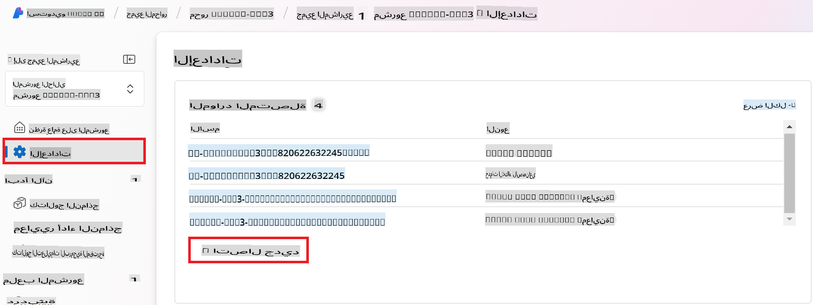

1. اختر **Custom keys** من قائمة التنقل.

    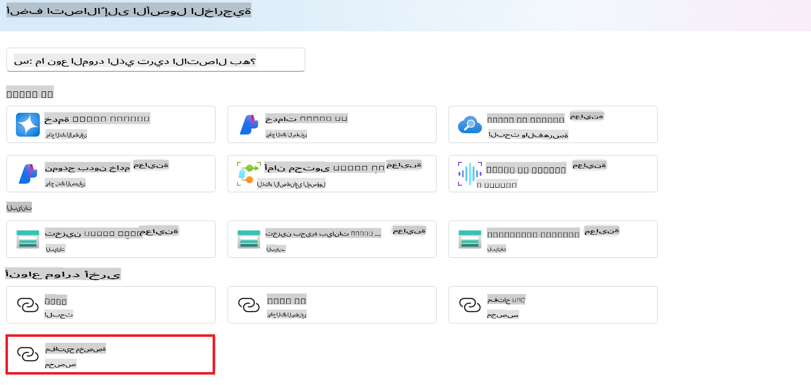

1. قم بتنفيذ الخطوات التالية:

    - اختر **+ Add key value pairs**.
    - بالنسبة لاسم المفتاح، أدخل **endpoint** والصق عنوان endpoint الذي نسخته من Azure ML Studio في حقل القيمة.
    - اختر **+ Add key value pairs** مرة أخرى.
    - بالنسبة لاسم المفتاح، أدخل **key** والصق المفتاح الذي نسخته من Azure ML Studio في حقل القيمة.
    - بعد إضافة المفاتيح، اختر **is secret** لمنع عرض المفتاح.

    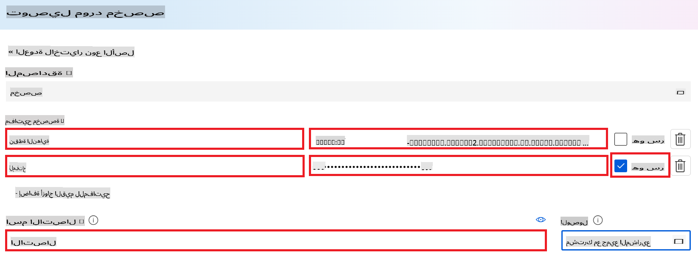

1. اختر **Add connection**.

#### إنشاء Prompt flow

لقد أضفت اتصالاً مخصصاً في Azure AI Foundry. الآن، لنقم بإنشاء Prompt flow باستخدام الخطوات التالية. بعد ذلك، ستقوم بربط هذا Prompt flow بالاتصال المخصص حتى تتمكن من استخدام النموذج المحسن داخل Prompt flow.

1. انتقل إلى مشروع Azure AI Foundry الذي قمت بإنشائه.

1. اختر **Prompt flow** من القائمة الجانبية.

1. اختر **+ Create** من قائمة التنقل.

    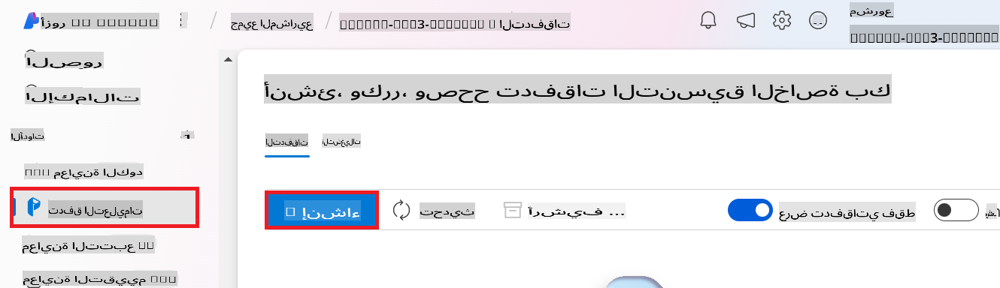

1. اختر **Chat flow** من قائمة التنقل.

    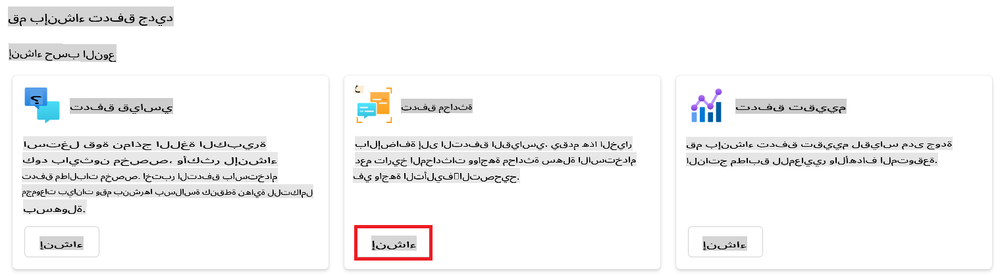

1. أدخل **Folder name** الذي ترغب في استخدامه.

    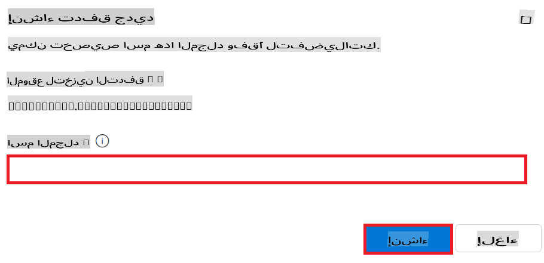

2. اختر **Create**.

#### إعداد Prompt flow للتفاعل مع نموذج Phi-3 المخصص

تحتاج إلى دمج نموذج Phi-3 المحسن في Prompt flow. ومع ذلك، فإن Prompt flow الحالي غير مصمم لهذا الغرض. لذلك، يجب عليك إعادة تصميم Prompt flow لتمكين دمج النموذج المخصص.

1. في Prompt flow، قم بتنفيذ الخطوات التالية لإعادة بناء التدفق الحالي:

    - اختر **Raw file mode**.
    - قم بحذف جميع التعليمات البرمجية الموجودة في ملف *flow.dag.yml*.
    - أضف التعليمات البرمجية التالية إلى ملف *flow.dag.yml*.

        ```yml
        inputs:
          input_data:
            type: string
            default: "Who founded Microsoft?"

        outputs:
          answer:
            type: string
            reference: ${integrate_with_promptflow.output}

        nodes:
        - name: integrate_with_promptflow
          type: python
          source:
            type: code
            path: integrate_with_promptflow.py
          inputs:
            input_data: ${inputs.input_data}
        ```

    - اختر **Save**.

    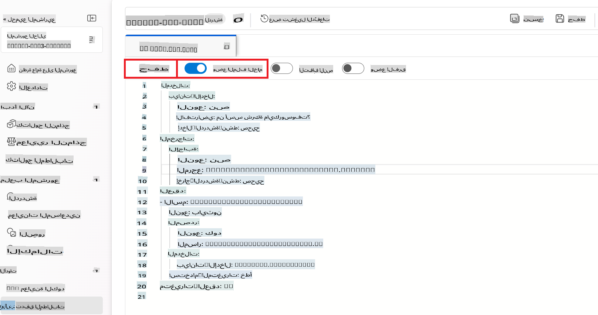

1. أضف التعليمات البرمجية التالية إلى ملف *integrate_with_promptflow.py* لاستخدام نموذج Phi-3 المخصص في Prompt flow.

    ```python
    import logging
    import requests
    from promptflow import tool
    from promptflow.connections import CustomConnection

    # Logging setup
    logging.basicConfig(
        format="%(asctime)s - %(levelname)s - %(name)s - %(message)s",
        datefmt="%Y-%m-%d %H:%M:%S",
        level=logging.DEBUG
    )
    logger = logging.getLogger(__name__)

    def query_phi3_model(input_data: str, connection: CustomConnection) -> str:
        """
        Send a request to the Phi-3 model endpoint with the given input data using Custom Connection.
        """

        # "connection" is the name of the Custom Connection, "endpoint", "key" are the keys in the Custom Connection
        endpoint_url = connection.endpoint
        api_key = connection.key

        headers = {
            "Content-Type": "application/json",
            "Authorization": f"Bearer {api_key}"
        }
        data = {
            "input_data": {
                "input_string": [
                    {"role": "user", "content": input_data}
                ],
                "parameters": {
                    "temperature": 0.7,
                    "max_new_tokens": 128
                }
            }
        }
        try:
            response = requests.post(endpoint_url, json=data, headers=headers)
            response.raise_for_status()
            
            # Log the full JSON response
            logger.debug(f"Full JSON response: {response.json()}")

            result = response.json()["output"]
            logger.info("Successfully received response from Azure ML Endpoint.")
            return result
        except requests.exceptions.RequestException as e:
            logger.error(f"Error querying Azure ML Endpoint: {e}")
            raise

    @tool
    def my_python_tool(input_data: str, connection: CustomConnection) -> str:
        """
        Tool function to process input data and query the Phi-3 model.
        """
        return query_phi3_model(input_data, connection)

    ```

    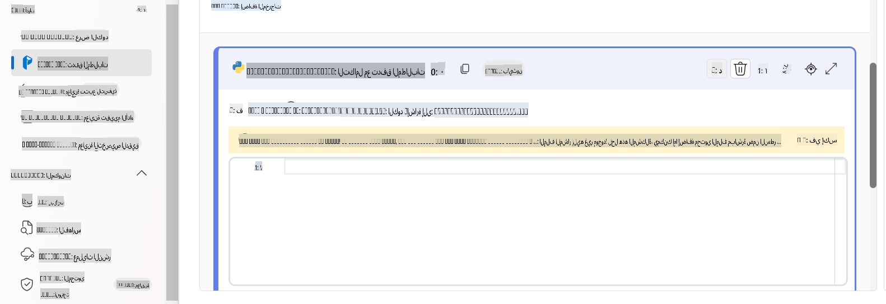

> [!NOTE]
> لمزيد من المعلومات التفصيلية حول استخدام Prompt flow في Azure AI Foundry، يمكنك الرجوع إلى [Prompt flow in Azure AI Foundry](https://learn.microsoft.com/azure/ai-studio/how-to/prompt-flow).

1. اختر **Chat input**، **Chat output** لتفعيل التفاعل مع النموذج الخاص بك.

    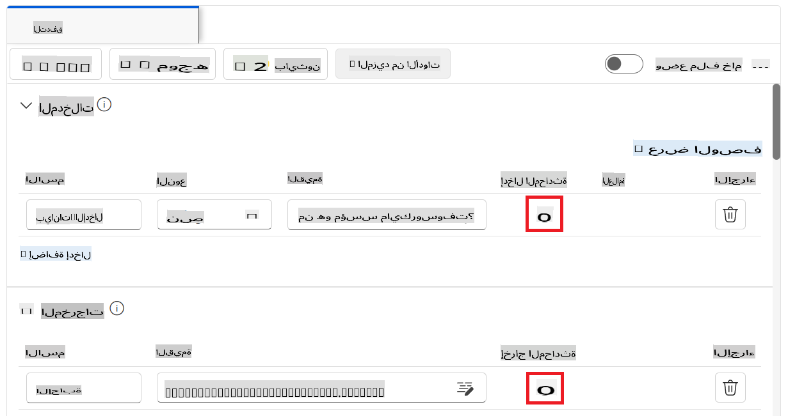

1. الآن أنت جاهز للتفاعل مع نموذج Phi-3 المخصص الخاص بك. في التمرين التالي، ستتعلم كيفية بدء Prompt flow واستخدامه للتفاعل مع نموذج Phi-3 المحسن الخاص بك.

> [!NOTE]
>
> يجب أن يبدو التدفق المعاد بناؤه كما في الصورة أدناه:
>
> 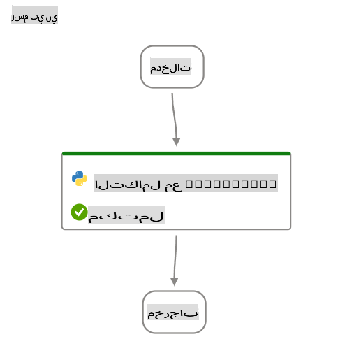
>

### التفاعل مع نموذج Phi-3 المخصص الخاص بك

الآن بعد أن قمت بتحسين ودمج نموذج Phi-3 المخصص الخاص بك مع Prompt flow، أنت جاهز لبدء التفاعل معه. سيوجهك هذا التمرين خلال عملية إعداد وبدء التفاعل مع النموذج الخاص بك باستخدام Prompt flow. من خلال اتباع هذه الخطوات، ستتمكن من الاستفادة الكاملة من إمكانيات نموذج Phi-3 المحسن الخاص بك لمهام ومحادثات متنوعة.

- تفاعل مع نموذج Phi-3 المخصص الخاص بك باستخدام Prompt flow.

#### بدء Prompt flow

1. اختر **Start compute sessions** لبدء Prompt flow.

    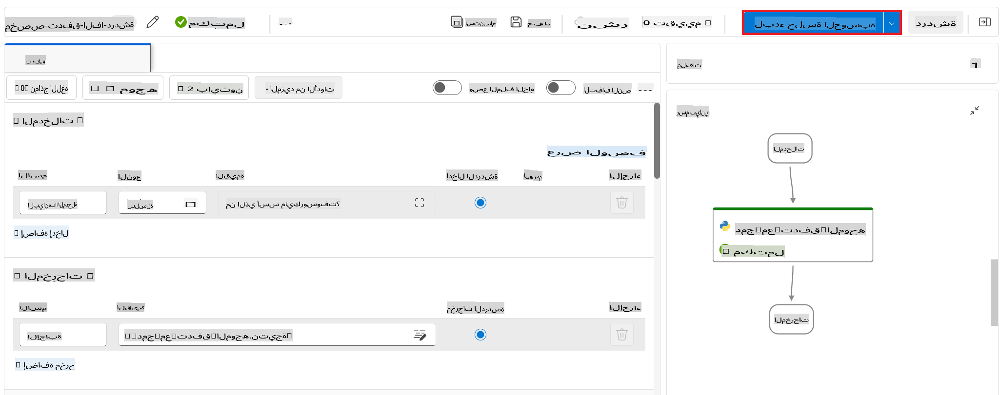

1. اختر **Validate and parse input** لتحديث المعلمات.

    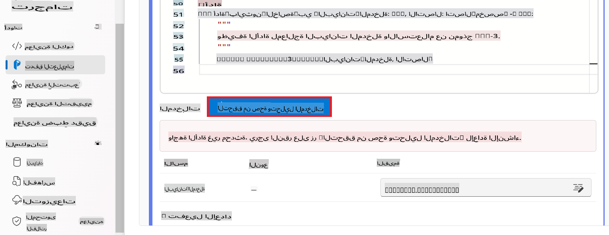

1. اختر **Value** الخاص بـ **connection** للاتصال المخصص الذي أنشأته. على سبيل المثال، *connection*.

    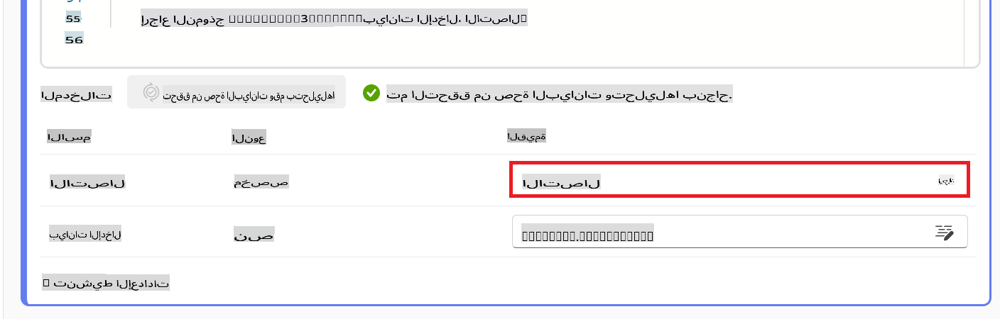

#### التفاعل مع النموذج المخصص الخاص بك

1. اختر **Chat**.

    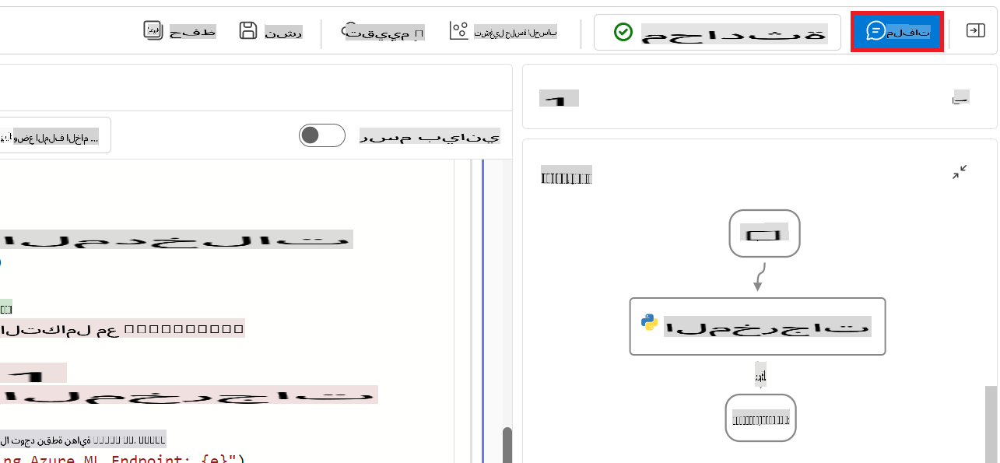

1. إليك مثال على النتائج: الآن يمكنك التفاعل مع نموذج Phi-3 المخصص الخاص بك. يُوصى بطرح أسئلة بناءً على البيانات المستخدمة في تحسين النموذج.

    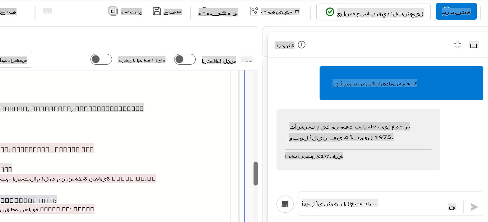

**إخلاء المسؤولية**:  
تم ترجمة هذا المستند باستخدام خدمات الترجمة الآلية بالاعتماد على الذكاء الاصطناعي. بينما نسعى لتحقيق الدقة، يُرجى العلم أن الترجمات الآلية قد تحتوي على أخطاء أو معلومات غير دقيقة. يجب اعتبار المستند الأصلي بلغته الأصلية هو المصدر الموثوق. للحصول على معلومات حساسة أو هامة، يُوصى بالاستعانة بترجمة بشرية احترافية. نحن غير مسؤولين عن أي سوء فهم أو تفسيرات خاطئة تنشأ عن استخدام هذه الترجمة.