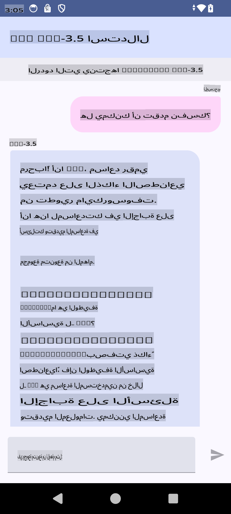

# **استخدام Microsoft Phi-3.5 tflite لإنشاء تطبيق أندرويد**

هذا مثال لتطبيق أندرويد يستخدم نماذج Microsoft Phi-3.5 tflite.

## **📚 المعرفة**

تتيح واجهة برمجة التطبيقات Android LLM Inference تشغيل نماذج اللغة الكبيرة (LLMs) بالكامل على الجهاز لتطبيقات أندرويد. يمكنك استخدامها لتنفيذ مجموعة واسعة من المهام، مثل إنشاء النصوص، واسترجاع المعلومات بصيغة اللغة الطبيعية، وتلخيص المستندات. توفر هذه المهمة دعمًا مدمجًا للعديد من نماذج اللغة الكبيرة النصية، مما يتيح لك تطبيق أحدث نماذج الذكاء الاصطناعي التوليدية على أجهزتك التي تعمل بنظام أندرويد.

مكتبة Googld AI Edge Torch هي مكتبة بايثون تدعم تحويل نماذج PyTorch إلى تنسيق .tflite، والذي يمكن تشغيله باستخدام TensorFlow Lite وMediaPipe. يتيح ذلك إنشاء تطبيقات لنظام أندرويد وiOS وإنترنت الأشياء يمكنها تشغيل النماذج بالكامل على الجهاز. تقدم AI Edge Torch تغطية واسعة لوحدة المعالجة المركزية (CPU)، مع دعم مبدئي لوحدة معالجة الرسوميات (GPU) ووحدة المعالجة العصبية (NPU). تسعى AI Edge Torch إلى التكامل الوثيق مع PyTorch، مستندة إلى torch.export() وتوفير تغطية جيدة لمشغلات ATen الأساسية.

## **🪬 الإرشادات**

### **🔥 تحويل Microsoft Phi-3.5 لدعم tflite**

0. هذا المثال مخصص لنظام أندرويد 14+

1. تثبيت Python 3.10.12

***اقتراح:*** استخدام conda لتثبيت بيئة Python الخاصة بك

2. Ubuntu 20.04 / 22.04 (يرجى التركيز على [google ai-edge-torch](https://github.com/google-ai-edge/ai-edge-torch))

***اقتراح:*** استخدام Azure Linux VM أو VM من طرف ثالث لإنشاء بيئتك

3. انتقل إلى واجهة Linux bash لتثبيت مكتبة Python 

```bash

git clone https://github.com/google-ai-edge/ai-edge-torch.git

cd ai-edge-torch

pip install -r requirements.txt -U 

pip install tensorflow-cpu -U

pip install -e .

```

4. قم بتنزيل Microsoft-3.5-Instruct من Hugging face

```bash

git lfs install

git clone  https://huggingface.co/microsoft/Phi-3.5-mini-instruct

```

5. تحويل Microsoft Phi-3.5 إلى tflite

```bash

python ai-edge-torch/ai_edge_torch/generative/examples/phi/convert_phi3_to_tflite.py --checkpoint_path  Your Microsoft Phi-3.5-mini-instruct path --tflite_path Your Microsoft Phi-3.5-mini-instruct tflite path  --prefill_seq_len 1024 --kv_cache_max_len 1280 --quantize True

```

### **🔥 تحويل Microsoft Phi-3.5 إلى حزمة Mediapipe لأندرويد**

يرجى تثبيت mediapipe أولاً

```bash

pip install mediapipe

```

قم بتشغيل هذا الكود في [دفترك](../../../../../../code/09.UpdateSamples/Aug/Android/convert/convert_phi.ipynb)

```python

import mediapipe as mp
from mediapipe.tasks.python.genai import bundler

config = bundler.BundleConfig(
    tflite_model='Your Phi-3.5 tflite model path',
    tokenizer_model='Your Phi-3.5 tokenizer model path',
    start_token='start_token',
    stop_tokens=[STOP_TOKENS],
    output_filename='Your Phi-3.5 task model path',
    enable_bytes_to_unicode_mapping=True or Flase,
)
bundler.create_bundle(config)

```

### **🔥 استخدام adb لدفع نموذج المهمة إلى مسار جهاز أندرويد الخاص بك**

```bash

adb shell rm -r /data/local/tmp/llm/ # Remove any previously loaded models

adb shell mkdir -p /data/local/tmp/llm/

adb push 'Your Phi-3.5 task model path' /data/local/tmp/llm/phi3.task

```

### **🔥 تشغيل كود الأندرويد الخاص بك**



**إخلاء المسؤولية**:  
تمت ترجمة هذا المستند باستخدام خدمات الترجمة الآلية المدعومة بالذكاء الاصطناعي. بينما نسعى لتحقيق الدقة، يرجى العلم أن الترجمات الآلية قد تحتوي على أخطاء أو معلومات غير دقيقة. يجب اعتبار المستند الأصلي بلغته الأصلية هو المصدر الموثوق. للحصول على معلومات حاسمة، يُوصى بالاستعانة بترجمة بشرية احترافية. نحن غير مسؤولين عن أي سوء فهم أو تفسيرات خاطئة تنشأ عن استخدام هذه الترجمة.