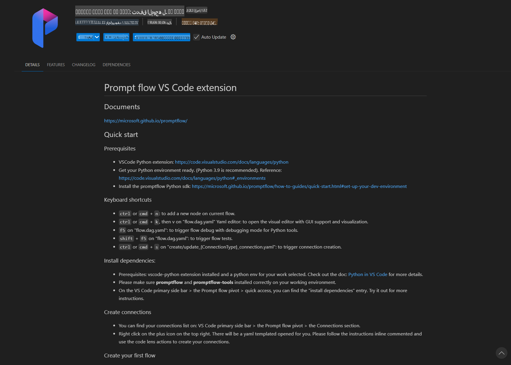
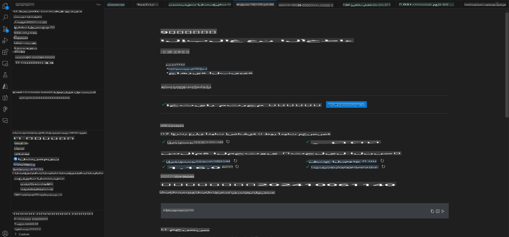
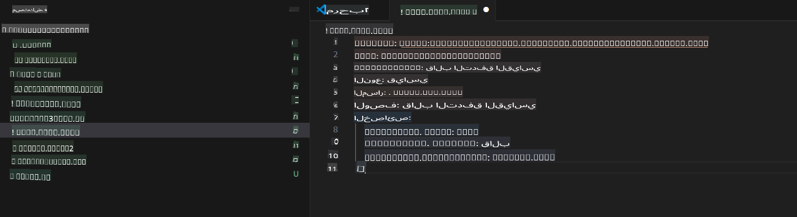
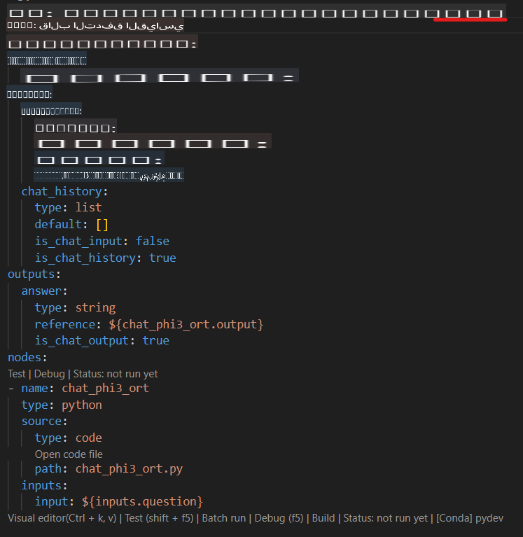
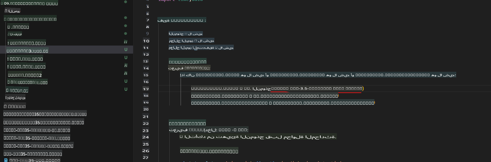
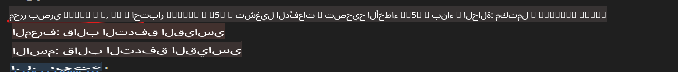
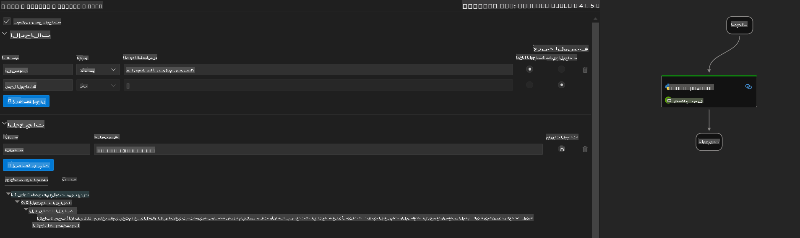
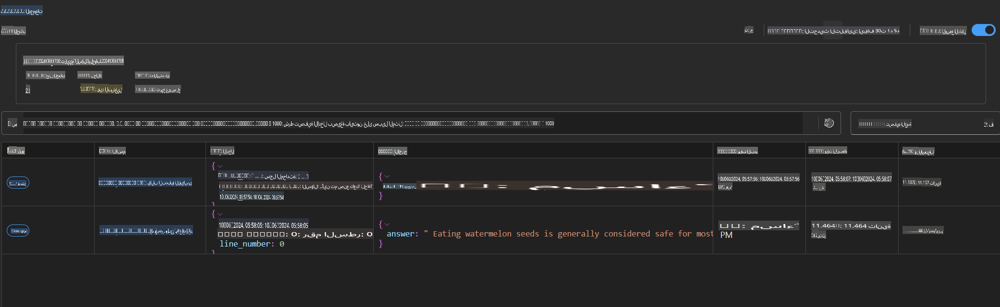

# استخدام وحدة معالجة الرسومات (GPU) في نظام ويندوز لإنشاء حل Prompt Flow باستخدام Phi-3.5-Instruct ONNX

الوثيقة التالية هي مثال على كيفية استخدام PromptFlow مع ONNX (Open Neural Network Exchange) لتطوير تطبيقات الذكاء الاصطناعي المستندة إلى نماذج Phi-3.

PromptFlow هو مجموعة أدوات تطوير تهدف إلى تبسيط دورة التطوير الشاملة لتطبيقات الذكاء الاصطناعي المستندة إلى النماذج اللغوية الكبيرة (LLM)، بدءًا من الفكرة والتجربة الأولية وصولاً إلى الاختبار والتقييم.

عند دمج PromptFlow مع ONNX، يمكن للمطورين:

- تحسين أداء النموذج: الاستفادة من ONNX لتسريع استدلال النموذج ونشره.
- تبسيط عملية التطوير: استخدام PromptFlow لإدارة سير العمل وأتمتة المهام المتكررة.
- تعزيز التعاون: تسهيل التعاون بين أعضاء الفريق من خلال توفير بيئة تطوير موحدة.

**Prompt Flow** هو مجموعة أدوات تطوير تهدف إلى تبسيط دورة التطوير الشاملة لتطبيقات الذكاء الاصطناعي المستندة إلى النماذج اللغوية الكبيرة (LLM)، بدءًا من الفكرة، التجربة الأولية، الاختبار، التقييم، وحتى نشر الإنتاج والمراقبة. يجعل هندسة النماذج أكثر سهولة ويسمح لك ببناء تطبيقات LLM بجودة إنتاجية.

يمكن لـ Prompt Flow الاتصال بخدمات OpenAI، Azure OpenAI، والنماذج القابلة للتخصيص (مثل Huggingface، LLM/SLM المحلية). نأمل في نشر نموذج Phi-3.5 ONNX المكمم للتطبيقات المحلية. يمكن لـ Prompt Flow مساعدتنا في التخطيط بشكل أفضل لأعمالنا وإكمال الحلول المحلية بناءً على Phi-3.5. في هذا المثال، سنقوم بدمج مكتبة ONNX Runtime GenAI لإكمال حل Prompt Flow المستند إلى وحدة معالجة الرسومات (GPU) في نظام ويندوز.

## **التثبيت**

### **ONNX Runtime GenAI لوحدة معالجة الرسومات في ويندوز**

اقرأ هذا الدليل لإعداد ONNX Runtime GenAI لوحدة معالجة الرسومات في ويندوز [اضغط هنا](./ORTWindowGPUGuideline.md)

### **إعداد Prompt Flow في VSCode**

1. قم بتثبيت ملحق Prompt Flow في VS Code



2. بعد تثبيت ملحق Prompt Flow في VS Code، انقر على الملحق، واختر **Installation dependencies** واتبع هذا الدليل لتثبيت Prompt Flow SDK في بيئتك



3. قم بتحميل [الكود النموذجي](../../../../../../code/09.UpdateSamples/Aug/pf/onnx_inference_pf) واستخدم VS Code لفتح هذا النموذج



4. افتح **flow.dag.yaml** لاختيار بيئة Python الخاصة بك



   افتح **chat_phi3_ort.py** لتغيير موقع نموذج Phi-3.5-instruct ONNX الخاص بك



5. قم بتشغيل Prompt Flow لاختبار الحل

افتح **flow.dag.yaml** وانقر على المحرر المرئي



بعد النقر على هذا، قم بتشغيله للاختبار



1. يمكنك تشغيل دفعة في الطرفية للتحقق من المزيد من النتائج

```bash

pf run create --file batch_run.yaml --stream --name 'Your eval qa name'    

```

يمكنك التحقق من النتائج في المتصفح الافتراضي الخاص بك



**إخلاء المسؤولية**:  
تم ترجمة هذا المستند باستخدام خدمات الترجمة الآلية بالاعتماد على الذكاء الاصطناعي. بينما نسعى لتحقيق الدقة، يُرجى العلم أن الترجمات الآلية قد تحتوي على أخطاء أو عدم دقة. يجب اعتبار المستند الأصلي بلغته الأصلية المصدر الموثوق. للحصول على معلومات حاسمة، يُوصى باللجوء إلى ترجمة بشرية احترافية. نحن غير مسؤولين عن أي سوء فهم أو تفسيرات خاطئة تنشأ عن استخدام هذه الترجمة.