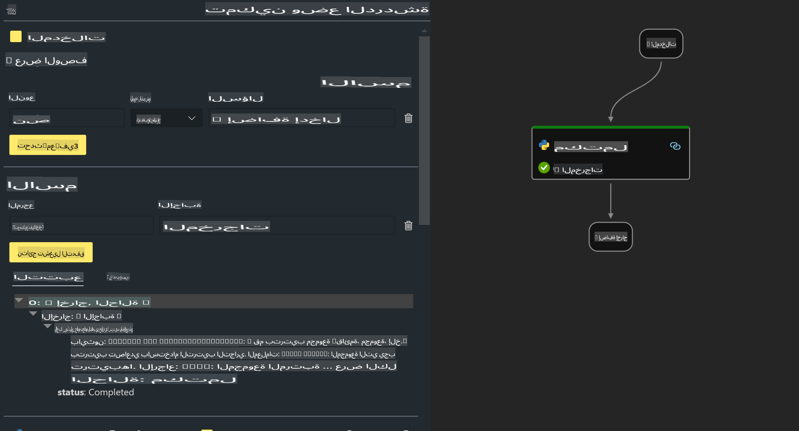

# **المختبر 2 - تشغيل Prompt flow مع Phi-3-mini في AIPC**

## **ما هو Prompt flow**

Prompt flow هو مجموعة من أدوات التطوير المصممة لتبسيط دورة التطوير الكاملة لتطبيقات الذكاء الاصطناعي المستندة إلى النماذج اللغوية الكبيرة (LLM)، بدءًا من الفكرة، والنماذج الأولية، والاختبار، والتقييم، وحتى النشر في الإنتاج والمراقبة. يجعل هندسة البرمجة التوجيهية أسهل بكثير ويساعدك على بناء تطبيقات LLM بجودة إنتاجية.

مع Prompt flow، ستتمكن من:

- إنشاء تدفقات تربط بين LLMs، والبرمجة التوجيهية، وكود Python، وأدوات أخرى في سير عمل قابل للتنفيذ.

- تصحيح الأخطاء وتكرار تدفقاتك بسهولة، خاصة التفاعل مع LLMs.

- تقييم تدفقاتك وحساب معايير الجودة والأداء باستخدام مجموعات بيانات أكبر.

- دمج الاختبار والتقييم في نظام CI/CD الخاص بك لضمان جودة تدفقاتك.

- نشر تدفقاتك على منصة الخدمة التي تختارها أو دمجها بسهولة في قاعدة كود تطبيقك.

- (اختياري ولكنه موصى به بشدة) التعاون مع فريقك من خلال الاستفادة من النسخة السحابية من Prompt flow في Azure AI.

## **ما هو AIPC**

يتضمن الحاسوب المزود بالذكاء الاصطناعي (AI PC) وحدة معالجة مركزية (CPU)، ووحدة معالجة رسومات (GPU)، ووحدة معالجة عصبية (NPU)، ولكل منها قدرات محددة لتسريع الذكاء الاصطناعي. الـ NPU، أو وحدة المعالجة العصبية، هي مسرع متخصص يتولى مهام الذكاء الاصطناعي (AI) والتعلم الآلي (ML) مباشرة على جهاز الكمبيوتر الخاص بك بدلاً من إرسال البيانات لمعالجتها في السحابة. يمكن أيضًا لـ GPU وCPU معالجة هذه الأحمال، ولكن NPU يتميز بشكل خاص في الحسابات منخفضة الطاقة للذكاء الاصطناعي. يمثل AI PC تحولًا جذريًا في طريقة عمل أجهزة الكمبيوتر لدينا. إنه ليس حلاً لمشكلة لم تكن موجودة من قبل، بل يعد بتحسين كبير للاستخدامات اليومية لأجهزة الكمبيوتر.

كيف يعمل ذلك؟ مقارنةً بالذكاء الاصطناعي التوليدي والنماذج اللغوية الكبيرة (LLMs) التي تم تدريبها على كميات هائلة من البيانات العامة، فإن الذكاء الاصطناعي الذي سيعمل على جهاز الكمبيوتر الخاص بك أكثر سهولة على جميع المستويات تقريبًا. الفكرة أسهل للفهم، ولأنه يتم تدريبه على بياناتك دون الحاجة للوصول إلى السحابة، فإن الفوائد تصبح أكثر جاذبية على الفور لشريحة أوسع من الناس.

على المدى القريب، يتضمن عالم AI PC مساعدين شخصيين ونماذج ذكاء اصطناعي أصغر تعمل مباشرة على جهاز الكمبيوتر الخاص بك، باستخدام بياناتك لتقديم تحسينات شخصية، خاصة، وأكثر أمانًا للذكاء الاصطناعي للأشياء التي تقوم بها بالفعل يوميًا - مثل تدوين محاضر الاجتماعات، وتنظيم دوري كرة قدم خيالي، وأتمتة تحسينات تحرير الصور والفيديو، أو إعداد خط سير مثالي لاجتماع عائلي بناءً على أوقات وصول ومغادرة الجميع.

## **إنشاء تدفقات كود التوليد على AIPC**

***ملاحظة***: إذا لم تكمل تثبيت البيئة، يرجى زيارة [Lab 0 -Installations](./01.Installations.md)

1. افتح ملحق Prompt flow في Visual Studio Code وأنشئ مشروع تدفق فارغ.


2. أضف معلمات الإدخال والإخراج وأضف كود Python كتدفق جديد.



يمكنك الرجوع إلى هذا الهيكل (flow.dag.yaml) لإنشاء التدفق الخاص بك:

```yaml

inputs:
  question:
    type: string
    default: how to write Bubble Algorithm
outputs:
  answer:
    type: string
    reference: ${Chat_With_Phi3.output}
nodes:
- name: Chat_With_Phi3
  type: python
  source:
    type: code
    path: Chat_With_Phi3.py
  inputs:
    question: ${inputs.question}


```

3. أضف الكود في ***Chat_With_Phi3.py***

```python


from promptflow.core import tool

# import torch
from transformers import AutoTokenizer, pipeline,TextStreamer
import intel_npu_acceleration_library as npu_lib

import warnings

import asyncio
import platform

class Phi3CodeAgent:
    
    model = None
    tokenizer = None
    text_streamer = None
    
    model_id = "microsoft/Phi-3-mini-4k-instruct"

    @staticmethod
    def init_phi3():
        
        if Phi3CodeAgent.model is None or Phi3CodeAgent.tokenizer is None or Phi3CodeAgent.text_streamer is None:
            Phi3CodeAgent.model = npu_lib.NPUModelForCausalLM.from_pretrained(
                                    Phi3CodeAgent.model_id,
                                    torch_dtype="auto",
                                    dtype=npu_lib.int4,
                                    trust_remote_code=True
                                )
            Phi3CodeAgent.tokenizer = AutoTokenizer.from_pretrained(Phi3CodeAgent.model_id)
            Phi3CodeAgent.text_streamer = TextStreamer(Phi3CodeAgent.tokenizer, skip_prompt=True)

    

    @staticmethod
    def chat_with_phi3(prompt):
        
        Phi3CodeAgent.init_phi3()

        messages = "<|system|>You are a AI Python coding assistant. Please help me to generate code in Python.The answer only genertated Python code, but any comments and instructions do not need to be generated<|end|><|user|>" + prompt +"<|end|><|assistant|>"


        generation_args = {
            "max_new_tokens": 1024,
            "return_full_text": False,
            "temperature": 0.3,
            "do_sample": False,
            "streamer": Phi3CodeAgent.text_streamer,
        }

        pipe = pipeline(
            "text-generation",
            model=Phi3CodeAgent.model,
            tokenizer=Phi3CodeAgent.tokenizer,
            # **generation_args
        )

        result = ''

        with warnings.catch_warnings():
            warnings.simplefilter("ignore")
            response = pipe(messages, **generation_args)
            result =response[0]['generated_text']
            return result


@tool
def my_python_tool(question: str) -> str:
    if platform.system() == 'Windows':
        asyncio.set_event_loop_policy(asyncio.WindowsSelectorEventLoopPolicy())
    return Phi3CodeAgent.chat_with_phi3(question)


```

4. يمكنك اختبار التدفق من Debug أو Run للتحقق من صحة كود التوليد.


5. قم بتشغيل التدفق كـ API تطوير في الطرفية.

```

pf flow serve --source ./ --port 8080 --host localhost   

```

يمكنك اختباره باستخدام Postman / Thunder Client.

### **ملاحظات**

1. التشغيل الأول يستغرق وقتًا طويلاً. يُوصى بتنزيل نموذج phi-3 من Hugging face CLI.

2. نظرًا لقدرات الحوسبة المحدودة لـ Intel NPU، يُوصى باستخدام Phi-3-mini-4k-instruct.

3. نستخدم تسريع Intel NPU لتحويل INT4، ولكن إذا قمت بإعادة تشغيل الخدمة، ستحتاج إلى حذف ذاكرة التخزين المؤقت ومجلدات nc_workshop.

## **الموارد**

1. تعلم Promptflow [https://microsoft.github.io/promptflow/](https://microsoft.github.io/promptflow/)

2. تعلم تسريع Intel NPU [https://github.com/intel/intel-npu-acceleration-library](https://github.com/intel/intel-npu-acceleration-library)

3. كود عينة، قم بتنزيل [كود عينة Local NPU Agent](../../../../../../../../../code/07.Lab/01/AIPC)

**إخلاء المسؤولية**:  
تم ترجمة هذا المستند باستخدام خدمات الترجمة الآلية بالذكاء الاصطناعي. بينما نسعى لتحقيق الدقة، يرجى العلم أن الترجمات الآلية قد تحتوي على أخطاء أو عدم دقة. يجب اعتبار المستند الأصلي بلغته الأصلية هو المصدر الرسمي. للحصول على معلومات حاسمة، يُوصى بالاستعانة بترجمة بشرية احترافية. نحن غير مسؤولين عن أي سوء فهم أو تفسيرات خاطئة تنشأ عن استخدام هذه الترجمة.