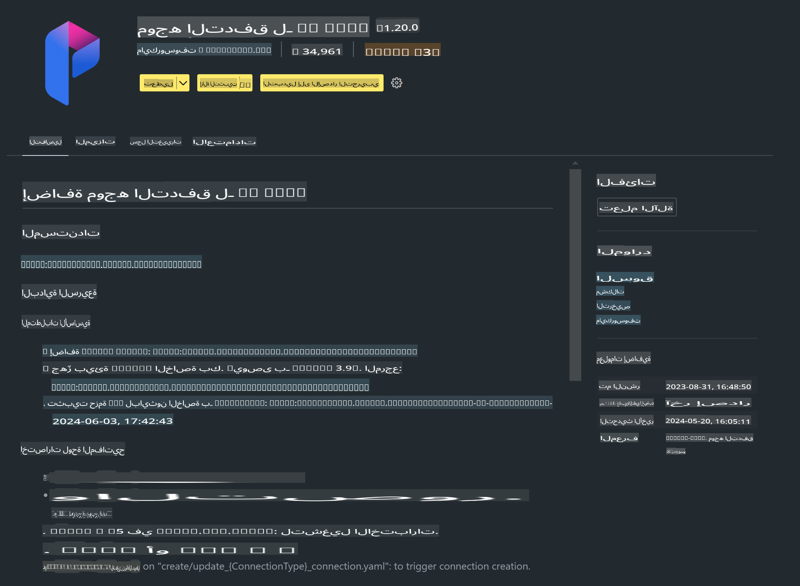

# **المختبر 0 - التثبيت**

عند دخولنا إلى المختبر، نحتاج إلى تهيئة البيئة المناسبة:

### **1. بايثون 3.11+**

يوصى باستخدام Miniforge لتهيئة بيئة بايثون الخاصة بك.

لتهيئة Miniforge، يرجى الرجوع إلى [https://github.com/conda-forge/miniforge](https://github.com/conda-forge/miniforge)

بعد تهيئة Miniforge، قم بتشغيل الأمر التالي في Power Shell:

```bash

conda create -n pyenv python==3.11.8 -y

conda activate pyenv

```

### **2. تثبيت Prompt flow SDK**

في المختبر 1، سنستخدم Prompt flow، لذا تحتاج إلى تهيئة Prompt flow SDK.

```bash

pip install promptflow --upgrade

```

يمكنك التحقق من promptflow sdk باستخدام هذا الأمر:

```bash

pf --version

```

### **3. تثبيت إضافة Visual Studio Code لـ Prompt flow**



### **4. إطار عمل MLX من Apple**

MLX هو إطار عمل للمصفوفات مخصص لأبحاث تعلم الآلة على معالجات Apple Silicon، تم تطويره بواسطة فريق أبحاث تعلم الآلة في Apple. يمكنك استخدام **إطار عمل Apple MLX** لتسريع LLM / SLM باستخدام معالجات Apple Silicon. إذا كنت ترغب في معرفة المزيد، يمكنك قراءة [https://github.com/microsoft/PhiCookBook/blob/main/md/01.Introduction/03/MLX_Inference.md](https://github.com/microsoft/PhiCookBook/blob/main/md/01.Introduction/03/MLX_Inference.md).

قم بتثبيت مكتبة MLX framework باستخدام bash:

```bash

pip install mlx-lm

```

### **5. مكتبات بايثون الأخرى**

قم بإنشاء ملف requirements.txt وأضف المحتوى التالي:

```txt

notebook
numpy 
scipy 
scikit-learn 
matplotlib 
pandas 
pillow 
graphviz

```

### **6. تثبيت NVM**

قم بتثبيت nvm باستخدام Powershell:

```bash

brew install nvm

```

ثم قم بتثبيت nodejs الإصدار 18.20:

```bash

nvm install 18.20.0

nvm use 18.20.0

```

### **7. تثبيت دعم التطوير لـ Visual Studio Code**

```bash

npm install --global yo generator-code

```

تهانينا! لقد قمت بتهيئة SDK بنجاح. الآن، انتقل إلى الخطوات العملية.

**إخلاء المسؤولية**:  
تم ترجمة هذا المستند باستخدام خدمات الترجمة الآلية المدعومة بالذكاء الاصطناعي. بينما نسعى لتحقيق الدقة، يرجى العلم أن الترجمات الآلية قد تحتوي على أخطاء أو معلومات غير دقيقة. يجب اعتبار المستند الأصلي بلغته الأصلية المصدر الرسمي. للحصول على معلومات حساسة أو مهمة، يُوصى بالاستعانة بترجمة بشرية احترافية. نحن غير مسؤولين عن أي سوء فهم أو تفسيرات خاطئة ناتجة عن استخدام هذه الترجمة.