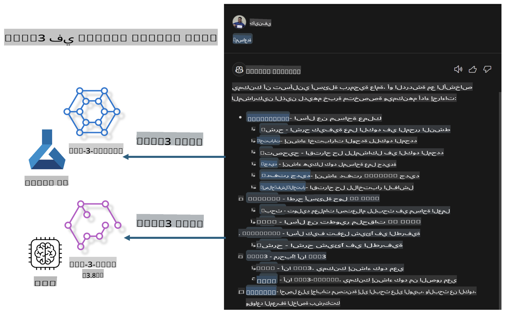

# **قم ببناء مساعد GitHub Copilot Chat الخاص بك باستخدام عائلة Microsoft Phi-3**

هل استخدمت وكيل مساحة العمل في GitHub Copilot Chat؟ هل ترغب في بناء وكيل الكود الخاص بفريقك؟ يهدف هذا المختبر العملي إلى دمج النموذج مفتوح المصدر لإنشاء وكيل أعمال كود على مستوى المؤسسة.

## **الأساسيات**

### **لماذا اختيار Microsoft Phi-3**

عائلة Phi-3 هي سلسلة تتضمن phi-3-mini، phi-3-small، وphi-3-medium، بناءً على معايير تدريب مختلفة لتوليد النصوص، إكمال الحوارات، وتوليد الأكواد. كما يوجد phi-3-vision القائم على الرؤية. هذا مناسب للمؤسسات أو الفرق المختلفة لإنشاء حلول AI توليدية تعمل دون اتصال.

ننصح بقراءة هذا الرابط [https://github.com/microsoft/PhiCookBook/blob/main/md/01.Introduction/01/01.PhiFamily.md](https://github.com/microsoft/PhiCookBook/blob/main/md/01.Introduction/01/01.PhiFamily.md)

### **GitHub Copilot Chat من Microsoft**

إضافة GitHub Copilot Chat تمنحك واجهة محادثة تتيح لك التفاعل مع GitHub Copilot والحصول على إجابات لأسئلة تتعلق بالكود مباشرة داخل VS Code، دون الحاجة إلى البحث في الوثائق أو المنتديات على الإنترنت.

قد يستخدم Copilot Chat ميزات مثل تمييز الصيغة، المسافات البادئة، وخصائص تنسيق أخرى لإضافة وضوح إلى الإجابة المولدة. بناءً على نوع السؤال المقدم من المستخدم، قد يحتوي الناتج على روابط للسياق الذي استخدمه Copilot في توليد الإجابة، مثل ملفات الكود المصدر أو الوثائق، أو أزرار للوصول إلى وظائف VS Code.

- يتكامل Copilot Chat مع تدفق عمل المطور ويمنحك المساعدة حيثما تحتاجها:

- ابدأ محادثة داخلية مباشرة من المحرر أو الطرفية للحصول على المساعدة أثناء كتابة الكود.

- استخدم عرض المحادثة لتكون لديك مساعد AI جاهز للمساعدة في أي وقت.

- أطلق Quick Chat لطرح سؤال سريع والعودة إلى عملك.

يمكنك استخدام GitHub Copilot Chat في سيناريوهات مختلفة، مثل:

- الإجابة على أسئلة الكود حول كيفية حل مشكلة معينة بأفضل طريقة.

- شرح كود شخص آخر واقتراح تحسينات.

- اقتراح إصلاحات للكود.

- توليد حالات اختبار الوحدة.

- إنشاء وثائق للكود.

ننصح بقراءة هذا الرابط [https://code.visualstudio.com/docs/copilot/copilot-chat](https://code.visualstudio.com/docs/copilot/copilot-chat?WT.mc_id=aiml-137032-kinfeylo)

### **GitHub Copilot Chat @workspace من Microsoft**

عند الإشارة إلى **@workspace** في Copilot Chat، يمكنك طرح أسئلة حول قاعدة الكود بأكملها. بناءً على السؤال، يسترجع Copilot بذكاء الملفات والرموز ذات الصلة، ثم يشير إليها في الإجابة كروابط وأمثلة كود.

للإجابة على سؤالك، يقوم **@workspace** بالبحث في نفس المصادر التي يستخدمها المطور عند التنقل في قاعدة الكود داخل VS Code:

- جميع الملفات في مساحة العمل، باستثناء الملفات التي يتم تجاهلها بواسطة ملف .gitignore.

- هيكل الدليل مع أسماء المجلدات والملفات المتداخلة.

- فهرس البحث في الكود الخاص بـ GitHub، إذا كانت مساحة العمل مستودعًا على GitHub ومفهرسة بواسطة البحث في الكود.

- الرموز والتعريفات في مساحة العمل.

- النصوص المحددة حاليًا أو النصوص المرئية في المحرر النشط.

ملاحظة: يتم تجاوز .gitignore إذا كان لديك ملف مفتوح أو نص محدد داخل ملف مُتجاهَل.

ننصح بقراءة هذا الرابط [[https://code.visualstudio.com/docs/copilot/copilot-chat](https://code.visualstudio.com/docs/copilot/workspace-context?WT.mc_id=aiml-137032-kinfeylo)]

## **تعرف أكثر على هذا المختبر**

لقد حسّن GitHub Copilot بشكل كبير من كفاءة البرمجة في المؤسسات، وكل مؤسسة تأمل في تخصيص الوظائف ذات الصلة بـ GitHub Copilot. قامت العديد من المؤسسات بتخصيص إضافات مشابهة لـ GitHub Copilot بناءً على سيناريوهات أعمالها الخاصة والنماذج مفتوحة المصدر. بالنسبة للمؤسسات، تكون الإضافات المخصصة أسهل في التحكم، ولكن هذا يؤثر أيضًا على تجربة المستخدم. في النهاية، يتمتع GitHub Copilot بوظائف أقوى في التعامل مع السيناريوهات العامة والاحترافية. إذا كان بالإمكان الحفاظ على تجربة متسقة، فسيكون من الأفضل تخصيص الإضافة الخاصة بالمؤسسة. يوفر GitHub Copilot Chat واجهات برمجية ذات صلة للمؤسسات للتوسع في تجربة المحادثة. الحفاظ على تجربة متسقة ووجود وظائف مخصصة يوفر تجربة مستخدم أفضل.

يستخدم هذا المختبر بشكل أساسي نموذج Phi-3 مع الجمع بين NPU المحلي وAzure الهجين لإنشاء وكيل مخصص في GitHub Copilot Chat ***@PHI3*** لمساعدة مطوري المؤسسات في إكمال توليد الأكواد ***(@PHI3 /gen)*** وتوليد الأكواد بناءً على الصور ***(@PHI3 /img)***.

### ***ملاحظة:*** 

يتم تنفيذ هذا المختبر حاليًا في AIPC من Intel CPU وApple Silicon. سنستمر في تحديث إصدار Qualcomm من NPU.

## **المختبر**

| الاسم | الوصف | AIPC | Apple |
| ------------ | ----------- | -------- |-------- |
| Lab0 - التثبيتات(✅) | تكوين وتثبيت البيئات والأدوات ذات الصلة | [اذهب](./HOL/AIPC/01.Installations.md) |[اذهب](./HOL/Apple/01.Installations.md) |
| Lab1 - تشغيل Prompt flow مع Phi-3-mini (✅) | الجمع بين AIPC / Apple Silicon، باستخدام NPU المحلي لإنشاء توليد أكواد من خلال Phi-3-mini | [اذهب](./HOL/AIPC/02.PromptflowWithNPU.md) |  [اذهب](./HOL/Apple/02.PromptflowWithMLX.md) |
| Lab2 - نشر Phi-3-vision على خدمة Azure Machine Learning(✅) | توليد الأكواد من خلال نشر Phi-3-vision image من كتالوج النماذج في Azure Machine Learning Service | [اذهب](./HOL/AIPC/03.DeployPhi3VisionOnAzure.md) |[اذهب](./HOL/Apple/03.DeployPhi3VisionOnAzure.md) |
| Lab3 - إنشاء وكيل @phi-3 في GitHub Copilot Chat(✅)  | إنشاء وكيل Phi-3 مخصص في GitHub Copilot Chat لإكمال توليد الأكواد، وتوليد الأكواد من الصور، وغيرها | [اذهب](./HOL/AIPC/04.CreatePhi3AgentInVSCode.md) | [اذهب](./HOL/Apple/04.CreatePhi3AgentInVSCode.md) |
| كود تجريبي (✅)  | تنزيل الكود التجريبي | [اذهب](../../../../../../../code/07.Lab/01/AIPC) | [اذهب](../../../../../../../code/07.Lab/01/Apple) |

## **المصادر**

1. Phi-3 Cookbook [https://github.com/microsoft/Phi-3CookBook](https://github.com/microsoft/Phi-3CookBook)

2. تعرف أكثر على GitHub Copilot [https://learn.microsoft.com/training/paths/copilot/](https://learn.microsoft.com/training/paths/copilot/?WT.mc_id=aiml-137032-kinfeylo)

3. تعرف أكثر على GitHub Copilot Chat [https://learn.microsoft.com/training/paths/accelerate-app-development-using-github-copilot/](https://learn.microsoft.com/training/paths/accelerate-app-development-using-github-copilot/?WT.mc_id=aiml-137032-kinfeylo)

4. تعرف أكثر على واجهات GitHub Copilot Chat API [https://code.visualstudio.com/api/extension-guides/chat](https://code.visualstudio.com/api/extension-guides/chat?WT.mc_id=aiml-137032-kinfeylo)

5. تعرف أكثر على Azure AI Foundry [https://learn.microsoft.com/training/paths/create-custom-copilots-ai-studio/](https://learn.microsoft.com/training/paths/create-custom-copilots-ai-studio/?WT.mc_id=aiml-137032-kinfeylo)

6. تعرف أكثر على كتالوج نماذج Azure AI Foundry [https://learn.microsoft.com/azure/ai-studio/how-to/model-catalog-overview](https://learn.microsoft.com/azure/ai-studio/how-to/model-catalog-overview)

**إخلاء المسؤولية**:  
تم ترجمة هذا المستند باستخدام خدمات الترجمة الآلية بالذكاء الاصطناعي. بينما نسعى جاهدين لتحقيق الدقة، يرجى العلم أن الترجمات الآلية قد تحتوي على أخطاء أو معلومات غير دقيقة. يجب اعتبار المستند الأصلي بلغته الأصلية هو المصدر الرسمي. بالنسبة للمعلومات الحساسة أو الهامة، يُوصى باللجوء إلى ترجمة بشرية احترافية. نحن غير مسؤولين عن أي سوء فهم أو تفسير خاطئ ناتج عن استخدام هذه الترجمة.