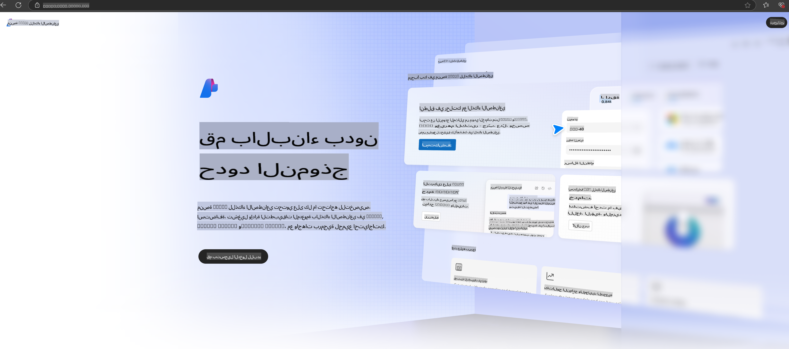

# **استخدام Phi-3 في Azure AI Foundry**

مع تطور الذكاء الاصطناعي التوليدي، نأمل في استخدام منصة موحدة لإدارة نماذج اللغة الكبيرة (LLM) والنماذج الصغيرة (SLM)، وتكامل بيانات المؤسسات، وعمليات التخصيص/استرجاع المعلومات (RAG)، وتقييم الأعمال المختلفة للمؤسسات بعد دمج LLM وSLM، وغيرها، بحيث يتم تنفيذ تطبيقات الذكاء الاصطناعي التوليدي بذكاء أكبر. [Azure AI Foundry](https://ai.azure.com) هي منصة تطبيقات ذكاء اصطناعي توليدي على مستوى المؤسسات.

مع Azure AI Foundry، يمكنك تقييم استجابات نماذج اللغة الكبيرة (LLM) وتنسيق مكونات التطبيقات القائمة على الأوامر لتحسين الأداء. تسهّل المنصة التوسع لتحويل إثبات المفاهيم إلى إنتاج متكامل بسهولة. كما أن المراقبة المستمرة والتحسين يدعمان النجاح طويل الأمد.

يمكننا نشر نموذج Phi-3 بسرعة على Azure AI Foundry من خلال خطوات بسيطة، ثم استخدام Azure AI Foundry لإكمال الأعمال المتعلقة بـ Phi-3 مثل Playground/Chat، التخصيص، التقييم، وغيرها.

## **1. التحضير**

إذا كنت قد قمت بالفعل بتثبيت [Azure Developer CLI](https://learn.microsoft.com/azure/developer/azure-developer-cli/overview?WT.mc_id=aiml-138114-kinfeylo) على جهازك، فإن استخدام هذا النموذج يكون بسيطًا مثل تشغيل هذا الأمر في دليل جديد.

## الإنشاء اليدوي

إنشاء مشروع ومركز Microsoft Azure AI Foundry هو طريقة رائعة لتنظيم وإدارة عملك في مجال الذكاء الاصطناعي. إليك دليل خطوة بخطوة للبدء:

### إنشاء مشروع في Azure AI Foundry

1. **اذهب إلى Azure AI Foundry**: قم بتسجيل الدخول إلى بوابة Azure AI Foundry.
2. **إنشاء مشروع**:
   - إذا كنت في مشروع بالفعل، اختر "Azure AI Foundry" في الزاوية العلوية اليسرى للصفحة للذهاب إلى الصفحة الرئيسية.
   - اختر "+ إنشاء مشروع".
   - أدخل اسمًا للمشروع.
   - إذا كان لديك مركز، سيتم اختياره افتراضيًا. إذا كنت تملك حق الوصول إلى أكثر من مركز، يمكنك اختيار مركز آخر من القائمة المنسدلة. إذا كنت ترغب في إنشاء مركز جديد، اختر "إنشاء مركز جديد" وأدخل اسمًا.
   - اختر "إنشاء".

### إنشاء مركز في Azure AI Foundry

1. **اذهب إلى Azure AI Foundry**: قم بتسجيل الدخول باستخدام حساب Azure الخاص بك.
2. **إنشاء مركز**:
   - اختر مركز الإدارة من القائمة اليسرى.
   - اختر "كل الموارد"، ثم السهم بجانب "+ مشروع جديد" واختر "+ مركز جديد".
   - في نافذة "إنشاء مركز جديد"، أدخل اسمًا للمركز (مثل contoso-hub) وقم بتعديل الحقول الأخرى حسب الحاجة.
   - اختر "التالي"، راجع المعلومات، ثم اختر "إنشاء".

لمزيد من التعليمات التفصيلية، يمكنك الرجوع إلى [وثائق Microsoft الرسمية](https://learn.microsoft.com/azure/ai-studio/how-to/create-projects).

بعد الإنشاء بنجاح، يمكنك الوصول إلى الاستوديو الذي قمت بإنشائه عبر [ai.azure.com](https://ai.azure.com/)

يمكن أن يكون هناك مشاريع متعددة على AI Foundry واحد. قم بإنشاء مشروع في AI Foundry كجزء من التحضير.

قم بإنشاء Azure AI Foundry [QuickStarts](https://learn.microsoft.com/azure/ai-studio/quickstarts/get-started-code)

## **2. نشر نموذج Phi في Azure AI Foundry**

اضغط على خيار Explore الخاص بالمشروع للدخول إلى كتالوج النماذج واختر Phi-3

اختر Phi-3-mini-4k-instruct

اضغط على 'نشر' لنشر نموذج Phi-3-mini-4k-instruct

> [!NOTE]
>
> يمكنك اختيار القدرة الحاسوبية عند النشر

## **3. Playground Chat Phi في Azure AI Foundry**

انتقل إلى صفحة النشر، اختر Playground، وابدأ المحادثة مع Phi-3 في Azure AI Foundry

## **4. نشر النموذج من Azure AI Foundry**

لنشر نموذج من كتالوج نماذج Azure، يمكنك اتباع الخطوات التالية:

- قم بتسجيل الدخول إلى Azure AI Foundry.
- اختر النموذج الذي تريد نشره من كتالوج نماذج Azure AI Foundry.
- في صفحة تفاصيل النموذج، اختر "نشر" ثم اختر "Serverless API with Azure AI Content Safety".
- اختر المشروع الذي تريد نشر نماذجك فيه. لاستخدام خيار Serverless API، يجب أن تكون مساحة العمل في منطقة East US 2 أو Sweden Central. يمكنك تخصيص اسم النشر.
- في معالج النشر، اختر "التسعير والشروط" لتتعرف على التسعير وشروط الاستخدام.
- اختر "نشر". انتظر حتى يصبح النشر جاهزًا ويتم إعادة توجيهك إلى صفحة النشرات.
- اختر "فتح في Playground" لبدء التفاعل مع النموذج.
- يمكنك العودة إلى صفحة النشرات، اختيار النشر، وتسجيل عنوان URL الهدف والمفتاح السري، الذي يمكنك استخدامه لاستدعاء النشر وإنشاء استجابات.
- يمكنك دائمًا العثور على تفاصيل عنوان URL ومفاتيح الوصول من خلال الانتقال إلى علامة تبويب "Build" واختيار "النشرات" من قسم "المكونات".

> [!NOTE]
> يرجى ملاحظة أن حسابك يجب أن يمتلك أذونات دور Azure AI Developer على مجموعة الموارد لتنفيذ هذه الخطوات.

## **5. استخدام واجهة Phi API في Azure AI Foundry**

يمكنك الوصول إلى https://{Your project name}.region.inference.ml.azure.com/swagger.json من خلال Postman GET ودمجه مع المفتاح لمعرفة الواجهات المتوفرة.

يمكنك الحصول على معلمات الطلب بسهولة، وكذلك معلمات الاستجابة.

**إخلاء المسؤولية**:  
تم ترجمة هذا المستند باستخدام خدمات ترجمة آلية تعتمد على الذكاء الاصطناعي. بينما نسعى لتحقيق الدقة، يُرجى العلم أن الترجمات الآلية قد تحتوي على أخطاء أو معلومات غير دقيقة. يجب اعتبار المستند الأصلي بلغته الأصلية هو المصدر الموثوق. للحصول على معلومات حاسمة، يُوصى بالاستعانة بترجمة بشرية احترافية. نحن غير مسؤولين عن أي سوء فهم أو تفسيرات خاطئة ناتجة عن استخدام هذه الترجمة.