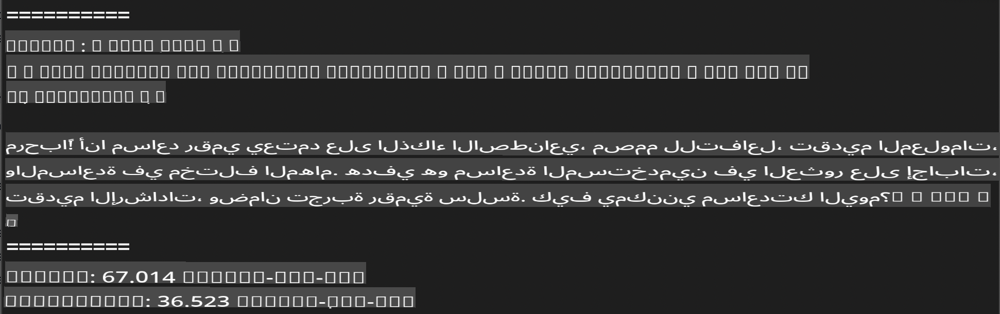
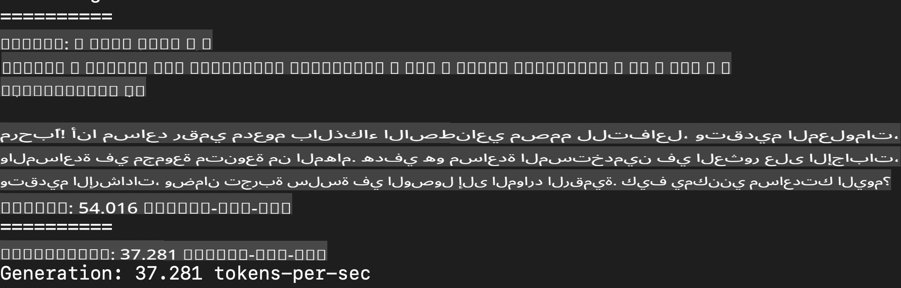
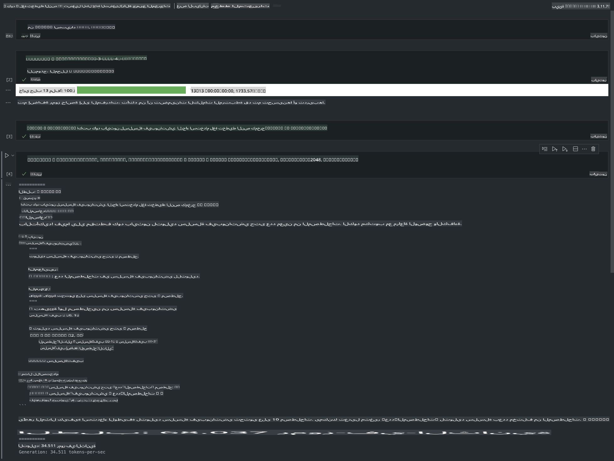

# **استنتاج Phi-3 باستخدام إطار عمل Apple MLX**

## **ما هو إطار عمل MLX**

MLX هو إطار عمل مخصص لأبحاث التعلم الآلي على معالجات Apple silicon، مقدم من فريق أبحاث التعلم الآلي في Apple.

تم تصميم MLX بواسطة باحثين في مجال التعلم الآلي ليلبي احتياجات الباحثين في هذا المجال. الإطار مصمم ليكون سهل الاستخدام، ولكنه فعال في تدريب النماذج ونشرها. كما أن تصميم الإطار نفسه بسيط من الناحية المفاهيمية. نهدف إلى تسهيل عملية التوسع والتحسين في MLX لمساعدة الباحثين على استكشاف الأفكار الجديدة بسرعة.

يمكن تسريع النماذج اللغوية الكبيرة (LLMs) على أجهزة Apple Silicon باستخدام MLX، ويمكن تشغيل النماذج محليًا بسهولة كبيرة.

## **استخدام MLX لاستنتاج Phi-3-mini**

### **1. إعداد بيئة MLX الخاصة بك**

1. Python 3.11.x  
2. تثبيت مكتبة MLX  

```bash

pip install mlx-lm

```

### **2. تشغيل Phi-3-mini في الطرفية باستخدام MLX**

```bash

python -m mlx_lm.generate --model microsoft/Phi-3-mini-4k-instruct --max-token 2048 --prompt  "<|user|>\nCan you introduce yourself<|end|>\n<|assistant|>"

```

النتيجة (بيئتي هي Apple M1 Max، ذاكرة 64GB) هي:



### **3. ضغط Phi-3-mini باستخدام MLX في الطرفية**

```bash

python -m mlx_lm.convert --hf-path microsoft/Phi-3-mini-4k-instruct

```

***ملاحظة:*** يمكن ضغط النموذج باستخدام mlx_lm.convert، والضغط الافتراضي هو INT4. في هذا المثال، يتم ضغط Phi-3-mini إلى INT4.

يمكن ضغط النموذج باستخدام mlx_lm.convert، والضغط الافتراضي هو INT4. هذا المثال يوضح كيفية ضغط Phi-3-mini إلى INT4. بعد الضغط، سيتم تخزين النموذج في المجلد الافتراضي ./mlx_model.

يمكننا اختبار النموذج المضغوط باستخدام MLX من خلال الطرفية.

```bash

python -m mlx_lm.generate --model ./mlx_model/ --max-token 2048 --prompt  "<|user|>\nCan you introduce yourself<|end|>\n<|assistant|>"

```

النتيجة هي:



### **4. تشغيل Phi-3-mini باستخدام MLX في Jupyter Notebook**



***ملاحظة:*** يرجى قراءة هذا المثال [اضغط على هذا الرابط](../../../../../code/03.Inference/MLX/MLX_DEMO.ipynb)

## **المصادر**

1. تعرف على إطار عمل Apple MLX [https://ml-explore.github.io](https://ml-explore.github.io/mlx/build/html/index.html)

2. مستودع Apple MLX على GitHub [https://github.com/ml-explore](https://github.com/ml-explore)

**إخلاء المسؤولية**:  
تمت ترجمة هذا المستند باستخدام خدمات الترجمة الآلية المدعومة بالذكاء الاصطناعي. على الرغم من أننا نسعى لتحقيق الدقة، يُرجى العلم أن الترجمات الآلية قد تحتوي على أخطاء أو معلومات غير دقيقة. يجب اعتبار المستند الأصلي بلغته الأصلية المصدر الموثوق. للحصول على معلومات حاسمة، يُوصى بالاستعانة بترجمة بشرية احترافية. نحن غير مسؤولين عن أي سوء فهم أو تفسيرات خاطئة ناتجة عن استخدام هذه الترجمة.