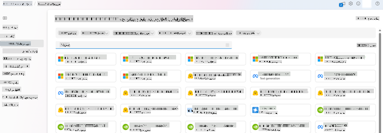
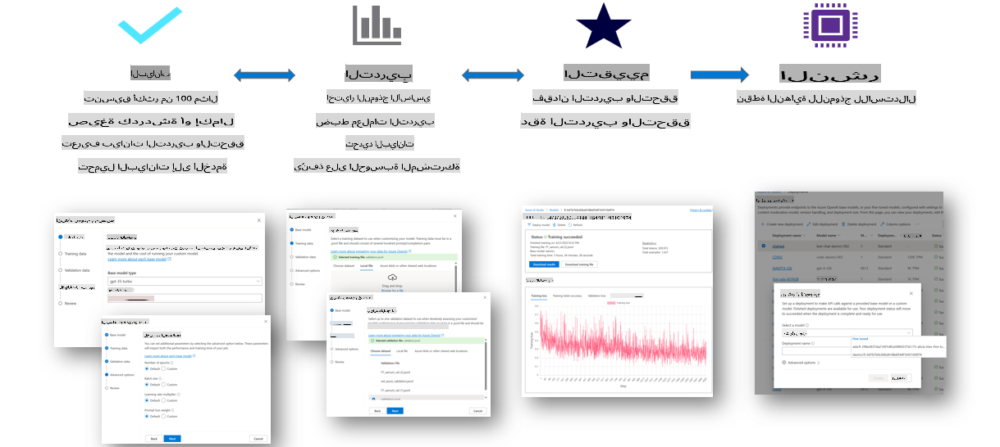
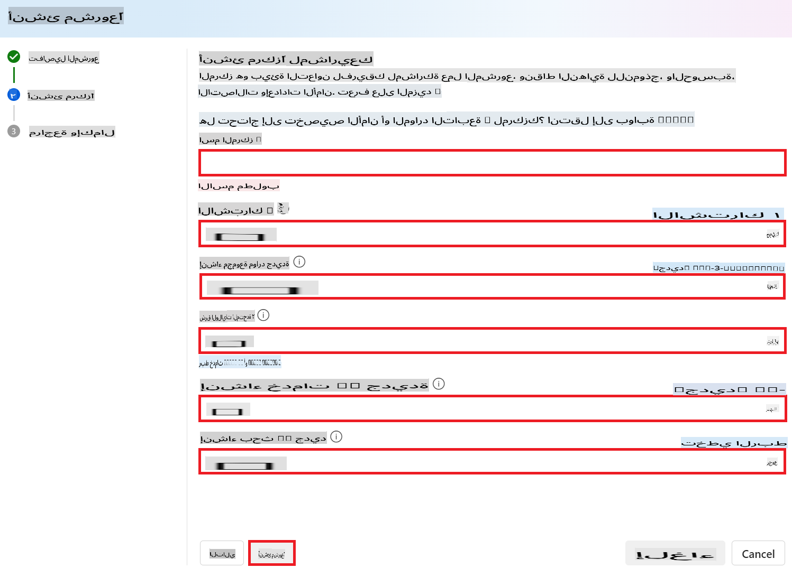
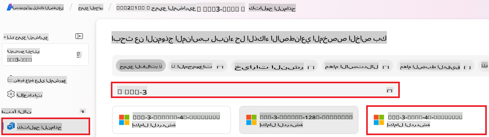
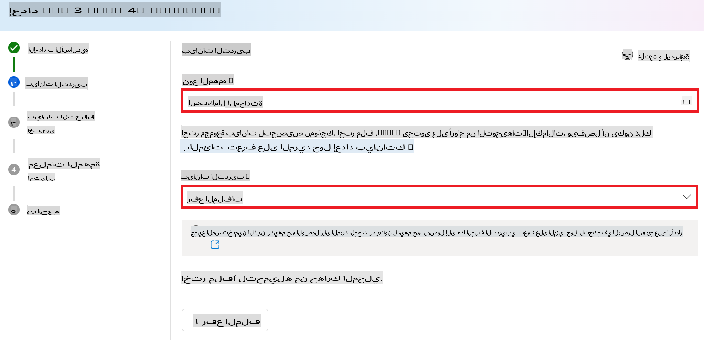
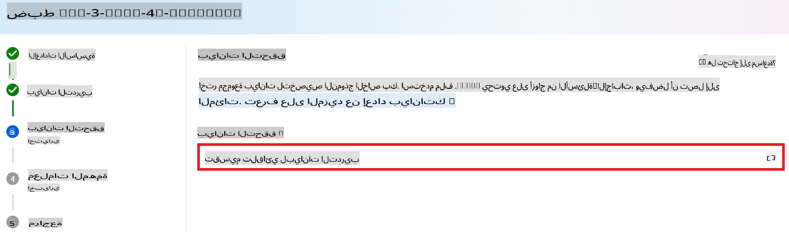
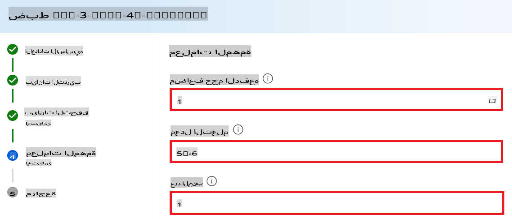
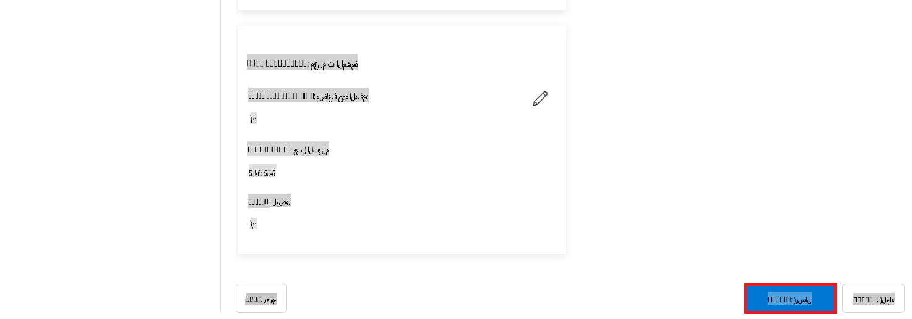
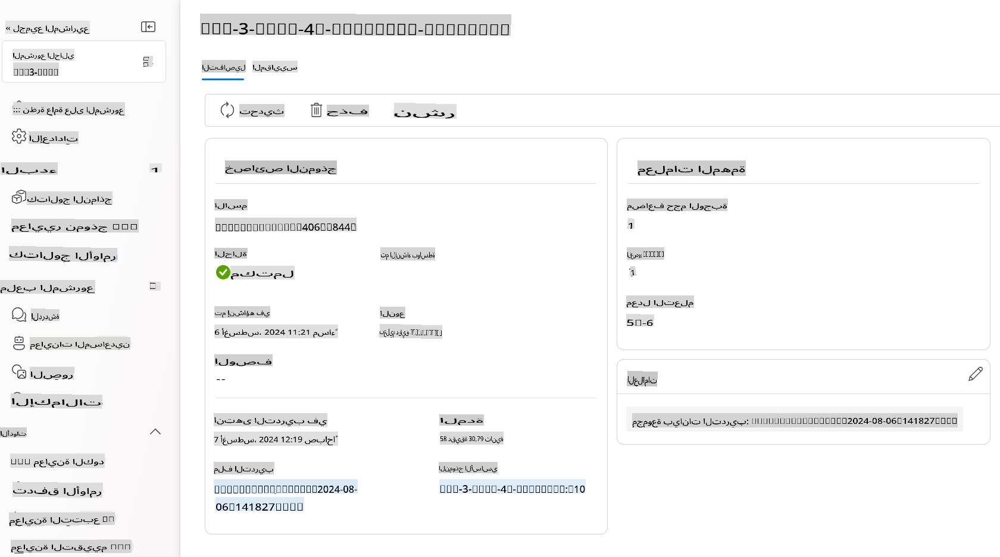

# تحسين Phi-3 باستخدام Azure AI Foundry

دعونا نستكشف كيفية تحسين نموذج اللغة Phi-3 Mini من مايكروسوفت باستخدام Azure AI Foundry. يتيح لك التحسين تخصيص Phi-3 Mini لمهام محددة، مما يجعله أكثر قوة ووعيًا بالسياق.

## الاعتبارات

- **الإمكانيات:** ما النماذج التي يمكن تحسينها؟ وما الذي يمكن للنموذج الأساسي القيام به بعد تحسينه؟
- **التكلفة:** ما هو نموذج التسعير لتحسين النماذج؟
- **إمكانية التخصيص:** إلى أي مدى يمكنني تعديل النموذج الأساسي – وبأي طرق؟
- **الراحة:** كيف يتم التحسين فعليًا – هل أحتاج إلى كتابة كود مخصص؟ هل أحتاج إلى توفير موارد الحوسبة بنفسي؟
- **الأمان:** النماذج المحسنة قد تواجه مخاطر أمان – هل هناك إجراءات حماية لمنع الأضرار غير المقصودة؟



## التحضير للتحسين

### المتطلبات الأساسية

> [!NOTE]
> بالنسبة لنماذج عائلة Phi-3، يتوفر عرض تحسين الدفع حسب الاستخدام فقط مع المحاور التي تم إنشاؤها في مناطق **East US 2**.

- اشتراك Azure. إذا لم يكن لديك اشتراك Azure، قم بإنشاء [حساب Azure مدفوع](https://azure.microsoft.com/pricing/purchase-options/pay-as-you-go) للبدء.

- مشروع [AI Foundry](https://ai.azure.com?WT.mc_id=aiml-138114-kinfeylo).
- يتم استخدام عناصر التحكم في الوصول المستندة إلى الدور في Azure (Azure RBAC) لمنح الوصول إلى العمليات في Azure AI Foundry. لتنفيذ الخطوات في هذه المقالة، يجب أن يكون حساب المستخدم الخاص بك معينًا بدور __Azure AI Developer__ على مجموعة الموارد.

### تسجيل مزود الاشتراك

تحقق من تسجيل الاشتراك مع مزود الموارد `Microsoft.Network`.

1. قم بتسجيل الدخول إلى [بوابة Azure](https://portal.azure.com).
1. اختر **الاشتراكات** من القائمة اليسرى.
1. اختر الاشتراك الذي ترغب في استخدامه.
1. اختر **إعدادات المشروع AI** > **موفرو الموارد** من القائمة اليسرى.
1. تأكد من أن **Microsoft.Network** موجود في قائمة موفري الموارد. إذا لم يكن موجودًا، قم بإضافته.

### تحضير البيانات

قم بإعداد بيانات التدريب والتحقق لتحسين النموذج. تتكون بيانات التدريب ومجموعات التحقق من أمثلة الإدخال والإخراج للطريقة التي ترغب في أن يعمل بها النموذج.

تأكد من أن جميع أمثلة التدريب تتبع التنسيق المتوقع للاستنتاج. لتحسين النماذج بفعالية، تأكد من أن البيانات متوازنة ومتنوعة.

يشمل ذلك الحفاظ على توازن البيانات، وتضمين سيناريوهات متنوعة، وتنقيح بيانات التدريب بشكل دوري لتتماشى مع التوقعات الواقعية، مما يؤدي في النهاية إلى استجابات نموذجية أكثر دقة وتوازنًا.

تتطلب أنواع النماذج المختلفة تنسيقات مختلفة لبيانات التدريب.

### استكمال المحادثة

يجب أن تكون بيانات التدريب والتحقق التي تستخدمها **منسقة** كوثيقة JSON Lines (JSONL). بالنسبة لـ `Phi-3-mini-128k-instruct` يجب أن تكون مجموعة بيانات التحسين منسقة بالتنسيق الحواري المستخدم بواسطة واجهة برمجة التطبيقات لاستكمال المحادثات.

### مثال على تنسيق الملف

```json
    {"messages": [{"role": "system", "content": "You are an Xbox customer support agent whose primary goal is to help users with issues they are experiencing with their Xbox devices. You are friendly and concise. You only provide factual answers to queries, and do not provide answers that are not related to Xbox."}, {"role": "user", "content": "Is Xbox better than PlayStation?"}, {"role": "assistant", "content": "I apologize, but I cannot provide personal opinions. My primary job is to assist you with any issues related to your Xbox device. Do you have any Xbox-related issues that need addressing?"}]}
    {"messages": [{"role": "system", "content": "You are an Xbox customer support agent whose primary goal is to help users with issues they are experiencing with their Xbox devices. You are friendly and concise. You only provide factual answers to queries, and do not provide answers that are not related to Xbox."}, {"role": "user", "content": "Can I play PC games on my Xbox?"}, {"role": "assistant", "content": "While Xbox consoles don't natively support PC games, they can play an array of Xbox games, many of which are also available on PC. Can I assist you with finding games compatible with your Xbox device?"}]}
    {"messages": [{"role": "system", "content": "You are an Xbox customer support agent whose primary goal is to help users with issues they are experiencing with their Xbox devices. You are friendly and concise. You only provide factual answers to queries, and do not provide answers that are not related to Xbox."}, {"role": "user", "content": "I'm having trouble connecting my Xbox to the Wi-Fi."}, {"role": "assistant", "content": "No worries, let's go through the network settings on your Xbox. Can you please tell me what happens when you try to connect it to the Wi-Fi?"}]}
```

النوع المدعوم للملف هو JSON Lines. يتم تحميل الملفات إلى مخزن البيانات الافتراضي وتصبح متاحة في مشروعك.

## تحسين Phi-3 باستخدام Azure AI Foundry

تتيح لك Azure AI Foundry تخصيص نماذج اللغة الكبيرة لمجموعات البيانات الخاصة بك باستخدام عملية تُعرف باسم التحسين. يوفر التحسين قيمة كبيرة من خلال التخصيص والتحسين لمهام وتطبيقات محددة. يؤدي ذلك إلى تحسين الأداء، وزيادة الكفاءة من حيث التكلفة، وتقليل التأخير، وإنتاج مخرجات مخصصة.



### إنشاء مشروع جديد

1. قم بتسجيل الدخول إلى [Azure AI Foundry](https://ai.azure.com).

1. اختر **+مشروع جديد** لإنشاء مشروع جديد في Azure AI Foundry.

    

1. قم بالمهام التالية:

    - اسم المشروع **اسم المحور**. يجب أن يكون قيمة فريدة.
    - اختر **المحور** الذي ترغب في استخدامه (قم بإنشاء واحد جديد إذا لزم الأمر).

    

1. قم بالمهام التالية لإنشاء محور جديد:

    - أدخل **اسم المحور**. يجب أن يكون قيمة فريدة.
    - اختر اشتراك Azure الخاص بك.
    - اختر **مجموعة الموارد** التي ترغب في استخدامها (قم بإنشاء واحدة جديدة إذا لزم الأمر).
    - اختر **الموقع** الذي ترغب في استخدامه.
    - اختر **الاتصال بخدمات Azure AI** التي ترغب في استخدامها (قم بإنشاء واحدة جديدة إذا لزم الأمر).
    - اختر **الاتصال بـ Azure AI Search** إلى **تخطي الاتصال**.

    

1. اختر **التالي**.
1. اختر **إنشاء مشروع**.

### تحضير البيانات

قبل التحسين، اجمع أو أنشئ مجموعة بيانات ذات صلة بمهمتك، مثل تعليمات الدردشة، أزواج الأسئلة والإجابات، أو أي نصوص أخرى ذات صلة. قم بتنظيف هذه البيانات ومعالجتها مسبقًا من خلال إزالة الضوضاء، ومعالجة القيم المفقودة، وتقسيم النصوص.

### تحسين نماذج Phi-3 في Azure AI Foundry

> [!NOTE]
> يتم دعم تحسين نماذج Phi-3 حاليًا في المشاريع الموجودة في منطقة East US 2.

1. اختر **كتالوج النماذج** من علامة التبويب الجانبية اليسرى.

1. اكتب *phi-3* في **شريط البحث** واختر نموذج phi-3 الذي ترغب في استخدامه.

    

1. اختر **تحسين**.

    

1. أدخل **اسم النموذج المحسن**.

    

1. اختر **التالي**.

1. قم بالمهام التالية:

    - اختر **نوع المهمة** إلى **استكمال المحادثة**.
    - اختر **بيانات التدريب** التي ترغب في استخدامها. يمكنك تحميلها من بيانات Azure AI Foundry أو من بيئتك المحلية.

    

1. اختر **التالي**.

1. قم بتحميل **بيانات التحقق** التي ترغب في استخدامها، أو يمكنك اختيار **التقسيم التلقائي لبيانات التدريب**.

    

1. اختر **التالي**.

1. قم بالمهام التالية:

    - اختر **مضاعف حجم الدفعة** الذي ترغب في استخدامه.
    - اختر **معدل التعلم** الذي ترغب في استخدامه.
    - اختر **عدد العصور** الذي ترغب في استخدامه.

    

1. اختر **إرسال** لبدء عملية التحسين.

    

1. بمجرد تحسين النموذج الخاص بك، سيتم عرض الحالة كـ **مكتمل**، كما هو موضح في الصورة أدناه. الآن يمكنك نشر النموذج واستخدامه في تطبيقك الخاص، في بيئة التجربة، أو في تدفق الأوامر. لمزيد من المعلومات، راجع [كيفية نشر نماذج Phi-3 الصغيرة باستخدام Azure AI Foundry](https://learn.microsoft.com/azure/ai-studio/how-to/deploy-models-phi-3?tabs=phi-3-5&pivots=programming-language-python).

    

> [!NOTE]
> لمزيد من المعلومات التفصيلية حول تحسين Phi-3، يرجى زيارة [تحسين نماذج Phi-3 في Azure AI Foundry](https://learn.microsoft.com/azure/ai-studio/how-to/fine-tune-phi-3?tabs=phi-3-mini).

## تنظيف النماذج المحسنة

يمكنك حذف نموذج محسّن من قائمة النماذج المحسنة في [Azure AI Foundry](https://ai.azure.com) أو من صفحة تفاصيل النموذج. اختر النموذج المحسن المراد حذفه من صفحة التحسين، ثم اختر زر الحذف لحذف النموذج المحسن.

> [!NOTE]
> لا يمكنك حذف نموذج مخصص إذا كان لديه نشر قائم. يجب أولاً حذف نشر النموذج الخاص بك قبل أن تتمكن من حذف النموذج المخصص.

## التكلفة والحصص

### اعتبارات التكلفة والحصص لنماذج Phi-3 المحسنة كخدمة

تُقدم نماذج Phi المحسنة كخدمة من قبل مايكروسوفت وتتكامل مع Azure AI Foundry للاستخدام. يمكنك العثور على الأسعار عند [النشر](https://learn.microsoft.com/azure/ai-studio/how-to/deploy-models-phi-3?tabs=phi-3-5&pivots=programming-language-python) أو تحسين النماذج ضمن علامة تبويب الأسعار والشروط في معالج النشر.

## تصفية المحتوى

النماذج المنشورة كخدمة مع الدفع حسب الاستخدام محمية بواسطة Azure AI Content Safety. عند نشرها على نقاط نهاية في الوقت الفعلي، يمكنك اختيار إلغاء الاشتراك في هذه الميزة. مع تمكين Azure AI Content Safety، تمر كل من الأوامر والإجابات عبر مجموعة من نماذج التصنيف التي تهدف إلى الكشف عن المحتوى الضار ومنعه. يقوم نظام تصفية المحتوى بالكشف واتخاذ الإجراءات على فئات محددة من المحتوى الضار المحتمل في كل من الأوامر المدخلة والإجابات المخرجة. تعرف على المزيد حول [Azure AI Content Safety](https://learn.microsoft.com/azure/ai-studio/concepts/content-filtering).

**إعداد التحسين**

المعلمات الفائقة: حدد معلمات مثل معدل التعلم، حجم الدفعة، وعدد العصور التدريبية.

**دالة الخسارة**

اختر دالة خسارة مناسبة لمهمتك (مثل cross-entropy).

**المحسّن**

اختر محسّنًا (مثل Adam) لتحديثات التدرج أثناء التدريب.

**عملية التحسين**

- تحميل النموذج المدرب مسبقًا: قم بتحميل نقطة تفتيش Phi-3 Mini.
- إضافة طبقات مخصصة: أضف طبقات مخصصة للمهام (مثل رأس التصنيف لتعليمات الدردشة).

**تدريب النموذج**
قم بتحسين النموذج باستخدام مجموعة البيانات الخاصة بك. راقب تقدم التدريب وقم بضبط المعلمات حسب الحاجة.

**التقييم والتحقق**

مجموعة التحقق: قم بتقسيم البيانات إلى مجموعات تدريب وتحقق.

**تقييم الأداء**

استخدم مقاييس مثل الدقة، درجة F1، أو الالتباس لتقييم أداء النموذج.

## حفظ النموذج المحسن

**نقطة تفتيش**
احفظ نقطة تفتيش النموذج المحسن لاستخدامها لاحقًا.

## النشر

- نشر كخدمة ويب: قم بنشر النموذج المحسن كخدمة ويب في Azure AI Foundry.
- اختبار نقطة النهاية: أرسل استفسارات اختبار إلى نقطة النهاية المنشورة للتحقق من وظيفتها.

## التكرار والتحسين

كرر: إذا لم يكن الأداء مرضيًا، قم بالتكرار من خلال ضبط المعلمات، إضافة المزيد من البيانات، أو تحسين النموذج لفترات إضافية.

## المراقبة والتنقيح

راقب باستمرار سلوك النموذج وقم بتنقيحه حسب الحاجة.

## التخصيص والتوسيع

المهام المخصصة: يمكن تحسين Phi-3 Mini لمهام مختلفة تتجاوز تعليمات الدردشة. استكشف استخدامات أخرى!
التجربة: جرّب معماريات مختلفة، مجموعات طبقات، وتقنيات لتحسين الأداء.

> [!NOTE]
> التحسين هو عملية تكرارية. جرب، تعلم، وخصص النموذج لتحقيق أفضل النتائج لمهمتك المحددة!

**إخلاء المسؤولية**:  
تمت ترجمة هذا المستند باستخدام خدمات الترجمة الآلية المعتمدة على الذكاء الاصطناعي. بينما نسعى لتحقيق الدقة، يُرجى العلم أن الترجمات الآلية قد تحتوي على أخطاء أو معلومات غير دقيقة. يجب اعتبار المستند الأصلي بلغته الأصلية هو المصدر الموثوق. للحصول على معلومات حاسمة، يُوصى بالاستعانة بترجمة بشرية احترافية. نحن غير مسؤولين عن أي سوء فهم أو تفسيرات خاطئة ناتجة عن استخدام هذه الترجمة.