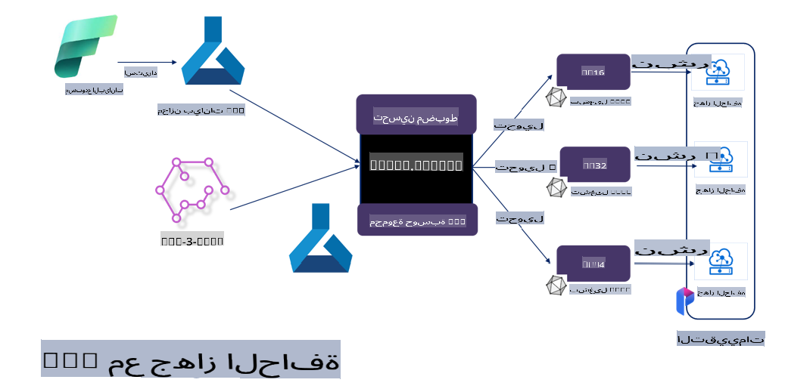

# **ضبط Phi-3 باستخدام Microsoft Olive**

[Olive](https://github.com/microsoft/OLive?WT.mc_id=aiml-138114-kinfeylo) هو أداة سهلة الاستخدام لتحسين النماذج مع مراعاة العتاد، تجمع بين تقنيات رائدة في الصناعة في ضغط النماذج، تحسينها، وتجميعها.

تم تصميم Olive لتبسيط عملية تحسين نماذج التعلم الآلي، مما يضمن تحقيق الاستفادة القصوى من بنى العتاد المحددة.

سواء كنت تعمل على تطبيقات سحابية أو أجهزة طرفية، فإن Olive يمكّنك من تحسين نماذجك بسهولة وفعالية.

## الميزات الرئيسية:
- يجمع Olive بين تقنيات تحسين مختلفة ويقوم بأتمتتها لتلائم أهداف العتاد المطلوبة.
- نظرًا لعدم وجود تقنية تحسين واحدة تناسب جميع السيناريوهات، يتيح Olive التوسع من خلال تمكين خبراء الصناعة من إدخال ابتكاراتهم في مجال التحسين.

## تقليل الجهد الهندسي:
- غالبًا ما يحتاج المطورون إلى تعلم واستخدام العديد من سلاسل الأدوات الخاصة بمزودي العتاد لتحضير النماذج المدربة ونشرها.
- يبسط Olive هذه التجربة من خلال أتمتة تقنيات التحسين للعتاد المطلوب.

## حل جاهز وشامل لتحسين النماذج:

من خلال دمج وضبط التقنيات المتكاملة، يقدم Olive حلاً موحدًا لتحسين النماذج من البداية إلى النهاية.
يأخذ في الاعتبار القيود مثل الدقة وزمن الاستجابة أثناء تحسين النماذج.

## استخدام Microsoft Olive لضبط النماذج

Microsoft Olive هو أداة مفتوحة المصدر وسهلة الاستخدام لتحسين النماذج، تغطي ضبط النماذج والمرجعية في مجال الذكاء الاصطناعي التوليدي. يتطلب فقط إعدادات بسيطة، وبالاقتران مع استخدام نماذج لغة مفتوحة المصدر وبيئات تشغيل ذات صلة (AzureML / GPU محلي، CPU، DirectML)، يمكنك إكمال ضبط النماذج أو استخدامها كمرجع من خلال التحسين التلقائي، والعثور على أفضل نموذج للنشر على السحابة أو على الأجهزة الطرفية. يسمح للشركات ببناء نماذجها الخاصة لقطاعات الصناعة على الأرض وفي السحابة.


## ضبط Phi-3 باستخدام Microsoft Olive 



## كود ومثال لضبط Phi-3 باستخدام Olive
في هذا المثال ستستخدم Olive للقيام بما يلي:

- ضبط محول LoRA لتصنيف العبارات إلى حزن، فرح، خوف، مفاجأة.
- دمج أوزان المحول في النموذج الأساسي.
- تحسين وتكميم النموذج إلى int4.

[كود المثال](../../code/03.Finetuning/olive-ort-example/README.md)

### إعداد Microsoft Olive

تثبيت Microsoft Olive بسيط جدًا، ويمكن تثبيته لاستخدام CPU، GPU، DirectML، وAzure ML

```bash
pip install olive-ai
```

إذا كنت ترغب في تشغيل نموذج ONNX باستخدام CPU، يمكنك استخدام:

```bash
pip install olive-ai[cpu]
```

إذا كنت ترغب في تشغيل نموذج ONNX باستخدام GPU، يمكنك استخدام:

```python
pip install olive-ai[gpu]
```

إذا كنت تريد استخدام Azure ML، استخدم:

```python
pip install git+https://github.com/microsoft/Olive#egg=olive-ai[azureml]
```

**ملاحظة**
متطلبات نظام التشغيل: Ubuntu 20.04 / 22.04 

### **ملف Config.json الخاص بـ Microsoft Olive**

بعد التثبيت، يمكنك تكوين إعدادات محددة للنموذج من خلال ملف الإعدادات، بما في ذلك البيانات، الحوسبة، التدريب، النشر، وتوليد النموذج.

**1. البيانات**

يدعم Microsoft Olive التدريب على البيانات المحلية وبيانات السحابة، ويمكن تكوين ذلك في الإعدادات.

*إعدادات البيانات المحلية*

يمكنك إعداد مجموعة البيانات التي تحتاجها للتدريب على الضبط بسهولة، عادةً بصيغة json، وتكييفها مع قالب البيانات. يجب تعديل ذلك بناءً على متطلبات النموذج (على سبيل المثال، تكييفه مع الصيغة المطلوبة لـ Microsoft Phi-3-mini. إذا كان لديك نماذج أخرى، يرجى الرجوع إلى صيغ الضبط المطلوبة للنماذج الأخرى).

```json

    "data_configs": [
        {
            "name": "dataset_default_train",
            "type": "HuggingfaceContainer",
            "load_dataset_config": {
                "params": {
                    "data_name": "json", 
                    "data_files":"dataset/dataset-classification.json",
                    "split": "train"
                }
            },
            "pre_process_data_config": {
                "params": {
                    "dataset_type": "corpus",
                    "text_cols": [
                            "phrase",
                            "tone"
                    ],
                    "text_template": "### Text: {phrase}\n### The tone is:\n{tone}",
                    "corpus_strategy": "join",
                    "source_max_len": 2048,
                    "pad_to_max_len": false,
                    "use_attention_mask": false
                }
            }
        }
    ],
```

**إعدادات مصدر بيانات السحابة**

من خلال ربط مستودع البيانات الخاص بـ Azure AI Studio / Azure Machine Learning Service، يمكنك ربط البيانات الموجودة في السحابة واختيار إدخال مصادر بيانات مختلفة إلى Azure AI Studio / Azure Machine Learning Service عبر Microsoft Fabric وAzure Data لدعم ضبط البيانات.

```json

    "data_configs": [
        {
            "name": "dataset_default_train",
            "type": "HuggingfaceContainer",
            "load_dataset_config": {
                "params": {
                    "data_name": "json", 
                    "data_files": {
                        "type": "azureml_datastore",
                        "config": {
                            "azureml_client": {
                                "subscription_id": "Your Azure Subscrition ID",
                                "resource_group": "Your Azure Resource Group",
                                "workspace_name": "Your Azure ML Workspaces name"
                            },
                            "datastore_name": "workspaceblobstore",
                            "relative_path": "Your train_data.json Azure ML Location"
                        }
                    },
                    "split": "train"
                }
            },
            "pre_process_data_config": {
                "params": {
                    "dataset_type": "corpus",
                    "text_cols": [
                            "Question",
                            "Best Answer"
                    ],
                    "text_template": "<|user|>\n{Question}<|end|>\n<|assistant|>\n{Best Answer}\n<|end|>",
                    "corpus_strategy": "join",
                    "source_max_len": 2048,
                    "pad_to_max_len": false,
                    "use_attention_mask": false
                }
            }
        }
    ],
    
```

**2. إعدادات الحوسبة**

إذا كنت بحاجة إلى العمل محليًا، يمكنك استخدام موارد البيانات المحلية مباشرةً. إذا كنت بحاجة إلى استخدام موارد Azure AI Studio / Azure Machine Learning Service، يجب تكوين المعلمات ذات الصلة مثل اسم القدرة الحاسوبية.

```json

    "systems": {
        "aml": {
            "type": "AzureML",
            "config": {
                "accelerators": ["gpu"],
                "hf_token": true,
                "aml_compute": "Your Azure AI Studio / Azure Machine Learning Service Compute Name",
                "aml_docker_config": {
                    "base_image": "Your Azure AI Studio / Azure Machine Learning Service docker",
                    "conda_file_path": "conda.yaml"
                }
            }
        },
        "azure_arc": {
            "type": "AzureML",
            "config": {
                "accelerators": ["gpu"],
                "aml_compute": "Your Azure AI Studio / Azure Machine Learning Service Compute Name",
                "aml_docker_config": {
                    "base_image": "Your Azure AI Studio / Azure Machine Learning Service docker",
                    "conda_file_path": "conda.yaml"
                }
            }
        }
    },
```

***ملاحظة***

نظرًا لأن التنفيذ يتم من خلال حاوية على Azure AI Studio / Azure Machine Learning Service، يجب تكوين البيئة المطلوبة. يتم ذلك في بيئة conda.yaml.

```yaml

name: project_environment
channels:
  - defaults
dependencies:
  - python=3.8.13
  - pip=22.3.1
  - pip:
      - einops
      - accelerate
      - azure-keyvault-secrets
      - azure-identity
      - bitsandbytes
      - datasets
      - huggingface_hub
      - peft
      - scipy
      - sentencepiece
      - torch>=2.2.0
      - transformers
      - git+https://github.com/microsoft/Olive@jiapli/mlflow_loading_fix#egg=olive-ai[gpu]
      - --extra-index-url https://aiinfra.pkgs.visualstudio.com/PublicPackages/_packaging/ORT-Nightly/pypi/simple/ 
      - ort-nightly-gpu==1.18.0.dev20240307004
      - --extra-index-url https://aiinfra.pkgs.visualstudio.com/PublicPackages/_packaging/onnxruntime-genai/pypi/simple/
      - onnxruntime-genai-cuda

    

```

**3. اختيار نموذج SLM**

يمكنك استخدام النموذج مباشرة من Hugging Face، أو دمجه مع Model Catalog الخاص بـ Azure AI Studio / Azure Machine Learning لاختيار النموذج الذي تريد استخدامه. في مثال الكود أدناه، سنستخدم Microsoft Phi-3-mini كمثال.

إذا كان لديك النموذج محليًا، يمكنك استخدام هذه الطريقة:

```json

    "input_model":{
        "type": "PyTorchModel",
        "config": {
            "hf_config": {
                "model_name": "model-cache/microsoft/phi-3-mini",
                "task": "text-generation",
                "model_loading_args": {
                    "trust_remote_code": true
                }
            }
        }
    },
```

إذا كنت ترغب في استخدام نموذج من Azure AI Studio / Azure Machine Learning Service، يمكنك استخدام هذه الطريقة:

```json

    "input_model":{
        "type": "PyTorchModel",
        "config": {
            "model_path": {
                "type": "azureml_registry_model",
                "config": {
                    "name": "microsoft/Phi-3-mini-4k-instruct",
                    "registry_name": "azureml-msr",
                    "version": "11"
                }
            },
             "model_file_format": "PyTorch.MLflow",
             "hf_config": {
                "model_name": "microsoft/Phi-3-mini-4k-instruct",
                "task": "text-generation",
                "from_pretrained_args": {
                    "trust_remote_code": true
                }
            }
        }
    },
```

**ملاحظة:**
يجب دمج النموذج مع Azure AI Studio / Azure Machine Learning Service، لذا عند إعداد النموذج، يرجى الرجوع إلى رقم الإصدار والتسمية ذات الصلة.

جميع النماذج على Azure يجب أن يتم إعدادها باستخدام PyTorch.MLflow.

يجب أن يكون لديك حساب على Hugging Face وربط المفتاح بقيمة المفتاح الخاصة بـ Azure AI Studio / Azure Machine Learning.

**4. الخوارزمية**

تقوم Microsoft Olive بتغليف خوارزميات ضبط Lora وQLora بشكل جيد جدًا. كل ما عليك فعله هو تكوين بعض المعلمات ذات الصلة. هنا سأستخدم QLora كمثال.

```json
        "lora": {
            "type": "LoRA",
            "config": {
                "target_modules": [
                    "o_proj",
                    "qkv_proj"
                ],
                "double_quant": true,
                "lora_r": 64,
                "lora_alpha": 64,
                "lora_dropout": 0.1,
                "train_data_config": "dataset_default_train",
                "eval_dataset_size": 0.3,
                "training_args": {
                    "seed": 0,
                    "data_seed": 42,
                    "per_device_train_batch_size": 1,
                    "per_device_eval_batch_size": 1,
                    "gradient_accumulation_steps": 4,
                    "gradient_checkpointing": false,
                    "learning_rate": 0.0001,
                    "num_train_epochs": 3,
                    "max_steps": 10,
                    "logging_steps": 10,
                    "evaluation_strategy": "steps",
                    "eval_steps": 187,
                    "group_by_length": true,
                    "adam_beta2": 0.999,
                    "max_grad_norm": 0.3
                }
            }
        },
```

إذا كنت تريد تحويل التكميم، فإن الفرع الرئيسي لـ Microsoft Olive يدعم بالفعل طريقة onnxruntime-genai. يمكنك إعدادها حسب احتياجاتك:

1. دمج أوزان المحول في النموذج الأساسي.
2. تحويل النموذج إلى نموذج ONNX بالدقة المطلوبة باستخدام ModelBuilder.

على سبيل المثال، التحويل إلى INT4 مكمي:

```json

        "merge_adapter_weights": {
            "type": "MergeAdapterWeights"
        },
        "builder": {
            "type": "ModelBuilder",
            "config": {
                "precision": "int4"
            }
        }
```

**ملاحظة** 
- إذا كنت تستخدم QLoRA، فإن تحويل التكميم باستخدام ONNXRuntime-genai غير مدعوم حاليًا.

- يجب الإشارة هنا إلى أنه يمكنك إعداد الخطوات أعلاه حسب احتياجاتك. ليس من الضروري إعداد كل الخطوات المذكورة أعلاه بالكامل. حسب احتياجاتك، يمكنك استخدام خطوات الخوارزمية مباشرةً دون ضبط. في النهاية، تحتاج إلى تكوين المحركات ذات الصلة.

```json

    "engine": {
        "log_severity_level": 0,
        "host": "aml",
        "target": "aml",
        "search_strategy": false,
        "execution_providers": ["CUDAExecutionProvider"],
        "cache_dir": "../model-cache/models/phi3-finetuned/cache",
        "output_dir" : "../model-cache/models/phi3-finetuned"
    }
```

**5. الانتهاء من الضبط**

على سطر الأوامر، قم بتنفيذ الأمر في دليل olive-config.json:

```bash
olive run --config olive-config.json  
```

**إخلاء مسؤولية**:  
تمت ترجمة هذا المستند باستخدام خدمات ترجمة آلية تعتمد على الذكاء الاصطناعي. في حين أننا نسعى لتحقيق الدقة، يرجى العلم بأن الترجمات الآلية قد تحتوي على أخطاء أو عدم دقة. يجب اعتبار المستند الأصلي بلغته الأصلية المصدر الموثوق. للحصول على معلومات حساسة أو هامة، يُوصى بالاستعانة بترجمة بشرية احترافية. نحن غير مسؤولين عن أي سوء فهم أو تفسير خاطئ ناتج عن استخدام هذه الترجمة.