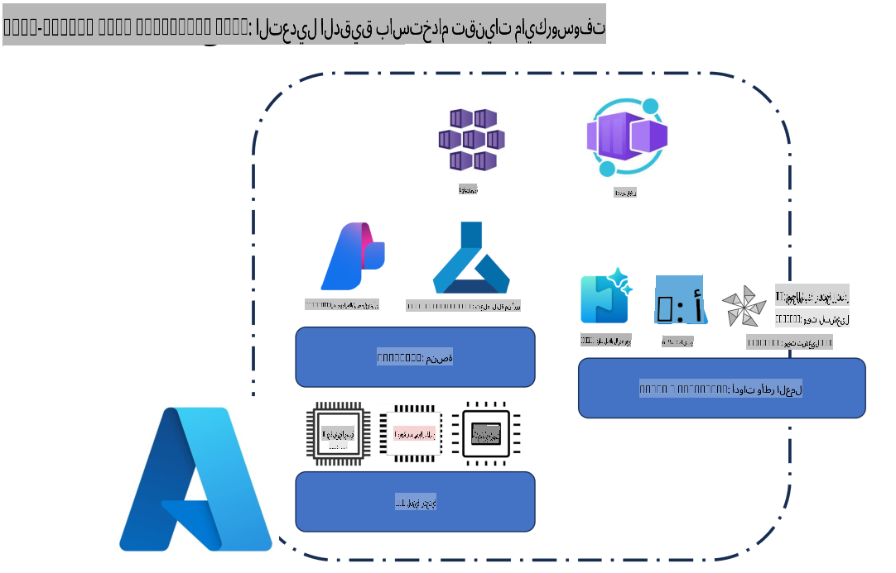
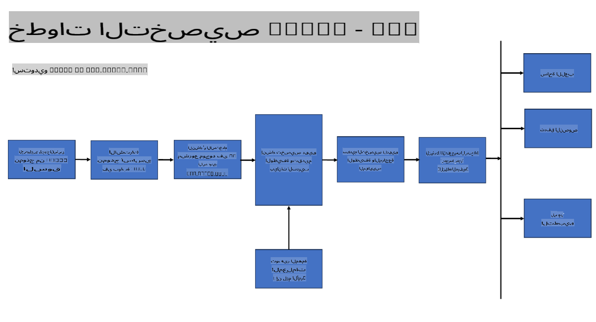
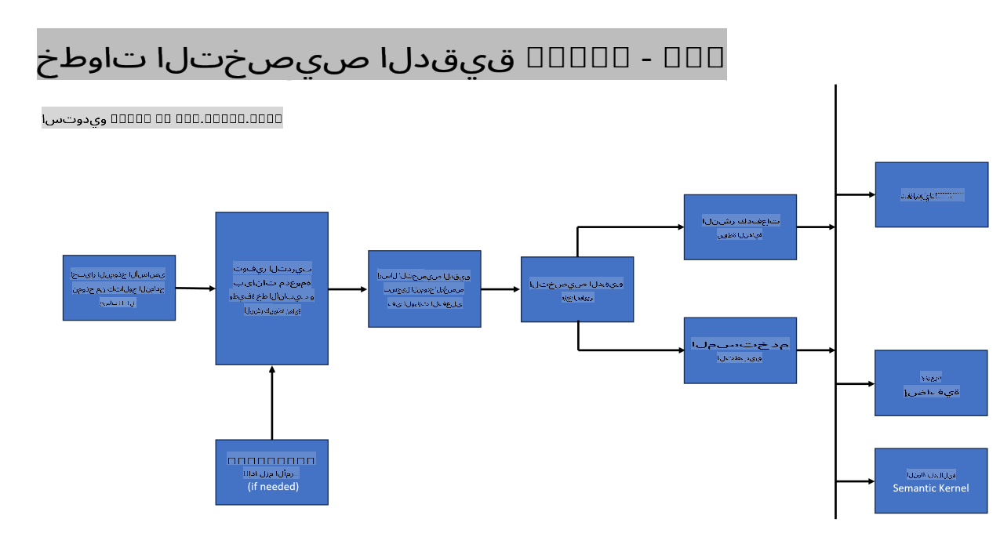
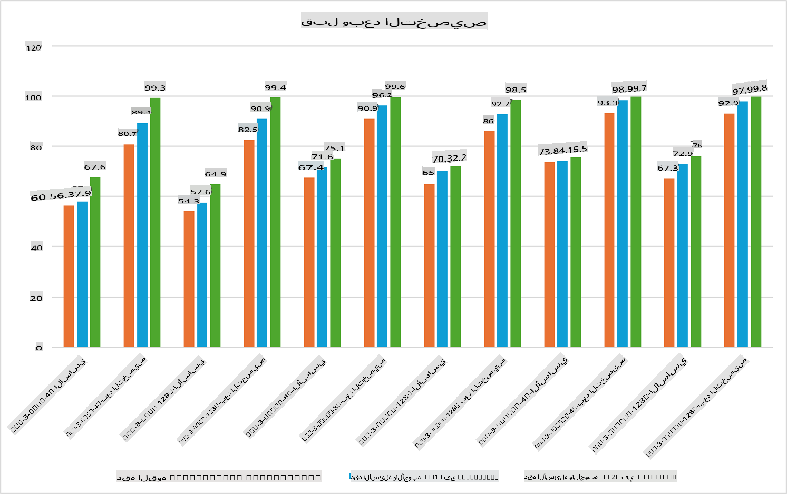

## سيناريوهات التخصيص الدقيق

**المنصة** تشمل هذه الفئة تقنيات متنوعة مثل Azure AI Foundry، Azure Machine Learning، AI Tools، Kaito، وONNX Runtime.

**البنية التحتية** تتضمن هذه الفئة وحدة المعالجة المركزية (CPU) وFPGA، وهما عنصران أساسيان في عملية التخصيص الدقيق. سأوضح لك الأيقونات الخاصة بكل من هذه التقنيات.

**الأدوات والإطارات** تشمل هذه الفئة ONNX Runtime وONNX Runtime. سأوضح لك الأيقونات الخاصة بكل من هذه التقنيات.  
[إدراج أيقونات ONNX Runtime وONNX Runtime]

عملية التخصيص الدقيق باستخدام تقنيات مايكروسوفت تتضمن مكونات وأدوات متنوعة. من خلال فهم واستخدام هذه التقنيات، يمكننا تخصيص تطبيقاتنا بفعالية وإنشاء حلول أفضل.

## النموذج كخدمة

تخصيص النموذج باستخدام التخصيص المستضاف، دون الحاجة إلى إنشاء وإدارة موارد الحوسبة.

التخصيص الدقيق بدون خوادم متاح لنماذج Phi-3-mini وPhi-3-medium، مما يتيح للمطورين تخصيص النماذج بسرعة وسهولة لسيناريوهات السحابة والحافة دون الحاجة إلى ترتيب موارد الحوسبة. كما أعلنا أن Phi-3-small أصبح الآن متاحًا من خلال عرض "النماذج كخدمة"، مما يتيح للمطورين البدء بسرعة وسهولة في تطوير الذكاء الاصطناعي دون الحاجة إلى إدارة البنية التحتية الأساسية.

## النموذج كمنصة

يتحكم المستخدمون في موارد الحوسبة الخاصة بهم من أجل تخصيص نماذجهم.

[مثال على التخصيص الدقيق](https://github.com/Azure/azureml-examples/blob/main/sdk/python/foundation-models/system/finetune/chat-completion/chat-completion.ipynb)

## سيناريوهات التخصيص الدقيق

| | | | | | | |
|-|-|-|-|-|-|-|
|السيناريو|LoRA|QLoRA|PEFT|DeepSpeed|ZeRO|DORA|
|تكييف النماذج اللغوية الكبيرة المدربة مسبقًا (LLMs) لمهام أو مجالات محددة|نعم|نعم|نعم|نعم|نعم|نعم|
|التخصيص الدقيق لمهام معالجة اللغة الطبيعية مثل تصنيف النصوص، التعرف على الكيانات المسماة، والترجمة الآلية|نعم|نعم|نعم|نعم|نعم|نعم|
|التخصيص الدقيق لمهام الإجابة على الأسئلة|نعم|نعم|نعم|نعم|نعم|نعم|
|التخصيص الدقيق لتوليد استجابات بشرية في روبوتات المحادثة|نعم|نعم|نعم|نعم|نعم|نعم|
|التخصيص الدقيق لتوليد الموسيقى، الفن، أو أشكال أخرى من الإبداع|نعم|نعم|نعم|نعم|نعم|نعم|
|تقليل التكاليف الحسابية والمالية|نعم|نعم|لا|نعم|نعم|لا|
|تقليل استخدام الذاكرة|لا|نعم|لا|نعم|نعم|نعم|
|استخدام عدد أقل من المعلمات للتخصيص الفعّال|لا|نعم|نعم|لا|لا|نعم|
|شكل فعال من التوازي في استخدام البيانات يقلل استهلاك الذاكرة ويوفر الوصول إلى ذاكرة GPU المجمعة لجميع أجهزة GPU المتاحة|لا|لا|لا|نعم|نعم|نعم|

## أمثلة على أداء التخصيص الدقيق

**إخلاء المسؤولية**:  
تم ترجمة هذا المستند باستخدام خدمات الترجمة الآلية بالاعتماد على الذكاء الاصطناعي. بينما نسعى لتحقيق الدقة، يرجى العلم أن الترجمات الآلية قد تحتوي على أخطاء أو معلومات غير دقيقة. يجب اعتبار المستند الأصلي بلغته الأصلية هو المصدر الرسمي والموثوق. للحصول على معلومات حساسة أو هامة، يُوصى بالاستعانة بترجمة بشرية احترافية. نحن غير مسؤولين عن أي سوء فهم أو تفسيرات خاطئة ناتجة عن استخدام هذه الترجمة.