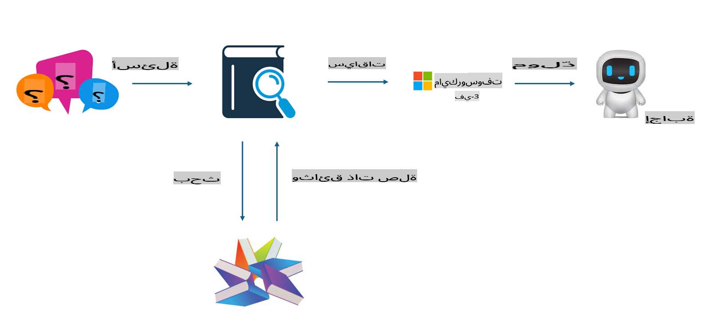

## ضبط النموذج مقابل RAG

## توليد المحتوى المعزز بالاسترجاع

RAG هو استرجاع البيانات + توليد النصوص. يتم تخزين البيانات المهيكلة وغير المهيكلة للمؤسسة في قاعدة بيانات متجهية. عند البحث عن محتوى ذي صلة، يتم العثور على الملخص والمحتوى المناسب لتشكيل سياق، ثم يتم دمج ذلك مع قدرة LLM/SLM على إكمال النصوص لتوليد المحتوى.

## عملية RAG

## ضبط النموذج
ضبط النموذج يعتمد على تحسين نموذج معين. لا يتطلب البدء من خوارزمية النموذج، ولكن يحتاج إلى تراكم البيانات بشكل مستمر. إذا كنت بحاجة إلى مصطلحات دقيقة وتعبيرات لغوية متخصصة في التطبيقات الصناعية، فإن ضبط النموذج هو الخيار الأفضل. ولكن إذا كانت بياناتك تتغير بشكل متكرر، فقد يصبح ضبط النموذج معقدًا.

## كيفية الاختيار
إذا كانت إجابتنا تتطلب إدخال بيانات خارجية، فإن RAG هو الخيار الأفضل.

إذا كنت بحاجة إلى إنتاج معرفة صناعية مستقرة ودقيقة، فإن ضبط النموذج سيكون اختيارًا جيدًا. يركز RAG على استرجاع المحتوى ذي الصلة ولكنه قد لا يتقن دائمًا التفاصيل المتخصصة.

يتطلب ضبط النموذج مجموعة بيانات عالية الجودة، وإذا كان النطاق صغيرًا، فلن يكون هناك فرق كبير. RAG أكثر مرونة.  
ضبط النموذج يعتبر صندوقًا أسودًا، أشبه بعلم غامض، ومن الصعب فهم الآلية الداخلية. ولكن RAG يسهل العثور على مصدر البيانات، مما يساعد في تصحيح الأخطاء أو التهيؤات ويوفر شفافية أفضل.

**إخلاء المسؤولية**:  
تم ترجمة هذا المستند باستخدام خدمات الترجمة الآلية المدعومة بالذكاء الاصطناعي. بينما نسعى جاهدين لتحقيق الدقة، يرجى العلم أن الترجمات الآلية قد تحتوي على أخطاء أو معلومات غير دقيقة. يجب اعتبار المستند الأصلي بلغته الأصلية هو المصدر الرسمي. بالنسبة للمعلومات الحساسة، يُوصى بالاستعانة بترجمة بشرية احترافية. نحن غير مسؤولين عن أي سوء فهم أو تفسيرات خاطئة تنشأ عن استخدام هذه الترجمة.