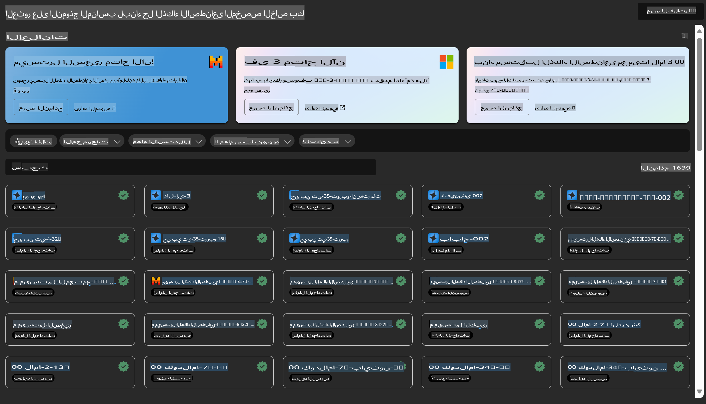
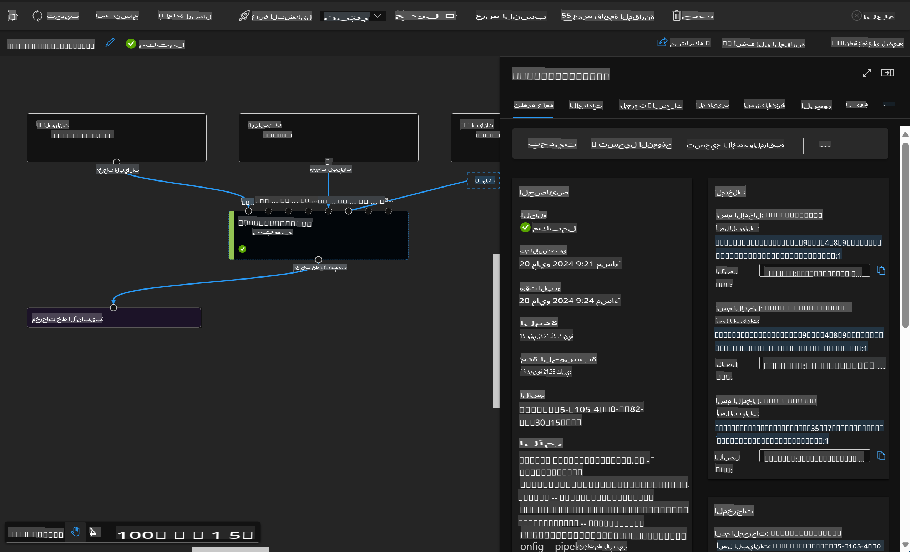

# **التعريف بخدمة Azure Machine Learning**

[Azure Machine Learning](https://ml.azure.com?WT.mc_id=aiml-138114-kinfeylo) هي خدمة سحابية تهدف إلى تسريع وإدارة دورة حياة مشاريع تعلم الآلة (ML).

يمكن لمتخصصي تعلم الآلة، وعلماء البيانات، والمهندسين استخدامها في أعمالهم اليومية من أجل:

- تدريب النماذج ونشرها.
- إدارة عمليات تعلم الآلة (MLOps).
- يمكنك إنشاء نموذج باستخدام Azure Machine Learning أو استخدام نموذج تم إنشاؤه من منصة مفتوحة المصدر مثل PyTorch أو TensorFlow أو scikit-learn.
- تساعد أدوات MLOps في مراقبة النماذج، وإعادة تدريبها، وإعادة نشرها.

## من هو المستفيد من Azure Machine Learning؟

**علماء البيانات ومهندسو تعلم الآلة**

يمكنهم استخدام الأدوات لتسريع وأتمتة مهامهم اليومية.
يوفر Azure ML ميزات للعدالة، والتفسير، والتتبع، والمراجعة.

**مطور التطبيقات**

يمكنهم دمج النماذج بسلاسة في التطبيقات أو الخدمات.

**مطور الأنظمة الأساسية**

لديهم وصول إلى مجموعة قوية من الأدوات المدعومة بواجهات Azure Resource Manager API.
تتيح هذه الأدوات بناء أدوات متقدمة لتعلم الآلة.

**المؤسسات**

بالعمل ضمن سحابة Microsoft Azure، تستفيد المؤسسات من أمان مألوف وتحكم مستند إلى الأدوار.
يمكن إعداد المشاريع للتحكم في الوصول إلى البيانات المحمية والعمليات المحددة.

## إنتاجية لكل أعضاء الفريق

غالبًا ما تتطلب مشاريع تعلم الآلة فريقًا يمتلك مهارات متنوعة لبنائها وصيانتها.

يوفر Azure ML أدوات تمكنك من:
- التعاون مع فريقك عبر دفاتر ملاحظات مشتركة، وموارد الحوسبة، والحوسبة بدون خوادم، والبيانات، والبيئات.
- تطوير نماذج تتسم بالعدالة، والتفسير، والتتبع، والمراجعة لتلبية متطلبات الامتثال والمتابعة.
- نشر نماذج تعلم الآلة بسرعة وسهولة على نطاق واسع، وإدارتها وحوكمتها بكفاءة باستخدام MLOps.
- تشغيل أحمال عمل تعلم الآلة في أي مكان مع حوكمة وأمان وامتثال مدمج.

## أدوات منصة متوافقة عبر الأنظمة

يمكن لأي عضو في فريق تعلم الآلة استخدام الأدوات التي يفضلها لإنجاز المهام.
سواء كنت تقوم بإجراء تجارب سريعة، أو ضبط معايير النماذج، أو بناء خطوط الأنابيب، أو إدارة الاستدلالات، يمكنك استخدام واجهات مألوفة تشمل:
- Azure Machine Learning Studio
- Python SDK (v2)
- Azure CLI (v2)
- Azure Resource Manager REST APIs

أثناء تحسين النماذج والتعاون خلال دورة التطوير، يمكنك مشاركة الأصول والموارد والقياسات والعثور عليها ضمن واجهة Azure Machine Learning studio.

## **LLM/SLM في Azure ML**

أضاف Azure ML العديد من الوظائف المتعلقة بـ LLM/SLM، مما يجمع بين LLMOps وSLMOps لإنشاء منصة تكنولوجيا ذكاء اصطناعي توليدي على مستوى المؤسسة.

### **كتالوج النماذج**

يمكن لمستخدمي المؤسسات نشر نماذج مختلفة وفقًا لسيناريوهات العمل المختلفة من خلال كتالوج النماذج، وتقديم الخدمات كنموذج كخدمة (Model as Service) للمطورين أو المستخدمين في المؤسسة للوصول إليها.

يعد كتالوج النماذج في Azure Machine Learning studio مركزًا لاستكشاف واستخدام مجموعة واسعة من النماذج التي تمكنك من بناء تطبيقات ذكاء اصطناعي توليدي. يحتوي كتالوج النماذج على مئات النماذج من مزودي النماذج مثل خدمة Azure OpenAI، وMistral، وMeta، وCohere، وNvidia، وHugging Face، بما في ذلك النماذج التي تدربت بواسطة Microsoft. النماذج من مزودين غير Microsoft تُعتبر منتجات غير تابعة لـ Microsoft، كما هو محدد في شروط منتجات Microsoft، وتخضع للشروط المقدمة مع النموذج.

### **خط أنابيب المهام**

جوهر خط أنابيب تعلم الآلة هو تقسيم مهمة تعلم الآلة الكاملة إلى سير عمل متعدد الخطوات. كل خطوة هي مكون يمكن إدارته وتطويره وتحسينه وتكوينه وأتمتته بشكل فردي. ترتبط الخطوات من خلال واجهات محددة جيدًا. تقوم خدمة خط أنابيب Azure Machine Learning بأتمتة جميع التبعيات بين خطوات الخطوط تلقائيًا.

في ضبط SLM / LLM، يمكننا إدارة البيانات وعمليات التدريب والتوليد من خلال خط الأنابيب.

### **تدفق التعليمات (Prompt flow)**

### فوائد استخدام تدفق التعليمات في Azure Machine Learning

يوفر تدفق التعليمات في Azure Machine Learning مجموعة من الفوائد التي تساعد المستخدمين على الانتقال من مرحلة الفكرة إلى التجربة، وفي النهاية إلى تطبيقات جاهزة للإنتاج تعتمد على LLM:

**مرونة هندسة التعليمات**

- تجربة تأليف تفاعلية: يوفر تدفق التعليمات في Azure Machine Learning تمثيلًا مرئيًا لبنية التدفق، مما يتيح للمستخدمين فهم مشاريعهم والتنقل فيها بسهولة. كما يقدم تجربة ترميز شبيهة بالدفاتر لتطوير التدفق وتصحيحه بكفاءة.
- متغيرات لضبط التعليمات: يمكن للمستخدمين إنشاء ومقارنة متغيرات متعددة للتعليمات، مما يسهل عملية تحسين تكرارية.
- التقييم: تتيح التدفقات التقييمية المدمجة للمستخدمين تقييم جودة وفعالية التعليمات والتدفقات الخاصة بهم.
- موارد شاملة: يتضمن تدفق التعليمات في Azure Machine Learning مكتبة من الأدوات والنماذج والقوالب المدمجة التي تمثل نقطة انطلاق للتطوير، مما يلهم الإبداع ويسرّع العملية.

**جاهزية المؤسسة لتطبيقات تعتمد على LLM**

- التعاون: يدعم تدفق التعليمات في Azure Machine Learning التعاون بين أعضاء الفريق، مما يتيح لعدة مستخدمين العمل معًا في مشاريع هندسة التعليمات، ومشاركة المعرفة، والحفاظ على التحكم في الإصدارات.
- منصة شاملة: يبسّط تدفق التعليمات في Azure Machine Learning العملية الكاملة لهندسة التعليمات، بدءًا من التطوير والتقييم إلى النشر والمراقبة. يمكن للمستخدمين نشر التدفقات كنقاط نهاية Azure Machine Learning ومراقبة أدائها في الوقت الفعلي، مما يضمن التشغيل الأمثل والتحسين المستمر.
- حلول جاهزية المؤسسة من Azure Machine Learning: يستفيد تدفق التعليمات من حلول جاهزية المؤسسة القوية في Azure Machine Learning، مما يوفر أساسًا آمنًا وقابلًا للتوسع وموثوقًا لتطوير التدفقات وتجربتها ونشرها.

مع تدفق التعليمات في Azure Machine Learning، يمكن للمستخدمين إطلاق العنان لمرونة هندسة التعليمات، والتعاون بفعالية، والاستفادة من حلول على مستوى المؤسسة لتطوير ونشر تطبيقات تعتمد على LLM بنجاح.

من خلال الجمع بين قوة الحوسبة والبيانات والمكونات المختلفة لـ Azure ML، يمكن لمطوري المؤسسات بسهولة بناء تطبيقاتهم الخاصة بالذكاء الاصطناعي.

**إخلاء المسؤولية**:  
تمت ترجمة هذا المستند باستخدام خدمات الترجمة الآلية المعتمدة على الذكاء الاصطناعي. بينما نسعى لتحقيق الدقة، يرجى العلم أن الترجمات الآلية قد تحتوي على أخطاء أو معلومات غير دقيقة. يجب اعتبار المستند الأصلي بلغته الأصلية المصدر الموثوق. للحصول على معلومات حاسمة، يُوصى بالاستعانة بترجمة بشرية احترافية. نحن غير مسؤولين عن أي سوء فهم أو تفسيرات خاطئة ناتجة عن استخدام هذه الترجمة.