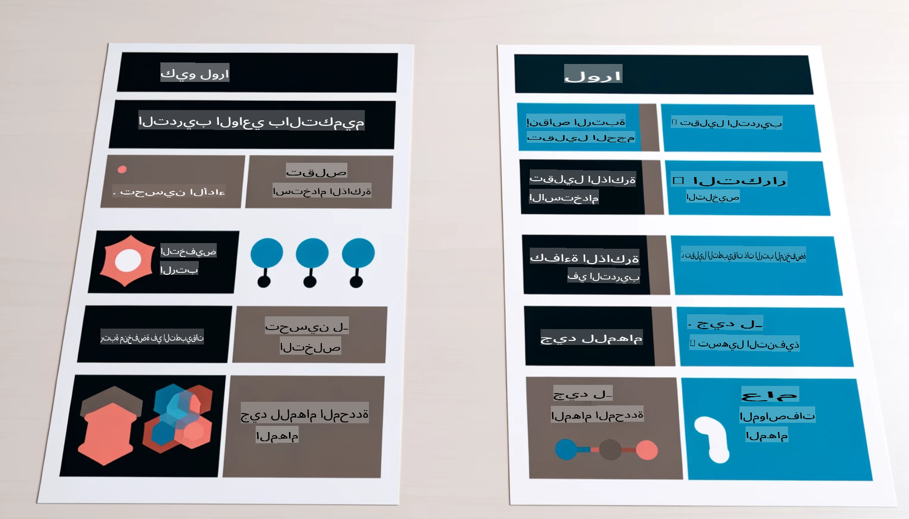

# **دع Phi-3 يصبح خبيرًا في الصناعة**

لإدخال نموذج Phi-3 في الصناعة، تحتاج إلى إضافة بيانات الأعمال الخاصة بالصناعة إلى نموذج Phi-3. لدينا خياران مختلفان، الأول هو RAG (توليد معزز بالاسترجاع) والثاني هو التخصيص الدقيق (Fine Tuning).

## **RAG مقابل التخصيص الدقيق**

### **توليد معزز بالاسترجاع (RAG)**

RAG هو استرجاع البيانات + توليد النصوص. يتم تخزين البيانات المنظمة وغير المنظمة للمؤسسة في قاعدة بيانات متجهية. عند البحث عن محتوى ذي صلة، يتم العثور على الملخص والمحتوى المناسبين لتكوين سياق، ويتم دمج قدرة إكمال النص للنماذج اللغوية LLM/SLM لتوليد المحتوى.

### **التخصيص الدقيق (Fine-tuning)**

التخصيص الدقيق يعتمد على تحسين نموذج معين. لا يتطلب البدء بخوارزمية النموذج، ولكن يتطلب تراكم البيانات بشكل مستمر. إذا كنت تريد مصطلحات وتعبيرات لغوية دقيقة أكثر في التطبيقات الصناعية، فإن التخصيص الدقيق هو الخيار الأفضل. ولكن إذا كانت بياناتك تتغير بشكل متكرر، فقد يصبح التخصيص الدقيق معقدًا.

### **كيفية الاختيار**

1. إذا كان جوابنا يتطلب إدخال بيانات خارجية، فإن RAG هو الخيار الأفضل.

2. إذا كنت بحاجة إلى إخراج معرفة صناعية دقيقة ومستقرة، فإن التخصيص الدقيق سيكون خيارًا جيدًا. يركز RAG على استرجاع المحتوى ذي الصلة ولكنه قد لا يتقن دائمًا التفاصيل المتخصصة.

3. التخصيص الدقيق يتطلب مجموعة بيانات عالية الجودة، وإذا كانت البيانات ضمن نطاق صغير فقط، فلن يحدث فرقًا كبيرًا. RAG أكثر مرونة.

4. التخصيص الدقيق يشبه "الصندوق الأسود"، ومن الصعب فهم آليته الداخلية. بينما يجعل RAG من السهل العثور على مصدر البيانات، مما يساعد في تقليل الأخطاء وتقديم شفافية أفضل.

### **السيناريوهات**

1. الصناعات العمودية التي تتطلب مصطلحات وتعبيرات مهنية محددة، ***التخصيص الدقيق*** سيكون الخيار الأفضل.

2. أنظمة الأسئلة والأجوبة التي تتطلب دمج نقاط معرفة مختلفة، ***RAG*** سيكون الخيار الأفضل.

3. دمج تدفق الأعمال الآلي ***RAG + التخصيص الدقيق*** هو الخيار الأفضل.

## **كيفية استخدام RAG**

قاعدة البيانات المتجهية هي مجموعة من البيانات المخزنة في شكل رياضي. تسهل قواعد البيانات المتجهية على نماذج التعلم الآلي تذكر المدخلات السابقة، مما يتيح استخدام التعلم الآلي لدعم حالات الاستخدام مثل البحث، والتوصيات، وتوليد النصوص. يمكن تحديد البيانات بناءً على مقاييس التشابه بدلاً من المطابقات الدقيقة، مما يسمح للنماذج الحاسوبية بفهم سياق البيانات.

قاعدة البيانات المتجهية هي المفتاح لتحقيق RAG. يمكننا تحويل البيانات إلى تخزين متجه باستخدام نماذج متجهية مثل text-embedding-3 و jina-ai-embedding وغيرها.

تعرف على المزيد حول إنشاء تطبيق RAG [https://github.com/microsoft/Phi-3CookBook](https://github.com/microsoft/Phi-3CookBook?WT.mc_id=aiml-138114-kinfeylo)

## **كيفية استخدام التخصيص الدقيق**

الخوارزميات الشائعة الاستخدام في التخصيص الدقيق هي Lora و QLora. كيف تختار؟
- [تعرف على المزيد مع هذا الدفتر التوضيحي](../../../../code/04.Finetuning/Phi_3_Inference_Finetuning.ipynb)
- [مثال على تخصيص دقيق بلغة Python](../../../../code/04.Finetuning/FineTrainingScript.py)

### **Lora و QLora**

LoRA (التكيف منخفض الرتبة) و QLoRA (التكيف منخفض الرتبة الكمي) هما تقنيتان تستخدمان لتخصيص النماذج اللغوية الكبيرة (LLMs) باستخدام التخصيص الفعال للمعاملات (PEFT). تم تصميم تقنيات PEFT لتدريب النماذج بكفاءة أكبر من الطرق التقليدية.

LoRA هي تقنية تخصيص مستقلة تقلل من استهلاك الذاكرة من خلال تطبيق تقريب منخفض الرتبة على مصفوفة تحديث الأوزان. توفر أوقات تدريب سريعة وتحافظ على الأداء قريبًا من طرق التخصيص التقليدية.

QLoRA هي نسخة موسعة من LoRA تتضمن تقنيات التكميم لتقليل استهلاك الذاكرة بشكل أكبر. تقوم QLoRA بتكميم دقة معاملات الأوزان في النموذج المدرب مسبقًا إلى دقة 4 بت، مما يجعلها أكثر كفاءة من حيث استهلاك الذاكرة مقارنة بـ LoRA. ومع ذلك، فإن تدريب QLoRA أبطأ بحوالي 30٪ من تدريب LoRA بسبب خطوات التكميم وإزالة التكميم الإضافية.

QLoRA تستخدم LoRA كملحق لإصلاح الأخطاء الناتجة عن التكميم. تتيح QLoRA تخصيص النماذج الضخمة التي تحتوي على مليارات المعاملات باستخدام وحدات معالجة رسومات صغيرة ومتوفرة على نطاق واسع. على سبيل المثال، يمكن لـ QLoRA تخصيص نموذج يحتوي على 70 مليار معاملة يتطلب 36 وحدة معالجة رسومات باستخدام وحدتين فقط.

**إخلاء المسؤولية**:  
تم ترجمة هذا المستند باستخدام خدمات الترجمة الآلية المعتمدة على الذكاء الاصطناعي. بينما نسعى لتحقيق الدقة، يُرجى العلم بأن الترجمات الآلية قد تحتوي على أخطاء أو معلومات غير دقيقة. يجب اعتبار المستند الأصلي بلغته الأصلية هو المصدر الموثوق. للحصول على معلومات حاسمة، يُوصى بالاستعانة بترجمة بشرية احترافية. نحن غير مسؤولين عن أي سوء فهم أو تفسيرات خاطئة ناتجة عن استخدام هذه الترجمة.