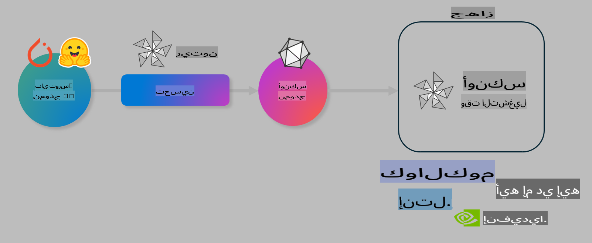

# مختبر: تحسين نماذج الذكاء الاصطناعي للتنفيذ على الأجهزة

## المقدمة

> [!IMPORTANT]
> يتطلب هذا المختبر وجود **وحدة معالجة رسومات Nvidia A10 أو A100** مع تثبيت برامج التشغيل وأدوات CUDA (الإصدار 12+).

> [!NOTE]
> هذا مختبر مدته **35 دقيقة** سيمنحك مقدمة عملية عن المفاهيم الأساسية لتحسين النماذج للتنفيذ على الأجهزة باستخدام OLIVE.

## أهداف التعلم

بنهاية هذا المختبر، ستتمكن من استخدام OLIVE لـ:

- تقليل دقة نموذج ذكاء اصطناعي باستخدام طريقة تقليل الدقة AWQ.
- تحسين نموذج ذكاء اصطناعي لمهمة معينة.
- إنشاء مكونات LoRA (نموذج محسّن) للتنفيذ الفعّال على الأجهزة باستخدام ONNX Runtime.

### ما هو Olive؟

Olive (*O*NNX *live*) هي أداة لتحسين النماذج مزودة بواجهة CLI تتيح لك نشر نماذج لـ ONNX Runtime +++https://onnxruntime.ai+++ بجودة وأداء عاليين.



عادةً ما يكون الإدخال إلى Olive نموذج PyTorch أو Hugging Face، بينما يكون الإخراج نموذج ONNX محسّن يتم تنفيذه على جهاز (هدف النشر) يعمل باستخدام ONNX Runtime. يقوم Olive بتحسين النموذج لتسريع الذكاء الاصطناعي في الجهاز الهدف (NPU، GPU، CPU) الذي توفره شركات تصنيع الأجهزة مثل Qualcomm، AMD، Nvidia، أو Intel.

ينفذ Olive *سير عمل*، وهو تسلسل مرتب من مهام تحسين النماذج الفردية التي تُعرف باسم *التمريرات* - أمثلة على التمريرات تشمل: ضغط النموذج، التقاط الرسم البياني، تقليل الدقة، تحسين الرسم البياني. كل تمرير يحتوي على مجموعة من المعايير التي يمكن ضبطها لتحقيق أفضل القياسات، مثل الدقة والكمون، التي يتم تقييمها بواسطة المقيم المعني. يستخدم Olive استراتيجية بحث تعتمد على خوارزمية بحث لضبط كل تمرير تلقائيًا إما بشكل فردي أو مع مجموعة من التمريرات معًا.

#### فوائد Olive

- **تقليل الإحباط والوقت** الناتج عن التجربة والخطأ اليدوية مع تقنيات مختلفة لتحسين الرسوم البيانية، الضغط، وتقليل الدقة. حدد قيود الجودة والأداء ودع Olive يجد أفضل نموذج لك تلقائيًا.
- **أكثر من 40 مكونًا مدمجًا لتحسين النماذج** تغطي أحدث التقنيات في تقليل الدقة، الضغط، تحسين الرسوم البيانية، والتحسين الدقيق.
- **واجهة CLI سهلة الاستخدام** للمهام الشائعة في تحسين النماذج. على سبيل المثال، olive quantize، olive auto-opt، olive finetune.
- تضمين حزم النماذج والنشر.
- دعم إنشاء نماذج لخدمة **Multi LoRA**.
- إنشاء سير عمل باستخدام YAML/JSON لتنظيم مهام تحسين النماذج والنشر.
- تكامل مع **Hugging Face** و **Azure AI**.
- آلية **تخزين مؤقت مدمجة** لتوفير **التكاليف**.

## تعليمات المختبر

> [!NOTE]
> يرجى التأكد من إعداد Azure AI Hub والمشروع الخاص بك وإعداد حساب A100 كما هو موضح في المختبر 1.

### الخطوة 0: الاتصال بـ Azure AI Compute

ستتصل بـ Azure AI Compute باستخدام ميزة الاتصال عن بُعد في **VS Code**.

1. افتح تطبيق سطح المكتب **VS Code**:
1. افتح **قائمة الأوامر** باستخدام **Shift+Ctrl+P**.
1. في قائمة الأوامر، ابحث عن **AzureML - remote: Connect to compute instance in New Window**.
1. اتبع التعليمات الظاهرة على الشاشة للاتصال بـ Compute. سيتضمن ذلك اختيار اشتراك Azure الخاص بك، مجموعة الموارد، المشروع، واسم الحوسبة الذي قمت بإعداده في المختبر 1.
1. بمجرد الاتصال بـ Azure ML Compute، سيتم عرض ذلك في **الزاوية السفلية اليسرى من Visual Code** `><Azure ML: Compute Name`.

### الخطوة 1: استنساخ هذا المستودع

في VS Code، يمكنك فتح نافذة طرفية جديدة باستخدام **Ctrl+J** واستنساخ هذا المستودع:

في الطرفية، يجب أن ترى المطالبة

```
azureuser@computername:~/cloudfiles/code$ 
```
استنساخ الحل

```bash
cd ~/localfiles
git clone https://github.com/microsoft/phi-3cookbook.git
```

### الخطوة 2: فتح المجلد في VS Code

لفتح VS Code في المجلد المناسب، قم بتنفيذ الأمر التالي في الطرفية، والذي سيفتح نافذة جديدة:

```bash
code phi-3cookbook/code/04.Finetuning/Olive-lab
```

بدلاً من ذلك، يمكنك فتح المجلد عن طريق اختيار **File** > **Open Folder**.

### الخطوة 3: التبعيات

افتح نافذة طرفية في VS Code في مثيل Azure AI Compute الخاص بك (نصيحة: **Ctrl+J**) ونفذ الأوامر التالية لتثبيت التبعيات:

```bash
conda create -n olive-ai python=3.11 -y
conda activate olive-ai
pip install -r requirements.txt
az extension remove -n azure-cli-ml
az extension add -n ml
```

> [!NOTE]
> سيستغرق تثبيت جميع التبعيات حوالي **5 دقائق**.

في هذا المختبر، ستقوم بتنزيل ورفع النماذج إلى كتالوج نماذج Azure AI. للوصول إلى كتالوج النماذج، ستحتاج إلى تسجيل الدخول إلى Azure باستخدام:

```bash
az login
```

> [!NOTE]
> أثناء تسجيل الدخول، سيُطلب منك اختيار اشتراكك. تأكد من تعيين الاشتراك إلى الاشتراك المخصص لهذا المختبر.

### الخطوة 4: تنفيذ أوامر Olive

افتح نافذة طرفية في VS Code في مثيل Azure AI Compute الخاص بك (نصيحة: **Ctrl+J**) وتأكد من تنشيط بيئة `olive-ai` في Conda:

```bash
conda activate olive-ai
```

بعد ذلك، نفذ أوامر Olive التالية في سطر الأوامر.

1. **تفحص البيانات:** في هذا المثال، ستقوم بتحسين نموذج Phi-3.5-Mini ليكون متخصصًا في الإجابة على الأسئلة المتعلقة بالسفر. يعرض الكود أدناه السجلات الأولى من مجموعة البيانات، والتي تكون بتنسيق JSON lines:

    ```bash
    head data/data_sample_travel.jsonl
    ```
1. **تقليل دقة النموذج:** قبل تدريب النموذج، قم أولاً بتقليل دقته باستخدام الأمر التالي الذي يستخدم تقنية تُعرف باسم Active Aware Quantization (AWQ) +++https://arxiv.org/abs/2306.00978+++. تقوم AWQ بتقليل أوزان النموذج مع مراعاة التفعيلات الناتجة أثناء التنفيذ. يعني هذا أن عملية تقليل الدقة تأخذ في الاعتبار التوزيع الفعلي للبيانات في التفعيلات، مما يؤدي إلى الحفاظ بشكل أفضل على دقة النموذج مقارنةً بطرق تقليل الأوزان التقليدية.

    ```bash
    olive quantize \
       --model_name_or_path microsoft/Phi-3.5-mini-instruct \
       --trust_remote_code \
       --algorithm awq \
       --output_path models/phi/awq \
       --log_level 1
    ```

    يستغرق تقليل الدقة حوالي **8 دقائق**، مما يؤدي إلى **تقليل حجم النموذج من ~7.5 جيجابايت إلى ~2.5 جيجابايت**.

    في هذا المختبر، نعرض لك كيفية إدخال النماذج من Hugging Face (على سبيل المثال: `microsoft/Phi-3.5-mini-instruct`). However, Olive also allows you to input models from the Azure AI catalog by updating the `model_name_or_path` argument to an Azure AI asset ID (for example:  `azureml://registries/azureml/models/Phi-3.5-mini-instruct/versions/4`). 

1. **Train the model:** Next, the `olive finetune` الأمر يقوم بتحسين النموذج الذي تم تقليل دقته. تقليل دقة النموذج *قبل* التحسين بدلاً من بعده يعطي دقة أفضل لأن عملية التحسين تستعيد بعض الفقد الناتج عن تقليل الدقة.

    ```bash
    olive finetune \
        --method lora \
        --model_name_or_path models/phi/awq \
        --data_files "data/data_sample_travel.jsonl" \
        --data_name "json" \
        --text_template "<|user|>\n{prompt}<|end|>\n<|assistant|>\n{response}<|end|>" \
        --max_steps 100 \
        --output_path ./models/phi/ft \
        --log_level 1
    ```

    يستغرق التحسين حوالي **6 دقائق** (مع 100 خطوة).

1. **تحسين النموذج:** بعد تدريب النموذج، قم بتحسينه باستخدام أمر `auto-opt` command, which will capture the ONNX graph and automatically perform a number of optimizations to improve the model performance for CPU by compressing the model and doing fusions. It should be noted, that you can also optimize for other devices such as NPU or GPU by just updating the `--device` and `--provider` الخاص بـ Olive - ولكن لأغراض هذا المختبر سنستخدم CPU.

    ```bash
    olive auto-opt \
       --model_name_or_path models/phi/ft/model \
       --adapter_path models/phi/ft/adapter \
       --device cpu \
       --provider CPUExecutionProvider \
       --use_ort_genai \
       --output_path models/phi/onnx-ao \
       --log_level 1
    ```

    يستغرق التحسين حوالي **5 دقائق**.

### الخطوة 5: اختبار سريع لتنفيذ النموذج

لاختبار تنفيذ النموذج، قم بإنشاء ملف Python في مجلدك باسم **app.py** وانسخ وألصق الكود التالي:

```python
import onnxruntime_genai as og
import numpy as np

print("loading model and adapters...", end="", flush=True)
model = og.Model("models/phi/onnx-ao/model")
adapters = og.Adapters(model)
adapters.load("models/phi/onnx-ao/model/adapter_weights.onnx_adapter", "travel")
print("DONE!")

tokenizer = og.Tokenizer(model)
tokenizer_stream = tokenizer.create_stream()

params = og.GeneratorParams(model)
params.set_search_options(max_length=100, past_present_share_buffer=False)
user_input = "what is the best thing to see in chicago"
params.input_ids = tokenizer.encode(f"<|user|>\n{user_input}<|end|>\n<|assistant|>\n")

generator = og.Generator(model, params)

generator.set_active_adapter(adapters, "travel")

print(f"{user_input}")

while not generator.is_done():
    generator.compute_logits()
    generator.generate_next_token()

    new_token = generator.get_next_tokens()[0]
    print(tokenizer_stream.decode(new_token), end='', flush=True)

print("\n")
```

نفذ الكود باستخدام:

```bash
python app.py
```

### الخطوة 6: رفع النموذج إلى Azure AI

رفع النموذج إلى مستودع نماذج Azure AI يجعل النموذج قابلاً للمشاركة مع أعضاء آخرين في فريق التطوير الخاص بك كما يتولى إدارة إصدارات النموذج. لرفع النموذج، قم بتنفيذ الأمر التالي:

> [!NOTE]
> قم بتحديث `{}` placeholders with the name of your resource group and Azure AI Project Name. 

To find your resource group `"resourceGroup" واسم مشروع Azure AI، ثم نفذ الأمر التالي

```
az ml workspace show
```

أو من خلال الذهاب إلى +++ai.azure.com+++ واختيار **management center** **project** **overview**.

قم بتحديث القيم `{}` بأسماء مجموعة الموارد واسم مشروع Azure AI الخاص بك.

```bash
az ml model create \
    --name ft-for-travel \
    --version 1 \
    --path ./models/phi/onnx-ao \
    --resource-group {RESOURCE_GROUP_NAME} \
    --workspace-name {PROJECT_NAME}
```
يمكنك بعد ذلك رؤية النموذج الذي تم رفعه ونشره على https://ml.azure.com/model/list

**إخلاء المسؤولية**:  
تم ترجمة هذا المستند باستخدام خدمات الترجمة الآلية المعتمدة على الذكاء الاصطناعي. بينما نسعى لتحقيق الدقة، يرجى العلم أن الترجمات الآلية قد تحتوي على أخطاء أو معلومات غير دقيقة. يجب اعتبار المستند الأصلي بلغته الأصلية هو المصدر الموثوق. للحصول على معلومات حاسمة، يُوصى باللجوء إلى ترجمة بشرية احترافية. نحن غير مسؤولين عن أي سوء فهم أو تفسيرات خاطئة تنشأ عن استخدام هذه الترجمة.