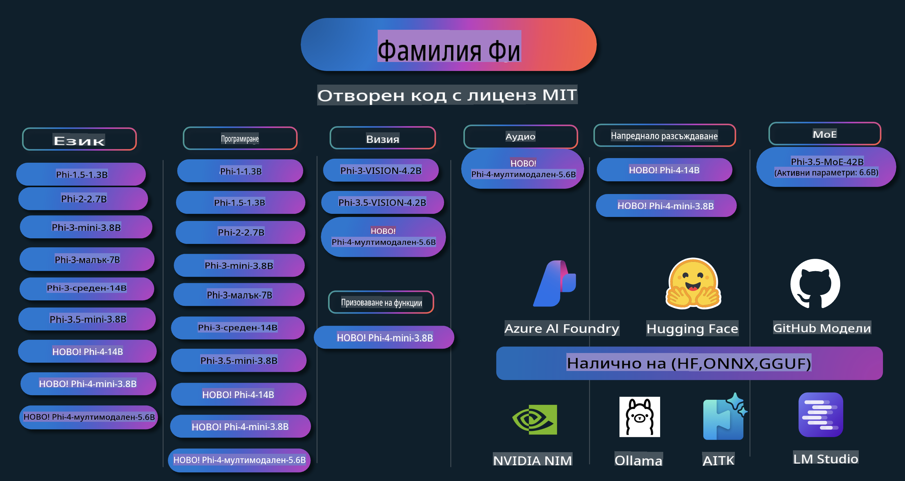

# Phi Cookbook: Практически примери с моделите Phi на Microsoft

  

  
  
  

  
  

Phi е серия от отворени AI модели, разработени от Microsoft.

Phi в момента е най-мощният и икономически ефективен малък езиков модел (SLM), с отлични резултати в мултиезикови задачи, разсъждения, генериране на текст/чат, кодиране, изображения, аудио и други сценарии.

Можете да внедрите Phi в облака или на крайни устройства и лесно да изградите генеративни AI приложения с ограничена изчислителна мощност.

Следвайте тези стъпки, за да започнете да използвате тези ресурси:  
1. **Направете Fork на хранилището**: Кликнете   
2. **Клонирайте хранилището**: `git clone https://github.com/microsoft/PhiCookBook.git`  
3. [**Присъединете се към Microsoft AI Discord общността и срещнете експерти и колеги разработчици**](https://discord.com/invite/ByRwuEEgH4?WT.mc_id=aiml-137032-kinfeylo)

## Съдържание

- Въведение  
  - [Добре дошли в семейството Phi](./md/01.Introduction/01/01.PhiFamily.md)  
  - [Настройка на вашата среда](./md/01.Introduction/01/01.EnvironmentSetup.md)  
  - [Разбиране на ключови технологии](./md/01.Introduction/01/01.Understandingtech.md)  
  - [AI безопасност за моделите Phi](./md/01.Introduction/01/01.AISafety.md)  
  - [Поддръжка на хардуер за Phi](./md/01.Introduction/01/01.Hardwaresupport.md)  
  - [Модели Phi и наличност на различни платформи](./md/01.Introduction/01/01.Edgeandcloud.md)  
  - [Използване на Guidance-ai и Phi](./md/01.Introduction/01/01.Guidance.md)  
  - [Модели от GitHub Marketplace](https://github.com/marketplace/models)  
  - [Каталог на модели в Azure AI](https://ai.azure.com)  

- Изпълнение на Phi в различни среди  
    - [Hugging Face](./md/01.Introduction/02/01.HF.md)  
    - [Модели от GitHub](./md/01.Introduction/02/02.GitHubModel.md)  
    - [Каталог на модели в Azure AI Foundry](./md/01.Introduction/02/03.AzureAIFoundry.md)  
    - [Ollama](./md/01.Introduction/02/04.Ollama.md)  
    - [AI Toolkit VSCode (AITK)](./md/01.Introduction/02/05.AITK.md)  
    - [NVIDIA NIM](./md/01.Introduction/02/06.NVIDIA.md)  

- Изпълнение на семейство Phi  
    - [Изпълнение на Phi в iOS](./md/01.Introduction/03/iOS_Inference.md)  
    - [Изпълнение на Phi в Android](./md/01.Introduction/03/Android_Inference.md)  
- [Inference Phi в Jetson](./md/01.Introduction/03/Jetson_Inference.md)  
    - [Inference Phi в AI PC](./md/01.Introduction/03/AIPC_Inference.md)  
    - [Inference Phi с Apple MLX Framework](./md/01.Introduction/03/MLX_Inference.md)  
    - [Inference Phi в локален сървър](./md/01.Introduction/03/Local_Server_Inference.md)  
    - [Inference Phi в отдалечен сървър с помощта на AI Toolkit](./md/01.Introduction/03/Remote_Interence.md)  
    - [Inference Phi с Rust](./md/01.Introduction/03/Rust_Inference.md)  
    - [Inference Phi--Vision локално](./md/01.Introduction/03/Vision_Inference.md)  
    - [Inference Phi с Kaito AKS, Azure Containers (официална поддръжка)](./md/01.Introduction/03/Kaito_Inference.md)  

- [Квантифициране на Phi семейство](./md/01.Introduction/04/QuantifyingPhi.md)  
    - [Квантифициране на Phi-3.5 / 4 с помощта на llama.cpp](./md/01.Introduction/04/UsingLlamacppQuantifyingPhi.md)  
    - [Квантифициране на Phi-3.5 / 4 с разширения за Generative AI за onnxruntime](./md/01.Introduction/04/UsingORTGenAIQuantifyingPhi.md)  
    - [Квантифициране на Phi-3.5 / 4 с Intel OpenVINO](./md/01.Introduction/04/UsingIntelOpenVINOQuantifyingPhi.md)  
    - [Квантифициране на Phi-3.5 / 4 с Apple MLX Framework](./md/01.Introduction/04/UsingAppleMLXQuantifyingPhi.md)  

- Оценяване на Phi  
    - [Отговорен AI](./md/01.Introduction/05/ResponsibleAI.md)  
    - [Azure AI Foundry за оценяване](./md/01.Introduction/05/AIFoundry.md)  
    - [Използване на Promptflow за оценяване](./md/01.Introduction/05/Promptflow.md)  

- RAG с Azure AI Search  
    - [Как да използваме Phi-4-mini и Phi-4-multimodal (RAG) с Azure AI Search](https://github.com/microsoft/PhiCookBook/blob/main/code/06.E2E/E2E_Phi-4-RAG-Azure-AI-Search.ipynb)  

- Примери за разработка на приложения с Phi  
  - Текстови и чат приложения  
    - Примери с Phi-4 🆕  
      - [📓] [Чат с Phi-4-mini ONNX модел](./md/02.Application/01.TextAndChat/Phi4/ChatWithPhi4ONNX/README.md)  
      - [Чат с Phi-4 локален ONNX модел .NET](../../md/04.HOL/dotnet/src/LabsPhi4-Chat-01OnnxRuntime)  
      - [Чат .NET Console App с Phi-4 ONNX с използване на Semantic Kernel](../../md/04.HOL/dotnet/src/LabsPhi4-Chat-02SK)  
    - Примери с Phi-3 / 3.5  
      - [Локален чатбот в браузър с Phi3, ONNX Runtime Web и WebGPU](https://github.com/microsoft/onnxruntime-inference-examples/tree/main/js/chat)  
      - [OpenVino Чат](./md/02.Application/01.TextAndChat/Phi3/E2E_OpenVino_Chat.md)  
      - [Мултимодел - Интерактивен Phi-3-mini и OpenAI Whisper](./md/02.Application/01.TextAndChat/Phi3/E2E_Phi-3-mini_with_whisper.md)  
      - [MLFlow - Създаване на обвивка и използване на Phi-3 с MLFlow](./md//02.Application/01.TextAndChat/Phi3/E2E_Phi-3-MLflow.md)  
      - [Оптимизация на модел - Как да оптимизираме Phi-3-mini модел за ONNX Runtime Web с Olive](https://github.com/microsoft/Olive/tree/main/examples/phi3)  
      - [WinUI3 приложение с Phi-3 mini-4k-instruct-onnx](https://github.com/microsoft/Phi3-Chat-WinUI3-Sample/)  
      - [WinUI3 Мултимодел AI приложение за бележки](https://github.com/microsoft/ai-powered-notes-winui3-sample)  
      - [Финна настройка и интегриране на персонализирани Phi-3 модели с Promptflow](./md/02.Application/01.TextAndChat/Phi3/E2E_Phi-3-FineTuning_PromptFlow_Integration.md)  
      - [Финна настройка и интегриране на персонализирани Phi-3 модели с Promptflow в Azure AI Foundry](./md/02.Application/01.TextAndChat/Phi3/E2E_Phi-3-FineTuning_PromptFlow_Integration_AIFoundry.md)  
      - [Оценяване на финно настроен Phi-3 / Phi-3.5 модел в Azure AI Foundry с фокус върху принципите на отговорния AI на Microsoft](./md/02.Application/01.TextAndChat/Phi3/E2E_Phi-3-Evaluation_AIFoundry.md)  
- [📓] [Phi-3.5-mini-instruct пример за предсказване на език (китайски/английски)](../../md/02.Application/01.TextAndChat/Phi3/phi3-instruct-demo.ipynb)
      - [Phi-3.5-Instruct WebGPU RAG Chatbot](./md/02.Application/01.TextAndChat/Phi3/WebGPUWithPhi35Readme.md)
      - [Използване на Windows GPU за създаване на решение с Prompt flow и Phi-3.5-Instruct ONNX](./md/02.Application/01.TextAndChat/Phi3/UsingPromptFlowWithONNX.md)
      - [Създаване на Android приложение с Microsoft Phi-3.5 tflite](./md/02.Application/01.TextAndChat/Phi3/UsingPhi35TFLiteCreateAndroidApp.md)
      - [Пример за Q&A .NET с локален ONNX Phi-3 модел чрез Microsoft.ML.OnnxRuntime](../../md/04.HOL/dotnet/src/LabsPhi301)
      - [Конзолно чат приложение .NET със Semantic Kernel и Phi-3](../../md/04.HOL/dotnet/src/LabsPhi302)

  - Azure AI Inference SDK Примери на базата на код
    - Phi-4 Примери 🆕
      - [📓] [Генериране на проектен код с Phi-4-multimodal](./md/02.Application/02.Code/Phi4/GenProjectCode/README.md)
    - Phi-3 / 3.5 Примери
      - [Създайте свой собствен Visual Studio Code GitHub Copilot Chat с Microsoft Phi-3 Family](./md/02.Application/02.Code/Phi3/VSCodeExt/README.md)
      - [Създайте свой собствен Visual Studio Code Chat Copilot Agent с Phi-3.5 чрез GitHub модели](/md/02.Application/02.Code/Phi3/CreateVSCodeChatAgentWithGitHubModels.md)

  - Примери за Разширено Разсъждение
    - Phi-4 Примери 🆕
      - [📓] [Phi-4-mini примери за разсъждение](./md/02.Application/03.AdvancedReasoning/Phi4/AdvancedResoningPhi4mini/README.md)
  
  - Демонстрации
      - [Phi-4-mini демонстрации, хоствани на Hugging Face Spaces](https://huggingface.co/spaces/microsoft/phi-4-mini?WT.mc_id=aiml-137032-kinfeylo)
      - [Phi-4-multimodal демонстрации, хоствани на Hugging Face Spaces](https://huggingface.co/spaces/microsoft/phi-4-multimodal?WT.mc_id=aiml-137032-kinfeylo)
  - Примери за Визия
    - Phi-4 Примери 🆕
      - [📓] [Използване на Phi-4-multimodal за четене на изображения и генериране на код](./md/02.Application/04.Vision/Phi4/CreateFrontend/README.md) 
    - Phi-3 / 3.5 Примери
      - [📓][Phi-3-vision-Image текст към текст](../../md/02.Application/04.Vision/Phi3/E2E_Phi-3-vision-image-text-to-text-online-endpoint.ipynb)
      - [Phi-3-vision-ONNX](https://onnxruntime.ai/docs/genai/tutorials/phi3-v.html)
      - [📓][Phi-3-vision CLIP Вграждане](../../md/02.Application/04.Vision/Phi3/E2E_Phi-3-vision-image-text-to-text-online-endpoint.ipynb)
      - [ДЕМОНСТРАЦИЯ: Phi-3 Рециклиране](https://github.com/jennifermarsman/PhiRecycling/)
      - [Phi-3-vision - Визуален езиков асистент - с Phi3-Vision и OpenVINO](https://docs.openvino.ai/nightly/notebooks/phi-3-vision-with-output.html)
      - [Phi-3 Vision Nvidia NIM](./md/02.Application/04.Vision/Phi3/E2E_Nvidia_NIM_Vision.md)
      - [Phi-3 Vision OpenVino](./md/02.Application/04.Vision/Phi3/E2E_OpenVino_Phi3Vision.md)
      - [📓][Phi-3.5 Vision пример за много кадри или изображения](../../md/02.Application/04.Vision/Phi3/phi3-vision-demo.ipynb)
      - [Phi-3 Vision Локален ONNX Модел чрез Microsoft.ML.OnnxRuntime .NET](../../md/04.HOL/dotnet/src/LabsPhi303)
      - [Меню базиран Phi-3 Vision Локален ONNX Модел чрез Microsoft.ML.OnnxRuntime .NET](../../md/04.HOL/dotnet/src/LabsPhi304)

  - Примери за Аудио
    - Phi-4 Примери 🆕
      - [📓] [Извличане на аудио транскрипции с Phi-4-multimodal](./md/02.Application/05.Audio/Phi4/Transciption/README.md)
      - [📓] [Phi-4-multimodal Пример за Аудио](../../md/02.Application/05.Audio/Phi4/Siri/demo.ipynb)
      - [📓] [Phi-4-multimodal Пример за Превод на Реч](../../md/02.Application/05.Audio/Phi4/Translate/demo.ipynb)
      - [.NET конзолно приложение с Phi-4-multimodal Аудио за анализ на аудио файл и генериране на транскрипция](../../md/04.HOL/dotnet/src/LabsPhi4-MultiModal-02Audio)

  - MOE Примери
    - Phi-3 / 3.5 Примери
      - [📓] [Phi-3.5 Mixture of Experts Models (MoEs) Пример за Социални Мрежи](../../md/02.Application/06.MoE/Phi3/phi3_moe_demo.ipynb)
      - [📓] [Създаване на Retrieval-Augmented Generation (RAG) Пайплайн с NVIDIA NIM Phi-3 MOE, Azure AI Search, и LlamaIndex](../../md/02.Application/06.MoE/Phi3/azure-ai-search-nvidia-rag.ipynb)
  - Примери за Функционално Извикване
    - Phi-4 Примери 🆕
      - [📓] [Използване на Функционално Извикване с Phi-4-mini](./md/02.Application/07.FunctionCalling/Phi4/FunctionCallingBasic/README.md)
  - Примери за Мултимодално Смесване
    - Phi-4 Примери 🆕
- [📓] [Използване на Phi-4-multimodal като технологичен журналист](../../md/02.Application/08.Multimodel/Phi4/TechJournalist/phi_4_mm_audio_text_publish_news.ipynb)  
  - [.NET конзолно приложение с Phi-4-multimodal за анализ на изображения](../../md/04.HOL/dotnet/src/LabsPhi4-MultiModal-01Images)

- Фина настройка на Phi примери  
  - [Сценарии за фина настройка](./md/03.FineTuning/FineTuning_Scenarios.md)  
  - [Фина настройка срещу RAG](./md/03.FineTuning/FineTuning_vs_RAG.md)  
  - [Фина настройка: Нека Phi-3 стане експерт в индустрията](./md/03.FineTuning/LetPhi3gotoIndustriy.md)  
  - [Фина настройка на Phi-3 с AI Toolkit за VS Code](./md/03.FineTuning/Finetuning_VSCodeaitoolkit.md)  
  - [Фина настройка на Phi-3 с Azure Machine Learning Service](./md/03.FineTuning/Introduce_AzureML.md)  
  - [Фина настройка на Phi-3 с Lora](./md/03.FineTuning/FineTuning_Lora.md)  
  - [Фина настройка на Phi-3 с QLora](./md/03.FineTuning/FineTuning_Qlora.md)  
  - [Фина настройка на Phi-3 с Azure AI Foundry](./md/03.FineTuning/FineTuning_AIFoundry.md)  
  - [Фина настройка на Phi-3 с Azure ML CLI/SDK](./md/03.FineTuning/FineTuning_MLSDK.md)  
  - [Фина настройка с Microsoft Olive](./md/03.FineTuning/FineTuning_MicrosoftOlive.md)  
  - [Фина настройка с Microsoft Olive: Практическа лаборатория](./md/03.FineTuning/olive-lab/readme.md)  
  - [Фина настройка на Phi-3-vision с Weights and Bias](./md/03.FineTuning/FineTuning_Phi-3-visionWandB.md)  
  - [Фина настройка на Phi-3 с Apple MLX Framework](./md/03.FineTuning/FineTuning_MLX.md)  
  - [Фина настройка на Phi-3-vision (официална поддръжка)](./md/03.FineTuning/FineTuning_Vision.md)  
  - [Фина настройка на Phi-3 с Kaito AKS и Azure Containers (официална поддръжка)](./md/03.FineTuning/FineTuning_Kaito.md)  
  - [Фина настройка на Phi-3 и 3.5 Vision](https://github.com/2U1/Phi3-Vision-Finetune)  

- Практическа лаборатория  
  - [Изследване на авангардни модели: LLMs, SLMs, локално разработване и още](https://github.com/microsoft/aitour-exploring-cutting-edge-models)  
  - [Отключване на потенциала на NLP: Фина настройка с Microsoft Olive](https://github.com/azure/Ignite_FineTuning_workshop)  

- Академични изследвания и публикации  
  - [Textbooks Are All You Need II: phi-1.5 технически доклад](https://arxiv.org/abs/2309.05463)  
  - [Phi-3 Технически доклад: Висококапацитетен езиков модел локално на вашия телефон](https://arxiv.org/abs/2404.14219)  
  - [Phi-4 Технически доклад](https://arxiv.org/abs/2412.08905)  
  - [Оптимизация на малки езикови модели за функция на повикване в превозни средства](https://arxiv.org/abs/2501.02342)  
  - [(WhyPHI) Фина настройка на PHI-3 за отговаряне на въпроси с множество отговори: Методология, резултати и предизвикателства](https://arxiv.org/abs/2501.01588)  

## Използване на Phi модели  

### Phi в Azure AI Foundry  

Можете да научите как да използвате Microsoft Phi и как да изградите E2E решения на различни хардуерни устройства. За да изпитате Phi сами, започнете, като тествате моделите и персонализирате Phi за вашите сценарии чрез [Azure AI Foundry Azure AI Model Catalog](https://aka.ms/phi3-azure-ai). Можете да научите повече в ръководството за започване [Azure AI Foundry](/md/02.QuickStart/AzureAIFoundry_QuickStart.md).  

**Playground**  
Всеки модел има специална платформа за тестване: [Azure AI Playground](https://aka.ms/try-phi3).  

### Phi в GitHub Models  

Можете да научите как да използвате Microsoft Phi и как да изградите E2E решения на различни хардуерни устройства. За да изпитате Phi сами, започнете, като тествате модела и персонализирате Phi за вашите сценарии чрез [GitHub Model Catalog](https://github.com/marketplace/models?WT.mc_id=aiml-137032-kinfeylo). Можете да научите повече в ръководството за започване [GitHub Model Catalog](/md/02.QuickStart/GitHubModel_QuickStart.md).  

**Playground**  
Всеки модел има отделна [платформа за тестване на модела](/md/02.QuickStart/GitHubModel_QuickStart.md).

### Phi на Hugging Face

Моделът може да бъде намерен и в [Hugging Face](https://huggingface.co/microsoft)

**Платформа**
 [Hugging Chat платформа](https://huggingface.co/chat/models/microsoft/Phi-3-mini-4k-instruct)

## Отговорен ИИ 

Microsoft се ангажира да помага на своите клиенти да използват нашите ИИ продукти отговорно, като споделяме наученото и изграждаме партньорства, базирани на доверие, чрез инструменти като Бележки за прозрачност и Оценки на въздействието. Много от тези ресурси могат да бъдат намерени на [https://aka.ms/RAI](https://aka.ms/RAI). Подходът на Microsoft към отговорния ИИ е базиран на нашите принципи за ИИ: справедливост, надеждност и безопасност, поверителност и сигурност, приобщаване, прозрачност и отчетност.

Мащабни модели за естествен език, изображения и реч - като тези, използвани в този пример - могат потенциално да се държат по начини, които са несправедливи, ненадеждни или обидни, което може да доведе до вреди. Моля, консултирайте се с [Бележката за прозрачност на услугата Azure OpenAI](https://learn.microsoft.com/legal/cognitive-services/openai/transparency-note?tabs=text), за да бъдете информирани за рисковете и ограниченията.

Препоръчителният подход за смекчаване на тези рискове е да включите система за безопасност във вашата архитектура, която може да открива и предотвратява вредно поведение. [Azure AI Content Safety](https://learn.microsoft.com/azure/ai-services/content-safety/overview) предоставя независим слой защита, способен да открива вредно съдържание, генерирано от потребители или ИИ, в приложения и услуги. Azure AI Content Safety включва текстови и визуални API-та, които ви позволяват да откривате вредни материали. В рамките на Azure AI Foundry, услугата Content Safety ви позволява да разглеждате, изследвате и изпробвате примерен код за откриване на вредно съдържание в различни модалности. Следната [документация за бърз старт](https://learn.microsoft.com/azure/ai-services/content-safety/quickstart-text?tabs=visual-studio%2Clinux&pivots=programming-language-rest) ще ви преведе през процеса на създаване на заявки към услугата.

Друг аспект, който трябва да се вземе предвид, е общата производителност на приложението. При мултимодални и мултимоделни приложения, производителността се счита за способността на системата да работи според очакванията на вас и вашите потребители, включително да не генерира вредни резултати. Важно е да оцените производителността на вашето приложение, използвайки [оценители за производителност и качество, както и за риск и безопасност](https://learn.microsoft.com/azure/ai-studio/concepts/evaluation-metrics-built-in). Имате също така възможността да създавате и оценявате с [персонализирани оценители](https://learn.microsoft.com/azure/ai-studio/how-to/develop/evaluate-sdk#custom-evaluators).

Можете да оцените вашето ИИ приложение в среда за разработка, използвайки [Azure AI Evaluation SDK](https://microsoft.github.io/promptflow/index.html). При наличието на тестови набор от данни или цел, генерираните резултати от вашето генеративно ИИ приложение се измерват количествено с вградени или персонализирани оценители по ваш избор. За да започнете работа с Azure AI Evaluation SDK за оценка на вашата система, можете да следвате [ръководството за бърз старт](https://learn.microsoft.com/azure/ai-studio/how-to/develop/flow-evaluate-sdk). След като изпълните оценка, можете да [визуализирате резултатите в Azure AI Foundry](https://learn.microsoft.com/azure/ai-studio/how-to/evaluate-flow-results). 

## Търговски марки

Този проект може да съдържа търговски марки или лога за проекти, продукти или услуги. Разрешеното използване на търговски марки или лога на Microsoft е предмет на и трябва да следва [Указанията за търговските марки и бранд на Microsoft](https://www.microsoft.com/legal/intellectualproperty/trademarks/usage/general).
Използването на търговски марки или лога на Microsoft в модифицирани версии на този проект не трябва да води до объркване или да предполага спонсорство от страна на Microsoft. Всяко използване на търговски марки или лога на трети страни е предмет на политиките на тези трети страни.

**Отказ от отговорност**:  
Този документ е преведен с помощта на машинни AI услуги за превод. Въпреки че се стремим към точност, имайте предвид, че автоматизираните преводи може да съдържат грешки или неточности. Оригиналният документ на неговия оригинален език трябва да се счита за авторитетния източник. За критична информация се препоръчва професионален човешки превод. Ние не носим отговорност за недоразумения или погрешни интерпретации, възникнали в резултат на използването на този превод.