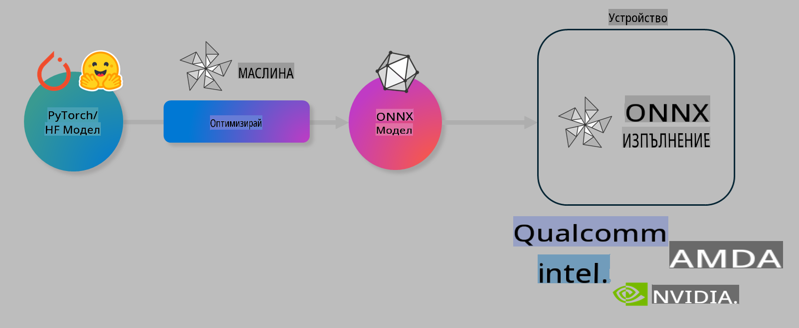

# Лаборатория. Оптимизиране на AI модели за inference на устройство

## Въведение 

> [!IMPORTANT]
> Тази лаборатория изисква **Nvidia A10 или A100 GPU** с инсталирани съответните драйвери и CUDA toolkit (версия 12+).

> [!NOTE]
> Това е **35-минутна** лаборатория, която ще ви даде практически опит с основните концепции за оптимизиране на модели за inference на устройство с помощта на OLIVE.

## Цели на обучението

До края на тази лаборатория ще можете да използвате OLIVE за:

- Квантизиране на AI модел с метода за квантизация AWQ.
- Файн-тюнинг на AI модел за конкретна задача.
- Генериране на LoRA адаптери (файн-тюнинг модел) за ефективен inference на устройство с ONNX Runtime.

### Какво е Olive

Olive (*O*NNX *live*) е инструмент за оптимизация на модели с придружаващ CLI, който ви позволява да подготвяте модели за ONNX runtime +++https://onnxruntime.ai+++ с високо качество и производителност.



Входът за Olive обикновено е PyTorch или Hugging Face модел, а изходът е оптимизиран ONNX модел, който се изпълнява на устройство (целево за разгръщане), използващо ONNX runtime. Olive оптимизира модела за AI ускорителя (NPU, GPU, CPU) на целевото устройство, предоставен от хардуерен доставчик като Qualcomm, AMD, Nvidia или Intel.

Olive изпълнява *workflow*, който е подредена последователност от индивидуални задачи за оптимизация на модели, наречени *passes* - примери за passes включват: компресия на модел, улавяне на граф, квантизация, оптимизация на граф. Всеки pass има набор от параметри, които могат да бъдат настроени за постигане на най-добрите метрики, например точност и латентност, които се оценяват от съответния оценител. Olive използва стратегия за търсене, която използва алгоритъм за търсене, за да автоматизира настройването на всеки pass поотделно или на група passes заедно.

#### Предимства на Olive

- **Намаляване на разочарованието и времето** за проби и грешки с различни техники за оптимизация на граф, компресия и квантизация. Дефинирайте вашите изисквания за качество и производителност и оставете Olive автоматично да намери най-добрия модел за вас.
- **40+ вградени компоненти за оптимизация на модели**, обхващащи авангардни техники в квантизация, компресия, оптимизация на граф и файн-тюнинг.
- **Лесен за използване CLI** за често срещани задачи по оптимизация на модели. Например, olive quantize, olive auto-opt, olive finetune.
- Вградена опаковка и разгръщане на модели.
- Поддръжка за генериране на модели за **Multi LoRA serving**.
- Създаване на workflows с помощта на YAML/JSON за оркестриране на задачи по оптимизация и разгръщане на модели.
- Интеграция с **Hugging Face** и **Azure AI**.
- Вградена **кешираща** механика за **спестяване на разходи**.

## Инструкции за лабораторията
> [!NOTE]
> Моля, уверете се, че сте настроили вашия Azure AI Hub и проект и сте конфигурирали вашия A100 изчислителен ресурс според указанията в Лаборатория 1.

### Стъпка 0: Свържете се с вашия Azure AI Compute

Ще се свържете с Azure AI изчислителния ресурс, използвайки функцията за дистанционен достъп в **VS Code.** 

1. Отворете вашето настолно приложение **VS Code**:
1. Отворете **палитрата за команди** с **Shift+Ctrl+P**.
1. В палитрата за команди потърсете **AzureML - remote: Connect to compute instance in New Window**.
1. Следвайте инструкциите на екрана, за да се свържете с изчислителния ресурс. Това ще включва избиране на вашия Azure Subscription, Resource Group, Project и Compute име, настроени в Лаборатория 1.
1. След като се свържете с вашия Azure ML Compute, това ще бъде показано в **долния ляв ъгъл на Visual Code** `><Azure ML: Compute Name`

### Стъпка 1: Клонирайте това хранилище

В VS Code можете да отворите нов терминал с **Ctrl+J** и да клонирате това хранилище:

В терминала трябва да видите подкана

```
azureuser@computername:~/cloudfiles/code$ 
```
Клонирайте решението 

```bash
cd ~/localfiles
git clone https://github.com/microsoft/phi-3cookbook.git
```

### Стъпка 2: Отворете папката в VS Code

За да отворите VS Code в съответната папка, изпълнете следната команда в терминала, която ще отвори нов прозорец:

```bash
code phi-3cookbook/code/04.Finetuning/Olive-lab
```

Алтернативно, можете да отворите папката, като изберете **File** > **Open Folder**. 

### Стъпка 3: Зависимости

Отворете прозорец на терминала в VS Code във вашия Azure AI Compute Instance (съвет: **Ctrl+J**) и изпълнете следните команди, за да инсталирате зависимостите:

```bash
conda create -n olive-ai python=3.11 -y
conda activate olive-ai
pip install -r requirements.txt
az extension remove -n azure-cli-ml
az extension add -n ml
```

> [!NOTE]
> Инсталирането на всички зависимости ще отнеме ~5 минути.

В тази лаборатория ще изтегляте и качвате модели в каталога с модели на Azure AI. За да имате достъп до каталога с модели, ще трябва да влезете в Azure, използвайки:

```bash
az login
```

> [!NOTE]
> При влизане ще бъдете помолени да изберете вашия абонамент. Уверете се, че сте избрали абонамента, предоставен за тази лаборатория.

### Стъпка 4: Изпълнение на Olive команди 

Отворете прозорец на терминала в VS Code във вашия Azure AI Compute Instance (съвет: **Ctrl+J**) и се уверете, че `olive-ai` conda средата е активирана:

```bash
conda activate olive-ai
```

След това изпълнете следните Olive команди в командния ред.

1. **Инспектирайте данните:** В този пример ще направите файн-тюнинг на Phi-3.5-Mini модела, така че той да бъде специализиран в отговарянето на въпроси, свързани с пътувания. Кодът по-долу показва първите няколко записа от набора данни, които са във формат JSON lines:
   
    ```bash
    head data/data_sample_travel.jsonl
    ```
1. **Квантизация на модела:** Преди да тренирате модела, първо го квантизирате със следната команда, която използва техника, наречена Active Aware Quantization (AWQ) +++https://arxiv.org/abs/2306.00978+++. AWQ квантизира теглата на модела, като взема предвид активациите, произведени по време на inference. Това означава, че процесът на квантизация отчита действителното разпределение на данните в активациите, което води до по-добро запазване на точността на модела в сравнение с традиционните методи за квантизация на тегла.
    
    ```bash
    olive quantize \
       --model_name_or_path microsoft/Phi-3.5-mini-instruct \
       --trust_remote_code \
       --algorithm awq \
       --output_path models/phi/awq \
       --log_level 1
    ```
    
    Квантизацията AWQ отнема **~8 минути**, като **намалява размера на модела от ~7.5GB до ~2.5GB**.
   
   В тази лаборатория ви показваме как да използвате модели от Hugging Face (например: `microsoft/Phi-3.5-mini-instruct`). However, Olive also allows you to input models from the Azure AI catalog by updating the `model_name_or_path` argument to an Azure AI asset ID (for example:  `azureml://registries/azureml/models/Phi-3.5-mini-instruct/versions/4`). 

1. **Train the model:** Next, the `olive finetune` командата прави файн-тюнинг на квантизирания модел. Квантизирането на модела *преди* файн-тюнинг вместо след това дава по-добра точност, тъй като процесът на файн-тюнинг възстановява част от загубата от квантизацията.
    
    ```bash
    olive finetune \
        --method lora \
        --model_name_or_path models/phi/awq \
        --data_files "data/data_sample_travel.jsonl" \
        --data_name "json" \
        --text_template "<|user|>\n{prompt}<|end|>\n<|assistant|>\n{response}<|end|>" \
        --max_steps 100 \
        --output_path ./models/phi/ft \
        --log_level 1
    ```
    
    Файн-тюнингът отнема **~6 минути** (с 100 стъпки).

1. **Оптимизация:** След като моделът е трениран, можете да го оптимизирате, използвайки Olive командата `auto-opt` command, which will capture the ONNX graph and automatically perform a number of optimizations to improve the model performance for CPU by compressing the model and doing fusions. It should be noted, that you can also optimize for other devices such as NPU or GPU by just updating the `--device` and `--provider` аргументи - но за целите на тази лаборатория ще използваме CPU.

    ```bash
    olive auto-opt \
       --model_name_or_path models/phi/ft/model \
       --adapter_path models/phi/ft/adapter \
       --device cpu \
       --provider CPUExecutionProvider \
       --use_ort_genai \
       --output_path models/phi/onnx-ao \
       --log_level 1
    ```
    
    Оптимизацията отнема **~5 минути**.

### Стъпка 5: Бърз тест на inference на модела

За да тествате inference на модела, създайте Python файл в папката си с име **app.py** и копирайте и поставете следния код:

```python
import onnxruntime_genai as og
import numpy as np

print("loading model and adapters...", end="", flush=True)
model = og.Model("models/phi/onnx-ao/model")
adapters = og.Adapters(model)
adapters.load("models/phi/onnx-ao/model/adapter_weights.onnx_adapter", "travel")
print("DONE!")

tokenizer = og.Tokenizer(model)
tokenizer_stream = tokenizer.create_stream()

params = og.GeneratorParams(model)
params.set_search_options(max_length=100, past_present_share_buffer=False)
user_input = "what is the best thing to see in chicago"
params.input_ids = tokenizer.encode(f"<|user|>\n{user_input}<|end|>\n<|assistant|>\n")

generator = og.Generator(model, params)

generator.set_active_adapter(adapters, "travel")

print(f"{user_input}")

while not generator.is_done():
    generator.compute_logits()
    generator.generate_next_token()

    new_token = generator.get_next_tokens()[0]
    print(tokenizer_stream.decode(new_token), end='', flush=True)

print("\n")
```

Изпълнете кода, използвайки:

```bash
python app.py
```

### Стъпка 6: Качване на модела в Azure AI

Качването на модела в хранилище за модели на Azure AI го прави споделим с други членове на вашия екип за разработка и също така управлява версиите на модела. За да качите модела, изпълнете следната команда:

> [!NOTE]
> Актуализирайте `{}` placeholders with the name of your resource group and Azure AI Project Name. 

To find your resource group `"resourceGroup"и името на Azure AI Project, изпълнете следната команда 

```
az ml workspace show
```

Или като отидете на +++ai.azure.com+++ и изберете **management center** **project** **overview**

Актуализирайте `{}` местата със съответното име на вашата ресурсна група и име на Azure AI Project.

```bash
az ml model create \
    --name ft-for-travel \
    --version 1 \
    --path ./models/phi/onnx-ao \
    --resource-group {RESOURCE_GROUP_NAME} \
    --workspace-name {PROJECT_NAME}
```
След това можете да видите качения си модел и да го разположите на https://ml.azure.com/model/list

**Отказ от отговорност**:  
Този документ е преведен с помощта на машинни AI услуги за превод. Въпреки че се стремим към точност, моля, имайте предвид, че автоматизираните преводи може да съдържат грешки или неточности. Оригиналният документ на неговия изходен език трябва да се счита за авторитетния източник. За критична информация се препоръчва професионален човешки превод. Не носим отговорност за каквито и да било недоразумения или погрешни тълкувания, произтичащи от използването на този превод.