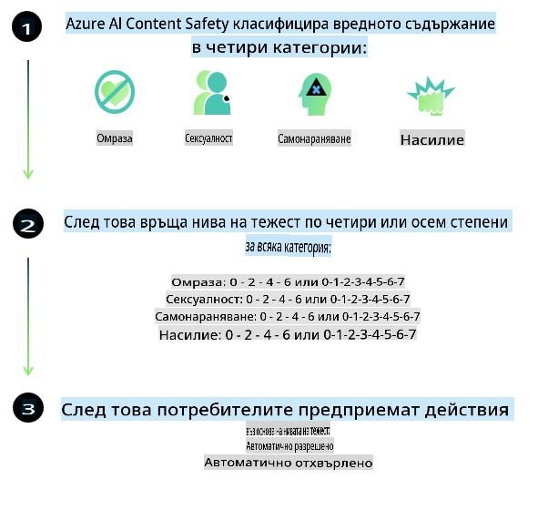
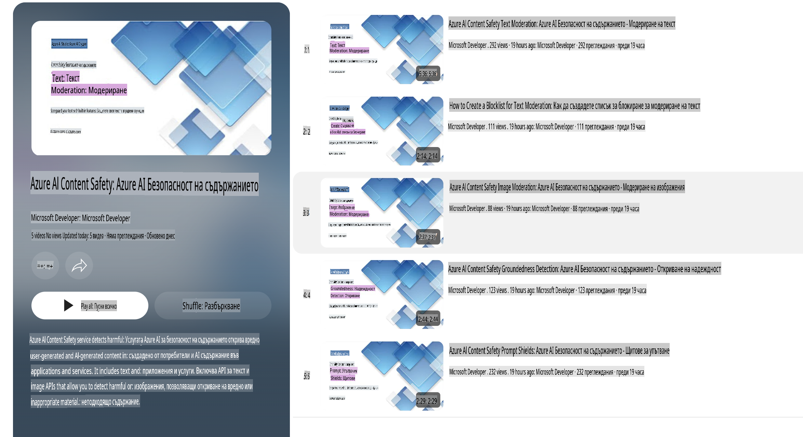

# AI безопасност за моделите Phi

Семейството от модели Phi е разработено в съответствие с [Microsoft Responsible AI Standard](https://query.prod.cms.rt.microsoft.com/cms/api/am/binary/RE5cmFl), който представлява набор от изисквания за цялата компания, базирани на следните шест принципа: отчетност, прозрачност, справедливост, надеждност и безопасност, поверителност и сигурност, както и приобщаване, които формират [принципите за отговорен AI на Microsoft](https://www.microsoft.com/ai/responsible-ai).

Както и при предишните модели Phi, е приложен многопластов подход за оценка на безопасността и пост-обучение за безопасност, с допълнителни мерки, взети предвид многоезичните възможности на това издание. Нашият подход към обучението и оценката на безопасността, включително тестване на множество езици и категории на риска, е описан в [Phi Safety Post-Training Paper](https://arxiv.org/abs/2407.13833). Въпреки че моделите Phi се възползват от този подход, разработчиците трябва да прилагат най-добрите практики за отговорен AI, включително картографиране, измерване и смекчаване на рисковете, свързани с конкретния случай на употреба и културния и езиковия контекст.

## Най-добри практики

Както и другите модели, семейството модели Phi може потенциално да се държи по начини, които са несправедливи, ненадеждни или обидни.

Някои от ограничените поведения на SLM и LLM, за които трябва да сте наясно, включват:

- **Качество на услугата:** Моделите Phi са обучени основно на английски текст. Езици, различни от английския, ще показват по-слаби резултати. Варианти на английския с по-малко представяне в обучителните данни може да имат по-слаби резултати в сравнение със стандартния американски английски.
- **Представяне на вреди и затвърждаване на стереотипи:** Тези модели могат да пре- или недопредставят групи от хора, да заличават представянето на определени групи или да затвърждават унизителни или негативни стереотипи. Въпреки пост-обучението за безопасност, тези ограничения може да продължат да съществуват поради различни нива на представяне на различни групи или разпространението на примери за негативни стереотипи в обучителните данни, които отразяват реални модели и обществени предразсъдъци.
- **Неподходящо или обидно съдържание:** Тези модели могат да генерират други видове неподходящо или обидно съдържание, което може да ги направи неподходящи за използване в чувствителни контексти без допълнителни смекчаващи мерки, специфични за конкретния случай.
- **Надеждност на информацията:** Езиковите модели могат да генерират несмислено съдържание или да създават съдържание, което звучи правдоподобно, но е неточно или остаряло.
- **Ограничен обхват за код:** По-голямата част от обучителните данни на Phi-3 са базирани на Python и използват общи пакети като "typing, math, random, collections, datetime, itertools". Ако моделът генерира Python скриптове, които използват други пакети или скриптове на други езици, силно препоръчваме потребителите ръчно да проверяват всички използвани API.

Разработчиците трябва да прилагат най-добрите практики за отговорен AI и са отговорни за осигуряването на съответствието на конкретния случай на употреба с приложимите закони и регулации (например поверителност, търговия и др.).

## Съображения за отговорен AI

Както и другите езикови модели, моделите от серията Phi могат потенциално да се държат по начини, които са несправедливи, ненадеждни или обидни. Някои от ограничените поведения, за които трябва да сте наясно, включват:

**Качество на услугата:** Моделите Phi са обучени основно на английски текст. Езици, различни от английския, ще показват по-слаби резултати. Варианти на английския с по-малко представяне в обучителните данни може да имат по-слаби резултати в сравнение със стандартния американски английски.

**Представяне на вреди и затвърждаване на стереотипи:** Тези модели могат да пре- или недопредставят групи от хора, да заличават представянето на определени групи или да затвърждават унизителни или негативни стереотипи. Въпреки пост-обучението за безопасност, тези ограничения може да продължат да съществуват поради различни нива на представяне на различни групи или разпространението на примери за негативни стереотипи в обучителните данни, които отразяват реални модели и обществени предразсъдъци.

**Неподходящо или обидно съдържание:** Тези модели могат да генерират други видове неподходящо или обидно съдържание, което може да ги направи неподходящи за използване в чувствителни контексти без допълнителни смекчаващи мерки, специфични за конкретния случай.  
**Надеждност на информацията:** Езиковите модели могат да генерират несмислено съдържание или да създават съдържание, което звучи правдоподобно, но е неточно или остаряло.

**Ограничен обхват за код:** По-голямата част от обучителните данни на Phi-3 са базирани на Python и използват общи пакети като "typing, math, random, collections, datetime, itertools". Ако моделът генерира Python скриптове, които използват други пакети или скриптове на други езици, силно препоръчваме потребителите ръчно да проверяват всички използвани API.

Разработчиците трябва да прилагат най-добрите практики за отговорен AI и са отговорни за осигуряването на съответствието на конкретния случай на употреба с приложимите закони и регулации (например поверителност, търговия и др.). Важни области за разглеждане включват:

**Разпределение:** Моделите може да не са подходящи за сценарии, които могат да имат значително въздействие върху правния статус или разпределението на ресурси или възможности за живот (например жилища, заетост, кредити и др.) без допълнителни оценки и техники за премахване на предразсъдъци.

**Сценарии с висок риск:** Разработчиците трябва да оценят пригодността на използването на модели в сценарии с висок риск, където несправедливи, ненадеждни или обидни резултати могат да бъдат изключително скъпи или да доведат до вреда. Това включва предоставяне на съвети в чувствителни или експертни области, където точността и надеждността са критични (например правни или здравни съвети). Допълнителни предпазни мерки трябва да бъдат внедрени на ниво приложение според контекста на внедряване.

**Дезинформация:** Моделите може да генерират неточна информация. Разработчиците трябва да следват най-добрите практики за прозрачност и да информират крайните потребители, че взаимодействат с AI система. На ниво приложение разработчиците могат да изградят механизми за обратна връзка и канали за обосноваване на отговорите с информация, специфична за случая, техника, известна като Retrieval Augmented Generation (RAG).

**Генериране на вредно съдържание:** Разработчиците трябва да оценяват изходните резултати спрямо техния контекст и да използват налични класификатори за безопасност или персонализирани решения, подходящи за техния случай на употреба.

**Злоупотреба:** Други форми на злоупотреба, като измами, спам или създаване на зловреден софтуер, са възможни, и разработчиците трябва да гарантират, че техните приложения не нарушават приложимите закони и регулации.

### Фино настройване и AI безопасност на съдържанието

След фино настройване на модел, силно препоръчваме използването на [Azure AI Content Safety](https://learn.microsoft.com/azure/ai-services/content-safety/overview) мерки за наблюдение на съдържанието, генерирано от моделите, идентифициране и блокиране на потенциални рискове, заплахи и проблеми с качеството.

[Azure AI Content Safety](https://learn.microsoft.com/azure/ai-services/content-safety/overview) поддържа както текстово, така и визуално съдържание. Може да бъде внедрен в облака, изолирани контейнери и на edge/вградени устройства.

## Преглед на Azure AI Content Safety

Azure AI Content Safety не е универсално решение; то може да бъде персонализирано, за да съответства на специфичните политики на бизнеса. Освен това, неговите многоезични модели му позволяват да разбира множество езици едновременно.

- **Azure AI Content Safety**
- **Microsoft Developer**
- **5 видеа**

Услугата Azure AI Content Safety открива вредно съдържание, генерирано от потребители или AI, в приложения и услуги. Тя включва API за текст и изображения, които позволяват откриване на вредни или неподходящи материали.

[AI Content Safety Playlist](https://www.youtube.com/playlist?list=PLlrxD0HtieHjaQ9bJjyp1T7FeCbmVcPkQ)

**Отказ от отговорност**:  
Този документ е преведен с помощта на машинни AI услуги за превод. Въпреки че се стремим към точност, моля, имайте предвид, че автоматизираните преводи може да съдържат грешки или неточности. Оригиналният документ на неговия оригинален език трябва да се счита за авторитетния източник. За критична информация се препоръчва професионален човешки превод. Не носим отговорност за каквито и да е недоразумения или погрешни интерпретации, възникнали в резултат на използването на този превод.