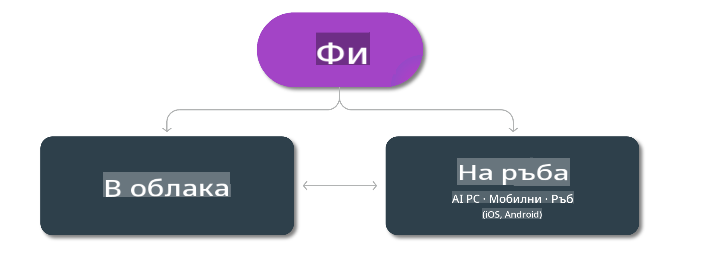

# Phi Модели и Наличност на различни платформи

## Сценарии за Edge и Cloud

## Наличност на модели и ресурси

| | | | | | | | | |
|-|-|-|-|-|-|-|-|-|
|Модел|Вход|Дължина на съдържанието|Azure AI (MaaS)|Azure ML (MaaP)|ONNX|Hugging Face|Ollama|Nvidia NIM|
|Phi-3-vision-128k-instruct|Текст+Изображение|128k|[Playground & Deployment](https://ai.azure.com/explore/models/Phi-3-vision-128k-instruct/version/2/registry/azureml)|[Playground, Deployment & Finetuning](https://ml.azure.com/registries/azureml/models/Phi-3-vision-128k-instruct/version/2)|[CUDA](https://huggingface.co/microsoft/Phi-3-vision-128k-instruct-onnx-cuda/tree/main),[CPU](https://huggingface.co/microsoft/Phi-3-vision-128k-instruct-onnx-cpu/tree/main), [DirectML](https://huggingface.co/microsoft/Phi-3-vision-128k-instruct-onnx-directml/tree/main)|[Изтегляне](https://huggingface.co/microsoft/Phi-3-vision-128k-instruct)|-NA-|[NIM APIs](https://build.nvidia.com/microsoft/phi-3-vision-128k-instruct)|
|Phi-3-mini-4k-instruct|Текст|4k|[Playground & Deployment](https://aka.ms/phi3-mini-4k-azure-ml)|[Playground, Deployment](https://aka.ms/phi3-mini-4k-azure-ml) & Finetuning|[CUDA](https://huggingface.co/microsoft/Phi-3-mini-4k-instruct-onnx), [Web](https://huggingface.co/microsoft/Phi-3-mini-4k-instruct-onnx)|[Playground & Изтегляне](https://huggingface.co/chat/models/microsoft/Phi-3-mini-4k-instruct)|[GGUF](https://huggingface.co/microsoft/Phi-3-mini-4k-instruct-gguf)|[NIM APIs](https://build.nvidia.com/microsoft/phi-3-mini-4k)|
|Phi-3-mini-128k-instruct|Текст|128k|[Playground & Deployment](https://ai.azure.com/explore/models/Phi-3-mini-128k-instruct/version/9/registry/azureml)|[Playground, Deployment](https://ai.azure.com/explore/models/Phi-3-mini-128k-instruct/version/9/registry/azureml) & Finetuning|[CUDA](https://huggingface.co/microsoft/Phi-3-mini-128k-instruct-onnx)|[Изтегляне](https://huggingface.co/microsoft/Phi-3-mini-128k-instruct-onnx)|-NA-|[NIM APIs](https://build.nvidia.com/microsoft/phi-3-mini)|
|Phi-3-small-8k-instruct|Текст|8k|[Playground & Deployment](https://ml.azure.com/registries/azureml/models/Phi-3-small-8k-instruct/version/2)|[Playground, Deployment](https://ai.azure.com/explore/models/Phi-3-small-8k-instruct/version/2/registry/azureml) & Finetuning|[CUDA](https://huggingface.co/microsoft/Phi-3-small-8k-instruct-onnx-cuda)|[Изтегляне](https://huggingface.co/microsoft/Phi-3-small-8k-instruct-onnx-cuda)|-NA-|[NIM APIs](https://build.nvidia.com/microsoft/phi-3-small-8k-instruct?docker=false)|
|Phi-3-small-128k-instruct|Текст|128k|[Playground & Deployment](https://ai.azure.com/explore/models/Phi-3-small-128k-instruct/version/2/registry/azureml)|[Playground, Deployment](https://ml.azure.com/registries/azureml/models/Phi-3-small-128k-instruct/version/2) & Finetuning|[CUDA](https://huggingface.co/microsoft/Phi-3-medium-128k-instruct-onnx-cuda)|[Изтегляне](https://huggingface.co/microsoft/Phi-3-small-128k-instruct)|-NA-|[NIM APIs](https://build.nvidia.com/microsoft/phi-3-small-128k-instruct?docker=false)|
|Phi-3-medium-4k-instruct|Текст|4k|[Playground & Deployment](https://huggingface.co/microsoft/Phi-3-medium-4k-instruct)|[Playground, Deployment](https://ml.azure.com/registries/azureml/models/Phi-3-medium-4k-instruct/version/2) и Файнтюнинг|[CUDA](https://huggingface.co/microsoft/Phi-3-medium-4k-instruct-onnx-cuda/tree/main), [CPU](https://huggingface.co/microsoft/Phi-3-medium-4k-instruct-onnx-cpu/tree/main), [DirectML](https://huggingface.co/microsoft/Phi-3-medium-4k-instruct-onnx-directml/tree/main)|[Изтегляне](https://huggingface.co/microsoft/Phi-3-medium-4k-instruct)|-Няма-|[NIM APIs](https://build.nvidia.com/microsoft/phi-3-medium-4k-instruct?docker=false)|
|Phi-3-medium-128k-instruct|Текст|128k|[Playground & Deployment](https://ai.azure.com/explore/models/Phi-3-medium-128k-instruct/version/2)|[Playground, Deployment](https://ml.azure.com/registries/azureml/models/Phi-3-medium-128k-instruct/version/2) и Файнтюнинг|[CUDA](https://huggingface.co/microsoft/Phi-3-medium-128k-instruct-onnx-cuda/tree/main), [CPU](https://huggingface.co/microsoft/Phi-3-medium-128k-instruct-onnx-cpu/tree/main), [DirectML](https://huggingface.co/microsoft/Phi-3-medium-128k-instruct-onnx-directml/tree/main)|[Изтегляне](https://huggingface.co/microsoft/Phi-3-medium-128k-instruct)|-Няма-|-Няма-|

**Отказ от отговорност**:  
Този документ е преведен с помощта на машинни AI услуги за превод. Въпреки че се стремим към точност, моля, имайте предвид, че автоматизираните преводи може да съдържат грешки или неточности. Оригиналният документ на неговия изходен език трябва да се счита за авторитетен източник. За критична информация се препоръчва професионален превод от човек. Ние не носим отговорност за каквито и да било недоразумения или погрешни интерпретации, произтичащи от използването на този превод.