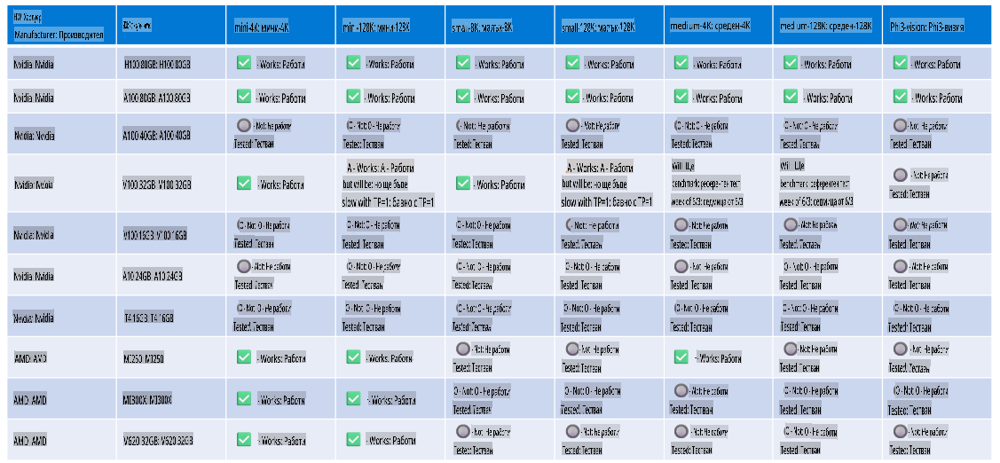

# Поддръжка на хардуер Phi

Microsoft Phi е оптимизиран за ONNX Runtime и поддържа Windows DirectML. Работи добре на различни видове хардуер, включително GPU, CPU и дори мобилни устройства.

## Хардуер на устройства
Конкретно поддържаният хардуер включва:

- GPU SKU: RTX 4090 (DirectML)
- GPU SKU: 1 A100 80GB (CUDA)
- CPU SKU: Standard F64s v2 (64 vCPU, 128 GiB памет)

## Мобилни SKU

- Android - Samsung Galaxy S21
- Apple iPhone 14 или по-нов с процесор A16/A17

## Спецификации на хардуера Phi

- Минимални изисквания за конфигурация.
- Windows: GPU, съвместим с DirectX 12, и минимум 4GB комбинирана RAM памет

CUDA: NVIDIA GPU с изчислителна способност >= 7.02



## Изпълнение на onnxruntime на множество GPU

В момента наличните Phi ONNX модели са само за 1 GPU. Възможно е да се поддържа мулти-GPU за Phi модел, но ORT с 2 GPU не гарантира, че ще осигури по-голям капацитет в сравнение с 2 инстанции на ORT. Моля, вижте [ONNX Runtime](https://onnxruntime.ai/) за най-новите актуализации.

На [Build 2024 екипът на GenAI ONNX](https://youtu.be/WLW4SE8M9i8?si=EtG04UwDvcjunyfC) обяви, че са активирали мулти-инстанции вместо мулти-GPU за Phi модели.

В момента това ви позволява да стартирате една onnxruntime или onnxruntime-genai инстанция с променливата на средата CUDA_VISIBLE_DEVICES по следния начин:

```Python
CUDA_VISIBLE_DEVICES=0 python infer.py
CUDA_VISIBLE_DEVICES=1 python infer.py
```

Чувствайте се свободни да изследвате Phi допълнително в [Azure AI Foundry](https://ai.azure.com)

**Отказ от отговорност**:  
Този документ е преведен с помощта на машинни AI услуги за превод. Въпреки че се стремим към точност, имайте предвид, че автоматизираните преводи може да съдържат грешки или неточности. Оригиналният документ на неговия оригинален език трябва да се счита за авторитетен източник. За критична информация се препоръчва професионален превод от човек. Ние не носим отговорност за никакви недоразумения или погрешни интерпретации, произтичащи от използването на този превод.