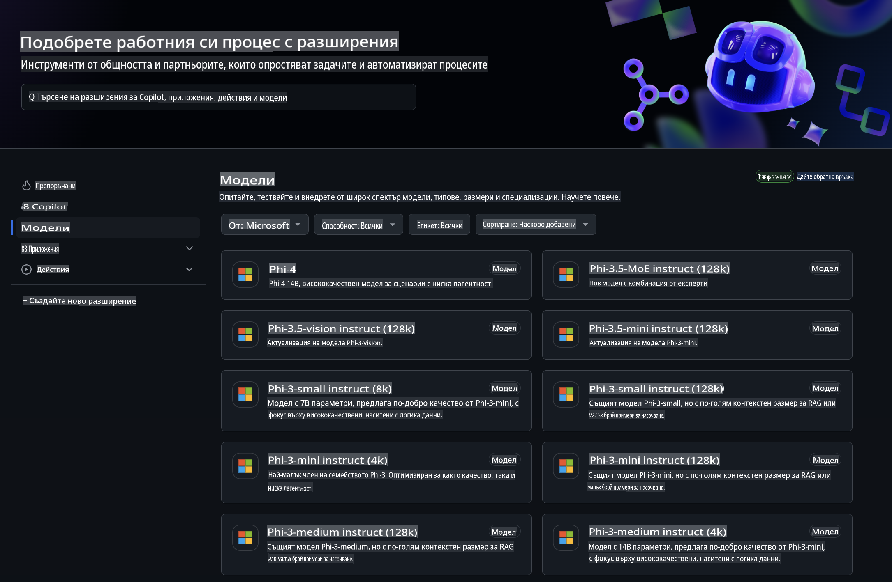
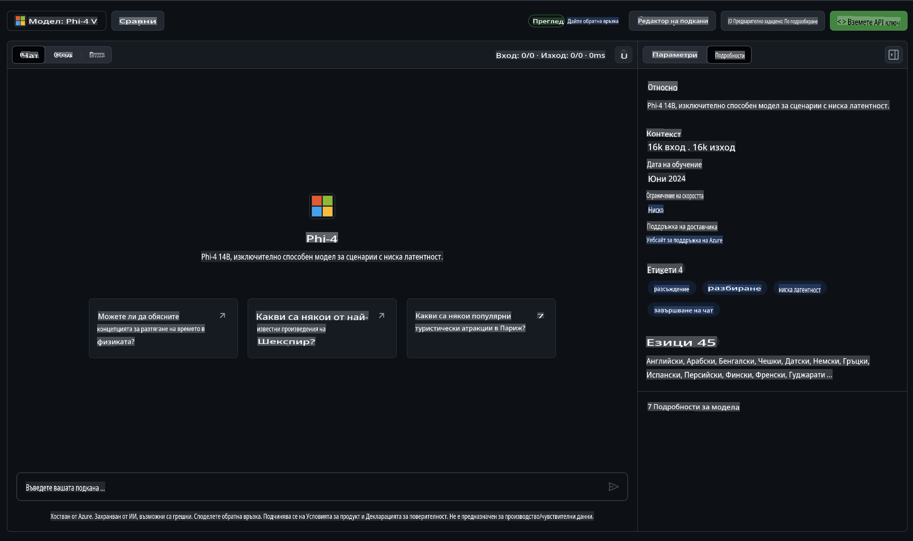
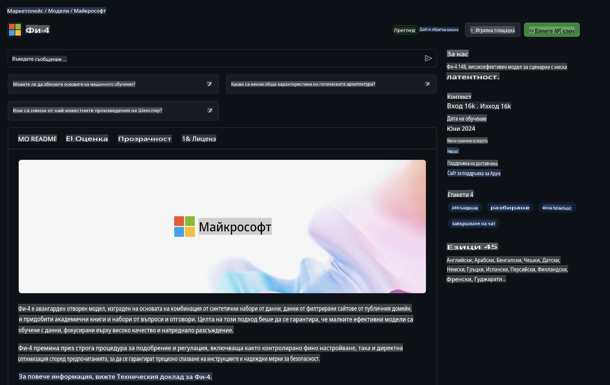

## Семейство Phi в GitHub Models

Добре дошли в [GitHub Models](https://github.com/marketplace/models)! Всичко е готово, за да изследвате AI модели, хоствани в Azure AI.



За повече информация относно наличните модели в GitHub Models, разгледайте [GitHub Model Marketplace](https://github.com/marketplace/models).

## Налични модели

Всеки модел разполага със специална тестова среда и примерен код.



### Семейство Phi в каталога на GitHub Model

- [Phi-4](https://github.com/marketplace/models/azureml/Phi-4)

- [Phi-3.5-MoE instruct (128k)](https://github.com/marketplace/models/azureml/Phi-3-5-MoE-instruct)

- [Phi-3.5-vision instruct (128k)](https://github.com/marketplace/models/azureml/Phi-3-5-vision-instruct)

- [Phi-3.5-mini instruct (128k)](https://github.com/marketplace/models/azureml/Phi-3-5-mini-instruct)

- [Phi-3-Medium-128k-Instruct](https://github.com/marketplace/models/azureml/Phi-3-medium-128k-instruct)

- [Phi-3-medium-4k-instruct](https://github.com/marketplace/models/azureml/Phi-3-medium-4k-instruct)

- [Phi-3-mini-128k-instruct](https://github.com/marketplace/models/azureml/Phi-3-mini-128k-instruct)

- [Phi-3-mini-4k-instruct](https://github.com/marketplace/models/azureml/Phi-3-mini-4k-instruct)

- [Phi-3-small-128k-instruct](https://github.com/marketplace/models/azureml/Phi-3-small-128k-instruct)

- [Phi-3-small-8k-instruct](https://github.com/marketplace/models/azureml/Phi-3-small-8k-instruct)

## Начало

Има няколко основни примера, които са готови за изпълнение. Можете да ги намерите в директорията със sample файлове. Ако искате директно да преминете към любимия си език, можете да намерите примерите на следните езици:

- Python
- JavaScript
- C#
- Java
- cURL

Съществува също специална среда Codespaces за изпълнение на примерите и моделите.


## Примерен код

По-долу са дадени примерни кодови откъси за няколко сценария. За допълнителна информация относно Azure AI Inference SDK, вижте пълната документация и примерите.

## Настройка

1. Създайте персонален достъп токен  
Не е необходимо да задавате никакви разрешения за токена. Обърнете внимание, че токенът ще бъде изпратен до услуга на Microsoft.

За да използвате кодовите откъси по-долу, създайте променлива на средата, за да зададете токена си като ключ за клиентския код.

Ако използвате bash:  
```
export GITHUB_TOKEN="<your-github-token-goes-here>"
```  
Ако сте в PowerShell:  

```
$Env:GITHUB_TOKEN="<your-github-token-goes-here>"
```  

Ако използвате команден ред на Windows:  

```
set GITHUB_TOKEN=<your-github-token-goes-here>
```  

## Пример с Python

### Инсталиране на зависимости  
Инсталирайте Azure AI Inference SDK с помощта на pip (Изисква: Python >=3.8):  

```
pip install azure-ai-inference
```  

### Изпълнение на основен примерен код  

Този пример демонстрира основно извикване на API за завършване на чат. Той използва GitHub AI модел и вашия GitHub токен. Извикването е синхронно.  

```python
import os
from azure.ai.inference import ChatCompletionsClient
from azure.ai.inference.models import SystemMessage, UserMessage
from azure.core.credentials import AzureKeyCredential

endpoint = "https://models.inference.ai.azure.com"
model_name = "Phi-4"
token = os.environ["GITHUB_TOKEN"]

client = ChatCompletionsClient(
    endpoint=endpoint,
    credential=AzureKeyCredential(token),
)

response = client.complete(
    messages=[
        UserMessage(content="I have $20,000 in my savings account, where I receive a 4% profit per year and payments twice a year. Can you please tell me how long it will take for me to become a millionaire? Also, can you please explain the math step by step as if you were explaining it to an uneducated person?"),
    ],
    temperature=0.4,
    top_p=1.0,
    max_tokens=2048,
    model=model_name
)

print(response.choices[0].message.content)
```  

### Изпълнение на многократно взаимодействие  

Този пример демонстрира многократно взаимодействие с API за завършване на чат. Когато използвате модела за чат приложение, трябва да управлявате историята на разговора и да изпращате последните съобщения към модела.  

```
import os
from azure.ai.inference import ChatCompletionsClient
from azure.ai.inference.models import AssistantMessage, SystemMessage, UserMessage
from azure.core.credentials import AzureKeyCredential

token = os.environ["GITHUB_TOKEN"]
endpoint = "https://models.inference.ai.azure.com"
# Replace Model_Name
model_name = "Phi-4"

client = ChatCompletionsClient(
    endpoint=endpoint,
    credential=AzureKeyCredential(token),
)

messages = [
    SystemMessage(content="You are a helpful assistant."),
    UserMessage(content="What is the capital of France?"),
    AssistantMessage(content="The capital of France is Paris."),
    UserMessage(content="What about Spain?"),
]

response = client.complete(messages=messages, model=model_name)

print(response.choices[0].message.content)
```  

### Поточно предаване на изхода  

За по-добро потребителско изживяване е препоръчително да предавате отговорите от модела поточно, така че първият токен да се появи бързо и да избегнете чакане за дълги отговори.  

```
import os
from azure.ai.inference import ChatCompletionsClient
from azure.ai.inference.models import SystemMessage, UserMessage
from azure.core.credentials import AzureKeyCredential

token = os.environ["GITHUB_TOKEN"]
endpoint = "https://models.inference.ai.azure.com"
# Replace Model_Name
model_name = "Phi-4"

client = ChatCompletionsClient(
    endpoint=endpoint,
    credential=AzureKeyCredential(token),
)

response = client.complete(
    stream=True,
    messages=[
        SystemMessage(content="You are a helpful assistant."),
        UserMessage(content="Give me 5 good reasons why I should exercise every day."),
    ],
    model=model_name,
)

for update in response:
    if update.choices:
        print(update.choices[0].delta.content or "", end="")

client.close()
```  

## Безплатна употреба и ограничения на GitHub Models  



[Ограниченията за тестовата среда и безплатното използване на API](https://docs.github.com/en/github-models/prototyping-with-ai-models#rate-limits) са предназначени да ви помогнат да експериментирате с моделите и да прототипирате вашето AI приложение. За употреба извън тези ограничения и за мащабиране на вашето приложение, трябва да осигурите ресурси от Azure акаунт и да се удостоверите оттам, вместо да използвате персоналния си достъп токен от GitHub. Не е необходимо да променяте нищо друго в кода си. Използвайте този линк, за да разберете как да надхвърлите безплатните лимити в Azure AI.

### Уточнения  

Помнете, че когато взаимодействате с модел, експериментирате с AI, така че са възможни грешки в съдържанието.  

Функцията е обект на различни ограничения (включително заявки на минута, заявки на ден, токени на заявка и едновременни заявки) и не е предназначена за производствени случаи на употреба.  

GitHub Models използва Azure AI Content Safety. Тези филтри не могат да бъдат изключени като част от преживяването с GitHub Models. Ако решите да използвате модели чрез платена услуга, моля, конфигурирайте филтрите за съдържание според вашите изисквания.  

Тази услуга е обект на Предварителните условия на GitHub.  

**Отказ от отговорност**:  
Този документ е преведен с помощта на автоматизирани AI услуги за превод. Въпреки че се стремим към точност, моля, имайте предвид, че автоматизираните преводи може да съдържат грешки или неточности. Оригиналният документ на неговия изходен език трябва да се счита за авторитетния източник. За критична информация се препоръчва професионален превод от човек. Не носим отговорност за каквито и да е недоразумения или погрешни интерпретации, произтичащи от използването на този превод.