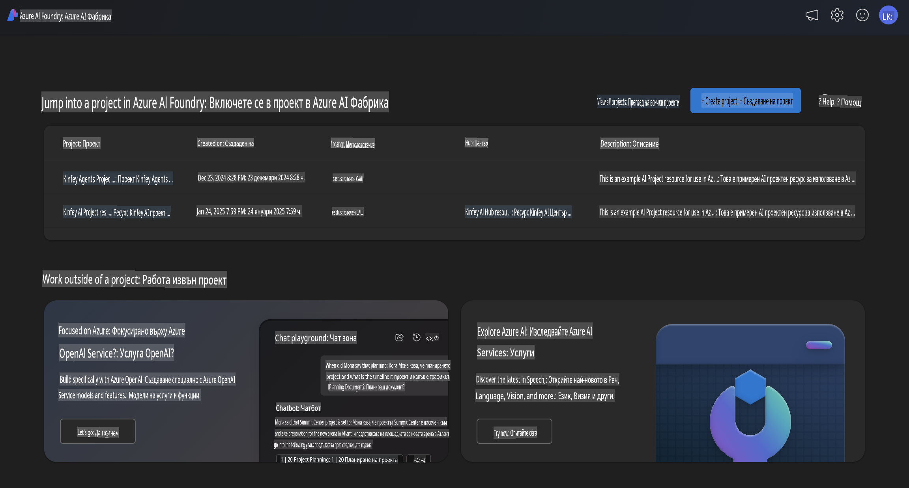
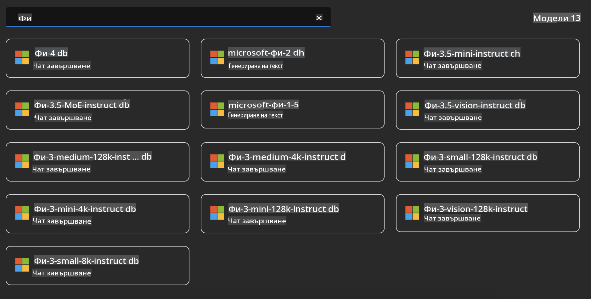
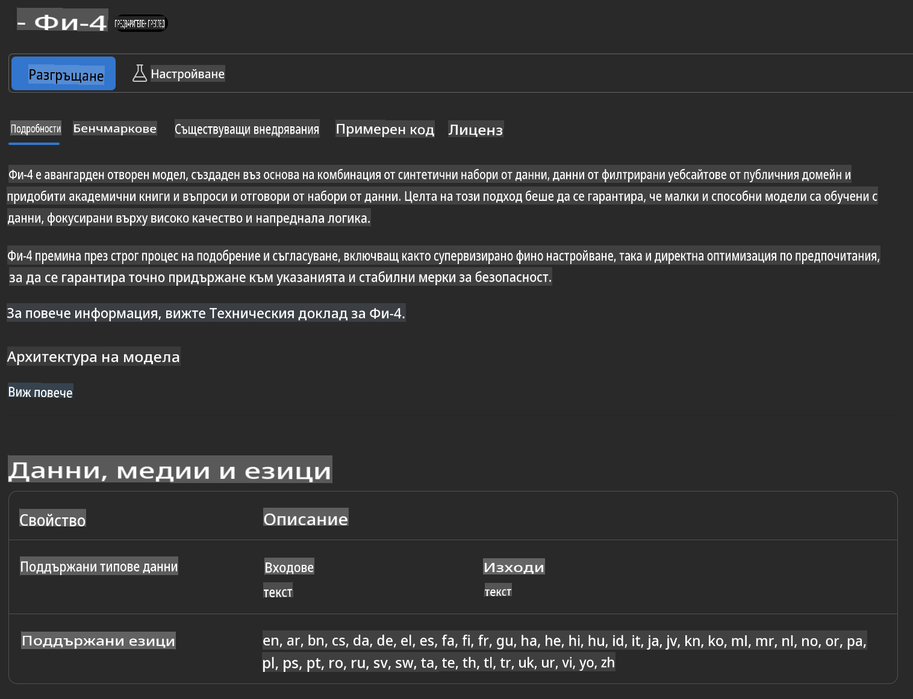
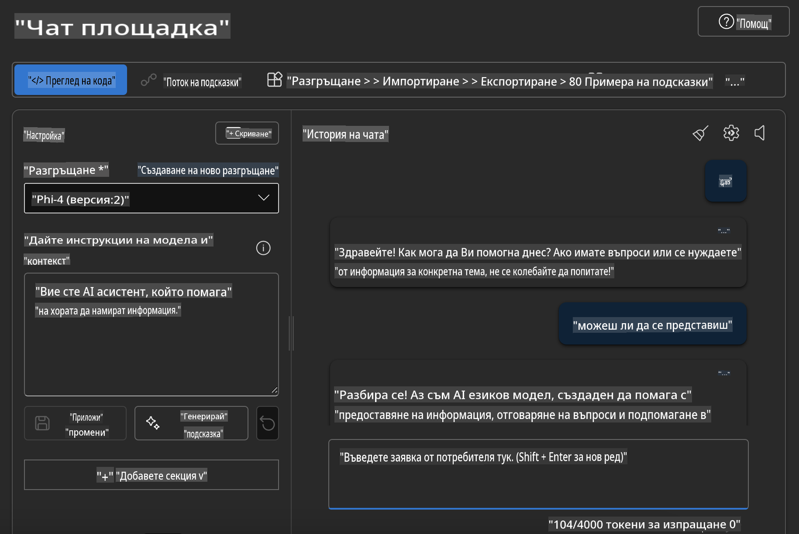

## Phi Family в Azure AI Foundry

[Azure AI Foundry](https://ai.azure.com) е надеждна платформа, която дава възможност на разработчиците да стимулират иновациите и да оформят бъдещето с изкуствен интелект по безопасен, сигурен и отговорен начин.

[Azure AI Foundry](https://ai.azure.com) е създадена за разработчици, за да:

- Създават приложения с генеративен изкуствен интелект на платформа от корпоративен клас.
- Изследват, изграждат, тестват и внедряват, използвайки най-новите AI инструменти и ML модели, базирани на отговорни AI практики.
- Сътрудничат в екип за целия жизнен цикъл на разработка на приложения.

С Azure AI Foundry можете да изследвате голямо разнообразие от модели, услуги и възможности и да започнете изграждането на AI приложения, които най-добре отговарят на вашите цели. Платформата Azure AI Foundry улеснява мащабирането, като трансформира концептуалните доказателства в напълно развити производствени приложения с лекота. Непрекъснатото наблюдение и усъвършенстване подпомагат дългосрочния успех.



Освен използването на Azure AOAI Service в Azure AI Foundry, можете също да използвате модели от трети страни в Azure AI Foundry Model Catalog. Това е добър избор, ако искате да използвате Azure AI Foundry като платформа за AI решения.

Можем бързо да внедрим модели от семейството Phi чрез Model Catalog в Azure AI Foundry.



### **Внедряване на Phi-4 в Azure AI Foundry**



### **Тестване на Phi-4 в Azure AI Foundry Playground**



### **Изпълнение на Python код за извикване на Azure AI Foundry Phi-4**

```python

import os  
import base64
from openai import AzureOpenAI  
from azure.identity import DefaultAzureCredential, get_bearer_token_provider  
        
endpoint = os.getenv("ENDPOINT_URL", "Your Azure AOAI Service Endpoint")  
deployment = os.getenv("DEPLOYMENT_NAME", "Phi-4")  
      
token_provider = get_bearer_token_provider(  
    DefaultAzureCredential(),  
    "https://cognitiveservices.azure.com/.default"  
)  
  
client = AzureOpenAI(  
    azure_endpoint=endpoint,  
    azure_ad_token_provider=token_provider,  
    api_version="2024-05-01-preview",  
)  
  

chat_prompt = [
    {
        "role": "system",
        "content": "You are an AI assistant that helps people find information."
    },
    {
        "role": "user",
        "content": "can you introduce yourself"
    }
] 
    
# Include speech result if speech is enabled  
messages = chat_prompt 

completion = client.chat.completions.create(  
    model=deployment,  
    messages=messages,
    max_tokens=800,  
    temperature=0.7,  
    top_p=0.95,  
    frequency_penalty=0,  
    presence_penalty=0,
    stop=None,  
    stream=False  
)  
  
print(completion.to_json())  

```

**Отказ от отговорност**:  
Този документ е преведен с помощта на машинно базирани AI услуги за превод. Въпреки че се стремим към точност, моля, имайте предвид, че автоматизираните преводи може да съдържат грешки или неточности. Оригиналният документ на неговия изходен език трябва да се счита за авторитетен източник. За критична информация се препоръчва професионален превод от човек. Не носим отговорност за каквито и да е недоразумения или погрешни интерпретации, произтичащи от използването на този превод.