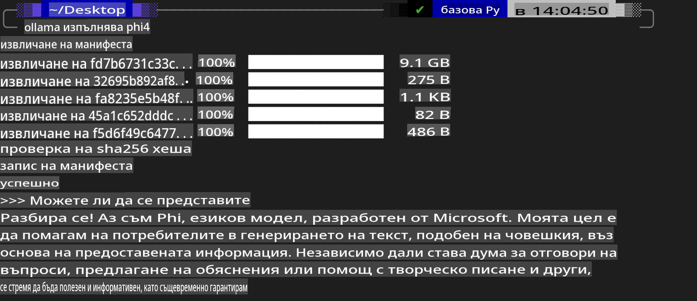
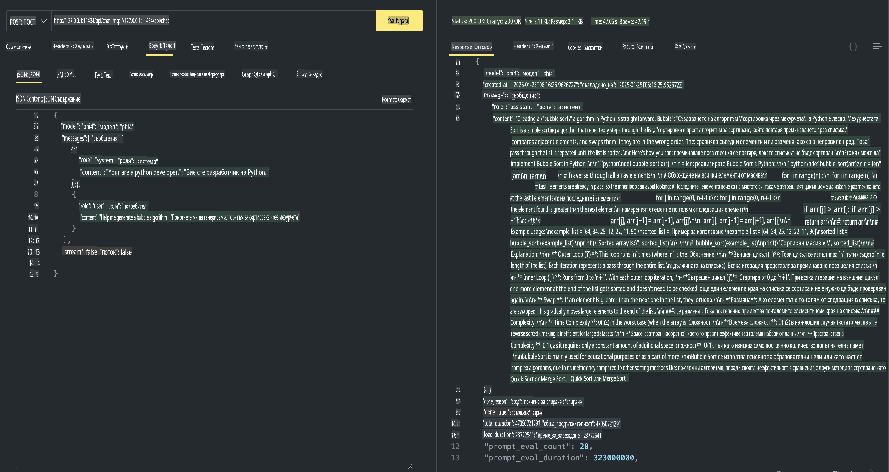

## Phi Family в Ollama

[Ollama](https://ollama.com) позволява на повече хора директно да внедряват отворени LLM или SLM чрез прости скриптове, а също така да изграждат API, които подпомагат локални приложения като Copilot.

## **1. Инсталация**

Ollama поддържа работа на Windows, macOS и Linux. Можете да инсталирате Ollama чрез този линк ([https://ollama.com/download](https://ollama.com/download)). След успешна инсталация можете директно да използвате Ollama скрипт, за да извикате Phi-3 през терминал. Можете да видите всички [налични библиотеки в Ollama](https://ollama.com/library). Ако отворите това хранилище в Codespace, Ollama вече ще бъде инсталиран.

```bash

ollama run phi4

```

> [!NOTE]
> Моделът ще бъде изтеглен първоначално, когато го стартирате за първи път. Разбира се, можете също така директно да посочите изтегления модел Phi-4. Вземаме WSL като пример за изпълнение на командата. След успешното изтегляне на модела, можете директно да взаимодействате през терминала.



## **2. Извикване на API на phi-4 от Ollama**

Ако искате да извикате API на Phi-4, генериран от Ollama, можете да използвате тази команда в терминала, за да стартирате сървъра на Ollama.

```bash

ollama serve

```

> [!NOTE]
> Ако използвате MacOS или Linux, обърнете внимание, че може да срещнете следната грешка **"Error: listen tcp 127.0.0.1:11434: bind: address already in use"**. Тази грешка може да се появи, когато изпълнявате командата. Можете или да я игнорирате, тъй като обикновено показва, че сървърът вече работи, или да спрете и рестартирате Ollama:

**macOS**

```bash

brew services restart ollama

```

**Linux**

```bash

sudo systemctl stop ollama

```

Ollama поддържа два API: generate и chat. Можете да извикате API на модела, предоставен от Ollama, според вашите нужди, като изпращате заявки към локалната услуга, работеща на порт 11434.

**Chat**

```bash

curl http://127.0.0.1:11434/api/chat -d '{
  "model": "phi3",
  "messages": [
    {
      "role": "system",
      "content": "Your are a python developer."
    },
    {
      "role": "user",
      "content": "Help me generate a bubble algorithm"
    }
  ],
  "stream": false
  
}'

This is the result in Postman



## Additional Resources

Check the list of available models in Ollama in [their library](https://ollama.com/library).

Pull your model from the Ollama server using this command

```bash
ollama pull phi4
```

Run the model using this command

```bash
ollama run phi4
```

***Note:*** Visit this link [https://github.com/ollama/ollama/blob/main/docs/api.md](https://github.com/ollama/ollama/blob/main/docs/api.md) to learn more

## Calling Ollama from Python

You can use `requests` or `urllib3` to make requests to the local server endpoints used above. However, a popular way to use Ollama in Python is via the [openai](https://pypi.org/project/openai/) SDK, since Ollama provides OpenAI-compatible server endpoints as well.

Here is an example for phi3-mini:

```python
import openai

client = openai.OpenAI(
    base_url="http://localhost:11434/v1",
    api_key="nokeyneeded",
)

response = client.chat.completions.create(
    model="phi4",
    temperature=0.7,
    n=1,
    messages=[
        {"role": "system", "content": "Ти си полезен асистент."},
        {"role": "user", "content": "Напиши хайку за гладна котка"},
    ],
)

print("Response:")
print(response.choices[0].message.content)
```

## Calling Ollama from JavaScript 

```javascript
// Пример за обобщение на файл с Phi-4
script({
    model: "ollama:phi4",
    title: "Обобщение с Phi-4",
    system: ["system"],
})

// Пример за обобщение
const file = def("FILE", env.files)
$`Обобщи ${file} в един параграф.`
```

## Calling Ollama from C#

Create a new C# Console application and add the following NuGet package:

```bash
dotnet add package Microsoft.SemanticKernel --version 1.34.0
```

Then replace this code in the `Program.cs` file

```csharp
using Microsoft.SemanticKernel;
using Microsoft.SemanticKernel.ChatCompletion;

// добавяне на услуга за чат, използвайки локалния сървър Ollama
#pragma warning disable SKEXP0001, SKEXP0003, SKEXP0010, SKEXP0011, SKEXP0050, SKEXP0052
builder.AddOpenAIChatCompletion(
    modelId: "phi4",
    endpoint: new Uri("http://localhost:11434/"),
    apiKey: "non required");

// извикване на прост подканващ текст към чат услугата
string prompt = "Разкажи шега за котенца";
var response = await kernel.InvokePromptAsync(prompt);
Console.WriteLine(response.GetValue<string>());
```

Run the app with the command:

```bash
dotnet run

**Отказ от отговорност**:  
Този документ е преведен с помощта на автоматизирани AI услуги за превод. Въпреки че се стремим към точност, моля, имайте предвид, че автоматизираните преводи може да съдържат грешки или неточности. Оригиналният документ на неговия изходен език трябва да се счита за авторитетен източник. За критична информация се препоръчва професионален превод от човек. Не носим отговорност за каквито и да било недоразумения или погрешни интерпретации, произтичащи от използването на този превод.