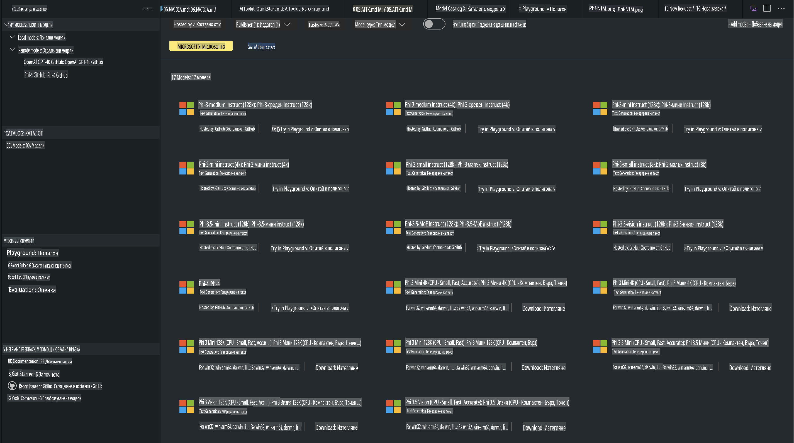
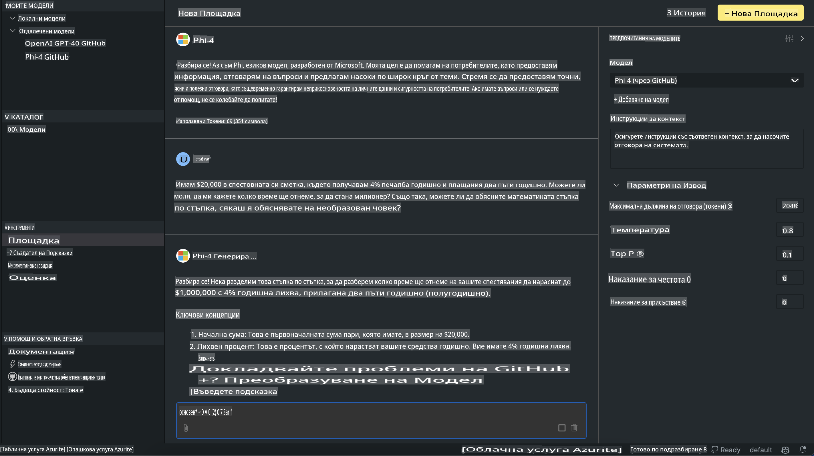

# Семейство Phi в AITK

[AI Toolkit за VS Code](https://marketplace.visualstudio.com/items?itemName=ms-windows-ai-studio.windows-ai-studio) улеснява разработката на приложения с генеративен AI, като обединява най-съвременните инструменти за разработка на AI и модели от Azure AI Foundry Catalog и други каталози като Hugging Face. Ще можете да разглеждате каталога с AI модели, захранван от GitHub Models и Azure AI Foundry Model Catalogs, да ги изтегляте локално или дистанционно, да ги донастройвате, тествате и използвате във вашето приложение.

AI Toolkit Preview работи локално. Локалното прогнозиране или донастройване зависи от избрания модел, като може да се наложи да разполагате с GPU като NVIDIA CUDA GPU. Можете също така директно да използвате GitHub Models с AITK.

## Първи стъпки

[Научете повече за това как да инсталирате Windows Subsystem за Linux](https://learn.microsoft.com/windows/wsl/install?WT.mc_id=aiml-137032-kinfeylo)

и [как да промените стандартната дистрибуция](https://learn.microsoft.com/windows/wsl/install#change-the-default-linux-distribution-installed).

[AI Tooklit GitHub хранилище](https://github.com/microsoft/vscode-ai-toolkit/)

- Windows, Linux, macOS
  
- За донастройване както на Windows, така и на Linux, ще ви е необходим Nvidia GPU. Освен това **Windows** изисква подсистема за Linux с Ubuntu дистрибуция 18.4 или по-нова. [Научете повече за това как да инсталирате Windows Subsystem за Linux](https://learn.microsoft.com/windows/wsl/install) и [как да промените стандартната дистрибуция](https://learn.microsoft.com/windows/wsl/install#change-the-default-linux-distribution-installed).

### Инсталиране на AI Toolkit

AI Toolkit се доставя като [разширение за Visual Studio Code](https://code.visualstudio.com/docs/setup/additional-components#_vs-code-extensions), така че първо трябва да инсталирате [VS Code](https://code.visualstudio.com/docs/setup/windows?WT.mc_id=aiml-137032-kinfeylo) и да изтеглите AI Toolkit от [VS Marketplace](https://marketplace.visualstudio.com/items?itemName=ms-windows-ai-studio.windows-ai-studio).
[AI Toolkit е наличен във Visual Studio Marketplace](https://marketplace.visualstudio.com/items?itemName=ms-windows-ai-studio.windows-ai-studio) и може да бъде инсталиран като всяко друго разширение за VS Code. 

Ако не сте запознати с инсталирането на разширения за VS Code, следвайте тези стъпки:

### Вход в системата

1. В лентата за активност в VS Code изберете **Extensions**.
2. В полето за търсене на разширения въведете "AI Toolkit".
3. Изберете "AI Toolkit for Visual Studio Code".
4. Изберете **Install**.

Вече сте готови да използвате разширението!

Ще бъдете подканени да влезете в GitHub, затова кликнете "Allow", за да продължите. Ще бъдете пренасочени към страницата за вход в GitHub.

Моля, влезте и следвайте стъпките на процеса. След успешното завършване ще бъдете пренасочени обратно към VS Code.

След като разширението е инсталирано, ще видите иконата на AI Toolkit в лентата за активност.

Нека разгледаме наличните действия!

### Налични действия

Основната странична лента на AI Toolkit е организирана в  

- **Models**
- **Resources**
- **Playground**  
- **Fine-tuning**
- **Evaluation**

Тези секции са налични в раздела Resources. За да започнете, изберете **Model Catalog**.

### Изтегляне на модел от каталога

След стартиране на AI Toolkit от страничната лента на VS Code, можете да изберете от следните опции:



- Намерете поддържан модел от **Model Catalog** и го изтеглете локално.
- Тествайте прогнозиране на модела в **Model Playground**.
- Донастройте модела локално или дистанционно в **Model Fine-tuning**.
- Разгърнете донастроени модели в облака чрез командната палитра за AI Toolkit.
- Оценете моделите.

> [!NOTE]
>
> **GPU срещу CPU**
>
> Ще забележите, че картите на моделите показват размера на модела, платформата и типа на ускорителя (CPU, GPU). За оптимизирана производителност на **Windows устройства с поне един GPU**, изберете версии на модела, които са предназначени само за Windows.
>
> Това гарантира, че разполагате с модел, оптимизиран за DirectML ускорителя.
>
> Имената на моделите са във формат
>
> - `{model_name}-{accelerator}-{quantization}-{format}`.
>
>За да проверите дали разполагате с GPU на вашето Windows устройство, отворете **Task Manager** и изберете раздела **Performance**. Ако имате GPU, те ще бъдат изброени с имена като "GPU 0" или "GPU 1".

### Стартиране на модел в Playground

След като всички параметри са зададени, кликнете **Generate Project**.

След като моделът ви е изтеглен, изберете **Load in Playground** от картата на модела в каталога:

- Стартирайте изтеглянето на модела.
- Инсталирайте всички предварителни условия и зависимости.
- Създайте работно пространство във VS Code.



### Използване на REST API във вашето приложение 

AI Toolkit разполага с локален REST API уеб сървър **на порт 5272**, който използва [OpenAI chat completions формат](https://platform.openai.com/docs/api-reference/chat/create). 

Това ви позволява да тествате вашето приложение локално, без да разчитате на облачна AI модел услуга. Например, следният JSON файл показва как да конфигурирате тялото на заявката:

```json
{
    "model": "Phi-4",
    "messages": [
        {
            "role": "user",
            "content": "what is the golden ratio?"
        }
    ],
    "temperature": 0.7,
    "top_p": 1,
    "top_k": 10,
    "max_tokens": 100,
    "stream": true
}
```

Можете да тествате REST API, използвайки (например) [Postman](https://www.postman.com/) или CURL (Client URL) утилитата:

```bash
curl -vX POST http://127.0.0.1:5272/v1/chat/completions -H 'Content-Type: application/json' -d @body.json
```

### Използване на OpenAI клиентска библиотека за Python

```python
from openai import OpenAI

client = OpenAI(
    base_url="http://127.0.0.1:5272/v1/", 
    api_key="x" # required for the API but not used
)

chat_completion = client.chat.completions.create(
    messages=[
        {
            "role": "user",
            "content": "what is the golden ratio?",
        }
    ],
    model="Phi-4",
)

print(chat_completion.choices[0].message.content)
```

### Използване на Azure OpenAI клиентска библиотека за .NET

Добавете [Azure OpenAI клиентска библиотека за .NET](https://www.nuget.org/packages/Azure.AI.OpenAI/) към вашия проект, използвайки NuGet:

```bash
dotnet add {project_name} package Azure.AI.OpenAI --version 1.0.0-beta.17
```

Добавете C# файл, наречен **OverridePolicy.cs**, към вашия проект и поставете следния код:

```csharp
// OverridePolicy.cs
using Azure.Core.Pipeline;
using Azure.Core;

internal partial class OverrideRequestUriPolicy(Uri overrideUri)
    : HttpPipelineSynchronousPolicy
{
    private readonly Uri _overrideUri = overrideUri;

    public override void OnSendingRequest(HttpMessage message)
    {
        message.Request.Uri.Reset(_overrideUri);
    }
}
```

След това поставете следния код във вашия **Program.cs** файл:

```csharp
// Program.cs
using Azure.AI.OpenAI;

Uri localhostUri = new("http://localhost:5272/v1/chat/completions");

OpenAIClientOptions clientOptions = new();
clientOptions.AddPolicy(
    new OverrideRequestUriPolicy(localhostUri),
    Azure.Core.HttpPipelinePosition.BeforeTransport);
OpenAIClient client = new(openAIApiKey: "unused", clientOptions);

ChatCompletionsOptions options = new()
{
    DeploymentName = "Phi-4",
    Messages =
    {
        new ChatRequestSystemMessage("You are a helpful assistant. Be brief and succinct."),
        new ChatRequestUserMessage("What is the golden ratio?"),
    }
};

StreamingResponse<StreamingChatCompletionsUpdate> streamingChatResponse
    = await client.GetChatCompletionsStreamingAsync(options);

await foreach (StreamingChatCompletionsUpdate chatChunk in streamingChatResponse)
{
    Console.Write(chatChunk.ContentUpdate);
}
```

## Донастройване с AI Toolkit

- Започнете с откриване на модели и Playground.
- Донастройване на модели и прогнозиране с помощта на локални компютърни ресурси.
- Дистанционно донастройване и прогнозиране с помощта на Azure ресурси.

[Донастройване с AI Toolkit](../../03.FineTuning/Finetuning_VSCodeaitoolkit.md)

## Ресурси за въпроси и отговори на AI Toolkit

Моля, обърнете се към нашата [страница за въпроси и отговори](https://github.com/microsoft/vscode-ai-toolkit/blob/main/archive/QA.md) за най-често срещаните проблеми и техните решения.

**Отказ от отговорност**:  
Този документ е преведен с помощта на автоматизирани AI услуги за превод. Въпреки че се стремим към точност, моля, имайте предвид, че автоматизираните преводи може да съдържат грешки или неточности. Оригиналният документ на неговия оригинален език трябва да се счита за авторитетен източник. За критична информация се препоръчва професионален превод от човек. Не носим отговорност за каквито и да е недоразумения или погрешни тълкувания, произтичащи от използването на този превод.