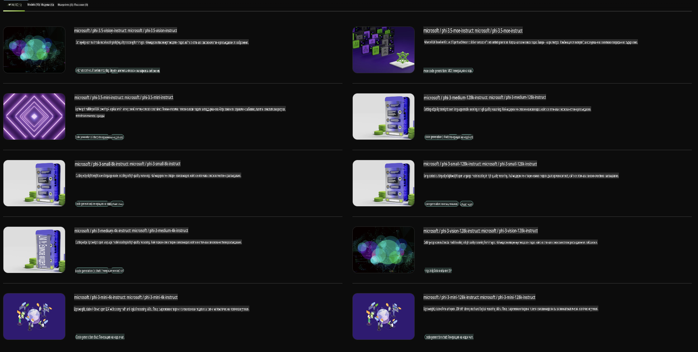

## Семейство Phi в NVIDIA NIM

NVIDIA NIM е набор от лесни за използване микросервизи, създадени да ускорят внедряването на модели за генеративен изкуствен интелект в облака, центровете за данни и работните станции. NIM се категоризират по семейства модели и на база конкретен модел. Например, NVIDIA NIM за големи езикови модели (LLMs) предоставя мощта на най-съвременните LLMs за корпоративни приложения, осигурявайки ненадминати възможности за обработка и разбиране на естествен език.

NIM улеснява IT и DevOps екипите да хостват сами големи езикови модели (LLMs) в собствените си управлявани среди, като същевременно предоставя на разработчиците стандартни API, които им позволяват да създават мощни копилоти, чатботове и AI асистенти, които могат да трансформират техния бизнес. Благодарение на авангардното GPU ускорение на NVIDIA и мащабируемото внедряване, NIM предлага най-бързия път към инференция с ненадмината производителност.

Можете да използвате NVIDIA NIM за инференция на модели от семейство Phi.



### **Примери - Phi-3-Vision в NVIDIA NIM**

Представете си, че имате изображение (`demo.png`) и искате да генерирате Python код, който обработва това изображение и запазва нова версия от него (`phi-3-vision.jpg`).

Кодът по-горе автоматизира този процес чрез:

1. Настройване на средата и необходимите конфигурации.
2. Създаване на подкана, която инструктира модела да генерира необходимия Python код.
3. Изпращане на подкана към модела и събиране на генерирания код.
4. Извличане и изпълнение на генерирания код.
5. Показване на оригиналното и обработеното изображение.

Този подход използва мощта на AI за автоматизиране на задачи за обработка на изображения, което прави постигането на вашите цели по-лесно и бързо.

[Примерно решение на кода](../../../../../code/06.E2E/E2E_Nvidia_NIM_Phi3_Vision.ipynb)

Нека разгледаме стъпка по стъпка какво прави целият код:

1. **Инсталиране на необходимия пакет**:
    ```python
    !pip install langchain_nvidia_ai_endpoints -U
    ```
    Тази команда инсталира пакета `langchain_nvidia_ai_endpoints`, като гарантира, че е най-новата версия.

2. **Импортиране на необходимите модули**:
    ```python
    from langchain_nvidia_ai_endpoints import ChatNVIDIA
    import getpass
    import os
    import base64
    ```
    Тези импорти добавят необходимите модули за взаимодействие с NVIDIA AI крайните точки, сигурно управление на пароли, взаимодействие с операционната система и кодиране/декодиране на данни във формат base64.

3. **Настройване на API ключ**:
    ```python
    if not os.getenv("NVIDIA_API_KEY"):
        os.environ["NVIDIA_API_KEY"] = getpass.getpass("Enter your NVIDIA API key: ")
    ```
    Този код проверява дали е зададена променливата на средата `NVIDIA_API_KEY`. Ако не, подканя потребителя да въведе своя API ключ сигурно.

4. **Дефиниране на модела и пътя до изображението**:
    ```python
    model = 'microsoft/phi-3-vision-128k-instruct'
    chat = ChatNVIDIA(model=model)
    img_path = './imgs/demo.png'
    ```
    Това задава модела, който ще се използва, създава инстанция на `ChatNVIDIA` със зададения модел и определя пътя до файла с изображението.

5. **Създаване на текстова подкана**:
    ```python
    text = "Please create Python code for image, and use plt to save the new picture under imgs/ and name it phi-3-vision.jpg."
    ```
    Това дефинира текстова подкана, която инструктира модела да генерира Python код за обработка на изображение.

6. **Кодиране на изображението в Base64**:
    ```python
    with open(img_path, "rb") as f:
        image_b64 = base64.b64encode(f.read()).decode()
    image = f''
    ```
    Този код чете файла с изображението, кодира го в base64 и създава HTML таг за изображение с кодираните данни.

7. **Комбиниране на текста и изображението в подкана**:
    ```python
    prompt = f"{text} {image}"
    ```
    Това комбинира текстовата подкана и HTML тага за изображение в един низ.

8. **Генериране на код с ChatNVIDIA**:
    ```python
    code = ""
    for chunk in chat.stream(prompt):
        print(chunk.content, end="")
        code += chunk.content
    ```
    Този код изпраща подкана към `ChatNVIDIA` model and collects the generated code in chunks, printing and appending each chunk to the `code` низ.

9. **Извличане на Python код от генерираното съдържание**:
    ```python
    begin = code.index('```python') + 9
    code = code[begin:]
    end = code.index('```')
    code = code[:end]
    ```
    Това извлича действителния Python код от генерираното съдържание, премахвайки markdown форматирането.

10. **Изпълнение на генерирания код**:
    ```python
    import subprocess
    result = subprocess.run(["python", "-c", code], capture_output=True)
    ```
    Това изпълнява извлечения Python код като подпроцес и улавя неговия изход.

11. **Показване на изображенията**:
    ```python
    from IPython.display import Image, display
    display(Image(filename='./imgs/phi-3-vision.jpg'))
    display(Image(filename='./imgs/demo.png'))
    ```
    Тези редове показват изображенията, използвайки модула `IPython.display`.

**Отказ от отговорност**:  
Този документ е преведен с помощта на автоматизирани AI услуги за превод. Въпреки че се стремим към точност, моля, имайте предвид, че автоматизираните преводи може да съдържат грешки или неточности. Оригиналният документ на неговия оригинален език трябва да се счита за авторитетен източник. За критична информация се препоръчва професионален човешки превод. Не носим отговорност за каквито и да е недоразумения или погрешни интерпретации, произтичащи от използването на този превод.