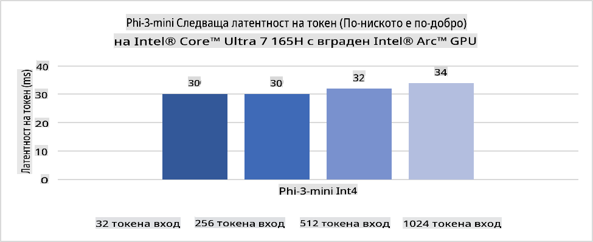
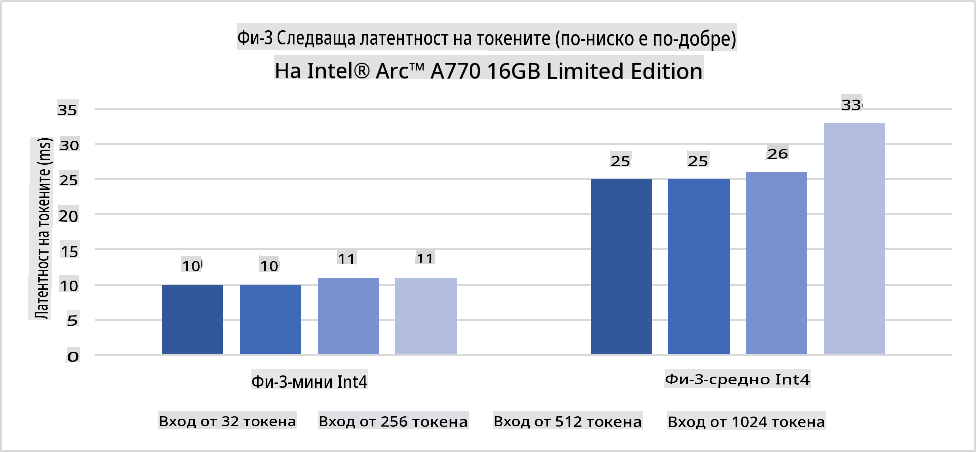
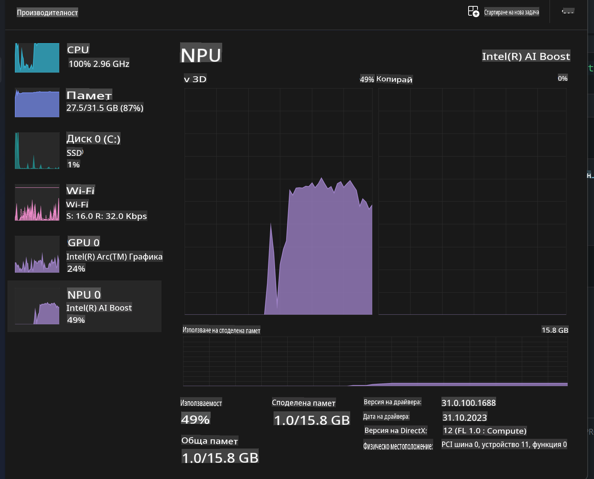
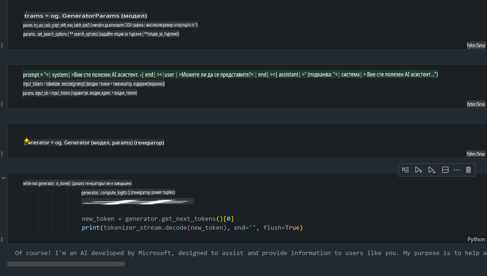
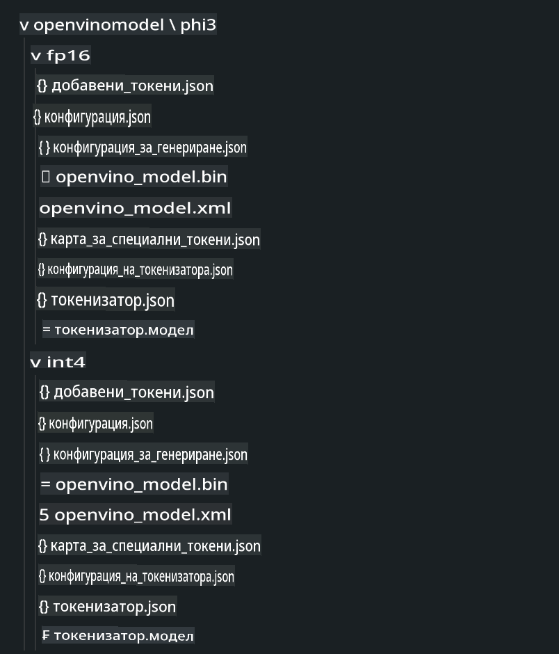
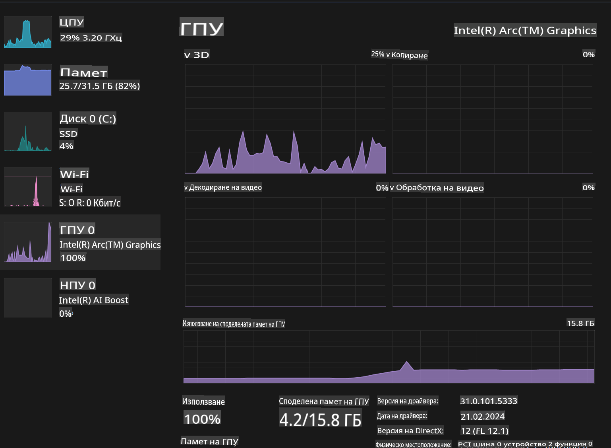

# **Инференция на Phi-3 в AI PC**

С развитието на генеративния изкуствен интелект (AI) и подобренията в хардуерните възможности на edge устройствата, все повече генеративни AI модели могат да бъдат интегрирани в устройствата на потребителите от типа "Донеси си собствено устройство" (BYOD). AI компютрите са сред тези модели. От 2024 г. Intel, AMD и Qualcomm си сътрудничат с производители на компютри, за да представят AI компютри, които улесняват внедряването на локализирани генеративни AI модели чрез хардуерни модификации. В тази дискусия ще се фокусираме върху Intel AI компютри и ще разгледаме как да внедрим Phi-3 на Intel AI компютър.

### Какво е NPU

NPU (Neural Processing Unit) е специализиран процесор или изчислителна единица в по-голям SoC, проектирана специално за ускоряване на операции с невронни мрежи и задачи, свързани с AI. За разлика от универсалните CPU и GPU, NPUs са оптимизирани за паралелни изчисления, базирани на данни, което ги прави изключително ефективни при обработка на големи мултимедийни данни като видеа и изображения, както и при обработка на данни за невронни мрежи. Те са особено добри в изпълнението на задачи, свързани с AI, като разпознаване на реч, замъгляване на фона при видеоразговори и процеси за редактиране на снимки или видеа, като разпознаване на обекти.

## NPU срещу GPU

Въпреки че много задачи, свързани с AI и машинно обучение, се изпълняват на GPU, съществува ключова разлика между GPU и NPU.  
GPU са известни със своите възможности за паралелни изчисления, но не всички GPU са еднакво ефективни извън обработката на графика. От друга страна, NPUs са създадени с цел за сложните изчисления, свързани с операциите на невронни мрежи, което ги прави изключително ефективни за AI задачи.

В обобщение, NPUs са математическите гении, които ускоряват AI изчисленията, и играят ключова роля в новата ера на AI компютрите!

***Този пример е базиран на най-новия Intel Core Ultra процесор на Intel.***

## **1. Използване на NPU за изпълнение на модела Phi-3**

Intel® NPU устройството е AI акселератор за инференция, интегриран в клиентските процесори на Intel, започвайки от поколението Intel® Core™ Ultra процесори (познато преди като Meteor Lake). То позволява енергийно ефективно изпълнение на задачи, свързани с изкуствени невронни мрежи.





**Библиотека за ускорение на Intel NPU**

Библиотеката за ускорение на Intel NPU [https://github.com/intel/intel-npu-acceleration-library](https://github.com/intel/intel-npu-acceleration-library) е Python библиотека, проектирана да подобри ефективността на вашите приложения, като използва мощността на Neural Processing Unit (NPU) на Intel за високоскоростни изчисления на съвместим хардуер.

Пример за Phi-3-mini на AI PC, захранван от Intel® Core™ Ultra процесори.


Инсталирайте Python библиотеката с pip

```bash

   pip install intel-npu-acceleration-library

```

***Забележка*** Проектът все още е в разработка, но референтният модел е вече доста завършен.

### **Изпълнение на Phi-3 с библиотеката за ускорение на Intel NPU**

С използването на ускорението на Intel NPU, тази библиотека не засяга традиционния процес на кодиране. Необходимо е само да използвате библиотеката за квантизация на оригиналния Phi-3 модел, като FP16, INT8, INT4, например

```python
from transformers import AutoTokenizer, pipeline,TextStreamer
from intel_npu_acceleration_library import NPUModelForCausalLM, int4
from intel_npu_acceleration_library.compiler import CompilerConfig
import warnings

model_id = "microsoft/Phi-3-mini-4k-instruct"

compiler_conf = CompilerConfig(dtype=int4)
model = NPUModelForCausalLM.from_pretrained(
    model_id, use_cache=True, config=compiler_conf, attn_implementation="sdpa"
).eval()

tokenizer = AutoTokenizer.from_pretrained(model_id)

text_streamer = TextStreamer(tokenizer, skip_prompt=True)
```

След успешна квантизация продължете с изпълнението, за да извикате NPU за изпълнение на модела Phi-3.

```python
generation_args = {
   "max_new_tokens": 1024,
   "return_full_text": False,
   "temperature": 0.3,
   "do_sample": False,
   "streamer": text_streamer,
}

pipe = pipeline(
   "text-generation",
   model=model,
   tokenizer=tokenizer,
)

query = "<|system|>You are a helpful AI assistant.<|end|><|user|>Can you introduce yourself?<|end|><|assistant|>"

with warnings.catch_warnings():
    warnings.simplefilter("ignore")
    pipe(query, **generation_args)
```

При изпълнение на кода можем да видим състоянието на работа на NPU чрез Task Manager.



***Примери***: [AIPC_NPU_DEMO.ipynb](../../../../../code/03.Inference/AIPC/AIPC_NPU_DEMO.ipynb)

## **2. Използване на DirectML + ONNX Runtime за изпълнение на модела Phi-3**

### **Какво е DirectML**

[DirectML](https://github.com/microsoft/DirectML) е високопроизводителна, хардуерно ускорена библиотека на DirectX 12 за машинно обучение. DirectML предоставя GPU ускорение за често срещани задачи на машинното обучение върху широка гама от поддържан хардуер и драйвери, включително всички DX12-съвместими GPU от производители като AMD, Intel, NVIDIA и Qualcomm.

Когато се използва самостоятелно, DirectML API е ниско ниво библиотека на DirectX 12 и е подходяща за високопроизводителни, нисколатентни приложения като фреймуъркове, игри и други приложения в реално време. Безпроблемната съвместимост на DirectML с Direct3D 12, както и ниската му натовареност и съответствие между хардуера, го правят идеален за ускоряване на машинното обучение, когато са желани както висока производителност, така и надеждност и предсказуемост на резултатите между различен хардуер.

***Забележка***: Най-новият DirectML вече поддържа NPU (https://devblogs.microsoft.com/directx/introducing-neural-processor-unit-npu-support-in-directml-developer-preview/)

### DirectML и CUDA по отношение на възможностите и производителността:

**DirectML** е библиотека за машинно обучение, разработена от Microsoft. Тя е проектирана да ускорява задачи на машинното обучение върху устройства с Windows, включително настолни компютри, лаптопи и edge устройства.  
- Базирана на DX12: DirectML е изградена върху DirectX 12 (DX12), което предоставя широка хардуерна поддръжка за GPU, включително както NVIDIA, така и AMD.  
- По-широка поддръжка: Понеже използва DX12, DirectML може да работи с всяко GPU, което поддържа DX12, дори и интегрирани GPU.  
- Обработка на изображения: DirectML обработва изображения и други данни чрез невронни мрежи, което го прави подходящ за задачи като разпознаване на изображения, откриване на обекти и други.  
- Лесно настройване: Настройването на DirectML е просто и не изисква специфични SDK или библиотеки от производителите на GPU.  
- Производителност: В някои случаи DirectML се представя добре и може да бъде по-бърз от CUDA, особено за определени задачи.  
- Ограничения: Има случаи, в които DirectML може да бъде по-бавен, особено при големи партиди с float16.

**CUDA** е паралелна изчислителна платформа и модел за програмиране на NVIDIA. Тя позволява на разработчиците да използват мощността на NVIDIA GPU за общо предназначение, включително машинно обучение и научни симулации.  
- Специфична за NVIDIA: CUDA е тясно интегрирана с NVIDIA GPU и е специално проектирана за тях.  
- Високо оптимизирана: Тя предоставя отлична производителност за задачи, ускорени от GPU, особено при използване на NVIDIA GPU.  
- Широко използвана: Много фреймуъркове и библиотеки за машинно обучение (като TensorFlow и PyTorch) имат поддръжка за CUDA.  
- Персонализация: Разработчиците могат да настроят CUDA за специфични задачи, което може да доведе до оптимална производителност.  
- Ограничения: Зависимостта на CUDA от хардуера на NVIDIA може да бъде ограничаваща, ако искате по-широка съвместимост между различни GPU.

### Избор между DirectML и CUDA

Изборът между DirectML и CUDA зависи от вашия конкретен случай, наличния хардуер и предпочитанията ви.  
Ако търсите по-широка съвместимост и лесна настройка, DirectML може да бъде добър избор. Въпреки това, ако разполагате с NVIDIA GPU и се нуждаете от силно оптимизирана производителност, CUDA остава силен претендент. В обобщение, и DirectML, и CUDA имат своите силни и слаби страни, така че вземете предвид изискванията и наличния хардуер, когато вземате решение.

### **Генеративен AI с ONNX Runtime**

В ерата на AI преносимостта на AI моделите е много важна. ONNX Runtime позволява лесно внедряване на обучени модели на различни устройства. Разработчиците не трябва да се фокусират върху фреймуърка за инференция и могат да използват унифициран API за завършване на инференцията на модела. В ерата на генеративния AI ONNX Runtime също е извършил оптимизация на кода (https://onnxruntime.ai/docs/genai/). Чрез оптимизирания ONNX Runtime квантовите генеративни AI модели могат да бъдат използвани на различни терминали. В Generative AI с ONNX Runtime можете да изпълнявате API за AI модел чрез Python, C#, C/C++. Разбира се, внедряването на iPhone може да се възползва от Generative AI с ONNX Runtime API на C++.

[Примерен код](https://github.com/Azure-Samples/Phi-3MiniSamples/tree/main/onnx)

***компилиране на генеративен AI с библиотеката ONNX Runtime***

```bash

winget install --id=Kitware.CMake  -e

git clone https://github.com/microsoft/onnxruntime.git

cd .\onnxruntime\

./build.bat --build_shared_lib --skip_tests --parallel --use_dml --config Release

cd ../

git clone https://github.com/microsoft/onnxruntime-genai.git

cd .\onnxruntime-genai\

mkdir ort

cd ort

mkdir include

mkdir lib

copy ..\onnxruntime\include\onnxruntime\core\providers\dml\dml_provider_factory.h ort\include

copy ..\onnxruntime\include\onnxruntime\core\session\onnxruntime_c_api.h ort\include

copy ..\onnxruntime\build\Windows\Release\Release\*.dll ort\lib

copy ..\onnxruntime\build\Windows\Release\Release\onnxruntime.lib ort\lib

python build.py --use_dml


```

**Инсталиране на библиотека**

```bash

pip install .\onnxruntime_genai_directml-0.3.0.dev0-cp310-cp310-win_amd64.whl

```

Това е резултатът от изпълнението



***Примери***: [AIPC_DirectML_DEMO.ipynb](../../../../../code/03.Inference/AIPC/AIPC_DirectML_DEMO.ipynb)

## **3. Използване на Intel OpenVINO за изпълнение на модела Phi-3**

### **Какво е OpenVINO**

[OpenVINO](https://github.com/openvinotoolkit/openvino) е инструмент с отворен код за оптимизиране и внедряване на модели за дълбоко обучение. Той предоставя ускорена производителност за модели за визия, аудио и език от популярни фреймуъркове като TensorFlow, PyTorch и други. Стартирайте с OpenVINO. OpenVINO може също да се използва в комбинация с CPU и GPU за изпълнение на модела Phi-3.

***Забележка***: В момента OpenVINO не поддържа NPU.

### **Инсталиране на библиотеката OpenVINO**

```bash

 pip install git+https://github.com/huggingface/optimum-intel.git

 pip install git+https://github.com/openvinotoolkit/nncf.git

 pip install openvino-nightly

```

### **Изпълнение на Phi-3 с OpenVINO**

Подобно на NPU, OpenVINO извършва извикване на генеративни AI модели чрез изпълнение на квантови модели. Първо трябва да квантизираме модела Phi-3 и да завършим квантизацията на модела чрез командния ред с помощта на optimum-cli.

**INT4**

```bash

optimum-cli export openvino --model "microsoft/Phi-3-mini-4k-instruct" --task text-generation-with-past --weight-format int4 --group-size 128 --ratio 0.6  --sym  --trust-remote-code ./openvinomodel/phi3/int4

```

**FP16**

```bash

optimum-cli export openvino --model "microsoft/Phi-3-mini-4k-instruct" --task text-generation-with-past --weight-format fp16 --trust-remote-code ./openvinomodel/phi3/fp16

```

Конвертираният формат изглежда така



Заредете пътищата на модела (model_dir), свързаните конфигурации (ov_config = {"PERFORMANCE_HINT": "LATENCY", "NUM_STREAMS": "1", "CACHE_DIR": ""}) и устройствата с хардуерно ускорение (GPU.0) чрез OVModelForCausalLM.

```python

ov_model = OVModelForCausalLM.from_pretrained(
     model_dir,
     device='GPU.0',
     ov_config=ov_config,
     config=AutoConfig.from_pretrained(model_dir, trust_remote_code=True),
     trust_remote_code=True,
)

```

При изпълнение на кода можем да видим състоянието на работа на GPU чрез Task Manager.



***Примери***: [AIPC_OpenVino_Demo.ipynb](../../../../../code/03.Inference/AIPC/AIPC_OpenVino_Demo.ipynb)

### ***Забележка***: Трите горепосочени метода имат свои собствени предимства, но се препоръчва да се използва NPU ускорение за инференция на AI компютър.

**Отказ от отговорност**:  
Този документ е преведен с помощта на автоматизирани AI услуги за превод. Въпреки че се стремим към точност, моля, имайте предвид, че автоматизираните преводи може да съдържат грешки или неточности. Оригиналният документ на неговия оригинален език трябва да се счита за авторитетен източник. За критична информация се препоръчва професионален човешки превод. Не носим отговорност за каквито и да е недоразумения или погрешни интерпретации, произтичащи от използването на този превод.