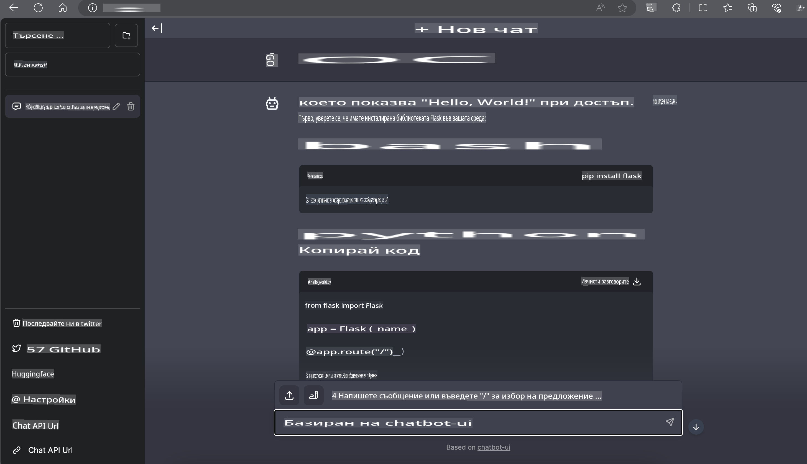

# **Inference Phi-3 в Nvidia Jetson**

Nvidia Jetson е серия от вградени компютърни платки от Nvidia. Моделите Jetson TK1, TX1 и TX2 са оборудвани с Tegra процесор (или SoC) от Nvidia, който интегрира централния процесор (CPU) с архитектура ARM. Jetson е система с ниска консумация на енергия и е проектирана за ускоряване на приложения за машинно обучение. Nvidia Jetson се използва от професионални разработчици за създаване на революционни AI продукти във всички индустрии, както и от студенти и ентусиасти за практически AI обучения и създаване на невероятни проекти. SLM се внедрява в edge устройства като Jetson, което позволява по-добра реализация на индустриални сценарии за генеративни AI приложения.

## Внедряване на NVIDIA Jetson:
Разработчиците, работещи върху автономна роботика и вградени устройства, могат да се възползват от Phi-3 Mini. Компактният размер на Phi-3 го прави идеален за edge внедряване. Параметрите са внимателно настроени по време на обучението, което гарантира висока точност на отговорите.

### TensorRT-LLM Оптимизация:
Библиотеката [TensorRT-LLM на NVIDIA](https://github.com/NVIDIA/TensorRT-LLM?WT.mc_id=aiml-138114-kinfeylo) оптимизира изводите на големи езикови модели. Тя поддържа дългия контекстов прозорец на Phi-3 Mini, подобрявайки както пропускателната способност, така и латентността. Оптимизациите включват техники като LongRoPE, FP8 и паралелна обработка.

### Наличност и внедряване:
Разработчиците могат да изследват Phi-3 Mini с контекстов прозорец от 128K на [NVIDIA's AI](https://www.nvidia.com/en-us/ai-data-science/generative-ai/). Той е пакетиран като NVIDIA NIM, микросървис със стандартен API, който може да бъде внедрен навсякъде. Освен това, [TensorRT-LLM имплементациите в GitHub](https://github.com/NVIDIA/TensorRT-LLM).

## **1. Подготовка**

a. Jetson Orin NX / Jetson NX

b. JetPack 5.1.2+
   
c. Cuda 11.8
   
d. Python 3.8+

## **2. Стартиране на Phi-3 в Jetson**

Можем да изберем [Ollama](https://ollama.com) или [LlamaEdge](https://llamaedge.com).

Ако искате да използвате gguf както в облака, така и в edge устройства, LlamaEdge може да се разглежда като WasmEdge (WasmEdge е лек, високопроизводителен, мащабируем WebAssembly runtime, подходящ за облачни, edge и децентрализирани приложения. Той поддържа serverless приложения, вградени функции, микросървиси, смарт договори и IoT устройства). Можете да внедрите количествения модел на gguf в edge устройства и облака чрез LlamaEdge.


Ето стъпките за използване:

1. Инсталирайте и изтеглете свързаните библиотеки и файлове

```bash

curl -sSf https://raw.githubusercontent.com/WasmEdge/WasmEdge/master/utils/install.sh | bash -s -- --plugin wasi_nn-ggml

curl -LO https://github.com/LlamaEdge/LlamaEdge/releases/latest/download/llama-api-server.wasm

curl -LO https://github.com/LlamaEdge/chatbot-ui/releases/latest/download/chatbot-ui.tar.gz

tar xzf chatbot-ui.tar.gz

```

**Забележка**: llama-api-server.wasm и chatbot-ui трябва да бъдат в една и съща директория.

2. Стартирайте скриптове в терминала

```bash

wasmedge --dir .:. --nn-preload default:GGML:AUTO:{Your gguf path} llama-api-server.wasm -p phi-3-chat

```

Ето резултата от стартирането:



***Примерен код*** [Phi-3 mini WASM Notebook Sample](https://github.com/Azure-Samples/Phi-3MiniSamples/tree/main/wasm)

В обобщение, Phi-3 Mini представлява значителен напредък в езиковото моделиране, съчетавайки ефективност, осъзнаване на контекста и оптимизациите на NVIDIA. Независимо дали изграждате роботи или edge приложения, Phi-3 Mini е мощен инструмент, който трябва да се има предвид.

**Отказ от отговорност**:  
Този документ е преведен с помощта на машинни AI услуги за превод. Въпреки че се стремим към точност, моля, имайте предвид, че автоматичните преводи може да съдържат грешки или неточности. Оригиналният документ на неговия изходен език трябва да се счита за авторитетния източник. За критична информация се препоръчва професионален превод от човек. Не носим отговорност за каквито и да било недоразумения или погрешни интерпретации, произтичащи от използването на този превод.