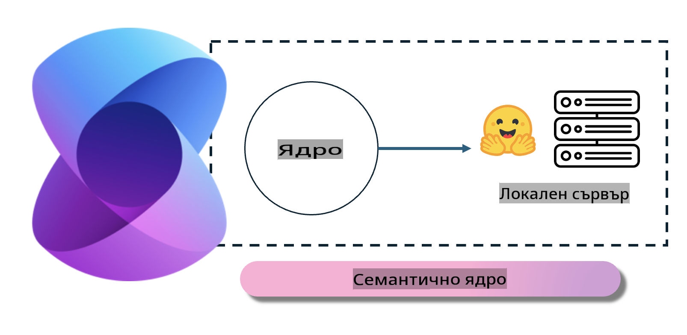
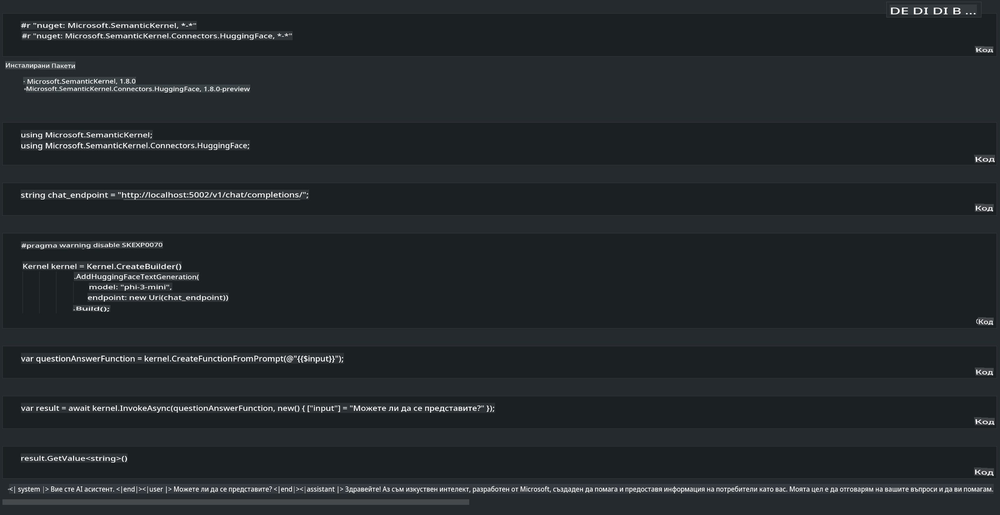

# **Инференция на Phi-3 на локален сървър**

Можем да разположим Phi-3 на локален сървър. Потребителите могат да изберат решения като [Ollama](https://ollama.com) или [LM Studio](https://llamaedge.com), или да напишат собствен код. Можете да свържете локалните услуги на Phi-3 чрез [Semantic Kernel](https://github.com/microsoft/semantic-kernel?WT.mc_id=aiml-138114-kinfeylo) или [Langchain](https://www.langchain.com/), за да изграждате приложения тип Copilot.

## **Използване на Semantic Kernel за достъп до Phi-3-mini**

В приложението Copilot създаваме приложения чрез Semantic Kernel / LangChain. Този тип рамка за приложения обикновено е съвместима с Azure OpenAI Service / OpenAI модели и може също така да поддържа отворени модели от Hugging Face и локални модели. Какво трябва да направим, ако искаме да използваме Semantic Kernel за достъп до Phi-3-mini? Като използваме .NET за пример, можем да го комбинираме с Hugging Face Connector в Semantic Kernel. По подразбиране той може да съответства на идентификатора на модела в Hugging Face (при първото използване моделът ще бъде изтеглен от Hugging Face, което отнема доста време). Също така можете да се свържете с изградената локална услуга. Сравнявайки двете, препоръчваме да използвате второто, тъй като предлага по-голяма степен на автономност, особено в корпоративни приложения.

От изображението става ясно, че достъпът до локални услуги чрез Semantic Kernel позволява лесно свързване със самостоятелно изграден сървър за модела Phi-3-mini. Ето резултата от изпълнението:

***Примерен код*** https://github.com/kinfey/Phi3MiniSamples/tree/main/semantickernel

**Отказ от отговорност**:  
Този документ е преведен с помощта на автоматизирани AI услуги за превод. Въпреки че се стремим към точност, моля, имайте предвид, че автоматизираните преводи може да съдържат грешки или неточности. Оригиналният документ на неговия оригинален език трябва да се счита за авторитетния източник. За критична информация се препоръчва професионален превод от човек. Не носим отговорност за никакви недоразумения или погрешни интерпретации, произтичащи от използването на този превод.