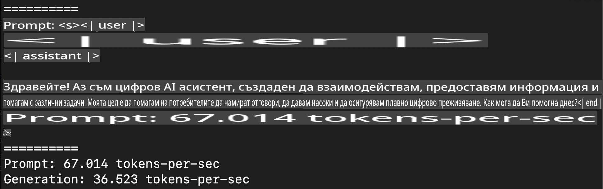
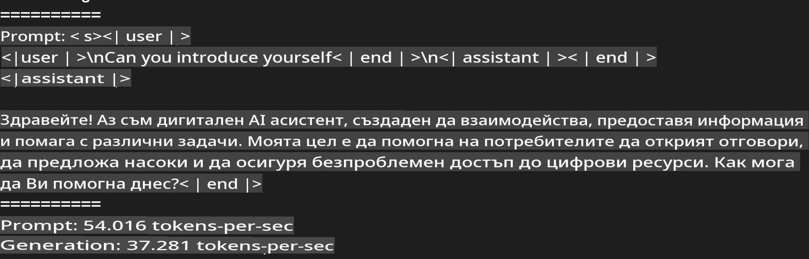
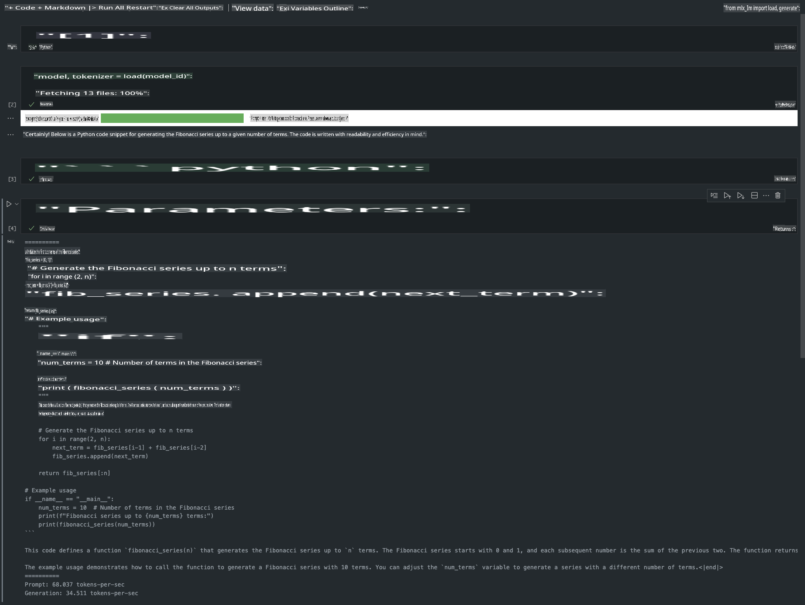

# **Инференция на Phi-3 с Apple MLX Framework**

## **Какво е MLX Framework**

MLX е рамка за изследвания в машинното обучение, разработена за Apple silicon от екипа на Apple за машинно обучение.

MLX е създаден от изследователи в машинното обучение за изследователи в машинното обучение. Рамката е проектирана да бъде лесна за използване, но същевременно ефективна за трениране и внедряване на модели. Дизайнът ѝ е концептуално опростен, за да улесни разширяването и подобряването ѝ от изследователите с цел бързо изпробване на нови идеи.

LLM моделите могат да бъдат ускорени на устройства с Apple Silicon чрез MLX, което позволява лесно локално изпълнение на моделите.

## **Използване на MLX за инференция на Phi-3-mini**

### **1. Настройка на вашата MLX среда**

1. Python 3.11.x  
2. Инсталирайте MLX библиотеката  

```bash

pip install mlx-lm

```

### **2. Стартиране на Phi-3-mini в терминал с MLX**

```bash

python -m mlx_lm.generate --model microsoft/Phi-3-mini-4k-instruct --max-token 2048 --prompt  "<|user|>\nCan you introduce yourself<|end|>\n<|assistant|>"

```

Резултатът (моята среда е Apple M1 Max, 64GB) е:



### **3. Квантизация на Phi-3-mini с MLX в терминал**

```bash

python -m mlx_lm.convert --hf-path microsoft/Phi-3-mini-4k-instruct

```

***Забележка:*** Моделът може да бъде квантизиран чрез mlx_lm.convert, като стандартната квантизация е INT4. В този пример Phi-3-mini се квантизира до INT4.

Моделът се квантизира чрез mlx_lm.convert, като стандартната квантизация е INT4. В този пример Phi-3-mini се квантизира до INT4. След квантизацията моделът ще бъде съхранен в стандартната директория ./mlx_model.

Можем да тестваме квантизирания с MLX модел от терминала:

```bash

python -m mlx_lm.generate --model ./mlx_model/ --max-token 2048 --prompt  "<|user|>\nCan you introduce yourself<|end|>\n<|assistant|>"

```

Резултатът е:



### **4. Стартиране на Phi-3-mini с MLX в Jupyter Notebook**



***Забележка:*** Моля, прочетете този пример [кликнете върху този линк](../../../../../code/03.Inference/MLX/MLX_DEMO.ipynb)

## **Ресурси**

1. Научете повече за Apple MLX Framework [https://ml-explore.github.io](https://ml-explore.github.io/mlx/build/html/index.html)

2. GitHub хранилище на Apple MLX [https://github.com/ml-explore](https://github.com/ml-explore)

**Отказ от отговорност**:  
Този документ е преведен с помощта на автоматизирани AI услуги за превод. Въпреки че се стремим към точност, моля, имайте предвид, че автоматизираните преводи могат да съдържат грешки или неточности. Оригиналният документ на неговия изходен език трябва да се счита за авторитетен източник. За критична информация се препоръчва професионален превод от човек. Не носим отговорност за каквито и да било недоразумения или погрешни интерпретации, произтичащи от използването на този превод.