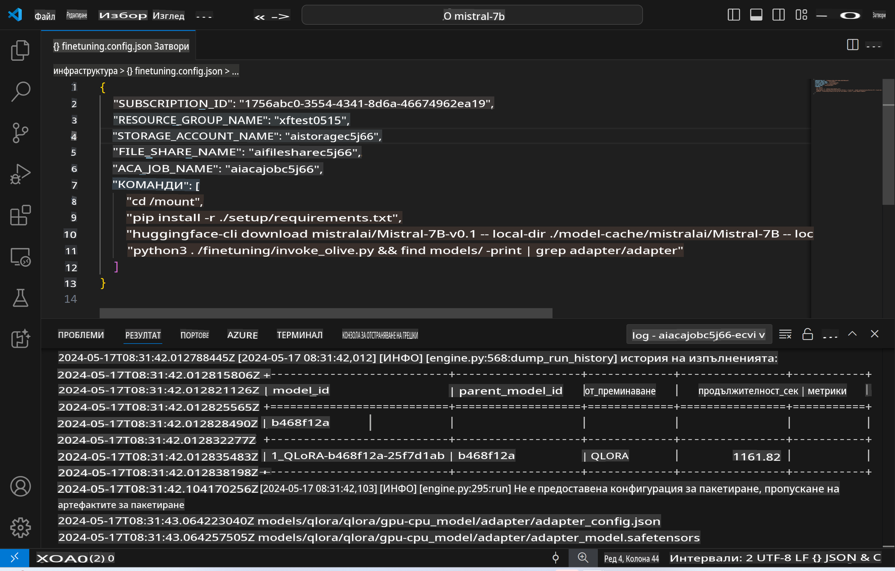
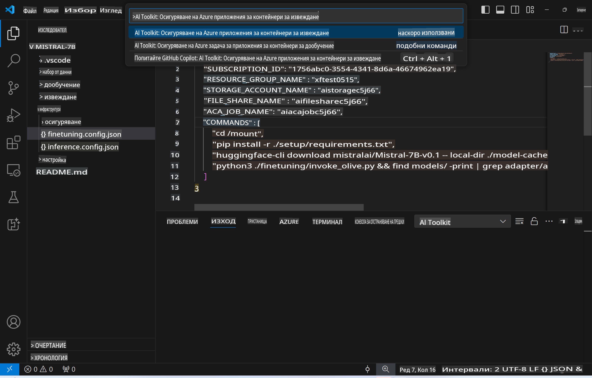
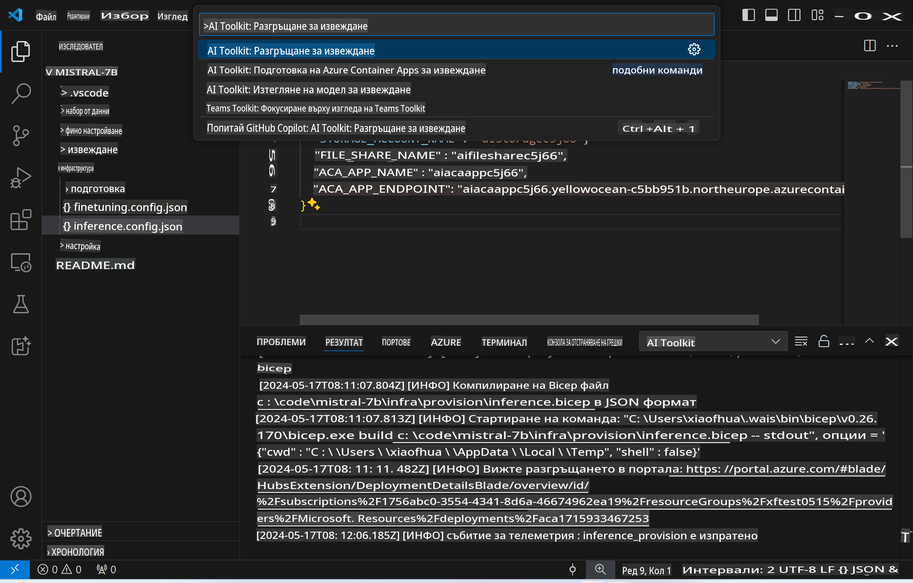
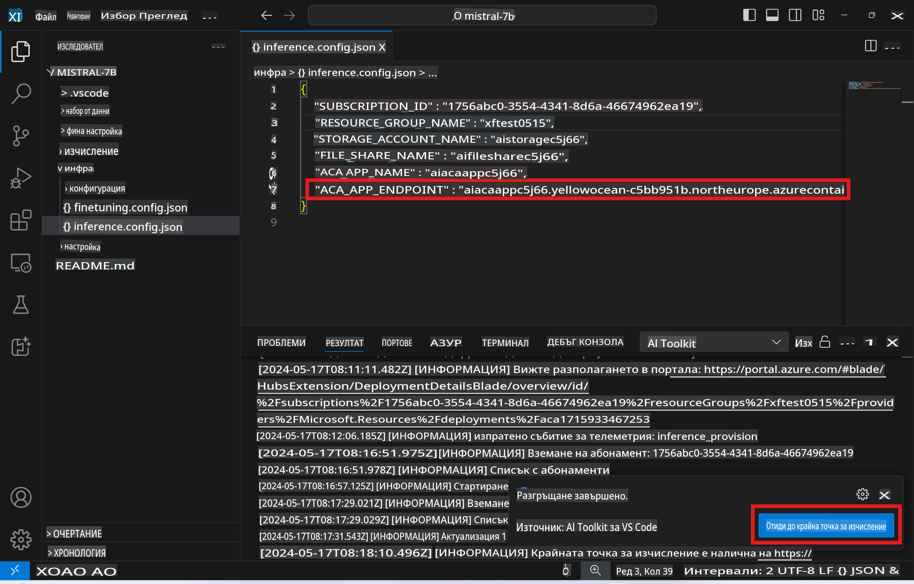

# Дистанционно извеждане с фино настроен модел

След като адаптерите бъдат обучени в отдалечената среда, използвайте просто приложение Gradio, за да взаимодействате с модела.



### Създаване на Azure ресурси
Трябва да настроите Azure ресурсите за дистанционно извеждане, като изпълните `AI Toolkit: Provision Azure Container Apps for inference` от командното меню. По време на тази настройка ще бъдете помолени да изберете вашия Azure Subscription и ресурсна група.  


По подразбиране, абонаментът и ресурсната група за извеждане трябва да съвпадат с тези, използвани за фино настройване. Извеждането ще използва същата среда на Azure Container App и ще има достъп до модела и адаптера на модела, съхранени в Azure Files, които са генерирани по време на стъпката за фино настройване.

## Използване на AI Toolkit

### Разгръщане за извеждане  
Ако искате да преразгледате кода за извеждане или да презаредите модела за извеждане, изпълнете командата `AI Toolkit: Deploy for inference`. Това ще синхронизира последния ви код с ACA и ще рестартира репликата.  



След успешното завършване на разгръщането, моделът е готов за оценка чрез този крайна точка.

### Достъп до API за извеждане

Можете да получите достъп до API за извеждане, като кликнете върху бутона "*Go to Inference Endpoint*", който се появява в известието на VSCode. Алтернативно, уеб API крайната точка може да бъде намерена под `ACA_APP_ENDPOINT` в `./infra/inference.config.json` и в панела с изхода.



> **Забележка:** Крайната точка за извеждане може да отнеме няколко минути, за да стане напълно оперативна.

## Компоненти за извеждане, включени в шаблона

| Папка | Съдържание |
| ------ |--------- |
| `infra` | Съдържа всички необходими конфигурации за дистанционни операции. |
| `infra/provision/inference.parameters.json` | Съдържа параметри за bicep шаблоните, използвани за създаване на Azure ресурси за извеждане. |
| `infra/provision/inference.bicep` | Съдържа шаблони за създаване на Azure ресурси за извеждане. |
| `infra/inference.config.json` | Конфигурационният файл, генериран от командата `AI Toolkit: Provision Azure Container Apps for inference`. Използва се като вход за други дистанционни команди. |

### Използване на AI Toolkit за конфигуриране на създаване на Azure ресурси
Конфигурирайте [AI Toolkit](https://marketplace.visualstudio.com/items?itemName=ms-windows-ai-studio.windows-ai-studio)

Създайте Azure Container Apps за извеждане ` command.

You can find configuration parameters in `./infra/provision/inference.parameters.json` file. Here are the details:
| Parameter | Description |
| --------- |------------ |
| `defaultCommands` | This is the commands to initiate a web API. |
| `maximumInstanceCount` | This parameter sets the maximum capacity of GPU instances. |
| `location` | This is the location where Azure resources are provisioned. The default value is the same as the chosen resource group's location. |
| `storageAccountName`, `fileShareName` `acaEnvironmentName`, `acaEnvironmentStorageName`, `acaAppName`,  `acaLogAnalyticsName` | These parameters are used to name the Azure resources for provision. By default, they will be same to the fine-tuning resource name. You can input a new, unused resource name to create your own custom-named resources, or you can input the name of an already existing Azure resource if you'd prefer to use that. For details, refer to the section [Using existing Azure Resources](../../../../../md/01.Introduction/03). |

### Using Existing Azure Resources

By default, the inference provision use the same Azure Container App Environment, Storage Account, Azure File Share, and Azure Log Analytics that were used for fine-tuning. A separate Azure Container App is created solely for the inference API. 

If you have customized the Azure resources during the fine-tuning step or want to use your own existing Azure resources for inference, specify their names in the `./infra/inference.parameters.json` файл. След това изпълнете командата `AI Toolkit: Provision Azure Container Apps for inference` от командното меню. Това ще актуализира всички посочени ресурси и ще създаде липсващите.

Например, ако вече имате съществуваща среда за Azure контейнер, вашият `./infra/finetuning.parameters.json` трябва да изглежда така:

```json
{
    "$schema": "https://schema.management.azure.com/schemas/2019-04-01/deploymentParameters.json#",
    "contentVersion": "1.0.0.0",
    "parameters": {
      ...
      "acaEnvironmentName": {
        "value": "<your-aca-env-name>"
      },
      "acaEnvironmentStorageName": {
        "value": null
      },
      ...
    }
  }
```

### Ръчно създаване  
Ако предпочитате ръчно да конфигурирате Azure ресурсите, можете да използвате предоставените bicep файлове в `./infra/provision` folders. If you have already set up and configured all the Azure resources without using the AI Toolkit command palette, you can simply enter the resource names in the `inference.config.json` файл.

Например:

```json
{
  "SUBSCRIPTION_ID": "<your-subscription-id>",
  "RESOURCE_GROUP_NAME": "<your-resource-group-name>",
  "STORAGE_ACCOUNT_NAME": "<your-storage-account-name>",
  "FILE_SHARE_NAME": "<your-file-share-name>",
  "ACA_APP_NAME": "<your-aca-name>",
  "ACA_APP_ENDPOINT": "<your-aca-endpoint>"
}
```

**Отказ от отговорност**:  
Този документ е преведен с помощта на услуги за машинен превод с изкуствен интелект. Въпреки че се стремим към точност, моля, имайте предвид, че автоматизираните преводи може да съдържат грешки или неточности. Оригиналният документ на неговия оригинален език трябва да се счита за авторитетния източник. За критична информация се препоръчва професионален превод от човек. Ние не носим отговорност за каквито и да било недоразумения или погрешни тълкувания, произтичащи от използването на този превод.