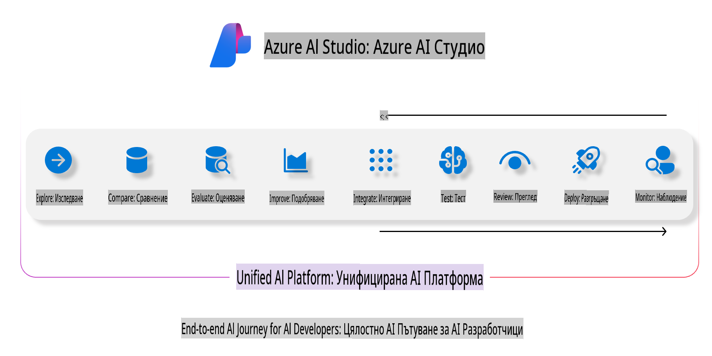

# **Използване на Azure AI Foundry за оценка**

Как да оцените вашето приложение за генериращ изкуствен интелект с помощта на [Azure AI Foundry](https://ai.azure.com?WT.mc_id=aiml-138114-kinfeylo). Независимо дали оценявате еднократни или многократни разговори, Azure AI Foundry предоставя инструменти за оценка на производителността и безопасността на модела.

## Как да оценяваме приложения за генериращ изкуствен интелект с Azure AI Foundry
За по-подробни инструкции вижте [документацията за Azure AI Foundry](https://learn.microsoft.com/azure/ai-studio/how-to/evaluate-generative-ai-app?WT.mc_id=aiml-138114-kinfeylo).

Ето стъпките, с които да започнете:

## Оценка на модели за генериращ изкуствен интелект в Azure AI Foundry

**Предварителни изисквания**

- Тестов набор от данни във формат CSV или JSON.
- Разположен модел за генериращ изкуствен интелект (като Phi-3, GPT 3.5, GPT 4 или Davinci модели).
- Среда за изпълнение с изчислителен инстанс за провеждане на оценката.

## Вградени метрики за оценка

Azure AI Foundry ви позволява да оценявате както еднократни, така и сложни многократни разговори.  
За сценарии с извличане и обогатяване на информация (RAG), където моделът се базира на специфични данни, можете да оценявате производителността с помощта на вградени метрики за оценка.  
Освен това, можете да оценявате общи сценарии за въпроси и отговори с еднократен подход (не-RAG).

## Създаване на оценка

От потребителския интерфейс на Azure AI Foundry, отидете на страницата Evaluate или Prompt Flow.  
Следвайте съветника за създаване на оценка, за да настроите процеса. Дайте по избор име на вашата оценка.  
Изберете сценария, който съответства на целите на вашето приложение.  
Изберете една или повече метрики за оценка, за да анализирате изхода на модела.

## Персонализиран процес на оценка (по избор)

За по-голяма гъвкавост можете да създадете персонализиран процес на оценка.  
Персонализирайте процеса на оценка според вашите специфични изисквания.

## Преглед на резултатите

След като проведете оценката, регистрирайте, прегледайте и анализирайте подробни метрики за оценка в Azure AI Foundry.  
Получете ценни прозрения за възможностите и ограниченията на вашето приложение.

**Забележка** Azure AI Foundry в момента е в публичен преглед, така че го използвайте за експерименти и цели за разработка. За производствени натоварвания обмислете други опции. Разгледайте официалната [документация за AI Foundry](https://learn.microsoft.com/azure/ai-studio/?WT.mc_id=aiml-138114-kinfeylo) за повече подробности и стъпка по стъпка инструкции.

**Отказ от отговорност**:  
Този документ е преведен с помощта на машинни AI услуги за превод. Въпреки че се стремим към точност, моля, имайте предвид, че автоматичните преводи може да съдържат грешки или неточности. Оригиналният документ на неговия изходен език трябва да се счита за авторитетен източник. За критична информация се препоръчва професионален превод от човек. Не носим отговорност за каквито и да било недоразумения или погрешни интерпретации, произтичащи от използването на този превод.