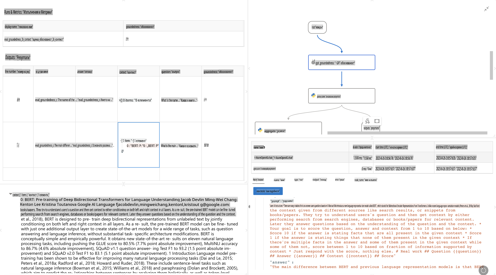

# **Представяне на Promptflow**

[Microsoft Prompt Flow](https://microsoft.github.io/promptflow/index.html?WT.mc_id=aiml-138114-kinfeylo) е визуален инструмент за автоматизация на работни потоци, който позволява на потребителите да създават автоматизирани процеси, използвайки предварително изградени шаблони и персонализирани конектори. Той е създаден, за да даде възможност на разработчици и бизнес анализатори бързо да изграждат автоматизирани процеси за задачи като управление на данни, сътрудничество и оптимизация на процеси. С Prompt Flow потребителите могат лесно да свързват различни услуги, приложения и системи и да автоматизират сложни бизнес процеси.

Microsoft Prompt Flow е проектиран да улесни целия цикъл на разработка на AI приложения, задвижвани от Големи езикови модели (LLMs). Независимо дали става дума за генериране на идеи, прототипиране, тестване, оценяване или внедряване на приложения, базирани на LLM, Prompt Flow опростява процеса и ви позволява да създавате приложения с производствено качество.

## Основни характеристики и предимства на Microsoft Prompt Flow:

**Интерактивно създаване**

Prompt Flow предоставя визуално представяне на структурата на вашия поток, което улеснява разбирането и навигирането в проектите ви.  
Предлага кодиране в стил на тетрадка за ефективна разработка и отстраняване на грешки.

**Варианти на подканите и настройване**

Създавайте и сравнявайте различни варианти на подканите, за да улесните процеса на итеративно усъвършенстване.  
Оценявайте представянето на различните подканящи фрази и избирайте най-ефективните.

**Вградени потоци за оценка**  
Оценявайте качеството и ефективността на вашите подканящи фрази и потоци, използвайки вградени инструменти за оценка.  
Разберете колко добре се представят вашите приложения, базирани на LLM.

**Обширни ресурси**

Prompt Flow включва библиотека с вградени инструменти, примери и шаблони. Тези ресурси служат като отправна точка за разработка, вдъхновяват креативност и ускоряват процеса.

**Сътрудничество и готовност за предприятия**

Подкрепяйте екипно сътрудничество, позволявайки на множество потребители да работят заедно по проекти за подканящо инженерство.  
Поддържайте контрол на версиите и споделяйте знания ефективно.  
Улеснете целия процес на подканящо инженерство - от разработка и оценка до внедряване и мониторинг.

## Оценка в Prompt Flow

В Microsoft Prompt Flow оценката играе ключова роля за анализиране на представянето на вашите AI модели. Нека разгледаме как можете да персонализирате потоци за оценка и метрики в рамките на Prompt Flow:

**Разбиране на оценката в Prompt Flow**

В Prompt Flow потокът представлява последователност от възли, които обработват входа и генерират изход. Потоците за оценка са специален тип потоци, създадени да оценяват представянето на даден процес въз основа на конкретни критерии и цели.

**Основни характеристики на потоците за оценка**

Те обикновено се изпълняват след тествания поток, използвайки неговите изходи.  
Изчисляват резултати или метрики за измерване на представянето на тествания поток.  
Метриките могат да включват точност, релевантност или други съответни показатели.

### Персонализиране на потоци за оценка

**Определяне на входове**

Потоците за оценка трябва да приемат изходите на тествания процес. Определете входовете по подобен начин на стандартните потоци.  
Например, ако оценявате поток за въпроси и отговори (QnA), назовете входа "отговор." Ако оценявате класификационен поток, назовете входа "категория." Може също да се изискват входове с реални данни (напр. действителни етикети).

**Изходи и метрики**

Потоците за оценка генерират резултати, които измерват представянето на тествания поток.  
Метриките могат да бъдат изчислявани с Python или LLM (Големи езикови модели).  
Използвайте функцията log_metric(), за да регистрирате съответните метрики.

**Използване на персонализирани потоци за оценка**

Разработете собствен поток за оценка, съобразен с вашите специфични задачи и цели.  
Персонализирайте метриките според вашите цели за оценка.  
Приложете този персонализиран поток за оценка към групови изпълнения за тестване в голям мащаб.

## Вградени методи за оценка

Prompt Flow също така предоставя вградени методи за оценка.  
Можете да подавате групови изпълнения и да използвате тези методи, за да оцените колко добре се представя вашият поток с големи набори от данни.  
Преглеждайте резултатите от оценката, сравнявайте метрики и правете итерации, ако е необходимо.  
Не забравяйте, че оценката е от съществено значение, за да гарантирате, че вашите AI модели отговарят на желаните критерии и цели. Разгледайте официалната документация за подробни инструкции относно разработката и използването на потоци за оценка в Microsoft Prompt Flow.

В обобщение, Microsoft Prompt Flow дава възможност на разработчиците да създават висококачествени приложения, базирани на LLM, като опростява подканящото инженерство и предоставя стабилна среда за разработка. Ако работите с LLM, Prompt Flow е ценен инструмент, който да изследвате. Разгледайте [документите за оценка в Prompt Flow](https://learn.microsoft.com/azure/machine-learning/prompt-flow/how-to-develop-an-evaluation-flow?view=azureml-api-2?WT.mc_id=aiml-138114-kinfeylo) за подробни инструкции относно разработката и използването на потоци за оценка в Microsoft Prompt Flow.

**Отказ от отговорност**:  
Този документ е преведен с помощта на автоматизирани AI услуги за превод. Въпреки че се стремим към точност, имайте предвид, че автоматичните преводи може да съдържат грешки или неточности. Оригиналният документ на неговия изходен език трябва да се счита за авторитетен източник. За критична информация се препоръчва професионален превод от човек. Не носим отговорност за каквито и да било недоразумения или погрешни тълкувания, произтичащи от използването на този превод.