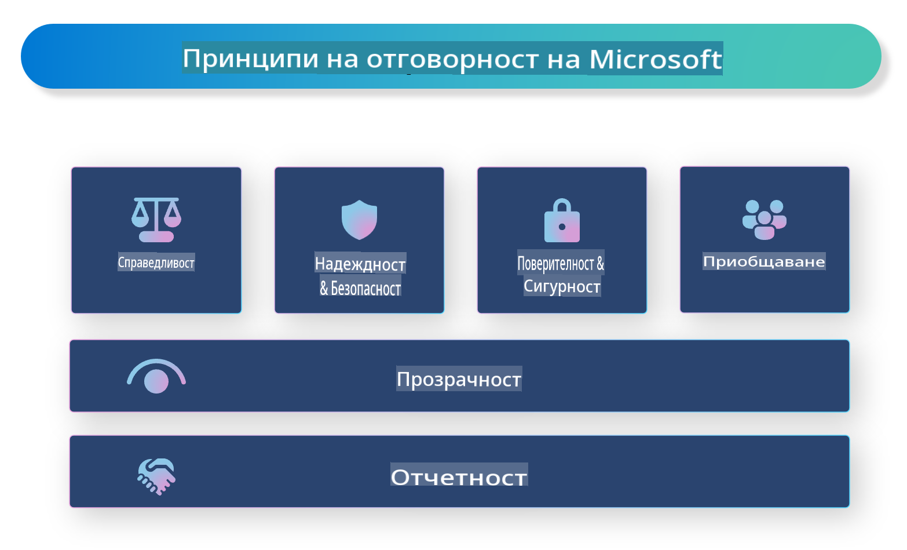

# **Въведение в Отговорния Изкуствен Интелект**

[Microsoft Responsible AI](https://www.microsoft.com/ai/responsible-ai?WT.mc_id=aiml-138114-kinfeylo) е инициатива, която цели да помогне на разработчиците и организациите да създават системи за изкуствен интелект (ИИ), които са прозрачни, надеждни и отговорни. Инициативата предоставя насоки и ресурси за разработване на отговорни ИИ решения, които съответстват на етични принципи като поверителност, справедливост и прозрачност. Ще разгледаме също някои от предизвикателствата и добрите практики, свързани със създаването на отговорни ИИ системи.

## Преглед на Microsoft Responsible AI

**Етични принципи**

Microsoft Responsible AI се ръководи от набор етични принципи като поверителност, справедливост, прозрачност, отговорност и безопасност. Тези принципи са създадени, за да гарантират, че ИИ системите се разработват по етичен и отговорен начин.

**Прозрачен ИИ**

Microsoft Responsible AI подчертава значението на прозрачността в ИИ системите. Това включва предоставяне на ясни обяснения за начина, по който работят ИИ моделите, както и гарантиране, че източниците на данни и алгоритмите са публично достъпни.

**Отговорен ИИ**

[Microsoft Responsible AI](https://www.microsoft.com/ai/responsible-ai?WT.mc_id=aiml-138114-kinfeylo) насърчава разработването на отговорни ИИ системи, които могат да предоставят информация за това как моделите вземат решения. Това помага на потребителите да разбират и да се доверяват на резултатите от ИИ системите.

**Инклузивност**

ИИ системите трябва да бъдат създадени така, че да са от полза за всички. Microsoft се стреми да създава инклузивен ИИ, който отчита различни гледни точки и избягва предразсъдъци или дискриминация.

**Надеждност и безопасност**

Гарантирането на надеждността и безопасността на ИИ системите е от ключово значение. Microsoft се фокусира върху изграждането на устойчиви модели, които работят последователно и избягват вредни последствия.

**Справедливост в ИИ**

Microsoft Responsible AI признава, че ИИ системите могат да възпроизвеждат предразсъдъци, ако са обучени с пристрастни данни или алгоритми. Инициативата предоставя насоки за разработване на справедливи ИИ системи, които не дискриминират по фактори като раса, пол или възраст.

**Поверителност и сигурност**

Microsoft Responsible AI подчертава значението на защитата на поверителността на потребителите и сигурността на данните в ИИ системите. Това включва прилагане на силно криптиране на данни и контрол на достъпа, както и редовно одитиране на ИИ системите за уязвимости.

**Отговорност и ангажираност**

Microsoft Responsible AI насърчава отговорността и ангажираността при разработването и внедряването на ИИ. Това включва гарантиране, че разработчиците и организациите са наясно с потенциалните рискове, свързани с ИИ системите, и предприемат мерки за тяхното смекчаване.

## Добри практики за създаване на отговорни ИИ системи

**Разработване на ИИ модели с разнообразни набори от данни**

За да се избегнат пристрастия в ИИ системите, е важно да се използват разнообразни набори от данни, които представят различни гледни точки и опит.

**Използване на техники за обясним ИИ**

Техниките за обясним ИИ могат да помогнат на потребителите да разберат как моделите вземат решения, което увеличава доверието в системата.

**Редовен одит на ИИ системите за уязвимости**

Редовните одити на ИИ системите могат да помогнат за идентифициране на потенциални рискове и уязвимости, които трябва да бъдат отстранени.

**Прилагане на силно криптиране на данни и контрол на достъпа**

Криптирането на данни и контрола на достъпа могат да помогнат за защита на поверителността и сигурността на потребителите в ИИ системите.

**Следване на етични принципи при разработването на ИИ**

Следването на етични принципи като справедливост, прозрачност и отговорност може да помогне за изграждането на доверие в ИИ системите и да гарантира, че те се разработват по отговорен начин.

## Използване на AI Foundry за Отговорен ИИ

[Azure AI Foundry](https://ai.azure.com?WT.mc_id=aiml-138114-kinfeylo) е мощна платформа, която позволява на разработчиците и организациите бързо да създават интелигентни, иновативни, готови за пазара и отговорни приложения. Ето някои ключови характеристики и възможности на Azure AI Foundry:

**Готови за използване API-та и модели**

Azure AI Foundry предоставя предварително създадени и персонализируеми API-та и модели. Те обхващат широк спектър от задачи на ИИ, включително генеративен ИИ, обработка на естествен език за разговори, търсене, мониторинг, превод, реч, зрение и вземане на решения.

**Prompt Flow**

Prompt Flow в Azure AI Foundry ви позволява да създавате преживявания с разговорен ИИ. Той улеснява проектирането и управлението на разговорни потоци, което прави по-лесно изграждането на чатботове, виртуални асистенти и други интерактивни приложения.

**Извличане с допълнено генериране (RAG)**

RAG е техника, която комбинира подходи, базирани на извличане и генериране. Тя подобрява качеството на генерираните отговори, като използва както предварително съществуващи знания (извличане), така и креативно генериране (генериране).

**Метрики за оценка и мониторинг на генеративен ИИ**

Azure AI Foundry предоставя инструменти за оценка и мониторинг на генеративни ИИ модели. Можете да оценявате тяхната производителност, справедливост и други важни метрики, за да гарантирате отговорно внедряване. Освен това, ако сте създали табло, можете да използвате интерфейса без код в Azure Machine Learning Studio, за да персонализирате и генерирате Табло за Отговорен ИИ и съответната оценителна карта, базирани на [Responsible AI Toolbox](https://responsibleaitoolbox.ai/?WT.mc_id=aiml-138114-kinfeylo) Python библиотеки. Тази оценителна карта ви помага да споделяте ключови прозрения, свързани със справедливостта, значимостта на характеристиките и други аспекти на отговорното внедряване, както с технически, така и с нетехнически заинтересовани страни.

За да използвате AI Foundry с отговорен ИИ, можете да следвате тези добри практики:

**Определете проблема и целите на вашата ИИ система**

Преди да започнете процеса на разработка, е важно ясно да определите проблема или целта, която вашата ИИ система се стреми да реши. Това ще ви помогне да идентифицирате данните, алгоритмите и ресурсите, необходими за изграждането на ефективен модел.

**Събиране и предварителна обработка на релевантни данни**

Качеството и количеството на данните, използвани за обучение на ИИ система, могат значително да повлияят на нейната производителност. Затова е важно да събирате релевантни данни, да ги почиствате, предварително обработвате и да се уверите, че те са представителни за населението или проблема, който се опитвате да решите.

**Избор на подходяща оценка**

Съществуват различни алгоритми за оценка. Важно е да изберете най-подходящия алгоритъм въз основа на вашите данни и проблем.

**Оценка и интерпретация на модела**

След като създадете ИИ модел, е важно да оцените неговата производителност с помощта на подходящи метрики и да интерпретирате резултатите по прозрачен начин. Това ще ви помогне да идентифицирате евентуални пристрастия или ограничения в модела и да направите подобрения, където е необходимо.

**Гарантиране на прозрачност и обяснимост**

ИИ системите трябва да бъдат прозрачни и обясними, за да могат потребителите да разбират как работят и как се вземат решенията. Това е особено важно за приложения, които имат значителни въздействия върху човешкия живот, като здравеопазване, финанси и правни системи.

**Мониторинг и актуализация на модела**

ИИ системите трябва да бъдат непрекъснато наблюдавани и актуализирани, за да се гарантира, че остават точни и ефективни с течение на времето. Това изисква постоянна поддръжка, тестване и преобучение на модела.

В заключение, Microsoft Responsible AI е инициатива, която цели да помогне на разработчиците и организациите да създават ИИ системи, които са прозрачни, надеждни и отговорни. Не забравяйте, че внедряването на отговорен ИИ е от съществено значение, а Azure AI Foundry се стреми да го направи практично за организациите. Следвайки етичните принципи и добрите практики, можем да гарантираме, че ИИ системите се разработват и внедряват по отговорен начин, който носи полза за обществото като цяло.

**Отказ от отговорност**:  
Този документ е преведен с помощта на машинни AI услуги за превод. Въпреки че се стремим към точност, моля, имайте предвид, че автоматизираните преводи може да съдържат грешки или неточности. Оригиналният документ на неговия изходен език трябва да се счита за авторитетен източник. За критична информация се препоръчва професионален човешки превод. Не носим отговорност за никакви недоразумения или погрешни интерпретации, произтичащи от използването на този превод.