# Фина настройка и интеграция на персонализирани Phi-3 модели с Prompt flow в Azure AI Foundry

Този пример от край до край (E2E) е базиран на ръководството "[Фина настройка и интеграция на персонализирани Phi-3 модели с Prompt Flow в Azure AI Foundry](https://techcommunity.microsoft.com/t5/educator-developer-blog/fine-tune-and-integrate-custom-phi-3-models-with-prompt-flow-in/ba-p/4191726?WT.mc_id=aiml-137032-kinfeylo)" от Microsoft Tech Community. То представя процесите за фина настройка, внедряване и интеграция на персонализирани Phi-3 модели с Prompt flow в Azure AI Foundry.  
За разлика от примера "[Фина настройка и интеграция на персонализирани Phi-3 модели с Prompt Flow](./E2E_Phi-3-FineTuning_PromptFlow_Integration.md)", който включва изпълнение на код локално, това ръководство се фокусира изцяло върху фината настройка и интеграция на вашия модел в Azure AI / ML Studio.

## Обзор

В този пример от край до край ще научите как да направите фина настройка на Phi-3 модела и да го интегрирате с Prompt flow в Azure AI Foundry. Използвайки Azure AI / ML Studio, ще установите работен процес за внедряване и използване на персонализирани AI модели. Този пример е разделен на три сценария:

**Сценарий 1: Настройка на Azure ресурси и подготовка за фина настройка**

**Сценарий 2: Фина настройка на Phi-3 модела и внедряване в Azure Machine Learning Studio**

**Сценарий 3: Интеграция с Prompt flow и чат с персонализирания ви модел в Azure AI Foundry**

Ето обзор на този пример от край до край.


### Съдържание

1. **[Сценарий 1: Настройка на Azure ресурси и подготовка за фина настройка](../../../../../../md/02.Application/01.TextAndChat/Phi3)**  
   - [Създаване на работно пространство за Azure Machine Learning](../../../../../../md/02.Application/01.TextAndChat/Phi3)  
   - [Заявка за GPU квоти в Azure Subscription](../../../../../../md/02.Application/01.TextAndChat/Phi3)  
   - [Добавяне на ролево присвояване](../../../../../../md/02.Application/01.TextAndChat/Phi3)  
   - [Настройка на проект](../../../../../../md/02.Application/01.TextAndChat/Phi3)  
   - [Подготовка на датасет за фина настройка](../../../../../../md/02.Application/01.TextAndChat/Phi3)  

1. **[Сценарий 2: Фина настройка на Phi-3 модела и внедряване в Azure Machine Learning Studio](../../../../../../md/02.Application/01.TextAndChat/Phi3)**  
   - [Фина настройка на Phi-3 модела](../../../../../../md/02.Application/01.TextAndChat/Phi3)  
   - [Внедряване на фино настроения Phi-3 модел](../../../../../../md/02.Application/01.TextAndChat/Phi3)  

1. **[Сценарий 3: Интеграция с Prompt flow и чат с персонализирания ви модел в Azure AI Foundry](../../../../../../md/02.Application/01.TextAndChat/Phi3)**  
   - [Интеграция на персонализирания Phi-3 модел с Prompt flow](../../../../../../md/02.Application/01.TextAndChat/Phi3)  
   - [Чат с персонализирания ви Phi-3 модел](../../../../../../md/02.Application/01.TextAndChat/Phi3)  

## Сценарий 1: Настройка на Azure ресурси и подготовка за фина настройка

### Създаване на работно пространство за Azure Machine Learning

1. Въведете *azure machine learning* в **търсачката** в горната част на портала и изберете **Azure Machine Learning** от предложените опции.

    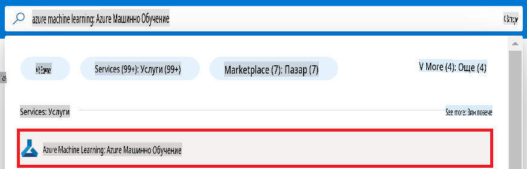

2. Изберете **+ Create** от менюто за навигация.

3. Изберете **New workspace** от менюто за навигация.

    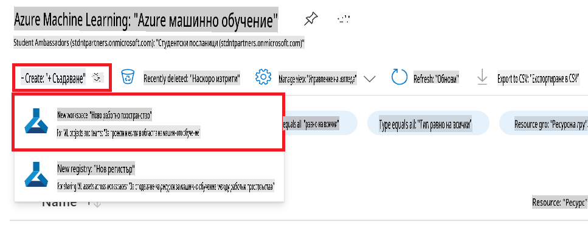

4. Изпълнете следните стъпки:

    - Изберете вашия Azure **Subscription**.  
    - Изберете **Resource group** (създайте нова, ако е необходимо).  
    - Въведете **Име на работното пространство**. То трябва да е уникално.  
    - Изберете **Регион**, който искате да използвате.  
    - Изберете **Storage account** (създайте нов, ако е необходимо).  
    - Изберете **Key vault** (създайте нов, ако е необходимо).  
    - Изберете **Application insights** (създайте нов, ако е необходимо).  
    - Изберете **Container registry** (създайте нов, ако е необходимо).  

    

5. Изберете **Review + Create**.

6. Изберете **Create**.

### Заявка за GPU квоти в Azure Subscription

В това ръководство ще научите как да направите фина настройка и внедряване на Phi-3 модел, използвайки GPU. За фината настройка ще използвате GPU *Standard_NC24ads_A100_v4*, което изисква заявка за квота. За внедряване ще използвате GPU *Standard_NC6s_v3*, което също изисква заявка за квота.

> [!NOTE]  
> Само абонаменти Pay-As-You-Go (стандартният тип абонамент) са допустими за GPU разпределение; абонаментите с предимства в момента не се поддържат.

1. Посетете [Azure ML Studio](https://ml.azure.com/home?wt.mc_id=studentamb_279723).

1. Изпълнете следните стъпки, за да заявите квота за *Standard NCADSA100v4 Family*:

    - Изберете **Quota** от лявото меню.  
    - Изберете **Virtual machine family**, която искате да използвате. Например, изберете **Standard NCADSA100v4 Family Cluster Dedicated vCPUs**, което включва GPU *Standard_NC24ads_A100_v4*.  
    - Изберете **Request quota** от менюто за навигация.  

        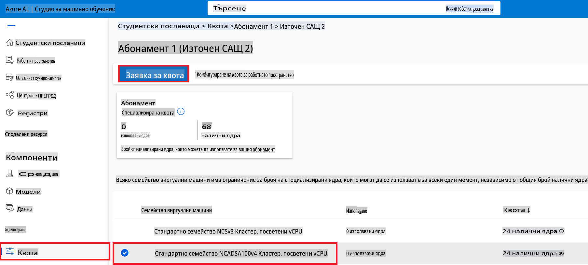

    - В страницата за заявка за квота въведете **Нов лимит за ядра**, който искате да използвате. Например, 24.  
    - В страницата за заявка за квота изберете **Submit**, за да подадете заявката за GPU квота.  

1. Изпълнете следните стъпки, за да заявите квота за *Standard NCSv3 Family*:

    - Изберете **Quota** от лявото меню.  
    - Изберете **Virtual machine family**, която искате да използвате. Например, изберете **Standard NCSv3 Family Cluster Dedicated vCPUs**, което включва GPU *Standard_NC6s_v3*.  
    - Изберете **Request quota** от менюто за навигация.  
    - В страницата за заявка за квота въведете **Нов лимит за ядра**, който искате да използвате. Например, 24.  
    - В страницата за заявка за квота изберете **Submit**, за да подадете заявката за GPU квота.  

### Добавяне на ролево присвояване

За да направите фина настройка и внедряване на вашите модели, първо трябва да създадете потребителска управлявана идентичност (UAI) и да ѝ присвоите подходящите разрешения. Тази UAI ще се използва за удостоверяване по време на внедряването.

#### Създаване на потребителска управлявана идентичност (UAI)

1. Въведете *managed identities* в **търсачката** в горната част на портала и изберете **Managed Identities** от предложените опции.

    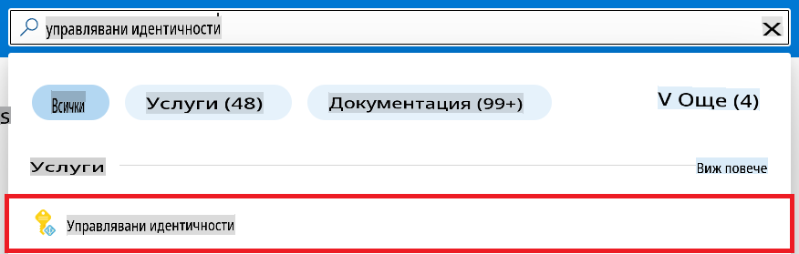

1. Изберете **+ Create**.

    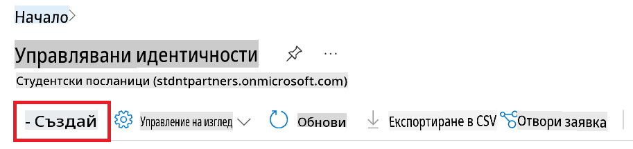

1. Изпълнете следните стъпки:

    - Изберете вашия Azure **Subscription**.  
    - Изберете **Resource group** (създайте нова, ако е необходимо).  
    - Изберете **Регион**, който искате да използвате.  
    - Въведете **Име**. То трябва да е уникално.  

    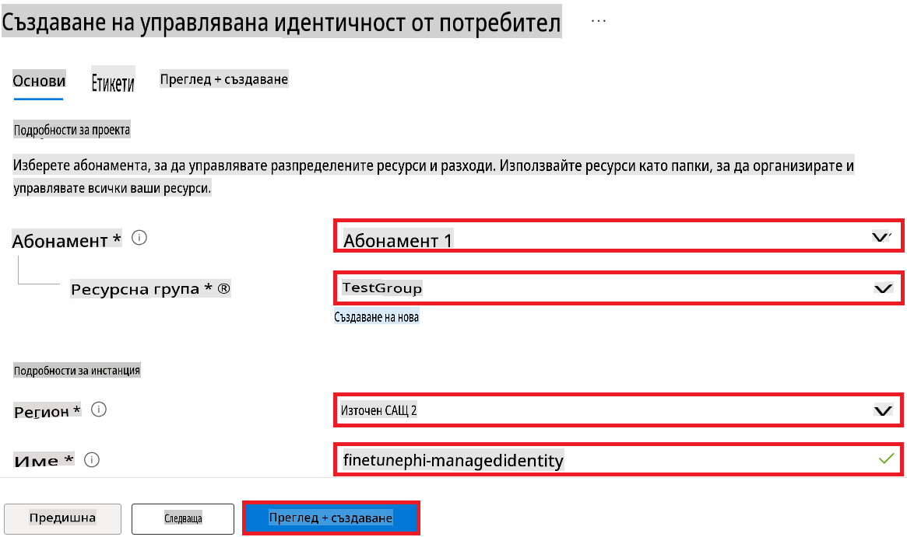

1. Изберете **Review + create**.

1. Изберете **+ Create**.

#### Добавяне на роля "Contributor" към управляваната идентичност

1. Навигирайте до ресурса за управляваната идентичност, който създадохте.

1. Изберете **Azure role assignments** от лявото меню.

1. Изберете **+ Add role assignment** от менюто за навигация.

1. В страницата за добавяне на роля изпълнете следните стъпки:
    - Изберете **Обхват** на **Resource group**.  
    - Изберете вашия Azure **Subscription**.  
    - Изберете **Resource group**, който ще използвате.  
    - Изберете **Роля** на **Contributor**.  

    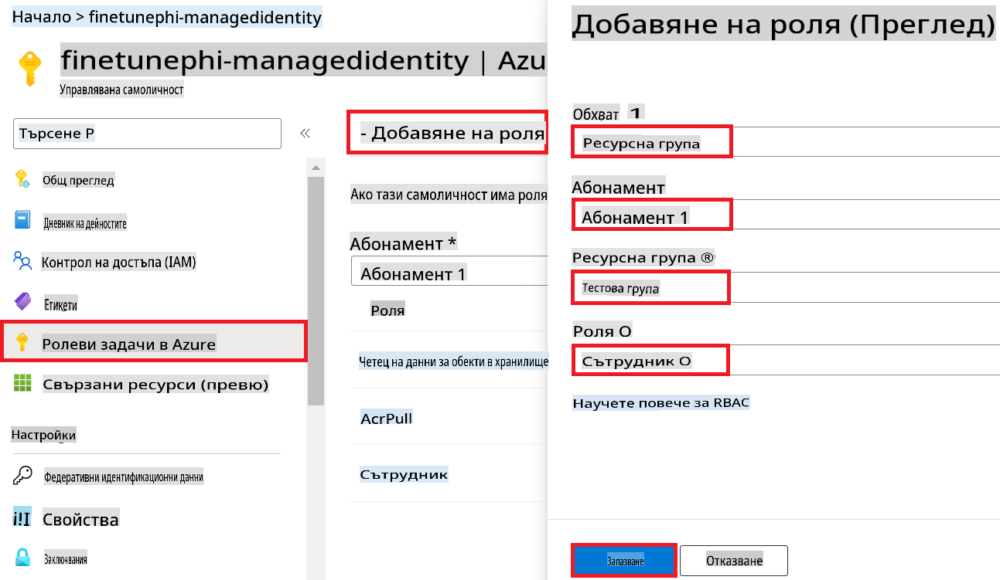

2. Изберете **Save**.  

...
1. Посетете [Azure ML Studio](https://ml.azure.com/home?wt.mc_id=studentamb_279723).

1. Изберете **Compute** от лявото меню.

1. Изберете **Compute clusters** от навигационното меню.

1. Изберете **+ New**.

    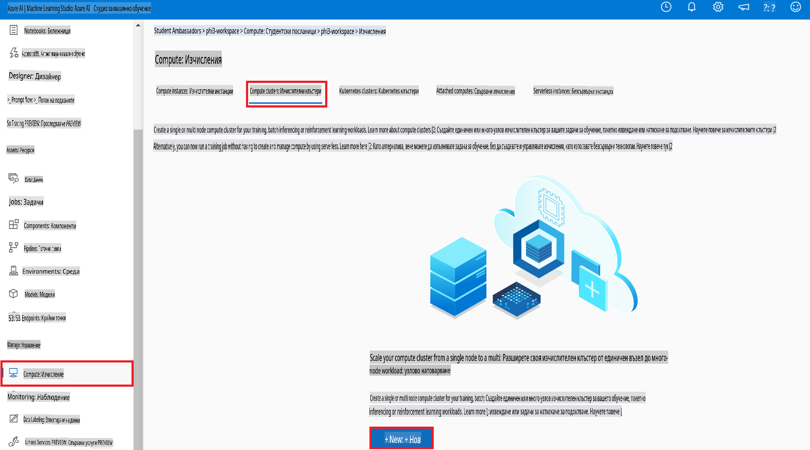

1. Изпълнете следните задачи:

    - Изберете **Region**, който искате да използвате.
    - Изберете **Virtual machine tier** на **Dedicated**.
    - Изберете **Virtual machine type** на **GPU**.
    - Изберете **Virtual machine size** филтър на **Select from all options**.
    - Изберете **Virtual machine size** на **Standard_NC24ads_A100_v4**.

    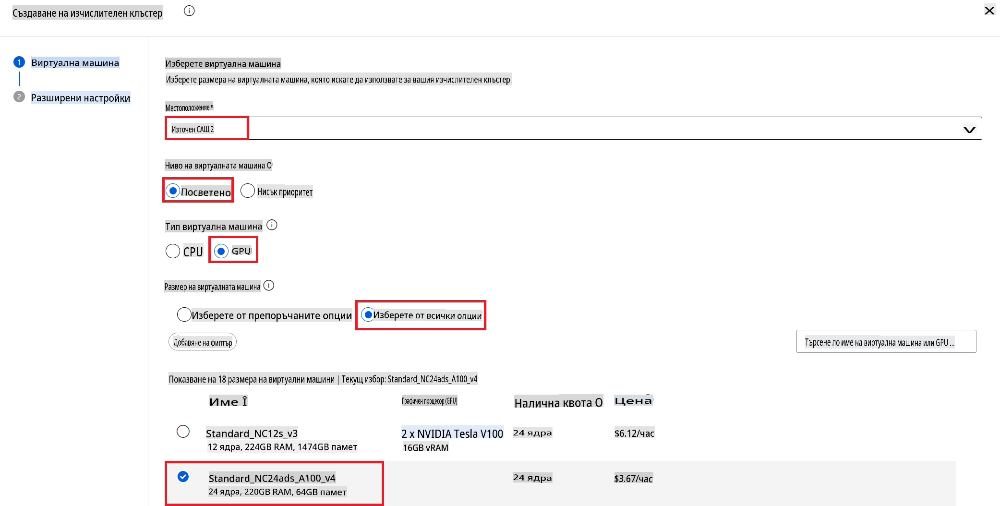

1. Изберете **Next**.

1. Изпълнете следните задачи:

    - Въведете **Compute name**. Трябва да бъде уникално.
    - Изберете **Minimum number of nodes** на **0**.
    - Изберете **Maximum number of nodes** на **1**.
    - Изберете **Idle seconds before scale down** на **120**.

    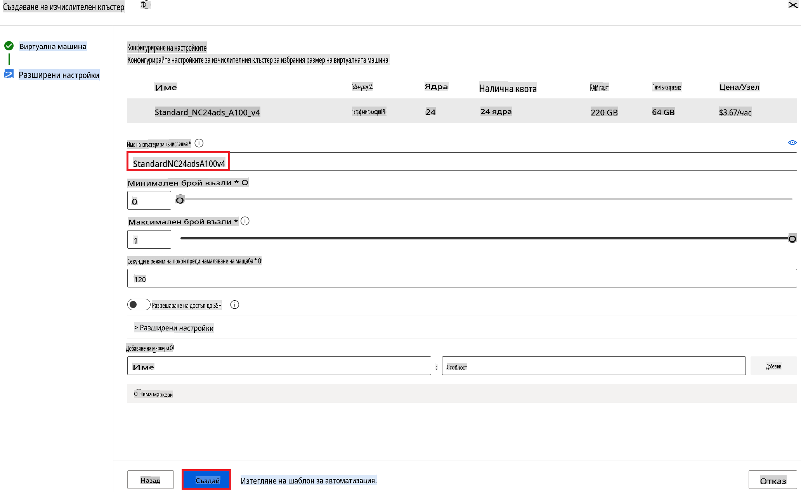

1. Изберете **Create**.

#### Фина настройка на модела Phi-3

1. Посетете [Azure ML Studio](https://ml.azure.com/home?wt.mc_id=studentamb_279723).

1. Изберете работното пространство Azure Machine Learning, което сте създали.

    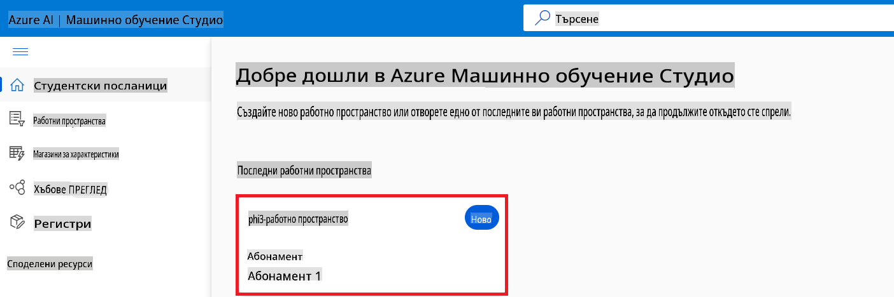

1. Изпълнете следните задачи:

    - Изберете **Model catalog** от лявото меню.
    - Въведете *phi-3-mini-4k* в **търсачката** и изберете **Phi-3-mini-4k-instruct** от предложените опции.

    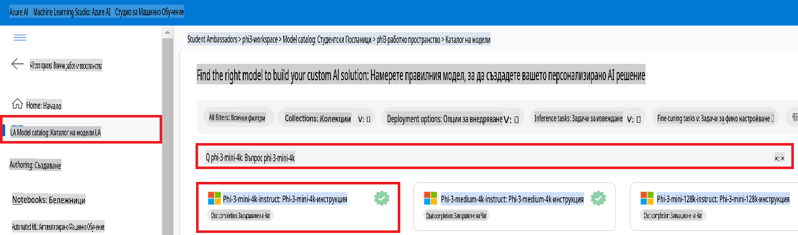

1. Изберете **Fine-tune** от навигационното меню.

    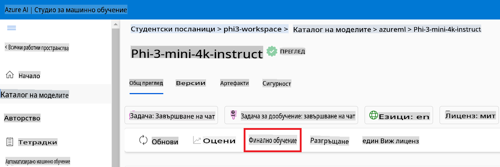

1. Изпълнете следните задачи:

    - Изберете **Select task type** на **Chat completion**.
    - Изберете **+ Select data**, за да качите **Training data**.
    - Изберете тип качване на Validation data на **Provide different validation data**.
    - Изберете **+ Select data**, за да качите **Validation data**.

    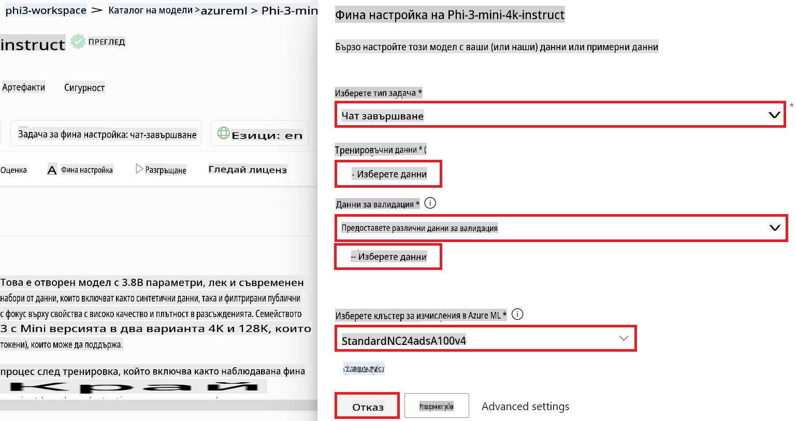

    > [!TIP]
    >
    > Можете да изберете **Advanced settings**, за да персонализирате конфигурации като **learning_rate** и **lr_scheduler_type**, за да оптимизирате процеса на фина настройка според вашите специфични нужди.

1. Изберете **Finish**.

1. В това упражнение успешно направихте фина настройка на модела Phi-3, използвайки Azure Machine Learning. Имайте предвид, че процесът на фина настройка може да отнеме значително време. След стартирането на задачата за фина настройка трябва да изчакате тя да завърши. Можете да следите статуса на задачата за фина настройка, като отидете на раздела Jobs в лявото меню на вашето Azure Machine Learning Workspace. В следващата серия ще разгърнете финално настроения модел и ще го интегрирате с Prompt Flow.

    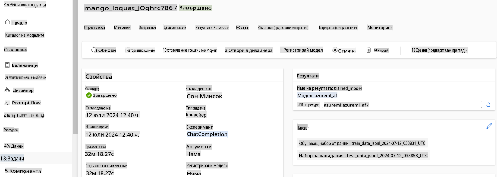

### Разгръщане на финално настроения модел Phi-3

За да интегрирате финално настроения модел Phi-3 с Prompt Flow, трябва да разположите модела, за да го направите достъпен за реалновремеви прогнози. Този процес включва регистриране на модела, създаване на онлайн крайна точка и разгръщане на модела.

В това упражнение ще:

- Регистрирате финално настроения модел в работното пространство на Azure Machine Learning.
- Създадете онлайн крайна точка.
- Разположите регистрирания финално настроен модел Phi-3.

#### Регистриране на финално настроения модел

1. Посетете [Azure ML Studio](https://ml.azure.com/home?wt.mc_id=studentamb_279723).

1. Изберете работното пространство Azure Machine Learning, което сте създали.

    

1. Изберете **Models** от лявото меню.
1. Изберете **+ Register**.
1. Изберете **From a job output**.

    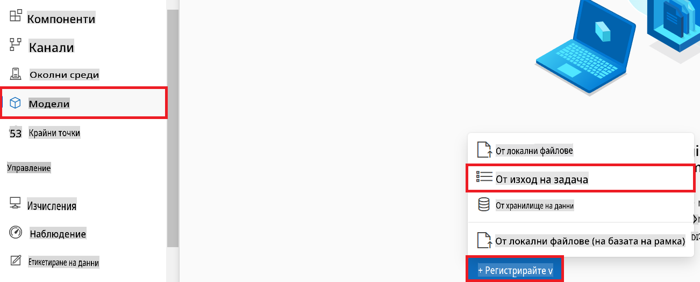

1. Изберете задачата, която сте създали.

    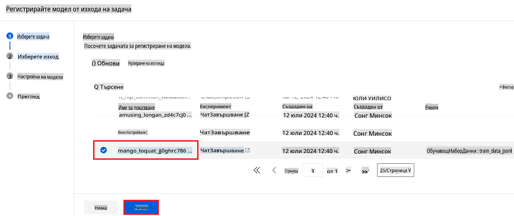

1. Изберете **Next**.

1. Изберете **Model type** на **MLflow**.

1. Уверете се, че **Job output** е избрано; трябва да е автоматично избрано.

    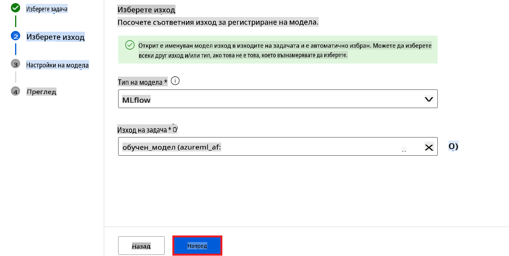

2. Изберете **Next**.

3. Изберете **Register**.

    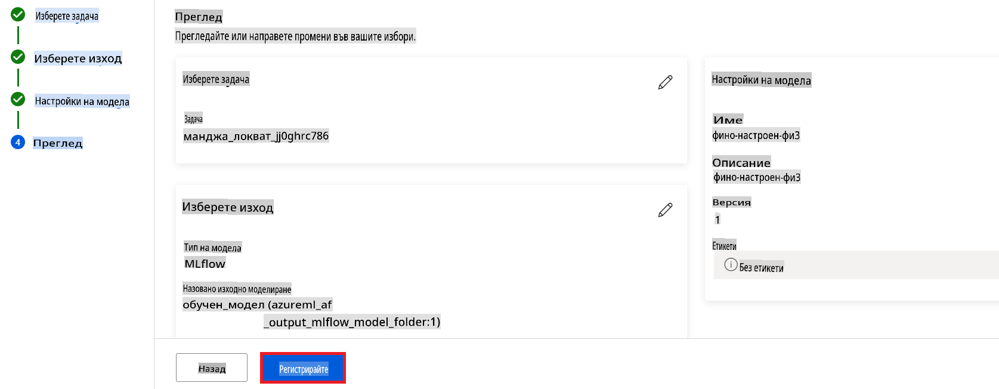

4. Можете да видите регистрирания си модел, като отидете в менюто **Models** от лявото меню.

    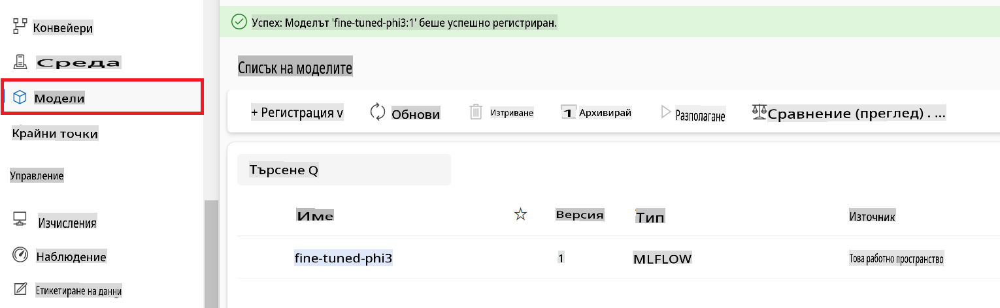

#### Разгръщане на финално настроения модел

1. Отидете в работното пространство Azure Machine Learning, което сте създали.

1. Изберете **Endpoints** от лявото меню.

1. Изберете **Real-time endpoints** от навигационното меню.

    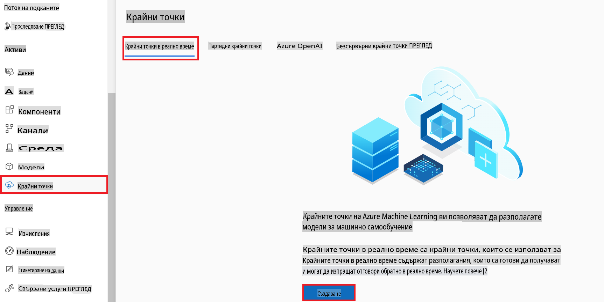

1. Изберете **Create**.

1. Изберете регистрирания модел, който сте създали.

    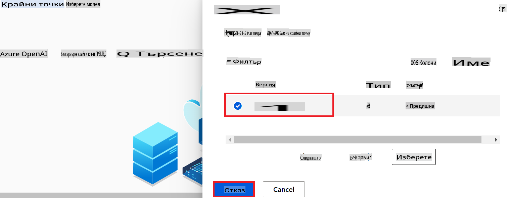

1. Изберете **Select**.

1. Изпълнете следните задачи:

    - Изберете **Virtual machine** на *Standard_NC6s_v3*.
    - Изберете **Instance count**, който искате да използвате. Например, *1*.
    - Изберете **Endpoint** на **New**, за да създадете крайна точка.
    - Въведете **Endpoint name**. Трябва да бъде уникално.
    - Въведете **Deployment name**. Трябва да бъде уникално.

    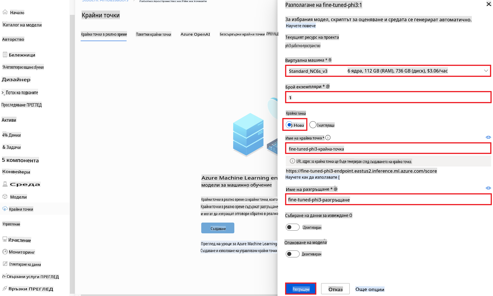

1. Изберете **Deploy**.

> [!WARNING]
> За да избегнете допълнителни такси по вашия акаунт, уверете се, че сте изтрили създадената крайна точка в работното пространство Azure Machine Learning.
>

#### Проверка на статуса на разгръщане в Azure Machine Learning Workspace

1. Отидете в работното пространство Azure Machine Learning, което сте създали.

1. Изберете **Endpoints** от лявото меню.

1. Изберете крайна точка, която сте създали.

    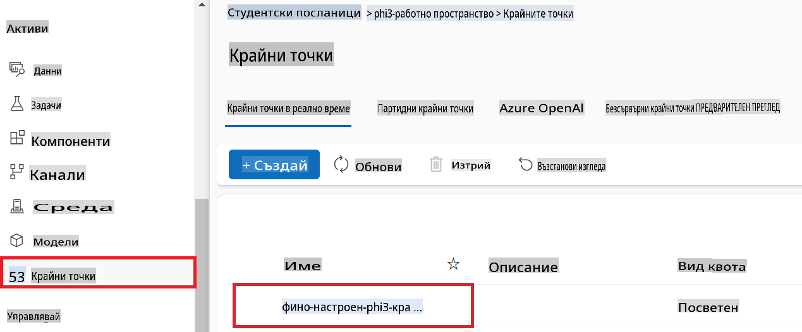

1. На тази страница можете да управлявате крайните точки по време на процеса на разгръщане.

> [!NOTE]
> След като разгръщането приключи, уверете се, че **Live traffic** е настроен на **100%**. Ако не е, изберете **Update traffic**, за да коригирате настройките за трафика. Имайте предвид, че не можете да тествате модела, ако трафикът е настроен на 0%.
>
> 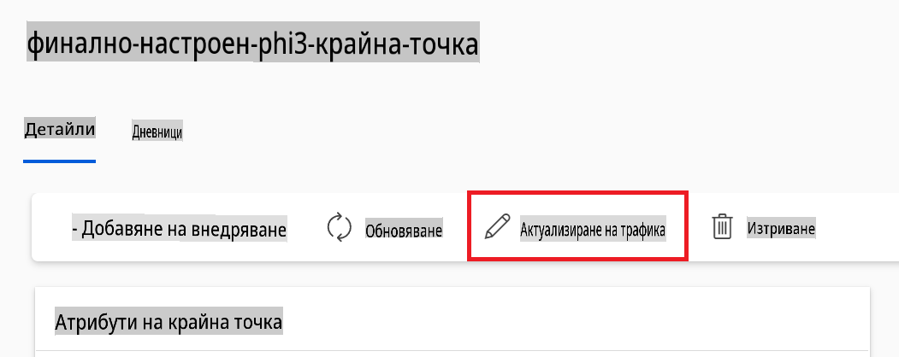
> 

## Сценарий 3: Интеграция с Prompt Flow и чат с вашия персонализиран модел в Azure AI Foundry

### Интегриране на персонализирания модел Phi-3 с Prompt Flow

След успешното разгръщане на финално настроения модел, вече можете да го интегрирате с Prompt Flow, за да го използвате в реалновремеви приложения, позволявайки различни интерактивни задачи с вашия персонализиран модел Phi-3.

В това упражнение ще:

- Създадете Azure AI Foundry Hub.
- Създадете Azure AI Foundry Project.
- Създадете Prompt Flow.
- Добавите персонализирана връзка за финално настроения модел Phi-3.
- Настроите Prompt Flow за чат с вашия персонализиран модел Phi-3.

> [!NOTE]
> Можете също така да интегрирате с Prompt Flow, използвайки Azure ML Studio. Същият процес на интеграция може да се приложи към Azure ML Studio.

#### Създаване на Azure AI Foundry Hub

Трябва да създадете Hub преди да създадете Project. Hub действа като Resource Group, позволявайки ви да организирате и управлявате множество проекти в Azure AI Foundry.

1. Посетете [Azure AI Foundry](https://ai.azure.com/?WT.mc_id=aiml-137032-kinfeylo).

1. Изберете **All hubs** от лявото меню.

1. Изберете **+ New hub** от навигационното меню.

    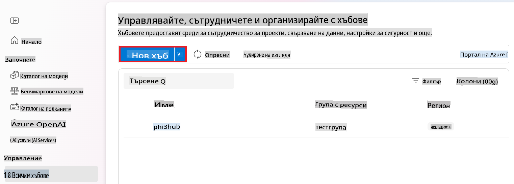

1. Изпълнете следните задачи:

    - Въведете **Hub name**. Трябва да бъде уникално.
    - Изберете вашия Azure **Subscription**.
    - Изберете **Resource group**, която да използвате (създайте нова, ако е необходимо).
    - Изберете **Location**, който искате да използвате.
    - Изберете **Connect Azure AI Services**, които да използвате (създайте нов, ако е необходимо).
    - Изберете **Connect Azure AI Search** на **Skip connecting**.

    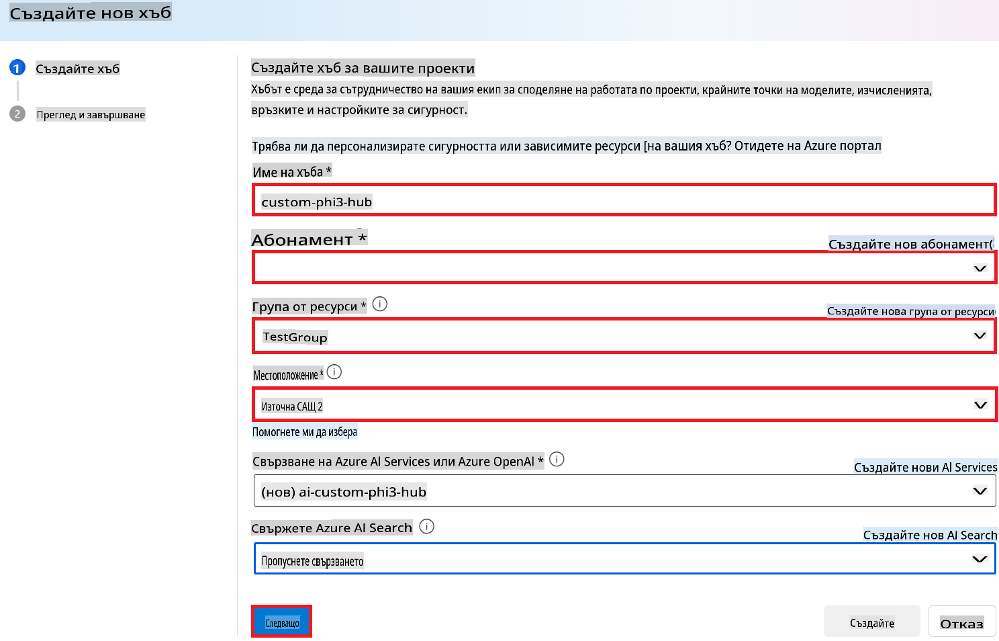

1. Изберете **Next**.

#### Създаване на Azure AI Foundry Project

1. В Hub, който сте създали, изберете **All projects** от лявото меню.

1. Изберете **+ New project** от навигационното меню.

    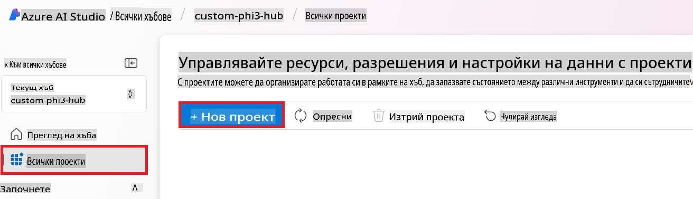

1. Въведете **Project name**. Трябва да бъде уникално.

    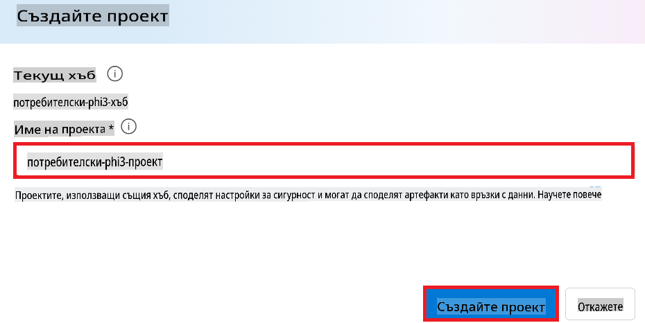

1. Изберете **Create a project**.

#### Добавяне на персонализирана връзка за финално настроения модел Phi-3

За да интегрирате вашия персонализиран модел Phi-3 с Prompt Flow, трябва да запазите крайната точка и ключа на модела в персонализирана връзка. Тази настройка осигурява достъп до вашия персонализиран модел Phi-3 в Prompt Flow.

#### Задаване на API ключ и URI на крайната точка на финално настроения модел Phi-3

1. Посетете [Azure ML Studio](https://ml.azure.com/home?WT.mc_id=aiml-137032-kinfeylo).

1. Отидете в работното пространство Azure Machine Learning, което сте създали.

1. Изберете **Endpoints** от лявото меню.

    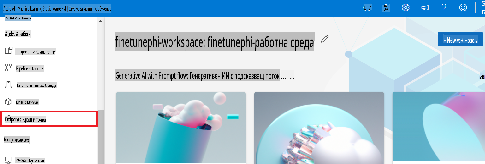

1. Изберете крайната точка, която сте създали.

    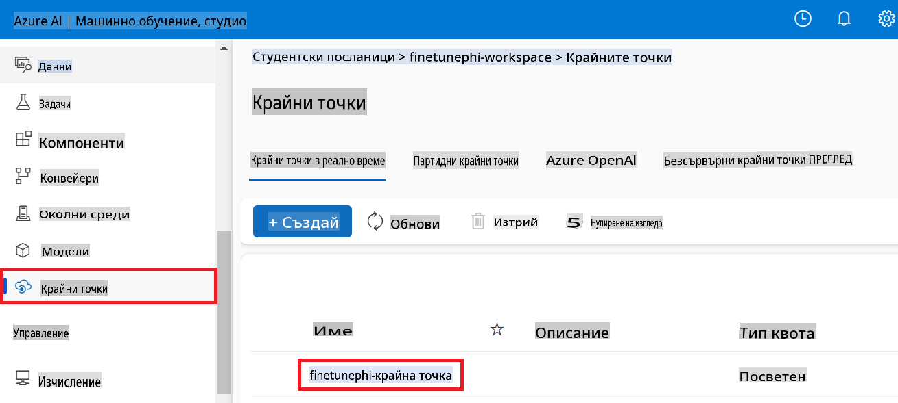

1. Изберете **Consume** от навигационното меню.

1. Копирайте вашия **REST endpoint** и **Primary key**.
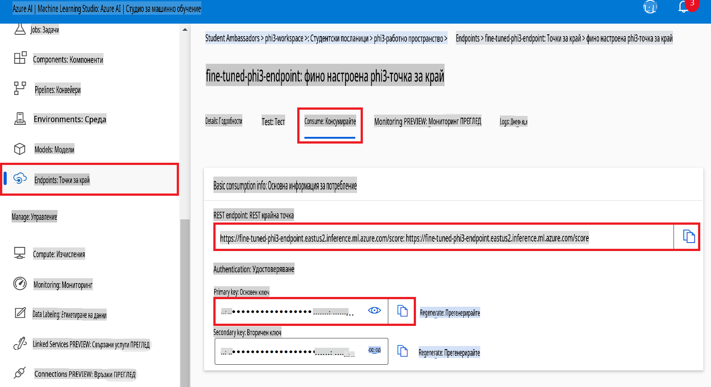

#### Добавяне на персонализирана връзка

1. Посетете [Azure AI Foundry](https://ai.azure.com/?WT.mc_id=aiml-137032-kinfeylo).

1. Навигирайте до проекта в Azure AI Foundry, който сте създали.

1. В проекта, който сте създали, изберете **Settings** от страничното меню вляво.

1. Изберете **+ New connection**.

    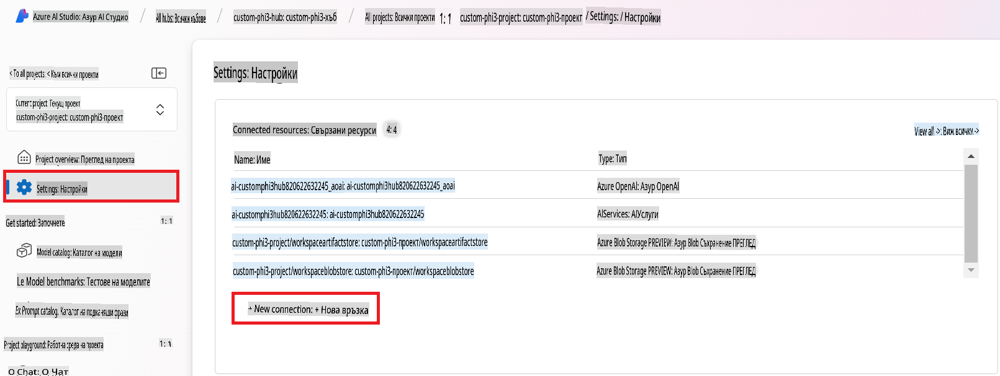

1. Изберете **Custom keys** от навигационното меню.

    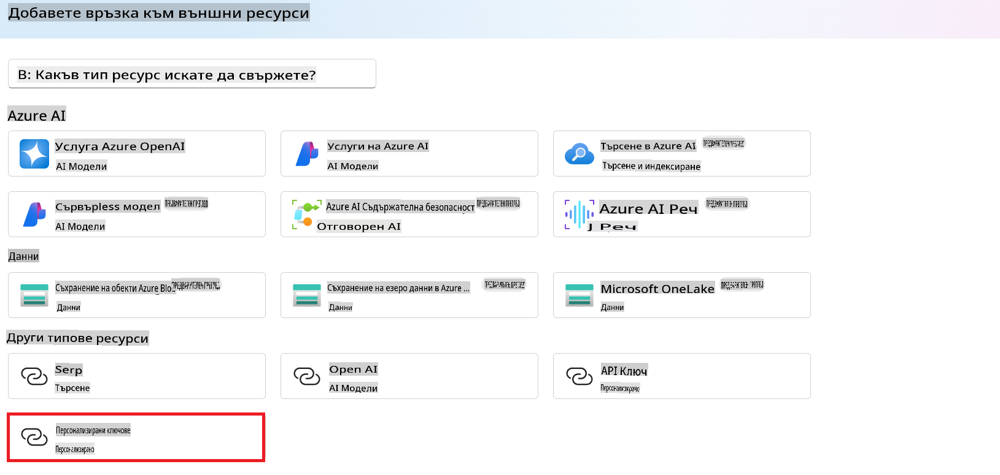

1. Изпълнете следните стъпки:

    - Изберете **+ Add key value pairs**.
    - За името на ключа въведете **endpoint** и поставете крайна точка, която сте копирали от Azure ML Studio, в полето за стойност.
    - Отново изберете **+ Add key value pairs**.
    - За името на ключа въведете **key** и поставете ключа, който сте копирали от Azure ML Studio, в полето за стойност.
    - След добавянето на ключовете, изберете **is secret**, за да предотвратите излагането на ключа.

    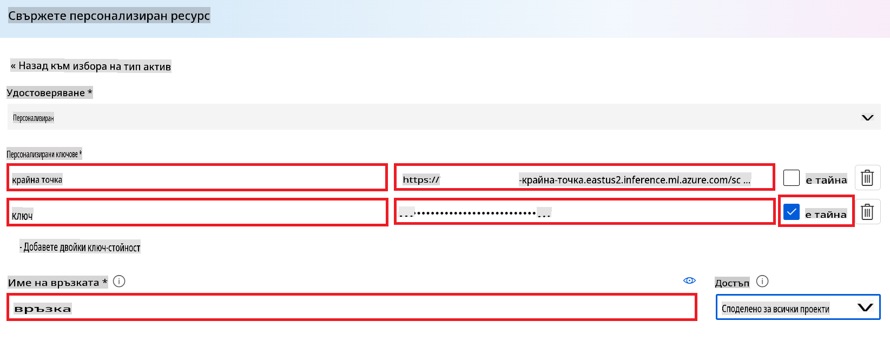

1. Изберете **Add connection**.

#### Създаване на Prompt flow

Добавихте персонализирана връзка в Azure AI Foundry. Сега нека създадем Prompt flow, като използваме следните стъпки. След това ще свържете този Prompt flow с персонализираната връзка, за да можете да използвате финно настроения модел в рамките на Prompt flow.

1. Навигирайте до проекта в Azure AI Foundry, който сте създали.

1. Изберете **Prompt flow** от страничното меню вляво.

1. Изберете **+ Create** от навигационното меню.

    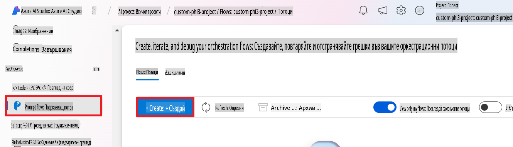

1. Изберете **Chat flow** от навигационното меню.

    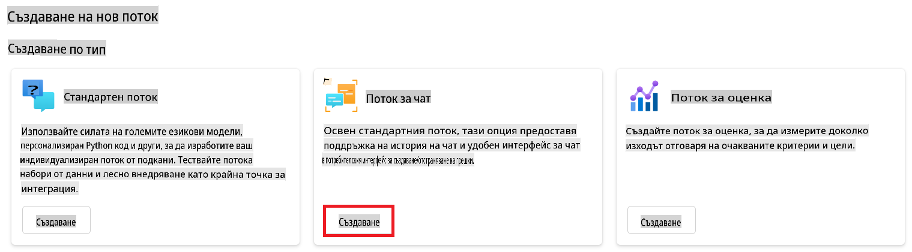

1. Въведете **Име на папка**, която да използвате.

    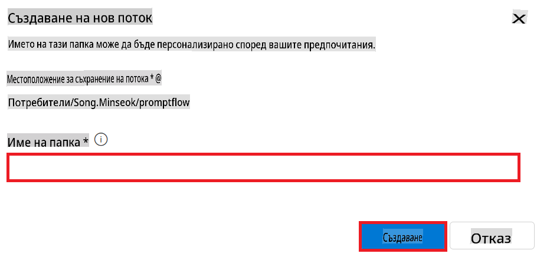

2. Изберете **Create**.

#### Настройване на Prompt flow за чат с персонализирания Phi-3 модел

Трябва да интегрирате финно настроения Phi-3 модел в Prompt flow. Съществуващият Prompt flow обаче не е проектиран за тази цел. Затова трябва да преработите Prompt flow, за да позволите интеграцията на персонализирания модел.

1. В Prompt flow изпълнете следните стъпки, за да преработите съществуващия поток:

    - Изберете **Raw file mode**.
    - Изтрийте целия съществуващ код във файла *flow.dag.yml*.
    - Добавете следния код във файла *flow.dag.yml*.

        ```yml
        inputs:
          input_data:
            type: string
            default: "Who founded Microsoft?"

        outputs:
          answer:
            type: string
            reference: ${integrate_with_promptflow.output}

        nodes:
        - name: integrate_with_promptflow
          type: python
          source:
            type: code
            path: integrate_with_promptflow.py
          inputs:
            input_data: ${inputs.input_data}
        ```

    - Изберете **Save**.

    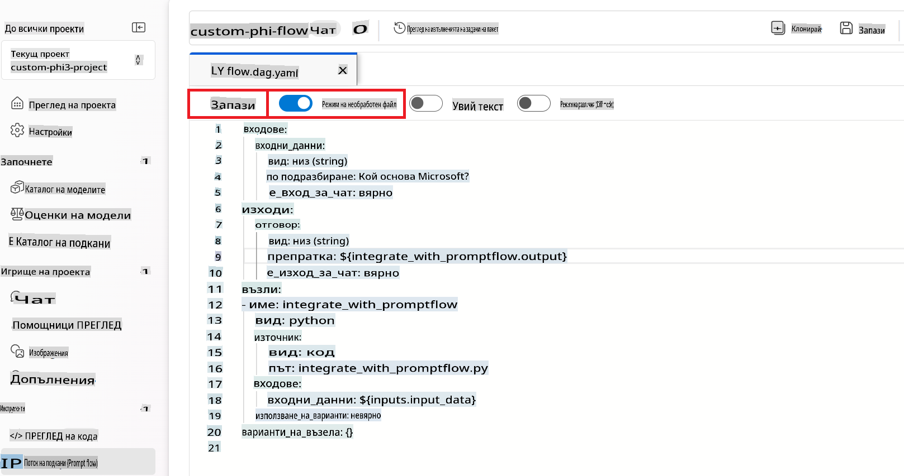

1. Добавете следния код във файла *integrate_with_promptflow.py*, за да използвате персонализирания Phi-3 модел в Prompt flow.

    ```python
    import logging
    import requests
    from promptflow import tool
    from promptflow.connections import CustomConnection

    # Logging setup
    logging.basicConfig(
        format="%(asctime)s - %(levelname)s - %(name)s - %(message)s",
        datefmt="%Y-%m-%d %H:%M:%S",
        level=logging.DEBUG
    )
    logger = logging.getLogger(__name__)

    def query_phi3_model(input_data: str, connection: CustomConnection) -> str:
        """
        Send a request to the Phi-3 model endpoint with the given input data using Custom Connection.
        """

        # "connection" is the name of the Custom Connection, "endpoint", "key" are the keys in the Custom Connection
        endpoint_url = connection.endpoint
        api_key = connection.key

        headers = {
            "Content-Type": "application/json",
            "Authorization": f"Bearer {api_key}"
        }
        data = {
            "input_data": {
                "input_string": [
                    {"role": "user", "content": input_data}
                ],
                "parameters": {
                    "temperature": 0.7,
                    "max_new_tokens": 128
                }
            }
        }
        try:
            response = requests.post(endpoint_url, json=data, headers=headers)
            response.raise_for_status()
            
            # Log the full JSON response
            logger.debug(f"Full JSON response: {response.json()}")

            result = response.json()["output"]
            logger.info("Successfully received response from Azure ML Endpoint.")
            return result
        except requests.exceptions.RequestException as e:
            logger.error(f"Error querying Azure ML Endpoint: {e}")
            raise

    @tool
    def my_python_tool(input_data: str, connection: CustomConnection) -> str:
        """
        Tool function to process input data and query the Phi-3 model.
        """
        return query_phi3_model(input_data, connection)

    ```

    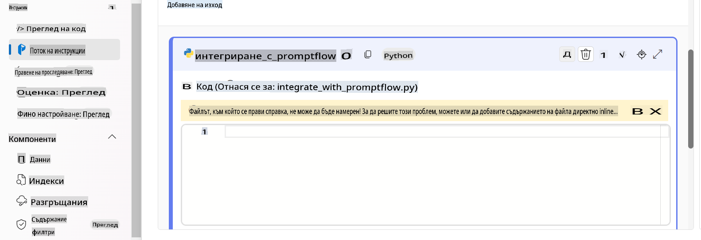

> [!NOTE]
> За по-подробна информация относно използването на Prompt flow в Azure AI Foundry, можете да се обърнете към [Prompt flow в Azure AI Foundry](https://learn.microsoft.com/azure/ai-studio/how-to/prompt-flow).

1. Изберете **Chat input**, **Chat output**, за да активирате чат с вашия модел.

    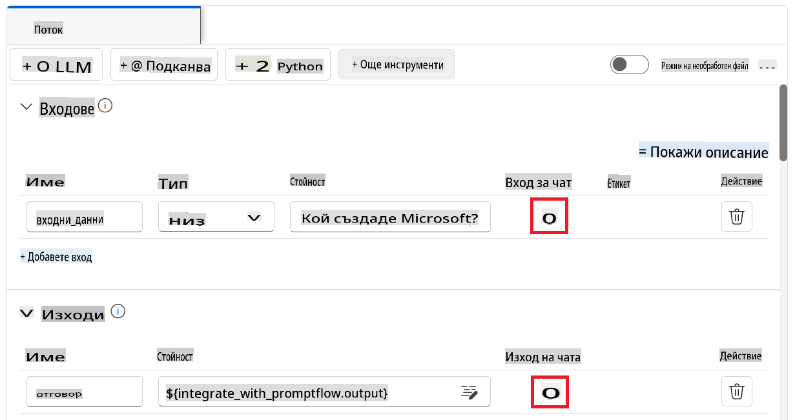

1. Сега сте готови да чатите с вашия персонализиран Phi-3 модел. В следващото упражнение ще научите как да стартирате Prompt flow и да го използвате за чат с вашия финно настроен Phi-3 модел.

> [!NOTE]
>
> Преработеният поток трябва да изглежда като на изображението по-долу:
>
> 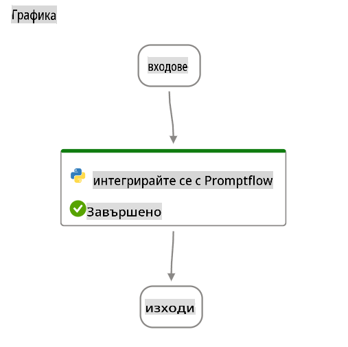
>

### Чат с вашия персонализиран Phi-3 модел

Сега, след като сте финно настроили и интегрирали вашия персонализиран Phi-3 модел с Prompt flow, сте готови да започнете да взаимодействате с него. Това упражнение ще ви преведе през процеса на настройка и стартиране на чат с вашия модел, използвайки Prompt flow. Следвайки тези стъпки, ще можете напълно да използвате възможностите на вашия финно настроен Phi-3 модел за различни задачи и разговори.

- Чат с вашия персонализиран Phi-3 модел, използвайки Prompt flow.

#### Стартиране на Prompt flow

1. Изберете **Start compute sessions**, за да стартирате Prompt flow.

    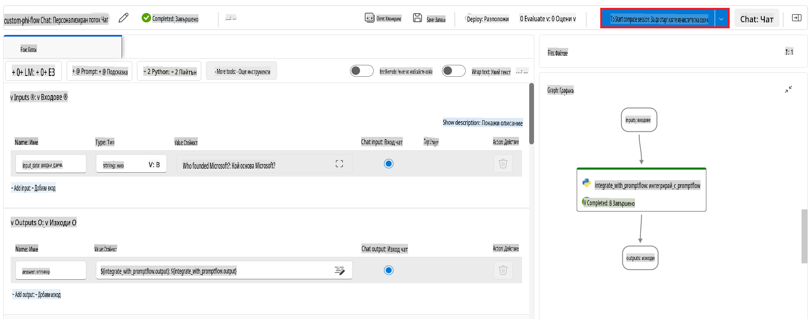

1. Изберете **Validate and parse input**, за да обновите параметрите.

    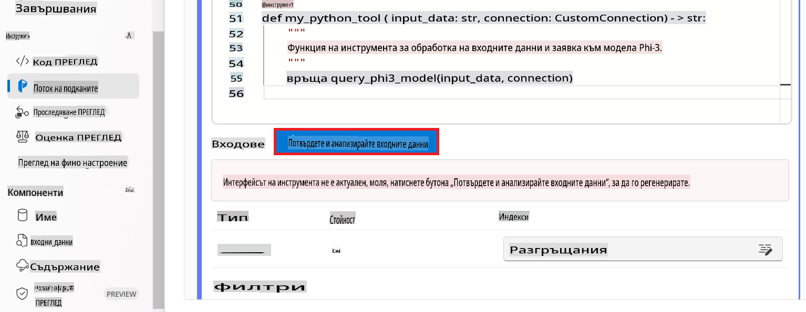

1. Изберете **Value** на **connection** към персонализираната връзка, която сте създали. Например, *connection*.

    

#### Чат с вашия персонализиран модел

1. Изберете **Chat**.

    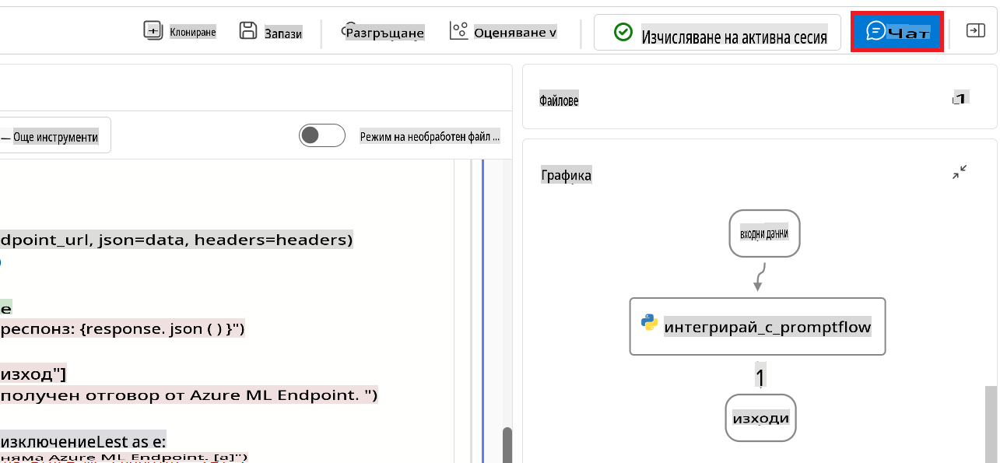

1. Ето пример за резултатите: Сега можете да чатите с вашия персонализиран Phi-3 модел. Препоръчително е да задавате въпроси, базирани на данните, използвани за финно настройване.

    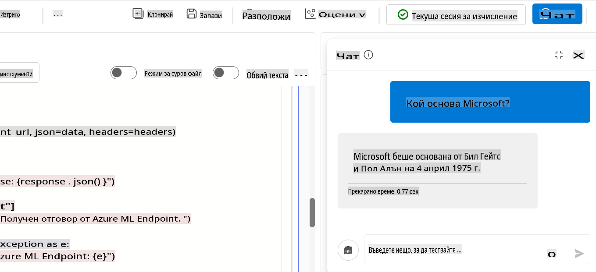

**Отказ от отговорност**:  
Този документ е преведен с помощта на машинни AI услуги за превод. Въпреки че се стремим към точност, моля, имайте предвид, че автоматизираните преводи може да съдържат грешки или неточности. Оригиналният документ на неговия оригинален език трябва да се счита за авторитетен източник. За критична информация се препоръчва професионален човешки превод. Не носим отговорност за каквито и да било недоразумения или погрешни интерпретации, произтичащи от използването на този превод.