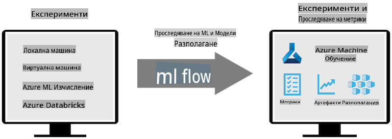
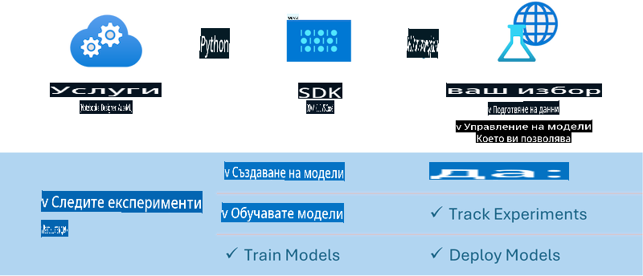

# MLflow

[MLflow](https://mlflow.org/) е платформа с отворен код, създадена за управление на целия жизнен цикъл на машинното обучение.


MLFlow се използва за управление на жизнения цикъл на машинното обучение, включително експериментиране, възпроизводимост, внедряване и централен регистър на модели. MLFlow в момента предлага четири основни компонента:

- **MLflow Tracking:** Записване и извличане на експерименти, код, конфигурация на данни и резултати.
- **MLflow Projects:** Опаковане на код за машинно обучение във формат, който позволява възпроизвеждане на изпълненията на всяка платформа.
- **MLflow Models:** Внедряване на модели за машинно обучение в разнообразни среди за обслужване.
- **Model Registry:** Съхраняване, анотиране и управление на модели в централен репозиторий.

MLFlow включва възможности за проследяване на експерименти, опаковане на код за възпроизводими изпълнения и споделяне и внедряване на модели. Интегриран е в Databricks и поддържа разнообразие от библиотеки за машинно обучение, което го прави независим от конкретна библиотека. Може да се използва с всяка библиотека за машинно обучение и на всеки програмен език, тъй като предоставя REST API и CLI за удобство.



Основните функции на MLFlow включват:

- **Проследяване на експерименти:** Записване и сравнение на параметри и резултати.
- **Управление на модели:** Внедряване на модели в различни платформи за обслужване и предсказване.
- **Регистър на модели:** Съвместно управление на жизнения цикъл на MLFlow моделите, включително версии и анотации.
- **Проекти:** Опаковане на код за машинно обучение за споделяне или използване в продукция.

MLFlow също така поддържа цикъла на MLOps, който включва подготовка на данни, регистриране и управление на модели, опаковане на модели за изпълнение, внедряване на услуги и мониторинг на модели. Целта му е да улесни прехода от прототип към продукционен работен процес, особено в облачни и edge среди.

## E2E Сценарий - Създаване на обвивка и използване на Phi-3 като MLFlow модел

В този пример от край до край ще демонстрираме два различни подхода за създаване на обвивка около Phi-3 малък езиков модел (SLM) и след това изпълнението му като MLFlow модел, било то локално или в облака, например в работното пространство на Azure Machine Learning.



| Проект | Описание | Местоположение |
| ------------ | ----------- | -------- |
| Transformer Pipeline | Transformer Pipeline е най-лесният вариант за създаване на обвивка, ако искате да използвате HuggingFace модел с експерименталния transformers flavour на MLFlow. | [**TransformerPipeline.ipynb**](../../../../../../code/06.E2E/E2E_Phi-3-MLflow_TransformerPipeline.ipynb) |
| Custom Python Wrapper | Към момента на писане на документа, Transformer Pipeline не поддържаше създаването на MLFlow обвивки за HuggingFace модели във формат ONNX, дори с експерименталния пакет optimum на Python. В такива случаи можете да създадете персонализирана Python обвивка за MLFlow модел. | [**CustomPythonWrapper.ipynb**](../../../../../../code/06.E2E/E2E_Phi-3-MLflow_CustomPythonWrapper.ipynb) |

## Проект: Transformer Pipeline

1. Ще ви трябват съответните Python пакети от MLFlow и HuggingFace:

    ``` Python
    import mlflow
    import transformers
    ```

2. След това трябва да инициирате transformer pipeline, като се позовете на целевия Phi-3 модел в регистъра на HuggingFace. Както се вижда от картата на модела _Phi-3-mini-4k-instruct_, задачата му е от тип „Генериране на текст“:

    ``` Python
    pipeline = transformers.pipeline(
        task = "text-generation",
        model = "microsoft/Phi-3-mini-4k-instruct"
    )
    ```

3. Сега можете да запазите трансформър pipeline-а на модела Phi-3 във формат MLFlow и да предоставите допълнителни детайли като целевия път за артефакти, специфични настройки за конфигурация на модела и тип на API за предсказания:

    ``` Python
    model_info = mlflow.transformers.log_model(
        transformers_model = pipeline,
        artifact_path = "phi3-mlflow-model",
        model_config = model_config,
        task = "llm/v1/chat"
    )
    ```

## Проект: Custom Python Wrapper

1. Тук можем да използваме [ONNX Runtime generate() API](https://github.com/microsoft/onnxruntime-genai) на Microsoft за извеждане и кодиране/декодиране на токени на ONNX модела. Трябва да изберете пакета _onnxruntime_genai_ за целевата ви изчислителна среда, като примерът по-долу е за CPU:

    ``` Python
    import mlflow
    from mlflow.models import infer_signature
    import onnxruntime_genai as og
    ```

2. Нашият персонализиран клас имплементира два метода: _load_context()_ за инициализиране на **ONNX модела** на Phi-3 Mini 4K Instruct, **параметрите на генератора** и **токенизатора**; и _predict()_ за генериране на изходни токени за предоставения prompt:

    ``` Python
    class Phi3Model(mlflow.pyfunc.PythonModel):
        def load_context(self, context):
            # Retrieving model from the artifacts
            model_path = context.artifacts["phi3-mini-onnx"]
            model_options = {
                 "max_length": 300,
                 "temperature": 0.2,         
            }
        
            # Defining the model
            self.phi3_model = og.Model(model_path)
            self.params = og.GeneratorParams(self.phi3_model)
            self.params.set_search_options(**model_options)
            
            # Defining the tokenizer
            self.tokenizer = og.Tokenizer(self.phi3_model)
    
        def predict(self, context, model_input):
            # Retrieving prompt from the input
            prompt = model_input["prompt"][0]
            self.params.input_ids = self.tokenizer.encode(prompt)
    
            # Generating the model's response
            response = self.phi3_model.generate(self.params)
    
            return self.tokenizer.decode(response[0][len(self.params.input_ids):])
    ```

3. Сега можете да използвате функцията _mlflow.pyfunc.log_model()_ за генериране на персонализирана Python обвивка (в pickle формат) за модела Phi-3, заедно с оригиналния ONNX модел и необходимите зависимости:

    ``` Python
    model_info = mlflow.pyfunc.log_model(
        artifact_path = artifact_path,
        python_model = Phi3Model(),
        artifacts = {
            "phi3-mini-onnx": "cpu_and_mobile/cpu-int4-rtn-block-32-acc-level-4",
        },
        input_example = input_example,
        signature = infer_signature(input_example, ["Run"]),
        extra_pip_requirements = ["torch", "onnxruntime_genai", "numpy"],
    )
    ```

## Подписи на генерираните MLFlow модели

1. В стъпка 3 от проекта Transformer Pipeline по-горе, ние задаваме задачата на MLFlow модела на „_llm/v1/chat_“. Такава инструкция генерира API обвивка на модела, съвместима с Chat API на OpenAI, както е показано по-долу:

    ``` Python
    {inputs: 
      ['messages': Array({content: string (required), name: string (optional), role: string (required)}) (required), 'temperature': double (optional), 'max_tokens': long (optional), 'stop': Array(string) (optional), 'n': long (optional), 'stream': boolean (optional)],
    outputs: 
      ['id': string (required), 'object': string (required), 'created': long (required), 'model': string (required), 'choices': Array({finish_reason: string (required), index: long (required), message: {content: string (required), name: string (optional), role: string (required)} (required)}) (required), 'usage': {completion_tokens: long (required), prompt_tokens: long (required), total_tokens: long (required)} (required)],
    params: 
      None}
    ```

2. В резултат можете да изпратите вашия prompt в следния формат:

    ``` Python
    messages = [{"role": "user", "content": "What is the capital of Spain?"}]
    ```

3. След това използвайте постпроцесинг, съвместим с OpenAI API, например _response[0][‘choices’][0][‘message’][‘content’]_, за да оформите вашия изход в нещо подобно на това:

    ``` JSON
    Question: What is the capital of Spain?
    
    Answer: The capital of Spain is Madrid. It is the largest city in Spain and serves as the political, economic, and cultural center of the country. Madrid is located in the center of the Iberian Peninsula and is known for its rich history, art, and architecture, including the Royal Palace, the Prado Museum, and the Plaza Mayor.
    
    Usage: {'prompt_tokens': 11, 'completion_tokens': 73, 'total_tokens': 84}
    ```

4. В стъпка 3 от проекта Custom Python Wrapper по-горе, позволяваме на пакета MLFlow да генерира подписа на модела от даден пример за вход. Подписът на обвивката на MLFlow модела ще изглежда така:

    ``` Python
    {inputs: 
      ['prompt': string (required)],
    outputs: 
      [string (required)],
    params: 
      None}
    ```

5. Следователно, нашият prompt трябва да съдържа ключ на речник „prompt“, подобен на този:

    ``` Python
    {"prompt": "<|system|>You are a stand-up comedian.<|end|><|user|>Tell me a joke about atom<|end|><|assistant|>",}
    ```

6. Изходът на модела след това ще бъде предоставен във формат на низ:

    ``` JSON
    Alright, here's a little atom-related joke for you!
    
    Why don't electrons ever play hide and seek with protons?
    
    Because good luck finding them when they're always "sharing" their electrons!
    
    Remember, this is all in good fun, and we're just having a little atomic-level humor!
    ```

**Отказ от отговорност**:  
Този документ е преведен с помощта на услуги за машинен превод, базирани на изкуствен интелект. Въпреки че се стремим към точност, моля, имайте предвид, че автоматичните преводи може да съдържат грешки или неточности. Оригиналният документ на неговия изходен език трябва да се счита за авторитетен източник. За критична информация се препоръчва професионален превод от човек. Не носим отговорност за каквито и да било недоразумения или погрешни интерпретации, произтичащи от използването на този превод.