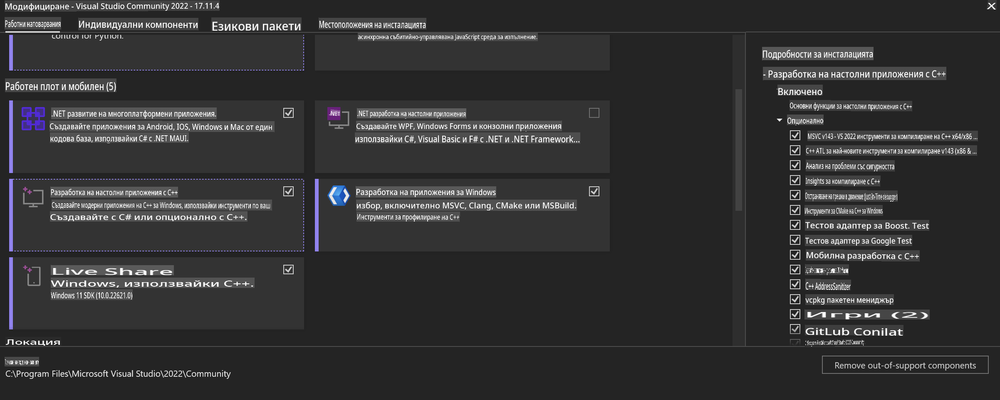
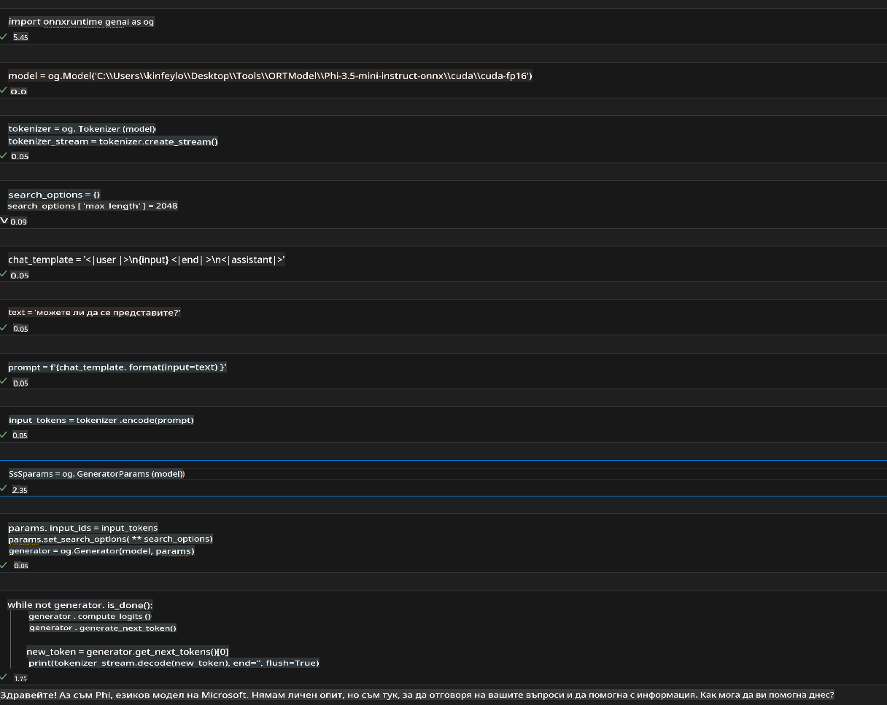
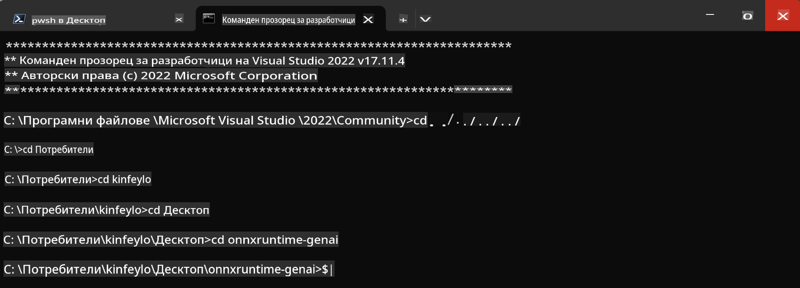

# **Ръководство за OnnxRuntime GenAI на Windows GPU**

Това ръководство предоставя стъпки за настройка и използване на ONNX Runtime (ORT) с GPU на Windows. То е създадено, за да ви помогне да се възползвате от GPU ускорението за вашите модели, подобрявайки производителността и ефективността.

Документът включва указания за:

- Настройка на средата: Инструкции за инсталиране на необходимите зависимости като CUDA, cuDNN и ONNX Runtime.
- Конфигурация: Как да конфигурирате средата и ONNX Runtime за ефективно използване на GPU ресурси.
- Съвети за оптимизация: Препоръки за фина настройка на GPU параметрите за оптимална производителност.

### **1. Python 3.10.x / 3.11.8**

   ***Забележка*** Препоръчва се използването на [miniforge](https://github.com/conda-forge/miniforge/releases/latest/download/Miniforge3-Windows-x86_64.exe) като Python среда.

   ```bash

   conda create -n pydev python==3.11.8

   conda activate pydev

   ```

   ***Напомняне*** Ако сте инсталирали някоя библиотека за ONNX за Python, моля, деинсталирайте я.

### **2. Инсталиране на CMake с winget**

   ```bash

   winget install -e --id Kitware.CMake

   ```

### **3. Инсталиране на Visual Studio 2022 - Desktop Development with C++**

   ***Забележка*** Ако не искате да компилирате, можете да пропуснете тази стъпка.



### **4. Инсталиране на NVIDIA драйвер**

1. **Драйвер за NVIDIA GPU**  [https://www.nvidia.com/en-us/drivers/](https://www.nvidia.com/en-us/drivers/)

2. **NVIDIA CUDA 12.4** [https://developer.nvidia.com/cuda-12-4-0-download-archive](https://developer.nvidia.com/cuda-12-4-0-download-archive)

3. **NVIDIA CUDNN 9.4**  [https://developer.nvidia.com/cudnn-downloads](https://developer.nvidia.com/cudnn-downloads)

***Напомняне*** Моля, използвайте стандартните настройки при инсталационния процес.

### **5. Настройка на NVIDIA среда**

Копирайте библиотеките, bin и include от NVIDIA CUDNN 9.4 в съответните папки на NVIDIA CUDA 12.4.

- копирайте файловете от *'C:\Program Files\NVIDIA\CUDNN\v9.4\bin\12.6'* в *'C:\Program Files\NVIDIA GPU Computing Toolkit\CUDA\v12.4\bin'*

- копирайте файловете от *'C:\Program Files\NVIDIA\CUDNN\v9.4\include\12.6'* в *'C:\Program Files\NVIDIA GPU Computing Toolkit\CUDA\v12.4\include'*

- копирайте файловете от *'C:\Program Files\NVIDIA\CUDNN\v9.4\lib\12.6'* в *'C:\Program Files\NVIDIA GPU Computing Toolkit\CUDA\v12.4\lib\x64'*

### **6. Изтегляне на Phi-3.5-mini-instruct-onnx**

   ```bash

   winget install -e --id Git.Git

   winget install -e --id GitHub.GitLFS

   git lfs install

   git clone https://huggingface.co/microsoft/Phi-3.5-mini-instruct-onnx

   ```

### **7. Изпълнение на InferencePhi35Instruct.ipynb**

   Отворете [Notebook](../../../../../../code/09.UpdateSamples/Aug/ortgpu-phi35-instruct.ipynb) и го изпълнете.



### **8. Компилиране на ORT GenAI GPU**

   ***Забележка*** 
   
   1. Моля, първо деинсталирайте всички библиотеки, свързани с onnx, onnxruntime и onnxruntime-genai.

   ```bash

   pip list 
   
   ```

   След това деинсталирайте всички библиотеки на onnxruntime, например:

   ```bash

   pip uninstall onnxruntime

   pip uninstall onnxruntime-genai

   pip uninstall onnxruntume-genai-cuda
   
   ```

   2. Проверете за поддръжка на Visual Studio Extension.

   Проверете папката C:\Program Files\NVIDIA GPU Computing Toolkit\CUDA\v12.4\extras, за да се уверите, че C:\Program Files\NVIDIA GPU Computing Toolkit\CUDA\v12.4\extras\visual_studio_integration съществува. 

   Ако не е намерена, проверете други папки на драйвера на Cuda toolkit и копирайте папката visual_studio_integration и съдържанието ѝ в C:\Program Files\NVIDIA GPU Computing Toolkit\CUDA\v12.4\extras\visual_studio_integration.

   - Ако не искате да компилирате, можете да пропуснете тази стъпка.

   ```bash

   git clone https://github.com/microsoft/onnxruntime-genai

   ```

   - Изтеглете [https://github.com/microsoft/onnxruntime/releases/download/v1.19.2/onnxruntime-win-x64-gpu-1.19.2.zip](https://github.com/microsoft/onnxruntime/releases/download/v1.19.2/onnxruntime-win-x64-gpu-1.19.2.zip)

   - Разархивирайте onnxruntime-win-x64-gpu-1.19.2.zip, преименувайте го на **ort** и копирайте папката ort в onnxruntime-genai.

   - Използвайки Windows Terminal, отворете Developer Command Prompt за VS 2022 и отидете в onnxruntime-genai.



   - Компилирайте го с вашата Python среда.

   ```bash

   cd onnxruntime-genai

   python build.py --use_cuda  --cuda_home "C:\Program Files\NVIDIA GPU Computing Toolkit\CUDA\v12.4" --config Release
 

   cd build/Windows/Release/Wheel

   pip install .whl

   ```

**Отказ от отговорност**:  
Този документ е преведен с помощта на машинни AI услуги за превод. Въпреки че се стремим към точност, моля, имайте предвид, че автоматичните преводи може да съдържат грешки или неточности. Оригиналният документ на неговия изходен език трябва да се счита за авторитетен източник. За критична информация се препоръчва професионален превод от човек. Не носим отговорност за каквито и да било недоразумения или погрешни интерпретации, произтичащи от използването на този превод.