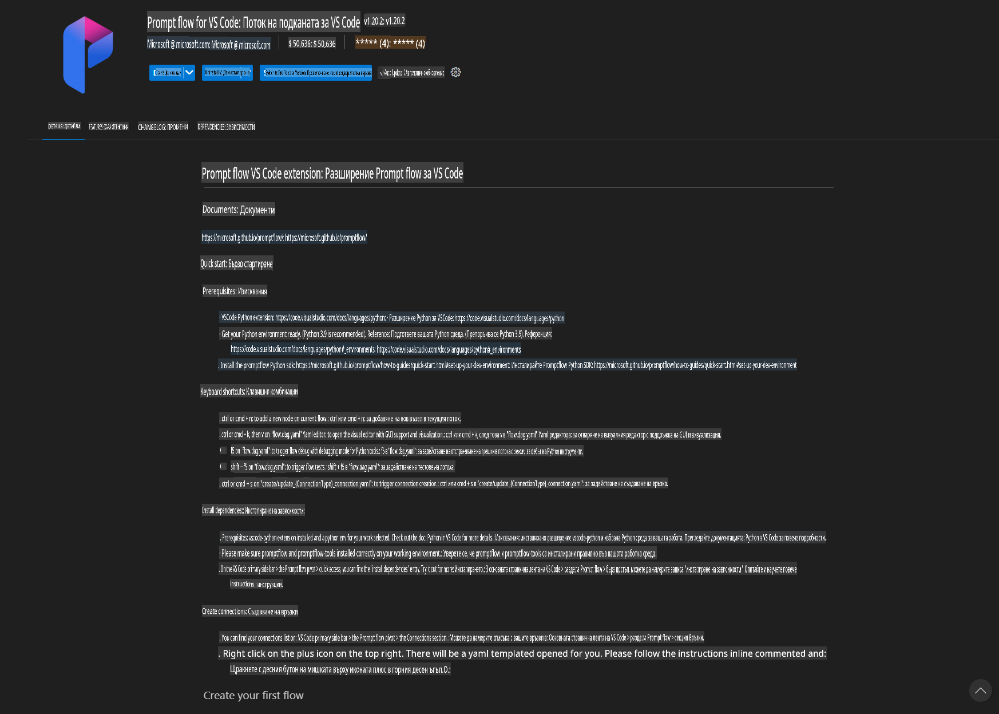
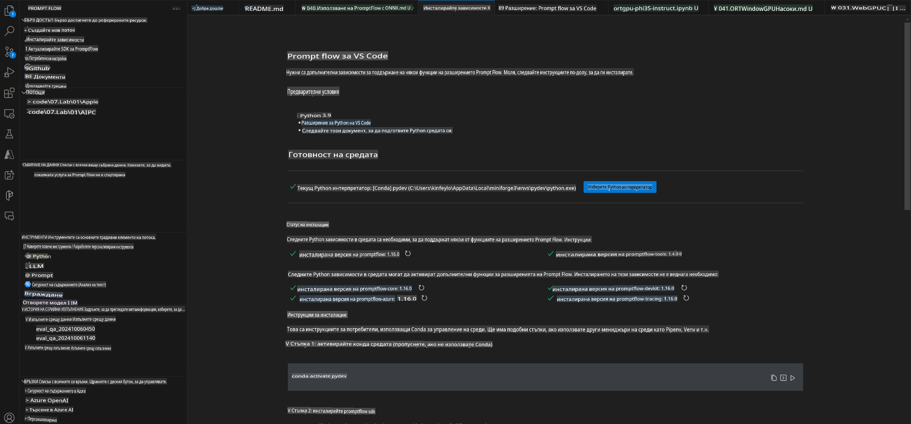
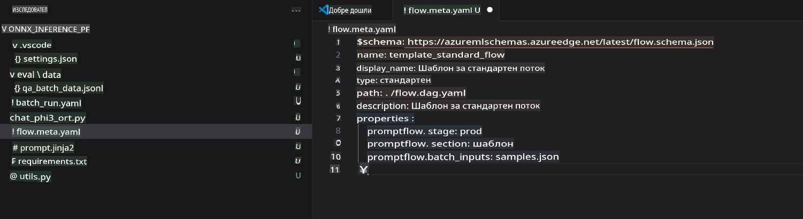
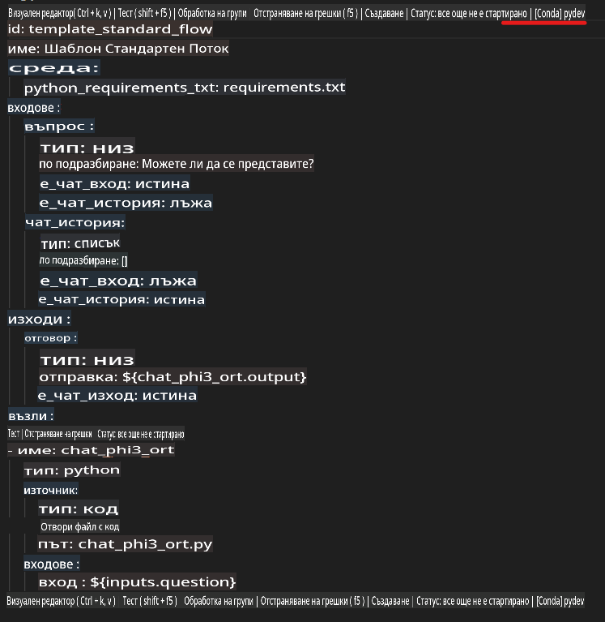
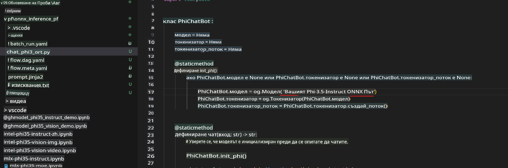
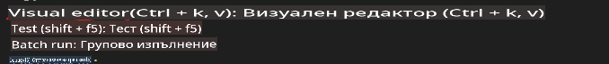
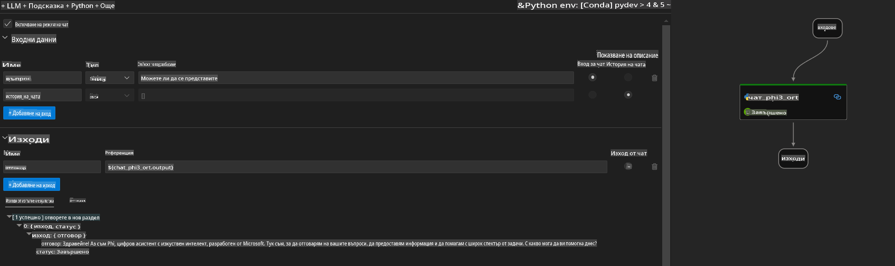
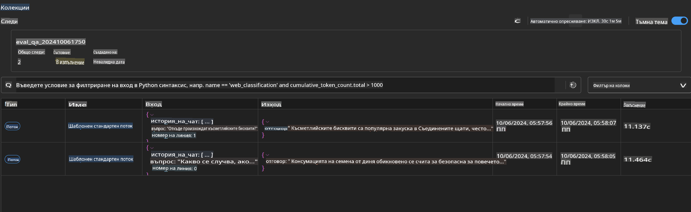

# Използване на Windows GPU за създаване на Prompt Flow решение с Phi-3.5-Instruct ONNX

Следният документ е пример за това как да използвате PromptFlow с ONNX (Open Neural Network Exchange) за разработване на AI приложения, базирани на модели Phi-3.

PromptFlow е набор от инструменти за разработка, създаден да улесни целия цикъл на разработка на AI приложения, базирани на LLM (Large Language Model), от идеята и прототипирането до тестването и оценяването.

Чрез интегриране на PromptFlow с ONNX, разработчиците могат да:

- **Оптимизират производителността на модела**: Използвайте ONNX за ефективно извеждане и внедряване на модели.
- **Улеснят разработката**: Използвайте PromptFlow за управление на работния процес и автоматизиране на повтарящи се задачи.
- **Подобрят сътрудничеството**: Улеснете по-доброто сътрудничество между членовете на екипа, предоставяйки унифицирана среда за разработка.

**Prompt Flow** е набор от инструменти за разработка, който улеснява целия цикъл на разработка на AI приложения, базирани на LLM, от идеята, прототипирането, тестването и оценяването до внедряването в производство и мониторинга. Той прави създаването на промптове много по-лесно и ви позволява да изграждате LLM приложения с производствено качество.

Prompt Flow може да се свърже с OpenAI, Azure OpenAI Service и персонализируеми модели (Huggingface, локални LLM/SLM). Надяваме се да внедрим квантования ONNX модел на Phi-3.5 в локални приложения. Prompt Flow може да ни помогне по-добре да планираме нашия бизнес и да завършим локални решения, базирани на Phi-3.5. В този пример ще комбинираме ONNX Runtime GenAI Library, за да завършим Prompt Flow решението, базирано на Windows GPU.

## **Инсталация**

### **ONNX Runtime GenAI за Windows GPU**

Прочетете това ръководство, за да настроите ONNX Runtime GenAI за Windows GPU [натиснете тук](./ORTWindowGPUGuideline.md)

### **Настройка на Prompt Flow в VSCode**

1. Инсталирайте разширението Prompt Flow за VS Code



2. След като инсталирате разширението Prompt Flow за VS Code, кликнете върху разширението и изберете **Installation dependencies**, следвайки това ръководство, за да инсталирате Prompt Flow SDK във вашата среда.



3. Изтеглете [Примерен код](../../../../../../code/09.UpdateSamples/Aug/pf/onnx_inference_pf) и използвайте VS Code, за да отворите този пример.



4. Отворете **flow.dag.yaml**, за да изберете вашата Python среда.



   Отворете **chat_phi3_ort.py**, за да промените местоположението на вашия Phi-3.5-instruct ONNX модел.



5. Стартирайте вашия Prompt Flow за тестване.

Отворете **flow.dag.yaml** и кликнете върху визуалния редактор.



След като кликнете, стартирайте го за тестване.



1. Можете да стартирате партида в терминала, за да проверите повече резултати.

```bash

pf run create --file batch_run.yaml --stream --name 'Your eval qa name'    

```

Можете да проверите резултатите във вашия браузър по подразбиране.



**Отказ от отговорност**:  
Този документ е преведен с помощта на автоматизирани AI услуги за превод. Въпреки че се стремим към точност, моля, имайте предвид, че автоматичните преводи може да съдържат грешки или неточности. Оригиналният документ на неговия оригинален език трябва да се счита за авторитетен източник. За критична информация се препоръчва професионален превод от човек. Ние не носим отговорност за каквито и да е недоразумения или погрешни интерпретации, произтичащи от използването на този превод.